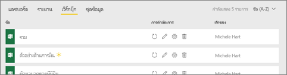
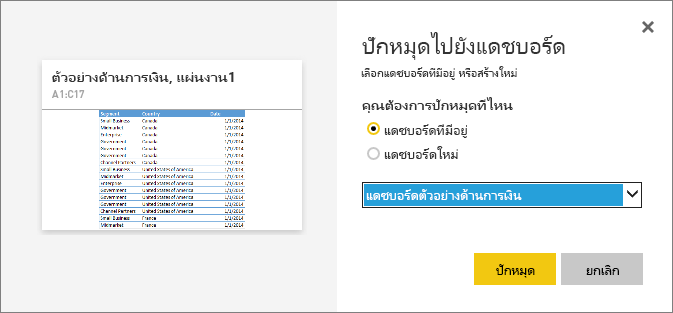

# ปักหมุดไทล์ไปที่แดชบอร์ด Power BI จาก Excel
ก่อนที่คุณสามารถปักหมุดไทล์จากสมุดงาน Excel ของคุณ คุณจะเชื่อมต่อเวิร์กบุ๊กนั้นกับเซอร์วิซ Power BI (app.powerbi.com) การเชื่อมต่อเวิร์กบุ๊กโดยหลักๆ คือการนำลิงก์เวอร์ชันอ่านอย่างเดียวของเวิร์กบุ๊กนั้นลงในยังเซอร์วิซ Power BI และให้คุณสามารถปักหมุดช่วงในแดชบอร์ดได้ คุณสามารถแม้กระทั้งปักหมุดทั้งแผ่นงานกับยังแดชบอร์ด  
ถ้าเวิร์กบุ๊กได้แชร์กับคุณ คุณจะมีความสามารถในการดูไทล์ที่ปักโดยเจ้าของ แต่อย่าสร้างแดชบอร์ดไทล์ด้วยตัวคุณเอง 

สำหรับข้อมูลเชิงลึกเกี่ยวกับว่า Excel และ Power BI ทำงานร่วมกันอย่างไร ให้ดู[รับข้อมูลจากแฟ้มสมุดงาน Excel](https://go.microsoft.com/fwlink/?LinkID=521962)

Watch Will แสดงให้เห็นวิธีการนำเข้าข้อมูลหลายวิธีจาก และเชื่อมต่อไปยัง เวิร์กบุ๊ก Excel

<iframe width="560" height="315" src="https://www.youtube.com/embed/l8JoB7w0zJA" frameborder="0" allowfullscreen></iframe>

## เชื่อมต่อเวิร์กบุ๊ก Excel ของคุณจาก OneDrive for Business กับ Power BI
เมื่อคุณเลือกตัวเลือกนี้ **สมุดงานข**องคุณจะปรากฏใน Power BI เช่นเดียวกับที่ปรากฏใน Excel Online แต่ไม่เหมือนกับ Excel Online เนื่องจากคุณจะมีคุณลักษณะบางอย่างที่ช่วยให้คุณสามารถปักหมุดองค์ประกอบต่าง ๆ จากแผ่นงานของคุณไปยังแดชบอร์ดได้ทันที

คุณไม่สามารถแก้ไขเวิร์กบุ๊กของคุณใน Power BI ได้ แต่ถ้าคุณจำเป็นต้องทำการเปลี่ยนแปลงบางอย่าง คุณสามารถเลือกไอคอนดินสอจากแถบ**เวิ๊กบุ๊ก**ของพื้นที่การทำงานของคุณใน Excel Online หรือเปิดใน Excel บนคอมพิวเตอร์ของคุณ การเปลี่ยนแปลงใด ๆ ที่คุณดำเนินการจะถูกบันทึกไปยังสมุดงานบน OneDrive

1. อัปโหลดเวิร์กบุ๊กของคุณไปยัง OneDrive for Business ของคุณ

2. จาก Power BI, [เชื่อมต่อกับสมุดงานนั้น](service-excel-workbook-files.md)โดยการเลือก**รับข้อมูล > ไฟล์ > OneDrive - ธุรกิจ**และไปยังตำแหน่งที่ตั้งคุณบันทึกไฟล์ Excel เลือกไฟล์ แล้วเลือก**เชื่อมต่อ > เชื่อมต่อ**

    

3. ใน Power BI เวิร์กบุ๊กจะถูกเพิ่มไปยังแท็บ**เวิร์กบุ๊ก**ของพื้นที่ทำงานของคุณ  ไอคอนระบุว่านี่คือเวิร์กบุ๊ก Excel และเครื่องหมายดอกจันสีเหลืองบ่งชี้ว่าใหม่
    
    
4. เปิดเวิร์กบุ๊กใน Power BI โดยเลือกชื่อเวิร์กบุ๊ก

    เปลี่ยนแปลงที่คุณทำกับเวิร์กบุ๊กใน Power BI จะไม่ถูกบันทึก และไม่มีผลต่อเวิร์กบุ๊กดั้งเดิมบน OneDrive for Business ถ้าคุณเรียงลำดับ กรอง หรือเปลี่ยนค่าใน Power BI การเปลี่ยนแปลงเหล่านั้นไม่สามารถบันทึกหรือปักหมุดได้ ถ้าคุณจำเป็นต้องทำการเปลี่ยนแปลงที่จะถูกบันทึก เลือก**แก้ไข**จากมุมขวาบนเพื่อเปิดสำหรับการแก้ไขใน Excel Online หรือ Excel การเปลี่ยนแปลงด้วยวิธีนี้อาจใช้เวลาสักครู่เพื่อปรับปรุงไทล์บนแดชบอร์ด
   
    

## ปักหมุดช่วงของเซลกับแดชบอร์ด
วิธีหนึ่งในการเพิ่ม[ไทล์แดชบอร์ด](consumer/end-user-tiles.md)ใหม่ นั้นมาจากภายในเวิร์กบุ๊ก Excel ใน Power BI ช่วงที่ถูกปักหมุดจากเวิร์กบุ๊ก Excel ที่ได้รับการบันทึกใน OneDrive for Business หรือไลบรารีเอกสารที่แชร์กลุ่มอื่น ช่วงต่าง ๆ สามารถมีข้อมูล แผนภูมิ ตาราง Pivottable PivotCharts และส่วนอื่น ๆ Excel

1. การไฮไลท์เซลล์ที่คุณต้องการปักหมุดกับแดชบอร์ด
   
    
2. เลือกหมุด  ไอคอน 
3. ปักหมุดไทล์ลงในแดชบอร์ดที่มีอยู่ หรือแดชบอร์ดใหม่ 
   
   * แดชบอร์ดที่มีอยู่ ให้เลือกชื่อของแดชบอร์ดจากรายการแบบดร๊อปดาวน์
   * แดชบอร์ดใหม่ พิมพ์ชื่อของแดชบอร์ดใหม่
   
     
4. เลือก**หมุด** ข้อความว่าสำเร็จแล้ว (ใกล้กับมุมบนขวา) ช่วยให้คุณทราบว่า การช่วงถูกเพิ่ม เป็นไทล์ ลงในแดชบอร์ดของคุณ 
   
    
5. เลือก**ไปยังแดชบอร์ด** จากที่นี่ คุณสามารถ[เปลี่ยนชื่อ ปรับขนาด ลิงก์ และย้าย](service-dashboard-edit-tile.md)การแสดงภาพที่ปักหมุดไว้ได้ ตามค่าเริ่มต้น การเลือกไทล์ที่ปักหมุดไว้นั้นเปิดสมุดงานใน Power BI

## ปักหมุดทั้งตารางหรือ PivotTable ไปยังแดชบอร์ด
ทำตามขั้นตอนข้างบน ยกเว้นแทนที่จะเลือกช่วงของเซลล์ เลือกทั้งตารางหรือ PivotTable

เพื่อปักหมุดตาราง ให้เลือกช่วงทั้งหมดของตารางและอย่าลืมรวมส่วนหัว  เพื่อปักหมุด PivotTable ตรวจสอบให้แน่ใจว่าได้รวมทุกส่วนที่มองเห็นได้ของ PivotTable รวมถึงตัวกรอง ถ้าใช้

 

ไทล์ที่สร้างขึ้นจากตารางหรือ PivotTable จะแสดงทั้งตาราง  ถ้าคุณเพิ่ม/ลบ/ตัวกรองแถวหรือคอลัมน์ในเวิร์กบุ๊กเดิม พวกมันจะเพิ่ม/ลบ/ถูกกรองในไทล์

## ดูสมุดงานที่เชื่อมโยงกับไทล์
การเลือกไทล์เวิร์กบุ๊กได้เปิดเวิร์กบุ๊กที่ลิงก์ใน Power BI เนื่องจากไฟล์เวิร์กบุ๊กอยู่บน OneDrive ของเจ้าของ OneDrive for Business การดูเวิร์กบุ๊กจำเป็นต้องมีสิทธิ์การอ่านเวิร์กบุ๊ก ถ้าคุณไม่มีสิทธิ์ คุณจะได้รับข้อผิดพลาด  

 

## ข้อควรพิจารณาและการแก้ไขปัญหา
ฟีเจอร์ที่ไม่ได้รับการสนับสนุน: Power BI ใช้ Excel Services เพื่อรับไทล์ของเวิร์กบุ๊ก ดังนั้น เนื่องจากฟีเจอร์บางอย่างจาก Excel ไม่รองรับ Excel Services REST API มันจะมองไม่เห็นบนไทล์ใน Power BI ตัวอย่างเช่น: เส้นแบบประกายไฟ ไอคอนการตั้งค่าการจัดรูปแบบตามเงื่อนไข และตัวแบ่งส่วนข้อมูลเวลา สำหรับรายการทั้งหมดของฟีเจอร์ไม่รองรับ ให้ดู[ฟีเจอร์ที่ไม่รองรับใน Excel Services REST API](https://msdn.microsoft.com/library/office/ff394477.aspx)

## ขั้นตอนถัดไป
[แชร์แดชบอร์ดที่เชื่อมโยงไปยังเวิร์กบุ๊ก Excel](service-share-dashboard-that-links-to-excel-onedrive.md)

[รับข้อมูลจากเวิร์กบุ๊ก Excel](service-excel-workbook-files.md)

มีคำถามเพิ่มเติมหรือไม่ [ลองไปที่ชุมชน Power BI](https://community.powerbi.com/)

