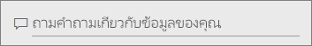
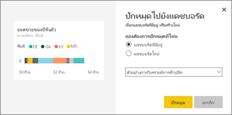

# ปักหมุดไทล์ที่แดชบอร์ดจาก Q&A
## วิธีการปักหมุดไทล์จาก Q&A
Q&A คือเครื่องมือราย Power BI แบบเฉพาะ จำเป็นต้องค้นหาข้อมูลเชิงลึกที่เฉพาะเจาะจงหรือไม่ ถามคำถามเกี่ยวกับข้อมูลของคุณ และรับคำตอบในรูปแบบการแสดงภาพ

ในการอธิบายวิธีใช้นี้ เราจะใช้ Power BI service (app.powerbi.com) เพื่อเปิดแดชบอร์ด ถามคำถามโดยใช้ภาษาธรรมชาติเพื่อสร้างภาพ และปักหมุดการแสดงภาพนั้นที่แดชบอร์ด แดชบอร์ดใช้งานใน Power BI Desktop ไม่ได้ สำหรับข้อมูลใน Q&A กับเครื่องมือและเนื้อหา Power BI อื่น ๆ ให้ดู[Q&A ของ Power BI โดยภาพรวม](consumer/end-user-q-and-a.md) 

เพื่อการทำตาม ให้เปิด[แดชบอร์ดตัวอย่างวิเคราะห์ร้านค้าปลีก](sample-retail-analysis.md)

1. เปิด[แดชบอร์ด](consumer/end-user-dashboards.md)ที่มีอย่างน้อยหนึ่งไทล์ที่ปักหมุดจากรายงาน เมื่อคุณถามคำถาม Power BI จะค้นหาคำตอบในชุดข้อมูลใดๆ ที่มีไทล์ถูกปักในแดชบอร์ดนั้น  เพื่อเรียนรู้เพิ่มเติม ให้ดู[รับข้อมูล](service-get-data.md)
2. ที่กล่องคำถามด้านบนในแดชบอร์ดของคุณ ให้เริ่มพิมพ์สิ่งที่คุณต้องการทราบเกี่ยวกับข้อมูลของคุณ  
   
3. ตัวอย่างเช่น พิมพ์ “ยอดขายของปีที่แล้วตามเดือนและพื้นที่”  
   

   กล่องคำถามให้คำแนะนำคุณ
4. เมื่อต้องการเพิ่มแผนภูมิลงในแดชบอร์ดของคุณแบบไทล์ ให้เลือกหมุดทางด้านขวาของพื้นที ถ้ามีการแชร์แดชบอร์ดกับคุณ คุณจะไม่สามารถปักหมุดการสร้างการแสดงภาพใดได้

5. ปักหมุดไทล์ลงในแดชบอร์ดที่มีอยู่ หรือแดชบอร์ดใหม่

   

   * แดชบอร์ดที่มีอยู่ ให้เลือกชื่อของแดชบอร์ดจากรายการแบบดร๊อปดาวน์ ตัวเลือกของคุณจะถูกจำกัดให้ใช้งานเฉพาะกับแดชบอร์ดดังกล่าวภายในพื้นที่ทำงานปัจจุบัน
   * แดชบอร์ดใหม่ พิมพ์ชื่อของแดชบอร์ดใหม่ แล้วจะได้รับการเพิ่มไปยังพื้นที่ทำงานปัจจุบันของคุณ

6. เลือก**หมุด**

   ข้อความการดำเนินการสำเร็จ (ใกล้กับมุมบนขวา) ช่วยให้คุณทราบว่าได้เพิ่มการแสดงภาพเป็นไทล์ ลงในแดชบอร์ดของคุณแล้ว  

   
7. เลือก**ไปยังแดชบอร์ด** เมื่อต้องการดูไทล์ใหม่ ที่นั่น คุณสามารถ[เปลี่ยนชื่อ ปรับขนาด เพิ่มลิงค์ และจัดตำแหน่งไทล์ใหม่ และอื่นๆ](service-dashboard-edit-tile.md) ในแดชบอร์ดของคุณได้

   

## ข้อควรพิจารณาและการแก้ไขปัญหา
* เมื่อคุณเริ่มพิมพ์คำถาม Q&Aจะเริ่มค้นหาคำตอบที่ดีที่สุดจากชุดข้อมูลทั้งหมดที่เชื่อมโยงกับแดชบอร์ดปัจจุบันทันที  "แดชบอร์ดปัจจุบัน" เป็นแดชบอร์ดที่แสดงอยู่ในแถบนำทางด้านบน ตัวอย่างเช่น การถามคำถามนี้ในแดชบอร์ด**ตัวอย่างการวิเคราะห์ร้านค้าปลีก**ที่เป็นส่วนหนึ่งของพื้นที่ทำงานแอป**mihart**

  
* **Q&A รู้ว่าจะใช้ข้อมูลชุดไหนได้อย่างไร**  Q&A มีสิทธิ์เข้าถึงชุดข้อมูลทั้งหมดที่มีการแสดงภาพอย่างน้อยหนึ่งที่ ที่ปักหมุดที่แดชบอร์ดนั้น

* **ไม่เห็นกล่องคำถาม หรือไม่**่ ตรวจสอบกับผู้ดูแลระบบ Power BI ของคุณ ผู้ดูแลระบบมีความสามารถในการปิดใช้งาน Q&A

## ขั้นตอนถัดไป
[เปลี่ยนชื่อ ปรับขนาด เพิ่มไฮเปอร์ลิงก์ เปลี่ยนตำแหน่งไทล์ และอื่น ๆ ](service-dashboard-edit-tile.md)    
[แสดงแดชบอร์ดไทล์ของคุณในโหมดโฟกัส](consumer/end-user-focus.md)     
[กลับไปยัง Q&A ใน Power BI](consumer/end-user-q-and-a.md)  
มีคำถามเพิ่มเติมหรือไม่ [ลองไปที่ชุมชน Power BI](http://community.powerbi.com/)
