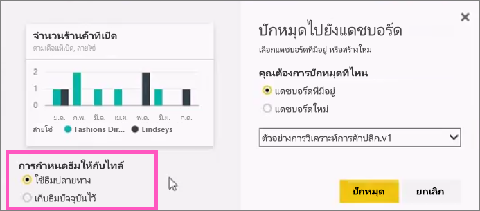
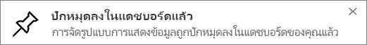

# ปักหมุดไทล์ไปยังแดชบอร์ด Power BI จากรายงาน
## ปักหมุดไทล์จากรายงาน
วิธีหนึ่งในการเพิ่ม[ไทล์แดชบอร์ด](service-dashboard-tiles.md)ใหม่ นั้นมาจากภายใน [รายงาน Power BI](service-reports.md) อันที่จริงแล้ว คุณสามารถเพิ่มไทล์ใหม่หลายตัวจากรายงาน  แต่ละไทล์เหล่านี้ เมื่อคลิกจะเป็นลิงก์กลับลงในรายงาน

และหน้ารายงานรูปภาพทั้งหมดสามารถปักหมุให้เป็นแดชบอร์ดได้  ซึ่งยังเรียกว่าการปักหมุดไทล์*live*  *Live* เนื่องจากคุณสามารถโต้ตอบกับไทล์บนแดชบอร์ดและเพราะว่า การเปลี่ยนแปลงในรายงานจะถูกซิงค์กับแดชบอร์ดไม่เหมือนกับไทล์การแสดงภาพแต่ละตัว คุณสามารถอ่านเพิ่มเติมเกี่ยวกับหัวข้อนี้ด้านล่าง

คุณไม่สามารถปักหมุดไทล์ จากรายงานที่มีการแชร์กับคุณ หรือจาก Power BI Desktop 

> **เคล็ดลับ** แสดงภาพบางตัวใช้รูปภาพพื้นหลัง การปักหมุดอาจไม่ทำงาน ถ้ารูปภาพพื้นหลังมีขนาดใหญ่เกินไป  ลองลดขนาดรูปภาพ หรือโดยใช้การบีบอัดรูปภาพ  
> 
> 

## ปักหมุดไทล์จากรายงาน
ดู Amanda สร้างแดชบอร์ดโดยการปักหมุดภาพและรูปภาพจากรายงาน Power BI

<iframe width="560" height="315" src="https://www.youtube.com/embed/lJKgWnvl6bQ" frameborder="0" allowfullscreen></iframe>

ในตอนนี้ ให้สร้างแดชบอร์ดของคุณเองโดยใช้หนึ่งในตัวอย่างรายงาน Power BI

1. วางเคอร์เซอร์เหนือการแสดงผลด้วยภาพที่คุณต้องการปักหมุด และเลือกไอคอนรูป เข็มหมุด Power BI เปิดขึ้นในหน้าจอ**ปักหมุดลงในแดชบอร์ด**
   
     
2. เลือกว่า คุณต้องการปักหมุดแดชบอร์ดที่มีอยู่ หรือสร้าแดชบอร์ดใหม่
   
   * แดชบอร์ดที่มีอยู่ ให้เลือกชื่อของแดชบอร์ดจากรายการแบบดร๊อปดาวน์ แดชบอร์ดที่แชร์กับคุณจะไม่ปรากฏขึ้นที่นี่
   * แดชบอร์ดใหม่ พิมพ์ชื่อของแดชบอร์ดใหม่
3. ในบางกรณี สิ่งที่คุณปักหมุดอาจจะมี*ธีม*ที่ถูกนำไปใช้  ตัวอย่างเช่น ภาพปักหมุดจากสมุดงาน Excel ถ้าเป็นเช่นนั้น เลือกชุดรูปแบบที่จะใช้กับไทล์
4. เลือก**หมุด**
   
   ข้อความว่าสำเร็จแล้ว (ใกล้กับมุมบนขวา) ช่วยให้คุณทราบว่าการแสดงภาพถูกเพิ่ม เป็นไทล ลงในแดชบอร์ดของคุณ
   
   
5. จากบานหน้าต่างนำทาง เลือกแดชบอร์ดที่ มีไทล์ใหม่ เลือกไทล์เพื่อกลับมาในรายงาน หรือ[แก้ไขการแสดงไทล์และลักษณะการทำงาน](service-dashboard-edit-tile.md)

## ปักหมุดทั้งหน้ารายงาน
ตัวเลือกอื่นคือ การปักหมุดทั้งหน้ารายงานที่แดชบอร์ด นี่คือวิธีง่ายๆ ในการปักหมุดการแสดงภาพมากกว่าหนึ่งครั้ง  นอกจากนี้ เมื่อคุณปักหมุดทั้งหน้า ไทล์จะเป็นแบบ*live* คุณสามารถโต้ตอบกับพวกมันได้จากที่นั่นบนแดชบอร์ด และเปลี่ยนแปลงที่คุณทำกับการแสดงภาพก่อนหน้านี้ในตัวแก้ไขรายงาน เช่นการเพิ่มตัวกรองหรือการเปลี่ยนแปลงเขตข้อมูลที่ใช้ในแผนภูมิ จะปรากฏในแดชบอร์ดไทล์เช่นกัน  

สำหรับข้อมูลเพิ่มเติม ให้ดู[ปักหมุดหน้ารายงานทั้งหน้า](service-dashboard-pin-live-tile-from-report.md)

## ขั้นตอนถัดไป
[แดชบอร์ดใน Power BI](service-dashboards.md)

[แดชบอร์ดไทล์ใน Power BI](service-dashboard-tiles.md)

[รายงานใน Power BI](service-reports.md)

[การรีเฟรชข้อมูลใน Power BI](refresh-data.md)

[แนวคิดพื้นฐานของ power BI](service-basic-concepts.md)

มีคำถามเพิ่มเติมหรือไม่ [ลองไปที่ชุมชน Power BI](http://community.powerbi.com/)

