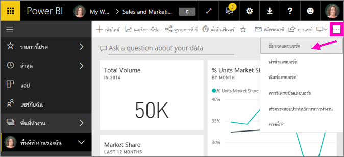
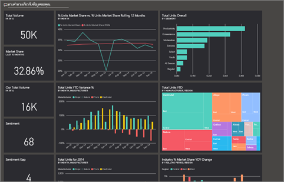
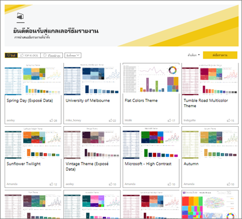
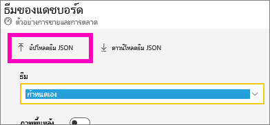

# ใช้ธีมแดชบอร์ดในบริการของ Power BI
ด้วย**ธีมแดชบอร์ด** คุณสามารถใช้ธีมสีกับทั้งแดชบอร์ดของคุณ เช่นสีขององค์กร การกำหนดสีตามฤดูกาล หรือธีมสีอื่นๆ ที่คุณอาจต้องการนำไปใช้ เมื่อคุณนำ**ธีมแดชบอร์ด**ไปใช้งาน วิชวลทั้งหมดบนแดชบอร์ดของคุณจะใช้สีจากธีมที่คุณเลือก (มีข้อยกเว้นบางข้อ ซึ่งจะอธิบายภายหลังในบทความนี้)

การเปลี่ยนสีของวิชวลรายงานในแดชบอร์ดจะไม่กระทบต่อวิชวลในรายงาน นอกจากนี้ เมื่อคุณปักหมุดไทล์จากรายงานที่[ใช้ธีมรายงานอยู่แล้ว](desktop-report-themes.md) คุณมีตัวเลือกเพื่อเก็บธีมปัจจุบัน หรือใช้ธีมแดชบอร์ด

## ข้อกำหนดเบื้องต้น
* เพื่อทดลองทำตาม เปิด[ตัวอย่างแดชบอร์ดการขายและการตลาด](sample-datasets.md)

## วิธีการทำงานของธีมแดชบอร์ด
เพื่อเริ่มต้นใช้งาน เปิดแดชบอร์ดที่คุณสร้าง (หรือมีสิทธิ์แก้ไข) ที่ต้องการกำหนดด้วยตนเอง เลือกที่จุดไข่ปลา (...) และเลือก**ธีมของแดชบอร์ด** 

ในบานหน้าต่างแดชบอร์ดที่ปรากฏขึ้น เลือกหนึ่งในธีมที่สร้างไว้ล่วงหน้าแล้ว  ในตัวอย่างด้านล่าง เราได้เลือกสี**เข้ม**

## สร้างธีมแบบกำหนดเอง

ธีมเริ่มต้นสำหรับแดชบอร์ด Power BI คือสี**อ่อน** ถ้าคุณต้องการกำหนดสี หรือสร้างธีมของคุณเอง เลือก**กำหนดเอง**ในรายการดรอปดาวน์ 

ใช้ตัวเลือกแบบกำหนดเองเพื่อสร้างธีมแดชบอร์ดของคุณเอง ถ้าต้องการเพิ่มรูปภาพพื้นหลัง เราขอแนะนำว่า รูปภาพของคุณมีความละเอียดอย่างน้อย 1920x1080 หากต้องการใช้รูปภาพเป็นพื้นหลัง ให้อัปโหลดรูปภาพไปยังเว็บไซต์สาธารณะ จากนั้นคัดลอก URL และวางลงในเขตข้อมูล **URL ของรูปภาพ** 

### ใช้ธีม JSON
อีกวิธีในการสร้างธีมแบบกำหนดเอง คือการอัปโหลดไฟล์ JSON ที่มีการตั้งค่าสำหรับสีทั้งหมดที่คุณต้องการใช้สำหรับแดชบอร์ดของคุณ ใน Power BI Desktop ผู้สร้างรายงานใช้ไฟล์ JSON [สร้างธีมสำหรับรายงาน](desktop-report-themes.md) ไฟล์ JSON เดียวกันนี้สามารถอัปโหลดสำหรับสำหรับแดชบอร์ดได้ หรือคุณสามารถค้นหา และอัปโหลดไฟล์ JSON จาก[หน้าแกลเลอรีธีม](https://community.powerbi.com/t5/Themes-Gallery/bd-p/ThemesGallery)ในชุมชน Power BI 

คุณยังสามารถบันทึกธีมแบบกำหนดเองของคุณเป็นไฟล์ JSON และให้แชร์กับผู้สร้างแดชบอร์ดอื่น ๆ ได้ 

### ใช้ธีมจากแกลเลอรีธีม

เหมือนกับตัวเลือกมีอยู่ภายในและแบบกำหนดเอง เมื่อธีมถูกอัปโหลด สีจะถูกนำไปใช้กับไทล์ทั้งหมดในแดชบอร์ดโดยอัตโนมัติ 

1. โฮเวอร์เหนือธีม และเลือก**ดูรายงาน**

    

2. เลื่อนลง แล้วค้นหาลิงก์ไปยังไฟล์ JSON  เลือกไอคอนดาวน์โหลด และบันทึกไฟล์

    

3. กลับไปในบริการของ Power BI ในหน้าต่างธีมแดชบอร์ดแบบกำหนดเอง เลือก**อัปโหลดธีม JSON**

    

4. นำทางไปยังตำแหน่งที่คุณบันทึกไฟล์ธีม JSON และเลือก**เปิด**

5. บนหน้าธีมแดชบอร์ด เลือก**บันทึก** ธีมใหม่จะถูกนำมาใช้ในแดชบอร์ดของคุณ

    

## ข้อควรพิจารณาและข้อจำกัด

* ถ้ารายงานของคุณใช้ธีมที่แตกต่างจากธีมแดชบอร์ด คุณสามารถควบคุมว่า วิชวลยังคงใช้ธีมปัจจุบัน หรือใช้ธีมของแดชบอร์ด เพื่อให้วิชวลจากแหล่งข้อมูลต่าง ๆ มีความสอดคล้องกัน เมื่อปักหมุดไทล์ไปยังแดชบอร์ด เลือก**คงชุดรูปแบบปัจจุบันไว้** เพื่อเก็บธีมรายงานไว้ วิชวลบนแดชบอร์ด จะคงธีมรายงาน รวมถึงการตั้งค่าความโปร่งใส 

    ครั้งเดียวที่คุณจะเห็นตัวเลือก**การกำหนดธีมไทล์**คือ ถ้าคุณสร้างรายงานใน Power BI Desktop [เพิ่มธีมรายงาน](desktop-report-themes.md) แล้วเผยแพร่รายงานไปยังบริการของ Power BI 

    

    ลองปักหมุดไทล์อีกครั้ง และเลือก**ใช้ธีมของแดชบอร์ด**

    

* ธีมแดชบอร์ดไม่สามารถใช้กับหน้ารายงานสด, ไทล์ iframe, ไทล์ SSRS, ไทล์เวิร์กบุ๊ก หรือรูปภาพที่ปักหมุดได้
* ธีมแดชบอร์ดสามารถดูได้บนอุปกรณ์เคลื่อนที่ แต่การสร้างธีมแดชบอร์ดสามารถทำได้ในบริการของ Power BI เท่านั้น 
* ธีมแดชบอร์ดแบบกำหนดเองทำงานกับเฉพาะไทล์ที่ปักหมุดจากรายงาน 

