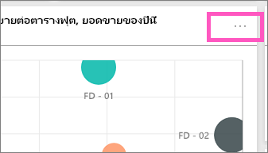
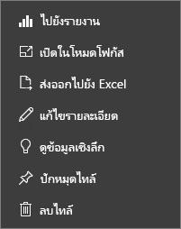

# ไทล์แดชบอร์ดใน Power BI
แดชบอร์ดและไทล์แดชบอร์ดเป็นคุณลักษณะของบริการ Power BI ไม่ใช่ของ Power BI Desktop ขณะที่ไม่สามารถสร้างหรือปักหมุดไทล์แดชบอร์ดใน Power BI สำหรับมือถือได้ แต่เราสามารถ[ดูและแชร์](mobile-tiles-in-the-mobile-apps.md)บนมือถือได้ และใน Power BI สำหรับอุปกรณ์เคลื่อนที่ คุณสามารถ[เพิ่มรูปภาพลงในแดชบอร์ดของคุณกับแอปฯ iPhone](mobile-iphone-app-get-started.md) ได้

## ไทล์แดชบอร์ด

ไทล์เป็นสแนปช็อตของข้อมูลของคุณที่ปักหมุดไปยังแดชบอร์ด คุณสามารถสร้างไทล์จากรายงาน ชุดข้อมูล แดชบอร์ด จากกล่องถามตอบ Excel และจาก SQL Server Reporting Services (SSRS) และอื่น ๆ ได้  ภาพถ่ายหน้าจอนี้แสดงไทล์ต่าง ๆ มากมายที่ปักหมุดไปยังแดชบอร์ดหนึ่ง

นอกจากการปักหมุดแล้ว คุณยังสามารถสร้างไทล์แบบเดี่ยวได้โดยตรงบนแดชบอร์ดโดยใช้[เพิ่มไทล์](service-dashboard-add-widget.md) ไทล์แบบเดี่ยวรวมถึง: กล่องข้อความ รูปภาพ วิดีโอ ข้อมูลสตรีมมิ่ง และเนื้อหาบนเว็บ

ต้องการความช่วยเหลือในการทำความเข้าใจเกี่ยวกับบล็อกที่ประกอบเป็น Power BI หรือไม่?  ดู[Power BI - แนวคิดพื้นฐาน](service-basic-concepts.md)

> [!NOTE]
> ถ้าการแสดงภาพต้นฉบับที่ใช้เพื่อสร้างไทล์เปลี่ยนแปลง ไทล์ดังกล่าวจะไม่เปลี่ยนแปลงไปด้วย  ตัวอย่างเช่น ถ้าคุณปักหมุดแผนภูมิเส้นจากรายงาน จากนั้นคุณเปลี่ยนแผนภูมิเส้นเป็นแผนภูมิแท่ง ไทล์แดชบอร์ดจะยังคงแสดงแผนภูมิเส้น รีเฟรชข้อมูลแต่การชนิดแสดงภาพไม่เปลี่ยน
> 
> 

## ปักหมุดไทล์จาก...
มีหลายวิธีในการเพิ่ม (PIN) ไทล์หนึ่ง ๆ ไปยังแดชบอร์ดหนึ่ง สามารถปักหมุดไทล์ได้จาก:

* [การถามตอบสำหรับ Power BI](service-dashboard-pin-tile-from-q-and-a.md)
* [รายงาน](service-dashboard-pin-tile-from-report.md)
* [แดชบอร์ดอื่น](service-pin-tile-to-another-dashboard.md)
* [สมุดงาน Excel บน OneDrive for Business](service-dashboard-pin-tile-from-excel.md)
* [Power BI Publisher สำหรับ Excel](publisher-for-excel.md)
* [ข้อมูลเชิงลึกด่วน](service-insights.md)
* [SSRS](https://msdn.microsoft.com/library/mt604784.aspx)

และเราสามารถสร้างไทล์แบบเดี่ยวสำหรับรูปภาพ กล่องข้อความ วิดีโอ ข้อมูลสตรีมมิ่ง และเนื้อหาบนเว็บได้โดยตรงบนแดชบอร์ดโดยใช้[เพิ่มไทล์](service-dashboard-add-widget.md)

  

## โต้ตอบกับไทล์บนแดชบอร์ด
### ย้ายและปรับขนาดไทล์
หยิบไทล์และ[ย้ายไปรอบ ๆ ในแดชบอร์ด](service-dashboard-edit-tile.md) เลื่อนและเลือกด้ามจับเพื่อปรับขนาดไทล์

### เลื่อนเหนือไทล์เพื่อเปลี่ยนลักษณะปรากฏและลักษณะการทำงาน
1. เลื่อนเหนือไทล์เพื่อแสดงจุดไข่ปลา
   
    
2. เลือกจุดไข่ปลาเพื่อเปิดเมนูการดำเนินการไทล์
   
    
   
    จากตรงนี้คุณสามารถ:
   
   * [เปิดรายงานที่ถูกใช้เพื่อสร้างไทล์นี้](service-reports.md)   
   
   * [เปิดแผ่นงานที่ถูกใช้เพื่อสร้างไทล์นี้](service-reports.md)   
     
     * [ดูในโหมดโฟกัส](service-focus-mode.md)   
     * [ส่งออกข้อมูลที่ใช้ในไทล์](power-bi-visualization-export-data.md) 
     * [แก้ไขชื่อเรื่องและชื่อเรื่องรอง เพิ่มไฮเปอร์ลิงก์ แสดงเวลาการรีเฟรชล่าสุด](service-dashboard-edit-tile.md) 
     * [เรียกใช้ข้อมูลเชิงลึก](service-insights.md) 
     * [ปักหมุดไทล์ไปยังแดชบอร์ดอื่น](service-pin-tile-to-another-dashboard.md) 
       
     * [ลบไทล์](service-dashboard-edit-tile.md)
     
3. เมื่อต้องปิดเมนูการดำเนินการ เลือกพื้นที่ว่างในพื้นที่ใช้งาน

### เลือก (คลิกที่) ไทล์
เมื่อคุณเลือกไทล์หนึ่ง สิ่งที่จะเกิดขึ้นถัดไปขึ้นอยู่กับวิธีที่ไทล์ถูกสร้างขึ้น และขึ้นอยู่กับว่าไทล์ดังกล่าวมี[ลิงก์แบบกำหนดเอง](service-dashboard-edit-tile.md)หรือไม่ หากมีีการลิงก์แบบกำหนดเอง การเลือกไทล์จะนำคุณไปที่ลิงก์นั้น มิฉะนั้น การเลือกไทล์จะนำคุณไปยังรายงาน สมุดงาน Excel Online รายงาน SSRS ที่อยู่ภายในองค์กร หรือการถามตอบที่ถูกใช้เพื่อสร้างไทล์ดังกล่าว

> [!NOTE]
> ข้อยกเว้นนี้คือ ไทล์วิดีโอที่สร้างขึ้นโดยตรงบนแดชบอร์ดโดยใช้ **เพิ่มไทล์** การเลือกไทล์วิดีโอ (ที่ถูกสร้างขึ้นด้วยวิธีนี้) ทำให้วิดีโอเล่นบนแดชบอร์ดดังกล่าว   
> 
> 

## ข้อควรพิจารณาและการแก้ไขปัญหา
* ถ้ามีการบันทึกรายงานที่ใช้เพื่อสร้างการแสดงภาพไม่ได้รับการบันทึก ดังนั้น การเลือกไทล์จะไม่ก่อให้เกิดการดำเนินการใด ๆ
* ถ้าไทล์ดังกล่าวถูกสร้างขึ้นจากสมุดงานใน Excel Online และคุณไม่มีอย่างน้อยหนึ่งสิทธิ์ในการอ่านสำหรับสมุดงานนั้น การเลือกไทล์จะไม่เปิดสมุดงานใน Excel Online
* สำหรับไทล์ที่สร้างขึ้นโดยตรงบนแดชบอร์ดโดยใช้**เพิ่มไทล์** ถ้ามีการตั้งค่าไฮเปอร์ลิงก์แบบกำหนดเอง การเลือกชื่อเรื่อง ชื่อเรื่องรอง และหรือไทล์จะเปิด URL นั้น  มิฉะนั้น ตามค่าเริ่มต้น การเลือกหนึ่งไทล์จากไทล์เหล่านี้ที่ถูกสร้างขึ้นโดยตรงบนแดชบอร์ดสำหรับรูปภาพหนึ่ง โค้ดของเว็บ หรือกล่องข้อความ จะไม่ก่อให้เกิดการดำเนินการใด
* ถ้าคุณไม่มีสิทธิ์ในรายงานภายใน SSRS การเลือกไทล์ที่สร้างขึ้นจาก SSRS จะสร้างหน้าที่ระบุว่าคุณไม่มีการเข้าถึง (rsAccessDenied)
* ถ้าคุณไม่สามารถเข้าถึงเครือข่ายที่เซิร์ฟเวอร์ SSRS นั้นอยู่ การเลือกไทล์ที่สร้างขึ้นจาก SSRS จะสร้างหน้าที่บ่งชี้ว่าไม่สามารถค้นหาเซิร์ฟเวอร์ (HTTP 404) ได้ อุปกรณ์ของคุณจำเป็นต้องมีสิทธิ์เข้าถึงเครือข่ายไปยังเซิร์ฟเวอร์รายงานเพื่อดูรายงานดังกล่าว
* ถ้าการแสดงภาพต้นฉบับที่ใช้เพื่อสร้างไทล์เปลี่ยนแปลง ไทล์ดังกล่าวจะไม่เปลี่ยนแปลงไปด้วย  ตัวอย่างเช่น ถ้าคุณปักหมุดแผนภูมิเส้นจากรายงาน จากนั้นคุณเปลี่ยนแผนภูมิเส้นเป็นแผนภูมิแท่ง ไทล์แดชบอร์ดจะยังคงแสดงแผนภูมิเส้น รีเฟรชข้อมูลแต่การชนิดแสดงภาพไม่เปลี่ยน

## ขั้นตอนถัดไป
[สร้างบัตร (ไทล์ตัวเลขขนาดใหญ่) สำหรับแดชบอร์ดของคุณ](power-bi-visualization-card.md)

[แดชบอร์ดใน Power BI](service-dashboards.md)  

[รีเฟรชข้อมูล](refresh-data.md)

[Power BI - แนวคิดพื้นฐาน](service-basic-concepts.md)

[ส่งออกไทล์ไปยัง Power Point](http://blogs.msdn.com/b/powerbidev/archive/2015/09/28/integrating-power-bi-tiles-into-office-documents.aspx)

[ปักหมุดรายการ Reporting Services ไปยังแดชบอร์ด Power BI](https://msdn.microsoft.com/library/mt604784.aspx)

มีคำถามเพิ่มเติมหรือไม่? [ลองไปที่ชุมชน Power BI](http://community.powerbi.com/)

