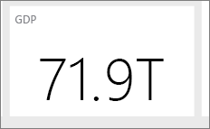

# เคล็ดลับสำหรับการออกแบบแดชบอร์ด Power BI ที่ยอดเยี่ยม
หลังจากที่คุณสร้างแดชบอร์ด และเพิ่มไทล์บางตัวเข้าไป ให้คิดเกี่ยวกับวิธีการทำให้แดชบอร์ดของคุณไม่เพียงแค่สวยงามเท่านั้น แต่ยังทำงาน โดยทั่วไป ซึ่งหมายความว่า ทำข้อมูลที่สำคัญที่สุดออกให้โดดเด่น และทำให้สะอาด และเป็นระเบียบ

นี่เป็นเคล็ดลับบางอย่าง

> [!TIP]
> หลักการออกแบบสำหรับรายงานจำนวนมากนำไปใช้กับแดชบอร์ดได้เช่นกัน  อ่านเอกสารทางเทคนิคของเราเรื่อง[หลักการออกแบบที่ดีที่สุดสำหรับรายงานและการแสดงภาพ](power-bi-visualization-best-practices.md)
>
>

## ให้เข้า[การสัมมนาผ่านเว็บเกี่ยวกับการตกแต่งแดชบอร์ด](https://info.microsoft.com/CO-PowerBI-WBNR-FY16-05May-12-Dashboard-Makeover-Registration.html)
ดูผู้เชี่ยวชาญ Microsoft Principal Program Manager และแดชบอร์ด Power BI คุณ Marc Reguera [ดำเนินการตกแต่งแดชบอร์ด ](https://info.microsoft.com/CO-PowerBI-WBNR-FY16-05May-12-Dashboard-Makeover-Registration.html)

## ให้พิจารณาผู้ชมรายงาน
อะไรคือตัววัดหลักที่จะช่วยให้พวกเขาทำการตัดสินใจ วิธการใช้แดชบอร์ด สิ่งที่ได้เรียนรู้หรือสมมติฐานทางวัฒนธรรมบริโภคนิยมอะไรส่งผลต่อตัวเลือกการออกแบบ ข้อมูลใดที่ผู้ชมของคุณต้องทำให้สำเร็จ

ให้จำไว้ว่า แดชบอร์ดคือภาพรวมหรือสถานที่เดียวที่สามารถตรวจสอบสถานะปัจจุบันของธุรกิจได้ แดชบอร์ดที่จะยึดตามรายงานต้นแบบและชุดข้อมูล และสิ่งทีมีการโหลดของรายละเอียด ผู้อ่านของคุณสามารถเจาะลึกเข้ารายงานจากแดชบอร์ดของคุณได้ ดังนั้นอย่าใส่รายละเอียดในแดชบอร์ดเว้นแต่ว่านั่นคือสิ่งที่ผู้อ่านของคุณจำเป็นต้องตรวจสอบ

แดชบอร์จะถูกแสดงอย่างไร ถ้าจะอยู่บนจอภาพขนาดใหญ่ คุณสามารถใส่เนื้อหาเพิ่มเติมได้ ถ้าผู้อ่านอ่านบนแท็บเล็ต หากมีไทล์น้อยลงจะสามารถอ่านได้ง่ายขึ้น

## บอกเล่าเรื่องราวและอยู่ในหน้าจอเดียว
เนื่องจากแดชบอร์ดที่มีไว้เพื่อแสดงข้อมูลที่สำคัญอย่างรวดเร็ว หากมีไทล์ทั้งหมดบนหนึ่งหน้าจอจะดีที่สุด คุณสามารถหลีกเลี่ยงแถบเลื่อนบนแดชบอร์ดของคุณได้ไหม

มีแดชบอร์ดเกินไปอีกหรือไม่  ลบข้อมูลที่จำเป็นทั้งหมดซึ่งอ่านได้และแปลความหมายได้อย่างง่ายดาย

## ทำให้ใช้โหมดเต็มหน้าจอ
แสดงแดชบอร์ดของคุณแบบ[เต็มหน้าจอ](service-fullscreen-mode.md)โดยไม่มีสิ่งรบกวน

## ทำให้ข้อมูลที่สำคัญที่่สุดให้ใหญ่ที่สุด
ถ้าข้อความและการแสดงภาพบนแดชบอร์ดของคุณจะมีขนาดเท่ากันทั้งหมด ผู้อ่านของคุณจะหาสิ่งสำคัญมากที่สุดยาก ตัวอย่างเช่น แสดงภาพการ์ดเป็นวิธีดีในการแสดงหมายเลขสำคัญให้เป็นที่รู้จัก  

แต่เช็คแน่ใจว่าคุณการให้บริบท  

อ่านเกี่ยวกับ[การสร้างไทล์ที่มีเพียงตัวเลขตัวเดียว](power-bi-visualization-card.md)

## ใส่ข้อมูลที่สำคัญที่สุดที่มุมด้านบน
คนส่วนใหญ่อ่านจากบนลงล่าง ดังนั้นให้ใส่รายละเอียดที่ด้านบนและแสดงรายละเอียดเพิ่มเติมเมื่อคุณย้ายในทิศทางที่ผู้ชมใช้อ่าน (จากซ้ายไปขวา ขวาไปซ้าย)

## ใช้การแสดงภาพที่เหมาะสมสำหรับข้อมูล และจัดรูปแบบให้อ่านได้ง่าย
หลีกเลี่ยงการแสดงภาพต่างๆ เพื่อให้มีความหลากหลาย  การแสดงภาพควรลงสีรูปภาพ และให้ "อ่าน" และแปลได้ง่าย  สำหรับข้อมูลและภาพบางอย่าง ภาพกราฟิกง่าย ๆ ก็เพียงพอ แต่อาจเรียกข้อมูลอื่นๆ เพื่อแสดงภาพที่ซับซ้อนมากขึ้น โปรดทำให้แน่ใจว่าได้ใช้ชื่อและป้ายชื่อและการกำหนดเองแบบอื่นๆ เพื่อช่วยผู้อ่าน  

* [เลือกการแสดงภาพข้อมูลที่เหมาะสม](https://www.youtube.com/watch?v=-tdkUYrzrio) ระมัดระวังการใช้แผนภูมิที่บิดเบือนความเป็นจริง เช่น แผนภูมิสามมิติ โปรดทราบว่า เป็นเรื่องยากสำหรับสมองมนุษยในการแปลรูปร่างวงกลม แผนภูมิวงกลม แผนภูมิโดนัท แผนภูมิหน้าปัดและชนิดแผนภูมิวงกลมอื่นๆ อาจมีลักษณะสวยงาม แต่ไม่ใช่แนวปฏิบัติที่ดีที่สุดสำหรับการแสดงภาพข้อมูล
* ไม่สอดคล้องกับมาตราส่วนแผนภูมิบนแกน ลำดับมิติของแผนภูมิ และสยังถูกใช้สำหรับค่ามิติภายในแผนภูมิ
* ให้ตรวจสอบการเข้ารหัสข้อมูลเชิงปริมาณอย่างดี ไม่เกินสามหรือสี่ตัวเลขเมื่อแสดงตัวเลข แสดงการวัดที่ตัวเลขหนึ่งหรือสองตัวด้านซ้ายของจุดทศนิยมและสเกลสำหรับหลักพันหรือหลักล้านเช่น 3.4 ไม่ใช่ 3,400,000
* แย่าผสมระดับของความแม่นยำกับเวลา ตรวจสอบให้แน่ใจว่ากรอบเวลานั้นความเข้าใจดีแล้ว  อย่ามีแผนภูมิหนึ่งอันที่มีเดือนล่าสุดถัดจากแผนภูมิที่ถูกกรองจากเดือนเฉพาะเดิอนหนึ่งของปี
* ไม่รวมหน่วยวัดขนาดใหญ่และขนาดเล็กบนมาตราส่วนเดียวกัน เช่นบนแผนภูมิแบบเส้นหรือแบบแท่ง  ตัวอย่างเช่น หน่วยวัดหนึ่งสามารถเป็นหลายล้านและหน่วยวัดอื่นๆ หลายพัน  เนื่องจากเป็นขนาดใหญ่ มันยากที่จะเห็นความแตกต่างของหน่วยวัดที่อยู่ในหลักพัน  ถ้าคุณต้องการผสม ให้เลือกภาพที่อนุญาตให้ใช้แกนที่สอง
* อย่ากระจายอยู่ในแผนภูมิของคุณด้วยป้ายชื่อข้อมูลที่ไม่จำเป็น โดยปกติแล้วด้วยค่าในแผนภูมิแท่งจะเข้าใจโดยไม่ต้องแสดงจำนวนที่แท้จริง
* ให้ความสนใจกับวิธีการชำระเงิน[แผนภูมิจะถูกเรียงลำดับ](power-bi-report-change-sort.md)  ถ้าคุณต้องการดึงดูดความสนใจไปยังหมายเลขสูงสุดหรือต่ำสุด ให้เรียงลำดับตามหน่วยวัด  ถ้าคุณต้องการให้บุคคลสามารถค้นหาประเภทใดประเภทหนึ่งได้อย่างรวดเร็วภายในประเภทอื่นๆมากมาย ให้เรียงลำดับตามแกน  
* แผนภูมิวงกลมนั้นดีที่สุดถ้าพวกมีน้อยกว่าแปดประเภท เนื่องจากคุณไม่สามารถเปรียบเทียบค่ากัน มันจึงยากที่จะเปรียบเทียบค่าในแผนภูมิวงกลมกว่าแผนภูมิแท่งและแผนภูมิคอลัมน์ แผนภูมิวงกลมนั้นเหมาะสำหรับการดูความสัมพันธ์จากส่วนย่อยไปส่วนทั้งหมด มากกว่าการเปรียบเทียบส่วนได้ แผนภูมหน้าปัดนั้นยอดเยี่ยมสำหรับการแสดงสถานะปัจจุบันในบริบทของเป้าหมาย

สำหรับคำแนะนำเพิ่มเติมของการแสดงภาพแบบเฉพาะ ให้ดู[ชนิดการแสดงภาพใน Power BI](power-bi-visualization-types-for-reports-and-q-and-a.md)  

## เรียนรู้เพิ่มเติมเกี่ยวกับแนวทางปฏิบัติที่ดีที่สุดของการออกแบบแดชบอร์ด
เพื่อทำความเข้าใจศิลปะของการออกแบบแดชบอร์ดดีเยี่ยม ให้พิจารณาการเรียนรู้หลักการ Gestalt พื้นฐานของการได้รับรู้ถึงภาพและวิธีการติดต่อสื่อสารข้อมูลที่สามารถดำเนินการได้ในบริบทอย่างชัดเจน โชคดี ที่มีของแหล่งข้อมูลอย่างกว้างขวางพร้อมใช้งาน และมีภายในบล็อกของเรา หนังสือที่เราชื่นชอบรวมถึง

* *Information Dashboard Design* โดย Stephen Few  
* *Show Me the Numbers* โดย Stephen Few  
* *Now You See It* โดย Stephen Few  
* *Envisioning Information* โดย Edward Tufte  
* *Advanced Presentations* Design โดย Andrew Abela   

## ขั้นตอนถัดไป
[สร้างแดชบอร์ดจากรายงาน](service-dashboard-create.md)  
[Power BI แนวคิดพื้นฐาน](service-basic-concepts.md)  
มีคำถามเพิ่มเติมหรือไม่ [ลองไปที่ชุมชน Power BI](http://community.powerbi.com/)
