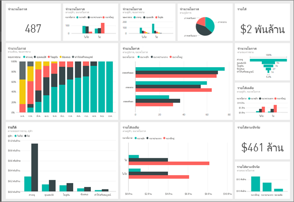
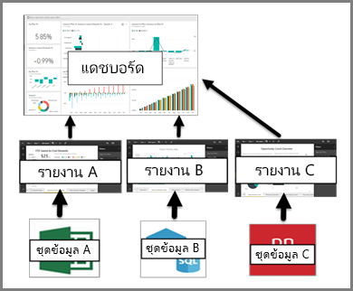

# การแนะนำไปยังแดชบอร์ดสำหรับนักออกแบบ Power BI

*แดชบอร์ด* Power BI เป็นแบบหน้าเดียวหรือที่เรียกว่าพื้นที่รายงาน ซึ่งบอกเล่าเรื่องราวผ่านการสร้างภาพข้อมูล เนื่องจากถูกจำกัดอยู่เพียงหนึ่งหน้า แดชบอร์ดที่ออกแบบมาอย่างดีจะประกอบด้วยส่วนสำคัญที่สุดของเรื่องราวเท่านั้น ผู้อ่านสามารถดูรายงานที่เกี่ยวข้องสำหรับรายละเอียด

แดชบอร์ดเป็นคุณลักษณะหนึ่งของบริการ Power BI เท่านั้น แต่คุณไม่สามารถใช้แดชบอร์ดใน Power BI Desktop ได้ ถึงแม้ว่าคุณไม่สามารถสร้างแดชบอร์ดบนอุปกรณ์มือถือ แต่คุณสามารถ [ดูและแชร์](mobile-apps-view-dashboard.md) ได้

## ข้อมูลพื้นฐานเกี่ยวกับแดชบอร์ด 

การแสดงภาพที่คุณเห็นบนแดชบอร์ดเรียกว่า *ไทล์* คุณ*ปักหมุด*ไทล์ไปยังแดชบอร์ดจากรายงาน หากคุณไม่คุ้นเคยกับ Power BI คุณสามารถเรียนรู้ข้อมูลพื้นฐานได้โดยการอ่าน[แนวคิดพื้นฐานสำหรับนักออกแบบในบริการ Power BI](service-basic-concepts.md)

การแสดงข้อมูลด้วยภาพบนแดชบอร์ดมาจากรายงาน และแต่ละรายงานจะยึดตามชุดข้อมูลหนึ่งชุด วิธีหนึ่งในการนึกภาพแดชบอร์ดคือทางเข้าไปยังรายงานและชุดข้อมูลพื้นฐาน การเลือกการแสดงภาพนำคุณไปยังรายงาน (และชุดข้อมูล) ที่อ้างอิง

## ข้อดีของแดชบอร์ด
แดชบอร์ดเป็นวิธีที่ยอดเยี่ยมในการตรวจดูธุรกิจของคุณและดูเมตริกซ์ที่สำคัญที่สุดของคุณอย่างรวดเร็ว การแสดงข้อมูลด้วยภาพบนแดชบอร์ดอาจมาจากหนึ่งหรือหลายชุดข้อมูลพื้นฐาน และจากรายงานหนึ่งหรือหลายรายงานพื้นฐาน แดชบอร์ดรวมข้อมูลภายในองค์กรและข้อมูลบนระบบคลาวด์ ให้มุมมองแบบรวมโดยไม่คำนึงถึงตำแหน่งที่ข้อมูลอยู่

แดชบอร์ดไม่ได้เป็นเพียงรูปภาพที่สวยงามเท่านั้น แดชบอร์ดยังมีความสามารถในการโต้ตอบได้สูงและมีการอัปเดตไทล์เมื่อมีการเปลี่ยนแปลงข้อมูลพื้นฐาน

## ใครบ้างที่สามารถสร้างแดชบอร์ดได้?
ความสามารถในการสร้างแดชบอร์ดถือเป็นคุณลักษณะสำหรับ*ผู้สร้าง* และจำเป็นต้องมีสิทธิ์ในการแก้ไขในรายงาน สิทธิ์ในการแก้ไขจะพร้อมใช้งานสำหรับผู้สร้างรายงานและผู้ร่วมงานที่ผู้สร้างให้สิทธิ์ในการเข้าถึง ตัวอย่างเช่น ถ้าเดวิดต้องสร้างรายงานในพื้นที่ทำงาน ABC และเพิ่มคุณเข้าไปเป็นสมาชิกของพื้นที่ทำงานนั้น ทั้งเดวิดและคุณจะมีสิทธิ์ในการแก้ไขรายงานนั้น ในทางกลับกัน ถ้ามีการแชร์รายงานกับคุณโดยตรงหรือเป็นส่วนหนึ่งของ[แอปฯ Power BI](service-create-distribute-apps.md) คุณกำลัง*ใช้*รายงาน คุณอาจไม่สามารถปักหมุดไทล์ไปยังแดชบอร์ดได้ 

> [!IMPORTANT]
> คุณจำเป็นต้องมีใบอนุญาต [Power BI Pro](service-free-vs-pro.md) เพื่อสร้างแดชบอร์ดในพื้นที่ทำงาน คุณสามารถสร้างแดชบอร์ดในพื้นที่ทำงานของฉันโดยไม่ต้องมีใบอนุญาต Power BI Pro

## แดชบอร์ดเทียบกับรายงาน
[รายงาน](service-reports.md)และแดชบอร์ดดูเหมือนว่าคล้ายกันเนื่องจากพื้นที่รายงานของทั้งสองเต็มไปด้วยการสร้างภาพข้อมูล แต่มีความแตกต่างที่สำคัญเท่าที่คุณสามารถดูได้ในตารางต่อไปนี้

| **ขีดความสามารถ** | **แดชบอร์ด** | **รายงาน** |
| --- | --- | --- |
| หน้า |หนึ่งหน้า |อย่างน้อยหนึ่งหน้า |
| แหล่งข้อมูล |อย่างน้อยหนึ่งรายงานและอย่างน้อยหนึ่งชุดข้อมูลต่อแดชบอร์ด |ชุดข้อมูลเดียวต่อรายงาน |
| พร้อมใช้งานใน Power BI Desktop |ไม่ใช่ | ใช่ สามารถสร้างและดูรายงานใน Power BI Desktop ได้ |
| สมัครใช้งาน |ใช่ สามารถสมัครใช้งานแดชบอร์ดได้ |ใช่ สามารถสมัครใช้งานหน้ารายงาน |
| การกรอง |หมายเลข ไม่สามารถกรองหรือแบ่งส่วนได้ |ใช่ มีหลายวิธีในการกรอง ทำไฮไลท์ และแบ่งส่วน |
| รายการเด่น |ใช่ สามารถตั้งค่าแดชบอร์ดหนึ่งเป็นแดชบอร์ด *ที่แนะนำของคุณ* ได้ |ไม่ใช่ |
| รายการโปรด | ใช่ สามารถทำเครื่องหมายหลายแดชบอร์ดเป็น *รายการโปรด*ได้ | ใช่ สามารถตั้งค่าหลายรายงานเป็น*รายการโปรด*ได้
| ตั้งค่าการแจ้งเตือน |ใช่ พร้อมใช้งานสำหรับแดชบอร์ดไทล์ในบางสถานการณ์ |ไม่ใช่ |
| แบบสอบถามภาษาธรรมชาติ (Q&A) |ใช่ | ใช่ ให้คุณมีสิทธิ์แก้ไขรายงานและชุดข้อมูลพื้นฐานของรายงานนั้น |
| สามารถดูตารางชุดข้อมูลพื้นฐานและพื้นที่ข้อมูลได้ |หมายเลข สามารถส่งออกข้อมูลได้ แต่ไม่สามารถมองเห็นตารางและเขตข้อมูลในแดชบอร์ดเองได้ |ใช่ |

## ขั้นตอนถัดไป
* สร้างความคุ้นเคยกับแดชบอร์ดโดยเข้าดูหนึ่งใน[ตัวอย่าง](sample-tutorial-connect-to-the-samples.md)ของเรา
* เรียนรู้เกี่ยวกับ[ไทล์แดชบอร์ด](service-dashboard-tiles.md)
* ต้องการติดตามไทล์แดชบอร์ดแต่ละรายการและได้รับอีเมลเมื่อถึงขีดจำกัดหนึ่งหรือไม่? [สร้างการแจ้งเตือนบนไทล์](service-set-data-alerts.md)
* เรียนรู้วิธีใช้ [การถามตอบ Power BI](power-bi-tutorial-q-and-a.md) เพื่อถามคำถามเกี่ยวกับข้อมูลของคุณและรับคำตอบในรูปแบบการแสดงภาพ
