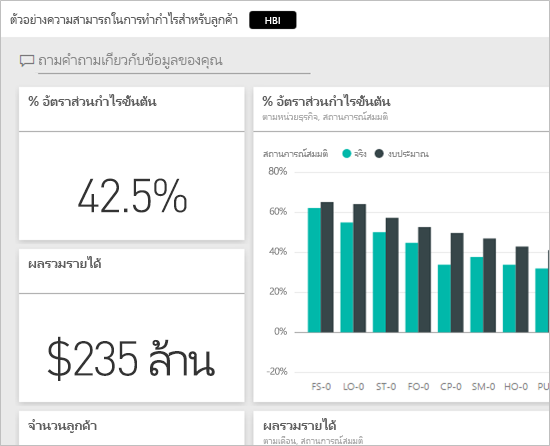
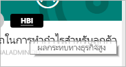
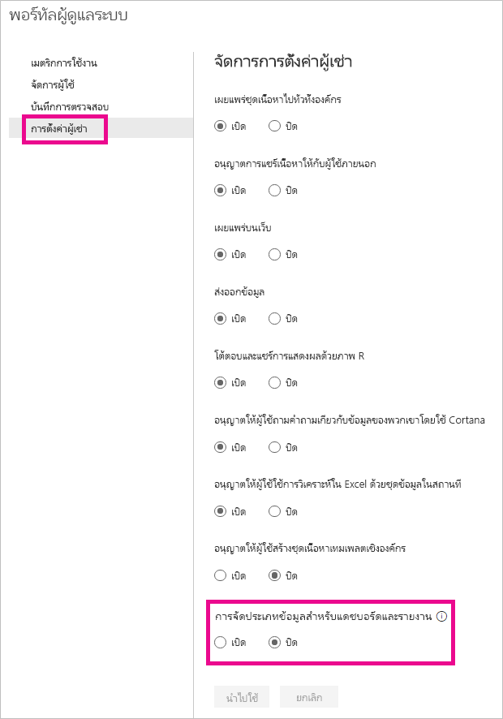

# การจัดประเภทข้อมูลของแดชบอร์ด
แดชบอร์ดทุกตัวจะแตกต่างกันไป และขึ้นอยู่กับแหล่งข้อมูลที่เชื่อมต่อ คุณอาจจะเห็นว่าคุณและเพื่อนร่วมงานของคุณแชร์ความต้องการมาตรการที่แตกต่างกัน โดยขึ้นอยู่กับระดับความลับของข้อมูล แดชบอร์ดบางตัวไม่ควรจะหรือพิมพ์หรือใช้ร่วมกันกับที่อยู่ภายนอกบริษัทของคุณ ในขณะที่ตัวอื่นๆสามารถแชร์ได้อย่างอิสระ โดยใช้การจัดประเภทข้อมูลแดชบอร์ด คุณจะสามารถสร้างความตระหนักให้กับบุคคลที่กำลังดูแดชบอร์ดของคุณ เกี่ยวกับระดับการรักษาความปลอดภัยใดควรใช้ คุณสามารถแท็กแดชบอร์ดของคุณ ด้วยการจัดประเภทที่กำหนดโดยแผนก IT ของบริษัทของคุณ ดังนั้นทุกคนที่ดูเนื้อหาจะมีการทำความเข้าใจเกี่ยวกับระดับความลับของข้อมูลในระดับเดียวกันได้

## แท็กการจัดประเภทข้อมูล
แท็กการจัดประเภทข้อมูลแสดงอยู่ถัดจากชื่อแดชบอร์ด เพื่อแจ้งให้ทุกคนที่ดูอยู่ทราบระดับความปลอดภัยที่ควรใช้กับแดชบอร์ดและข้อมูลที่มี

ซึ่งจะแสดงถัดจากแดชบอร์ดไทล์ในรายการโปรดของคุณด้วย

เมื่อคุณวางเคอร์เซอร์เหนือแท็ก คุณจะเห็นชื่อเต็มของการจัดประเภท

ผู้ดูแลระบบยังสามารถตั้งค่าเป็น URL สำหรับแท็กที่ให้ข้อมูลเพิ่มเติม

> [!NOTE]
> โดยขึ้นอยู่กับการตั้งค่าการจัดประเภท ที่ตั้งโดยผู้ดูแลระบบของคุณ การจัดประเภทบางชนิดอาจไม่แสดงเป็นแท็กบนแดชบอร์ด ถ้าคุณเป็นเจ้าของแดชบอร์ด คุณสามารถตรวจสอบชนิดการจัดประเภทแดชบอร์ดของคุณภายใต้การตั้งค่าแดชบอร์ดได้เสมอ
> 
> 

## ตั้งค่าการจัดประเภทของแดชบอร์ด
ถ้าการจัดประเภทข้อมูลถูกเปิดใช้งานสำหรับบริษัทของคุณ แดชบอร์ดทั้งหมดจะเริ่มด้วยการจัดประเภทชนิดเริ่มต้น แต่ในฐานะเจ้าของแดชบอร์ด คุณสามารถเปลี่ยนการจัดประเภทเพื่อให้ตรงกับระดับความปลอดภัยของแดชบอร์ดได้

เมื่อต้องเปลี่ยนชนิดการจัดประเภท ให้ทำสิ่งต่อไปนี้

1. ไปที่การตั้งค่าแดชบอร์ดโดยการเลือก**จุดไข่ปลา**ถัดจากชื่อแดชบอร์ดและเลือก**ตั้งค่า**
   
    
2. ภายใต้การตั้งค่าแดชบอร์ด คุณจะสามารถดูการจัดประเภทปัจจุบันของแดชบอร์ดของคุณ และใชดร๊อปดาวน์เพื่อเปลี่ยนชนิดการจัดประเภท
   
    
3. ให้เลือก**นำไปใช้** เมื่อทำเสร็จแล้ว

หลังจากทีใช้การเปลี่ยนแปลง ทุกคนที่คุณแชร์ จะเห็นการปรับปรุงในครั้งถัดไปที่พวกเขารีโหลดแดชบอร์ด

## ทำงานกับแท็กการจัดประเภทข้อมูลในฐานะผู้ดูแลระบบ
จัดประเภทข้อมูลถูกตั้งค่าโดยผู้ดูแลระบบส่วนกลางสำหรับองค์กรของคุณ เพื่อเปิดการจัดประเภทข้อมูล ให้ทำสิ่งต่อไปนี้

1. ให้เลือกเฟืองการตั้งค่า และเลือก**ผู้ดพอร์ทัล**
   
    
2. เปลี่ยน**การจัดประเภทข้อมูลของแดชบอร์ดและรายงาน**เป็น*เปิด*ภายในแท็บ**การตั้งค่าผู้เช่า**
   
    

เมื่อเปิดใช้งาน คุณจะเห็นแบบฟอร์มเพื่อสร้างการแบ่งประเภทต่างๆ ในองค์กรของคุณ

แต่ละประเภทมี**ชื่อ**และ**ตัวย่อ**ซึ่งจะปรากฏในแดชบอร์ด สำหรับการจัดประเภทแต่ละตัว คุณสามารถตัดสินใจว่าจะให้แท็กอ้างอิงแบบย่อปรากฏในแดชบอร์ดหรือไม่ โดยการเลือก**แสดงแท็ก** ถ้าคุณตัดสินใจไม่แสดงชนิดการจัดประเภทบนแดชบอร์ด เจ้าของจะยังคงสามารถดูชนิดได้โดยการตรวจสอบการตั้งค่าแดชบอร์ด นอกจากนี้ คุณสามารถเลือกที่จะเพิ่มเป็น**URL**ที่มีข้อมูลเพิ่มเติมเกี่ยวกับแนวทางการจัดประเภทและความต้องการใช้งานขององค์กรของคุณได้  

สิ่งสุดท้ายที่คุณจำเป็นต้องตัดสินใจคือชนิดการจัดประเภทที่จะเป็นค่าเริ่มต้น  

เมื่อคุณกรอกแบบฟอร์มพร้อมกับชนิดของการจัดประเภท ให้เลือก**นำไปใช้**เพื่อบันทึกการเปลี่ยนแปลง

ในตอนนี้ แดชบอร์ดทั้งหมดจะถูกกำหนดการแบ่งประเภทค่าเริ่มต้น และเจ้าของแดชบอร์ดในขณะนี้จะสามารถปรับปรุงชนิดการจัดประเภท ให้เหมาะสมสำหรับเนื้อหาของเธอ คุณสามารถกลับมาที่นี่ในอนาคตเมื่อต้องเพิ่มหรือลบชนิดการจัดประเภท หรือเปลี่ยนค่าเริ่มต้น  

> [!NOTE]
> มีบางสิ่งที่สำคัญที่ต้องทราบเมื่อคุณกลับมาทำการเปลี่ยนแปลง
> 
> * ถ้าคุณปิดใช้งานการจัดประเภทข้อมูล จะไม่จดจำแท็ก คุณจะต้องเริ่มต้นใหม่ทั้งหมด ถ้าคุณตัดสินใจกลับไปเป็นเหมือนเก่าภายหลัง  
> * ถ้าคุณลบชนิดการจัดประเภท แดชบอร์ดใดๆที่ถูกกำหนด ชนิดการจัดประเภทที่ถูกลบออก จะถูกกำหนดให้กลับไปเป็นค่าเริ่มต้นจนกว่าเจ้าของจะตั้งค่าอีกครั้ง  
> * ถ้าคุณเปลี่ยนค่าเริ่มต้น แดชบอร์ดทั้งหมดที่ไม่ได้กำหนดชนิดการจัดประเภทโดยเจ้าของ จะเปลี่ยนเป็นค่าเริ่มต้นตัวใหม่
> 
> 

