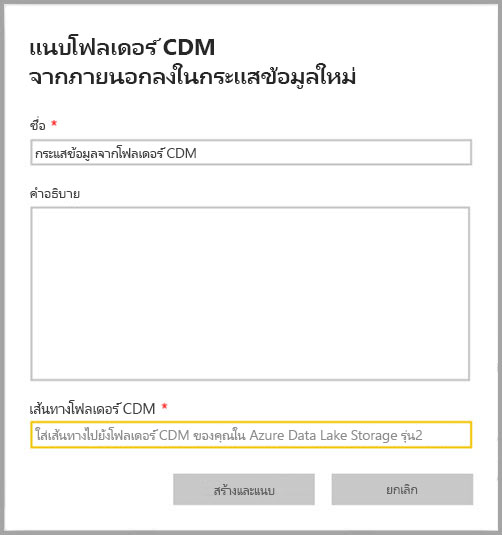
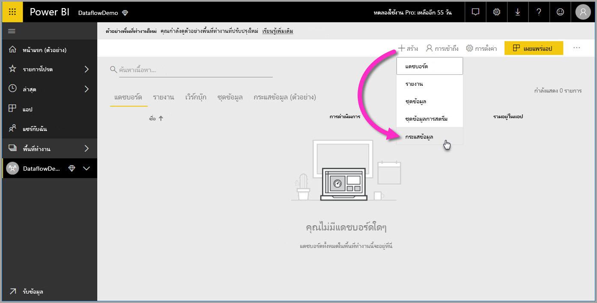
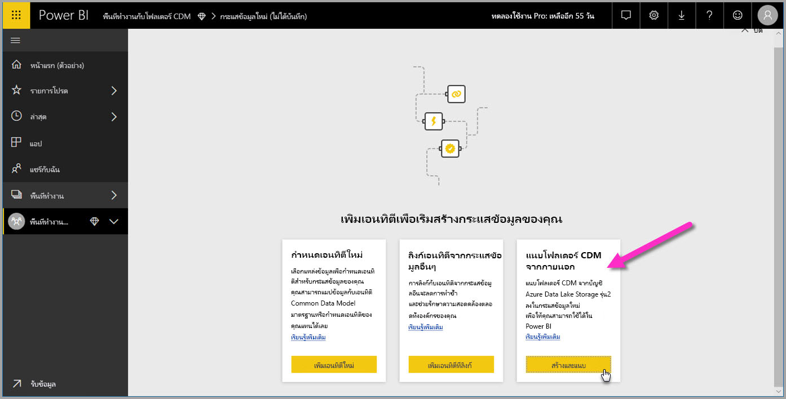

# เพิ่มโฟลเดอร์ CDM ไปยัง Power BI เป็นกระแสข้อมูล (ตัวอย่าง)

ใน Power BI คุณสามารถเพิ่มโฟลเดอร์แบบจำลองข้อมูลทั่วไป (CDM) ที่จัดเก็บไว้ใน Azure Data Lake Store Gen2 ขององค์กรคุณเป็นกระแสข้อมูล เมื่อคุณสร้างกระแสข้อมูลจากโฟลเดอร์ CDM คุณอาจใช้ **Power BI Desktop** และ **บริการของ Power BI** เพื่อสร้างชุดข้อมูล รายงาน แดชบอร์ด และแอปที่ใช้ข้อมูลที่คุณป้อนเข้าโฟลเดอร์ CDM

มีข้อกำหนดสองสามข้อสำหรับการสร้างกระแสข้อมูลจากโฟลเดอร์ CDM ตามรายการที่อธิบายต่อไปนี้:

* การสร้างกระแสข้อมูลจากโฟลเดอร์ CDM สามารถใช้งานได้ใน*พื้นที่ทำงานใหม่*[เท่านั้น](service-create-the-new-workspaces.md) 
* การเพิ่มโฟลเดอร์ CDM ไปยัง Power BI จำเป็นต้องให้ผู้ใช้เพิ่มโฟลเดอร์เพื่อให้ได้รับ[การอนุญาตจากไฟล์และโฟลเดอร์ CDM](https://go.microsoft.com/fwlink/?linkid=2029121)
* คุณต้องได้รับอนุญาตให้สามารถอ่านและดำเนินการ กับไฟล์และโฟลเดอร์ในโฟลเดอร์ CDM เพื่อเพิ่มของเหล่านั้นลงใน Power BI ทั้งหมด

ส่วนต่อไปนี้จะอธิบายวิธีการสร้างแบบกระแสข้อมูลจากโฟลเดอร์ CDM

## สร้างกระแสข้อมูลจากโฟลเดอร์ CDM

เพื่อเริ่มการสร้างกระแสข้อมูลจากโฟลเดอร์ CDM ให้เรียกใช้**บริการ Power BI**และเลือก**แอปพื้นที่ทำงาน**จากบานหน้าต่างนำทางด้านซ้าย คุณยังสามารถสร้างพื้นที่ทำงานใหม่ได้ซึ่งคุณสามารถสร้างกระแสข้อมูลชุดใหม่

ในหน้าจอที่ปรากฏให้เลือก**สร้างและแนบ**ดังที่แสดงในรูปต่อไปนี้

หน้าจอที่ปรากฏขึ้นถัดไปช่วยให้คุณตั้งชื่อกระแสข้อมูลของคุณ ใส่คำอธิบายของกระแสข้อมูลและระบุเส้นทางไปยังโฟลเดอร์ CDM ในบัญชี Azure Data Lake Gen2 ขององค์กรคุณ อ่านบทความในส่วนที่อธิบาย[วิธีการให้ได้มาซึ่งโฟลเดอร์ CDM ของคุณ](service-dataflows-configure-workspace-storage-settings.md#get-the-uri-of-stored-dataflow-files) 

เมื่อคุณได้กรอกข้อมูลแล้ว เลือก**สร้างและแนบ**เพื่อสร้างกระแสข้อมูล

กระแสข้อมูลจากโฟลเดอร์ CDM จะถูกทำเครื่องหมายเป็นไอคอนว่ามาจาก*ภายนอก*เมื่อแสดงผลใน Power BI ในส่วนถัดไป เราอธิบายความแตกต่างระหว่างกระแสข้อมูลมาตรฐาน และกระแสข้อมูลที่สร้างขึ้นจากโฟลเดอร์ CDM

เมื่อสิทธิ์การให้อนุญาตถูกตั้งค่าอย่างเหมาะสม ตามที่อธิบายไว้ในบทความก่อนหน้านี้ คุณสามารถเชื่อมต่อกับกระแสข้อมูลของคุณใน**Power BI Desktop**ได้

## ข้อควรพิจารณาและข้อจำกัด

เมื่อทำงานโดยได้รับอนุญาตให้เข้าถึงกระแสข้อมูลที่สร้างขึ้นจากโฟลเดอร์ CDM แล้ว กระบวนการทำงานจะคล้ายกับที่ทำในแหล่งข้อมูลภายนอกบน Power BI สิทธิ์การอนุญาตจะถูกจัดการที่แหล่งข้อมูล ไม่ใช่จากภายใน Power BI สิทธิ์การอนุญาตต้องได้รับการจัดการอย่างเหมาะสมตั้งแต่แหล่งข้อมูล ยกตัวอย่างเช่น การสร้างกระแสข้อมูลจากโฟลเดอร์ CDM เพื่อให้สามารถใช้งานได้อย่างเหมาะสมกับ Power BI

รายการต่อไปนี้จะช่วยทำให้ชัดเจนว่ากระแสข้อมูลจากโฟลเดอร์ CDM ทำงานกับ Power BI

พื้นที่ทำงานแบบฝังตัวสำหรับ power BI Pro, Premium:
* ไม่สามารถแก้ไขกระแสข้อมูลจากโฟลเดอร์ CDM
* จัดการสิทธิ์ในการอ่านกระแสข้อมูลที่ถูกสร้างขึ้นจากโฟลเดอร์ CDM ซึ่งได้รับการจัดการโดยเจ้าของโฟลเดอร์ CDM ไม่ใช่จาก Power BI

Power BI Desktop:
* เฉพาะผู้ใช้ที่ได้รับอนุญาตให้เข้าใช้งานในพื้นที่ทำงานที่สร้างขึ้นโดย กระแสข้อมูลและโฟลเดอร์ CDM เท่านั้นที่จะสามารถเข้าถึงข้อมูลจากตัวเชื่อมต่อกระแสข้อมูล Power BI

มีข้อควรพิจารณาเพิ่มเติมบางข้อเช่นกันซึ่งอธิบายไว้ในรายการต่อไปนี้:

* การสร้างกระแสข้อมูลจากโฟลเดอร์ CDM สามารถใช้งานได้ใน*พื้นที่ทำงานใหม่*[เท่านั้น](service-create-the-new-workspaces.md)
* เอนทิตีที่เชื่อมโยงไม่พร้อมใช้งานสำหรับกระแสข้อมูล ที่สร้างขึ้นจากโฟลเดอร์ CDM

ลูกค้าของ**Power BI Desktop**ไม่สามารถเข้าถึงกระแสข้อมูล ที่จัดเก็บในบัญชี Azure Data Lake Storage Gen2 เว้นแต่ว่าพวกเขาเป็นเจ้าของกระแสข้อมูล หรือได้รับอนุญาตอย่างถูกต้องให้เข้าถึงโฟลเดอร์ CDM ของ กระแสข้อมูลได้ พิจารณาสถานการณ์ต่อไปนี้:

1.  แอนนาสร้างแอปพื้นที่ทำงานใหม่และกำหนดค่าเพื่อจัดเก็บกระแสข้อมูลจากโฟลเดอร์ CDM
2.  เบน (สมาชิกคนหนึ่งของพื้นที่ทำงานที่แอนนาสร้าง) ต้องการใช้ Power BI Desktop และตัวเชื่อมต่อกระแสข้อมูลเพื่อรับข้อมูลจากกระแสข้อมูลที่ แอนนาสร้าง
3.  เบนเจอข้อผิดพลาดเนื่องจากเขาไม่ได้ถูกเพิ่มหรือได้รับอนุญาตไปยังโฟลเดอร์ CDM ของกระแสข้อมูลใน data lake

    

เพื่อแก้ไขปัญหานี้ เบนได้รับมอบสิทธิ์ให้สามารถเข้าถึงโฟลเดอร์และไฟล์ CDM คุณสามารถเรียนรู้เพิ่มเติมเกี่ยวกับวิธีการอนุญาตให้เข้าถึงไปยังโฟลเดอร์ CDM ใน[บทความนี้](https://go.microsoft.com/fwlink/?linkid=2029121)ได้

## ขั้นตอนถัดไป

บทความนี้มีคำแนะนำเกี่ยวกับวิธีการกำหนดค่าพื้นที่ทำงานที่เก็บกระแสข้อมูล สำหรับรายละเอียดเพิ่มเติม ดูที่บทความดังต่อไปนี้:

สำหรับข้อมูลเพิ่มเติมเกี่ยวกับกระแสข้อมูล, CDM, และ Azure Data Lake Storage Gen2 ดูบทความต่อไปนี้:

* [ การรวมกระแสข้อมูลและ Azure Data Lake (ตัวอย่าง)](service-dataflows-azure-data-lake-integration.md)
* [กำหนดการตั้งค่ากระแสข้อมูลพื้นที่ทำงาน (ตัวอย่าง)](service-dataflows-configure-workspace-storage-settings.md)
* [เชื่อมต่อ Azure Data Lake Storage Gen2 สำหรับที่เก็บกระแสข้อมูล (ตัวอย่าง)](service-dataflows-connect-azure-data-lake-storage-gen2.md)

สำหรับข้อมูลเกี่ยวกับกระแสข้อมูลโดยรวม ให้อ่านบทความเหล่านี้:

* [การสร้างและใช้กระแสข้อมูลใน Power BI](service-dataflows-create-use.md)
* [ใช้เอนทิตีที่มีการคำนวณใน Power BI Premium](service-dataflows-computed-entities-premium.md)
* [ใช้ dataflows กับแหล่งข้อมูลภายในองค์กร](service-dataflows-on-premises-gateways.md)
* [ทรัพยากรสำหรับนักพัฒนาสำหรับ dataflows Power BI](service-dataflows-developer-resources.md)

สำหรับข้อมูลเพิ่มเติมเกี่ยวกับพื้นที่เก็บข้อมูล Azure คุณสามารถอ่านบทความเหล่านี้:
* [คู่มือความปลอดภัยการเก็บข้อมูลของ Azure](https://docs.microsoft.com/azure/storage/common/storage-security-guide)
* [การกำหนดค่าการรีเฟรชตามกำหนดการ](refresh-scheduled-refresh.md)
* [เริ่มต้นด้วยตัวอย่างของ github จากบริการข้อมูล Azure](https://aka.ms/cdmadstutorial)

สำหรับข้อมูลเพิ่มเติมเกี่ยวกับ Common Data Model สามารถดูได้ในบทความภาพรวม:
* [Common Data Model - ภาพรวม](https://docs.microsoft.com/powerapps/common-data-model/overview)
* [โฟลเดอร์ CDM ](https://go.microsoft.com/fwlink/?linkid=2045304)
* [นิยามของ ไฟล์รูปแบบ CDM](https://go.microsoft.com/fwlink/?linkid=2045521)

และคุณสามารถลอง[ถามคำถามในชุมชนของ Power BI](http://community.powerbi.com/) ได้เสมอ

