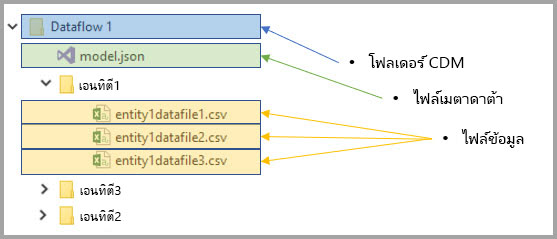
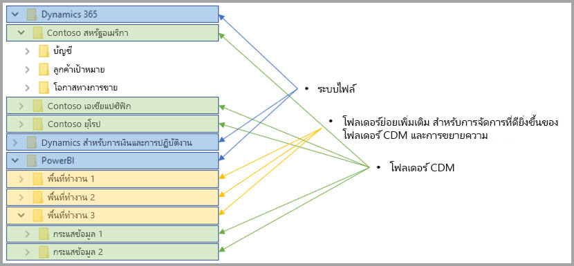

# การรวมกระแสข้อมูลและ Azure Data Lake (ตัวอย่าง)

ตามค่าเริ่มต้น ข้อมูลที่ใช้กับ Power BI จะถูกเก็บไว้ในที่เก็บข้อมูลภายในโดย Power BI ด้วยการรวมกันของกระแสข้อมูลและ Azure Data Lake Storage Gen2 (ADLS Gen2) คุณสามารถจัดเก็บกระแสข้อมูลของคุณในบัญชี Azure Data Lake Storage Gen2 ภายในองค์กรของคุณได้ 

## วิธีที่ทำให้โฟลเดอร์ CDM มีความเกี่ยวข้องกับกระแสข้อมูล

ด้วย**กระแสข้อมูล**ผู้ใช้และองค์กรสามารถ รวมข้อมูลจากแหล่งข้อมูลที่แตกต่างกันอย่างสิ้นเชิง และเตรียมข้อมูลนั้นเพื่อทำแบบจำลอง ด้วย Common Data Model (CDM), องค์กรสามารถใช้และปรับใช้รูปแบบข้อมูลที่มีความสอดคล้องกันที่สื่อความหมายไปในทางเดียวกันไปทั่วทั้งแอปพลิเคชัน และด้วย Azure Data Lake Storage gen2 (ADLS Gen2) ที่มีการควบคุมความสามารถในการเข้าถึง สามารถใช้ได้ด้วยกันกับ data lakes ใน Azure เมื่อรวมกัน องค์ประกอบเหล่านี้จะให้ข้อมูลที่มาจากส่วนกลาง มีโครงสร้างข้อมูล มีการควบคุมการเข้าถึงรายละเอียด และมีความสอดคล้องภายในแอปที่ใช้ร่วมกันทั่วทั้งองค์กร

ข้อมูลที่จัดเก็บไว้ในรูปแบบ CDM มีความสอดคล้องภายในแอปและสามารถใช้ร่วมกันทั่วทั้งองค์กรได้ ด้วยการรวม CDM กับ ADLS Gen2 ความสอดคล้องทางโครงสร้างเดียวกันและสื่อความหมายไปในทางเดียวกันสามารถใช้จัดเก็บข้อมูลใน (ADLS Gen2) โดยใช้โฟลเดอร์ CDM ที่ประกอบด้วยข้อมูลที่เป็นแบบแผนเดียวกันในรูปแบบ CDM มาตรฐาน เมตาดาต้ามาตรฐานและข้อมูลอธิบายด้วยตนเองใน Azure Data Lake ช่วยอำนวยความสะดวกในเมตาดาต้าให้ง่ายต่อการค้นหา และ การแปลความระหว่างผู้สร้างข้อมูลและผู้บริโภคเช่น Power BI, Azure Data Factory, Azure Data Lake, Databricks และ Azure Machine Learning ( ML) 

รูปแบบของที่จัดเก็บกระแสข้อมูลและข้อมูลในโฟลเดอร์ CDM ถูกเก็บในรูปแบบต่อไปนี้:

**Model.json**
* ไฟล์เมตาดาต้า**Model.json**ประกอบด้วยข้อมูลความหมายเกี่ยวกับระเบียนของเอนทิตี แอตทริบิวต์ และลิงก์ไปยังไฟล์ข้อมูล การมีอยู่ของไฟล์ model.json บ่งบอกถึงมาตรฐานตามรูปแบบเมตาดาต้าของ CDM และอาจรวมถึงเอนทิตีมาตรฐานซึ่งมีข้อมูลหลัก ๆ ที่รวบรวมไว้พร้อมความหมายอย่างครบถ้วนที่ซึ่งแอปพลิเคชั่นสามารถนำข้อมูลไปใช้งานได้
* Power BI ยังเก็บข้อมูลจากแต่ละแหล่งข้อมูลพร้อมกับการ**แปลงข้อมูลและคิวรี**ซึ่งสร้างขึ้นโดย Dataflow Editor ในบริการ Power BI รหัสผ่านไปยังแหล่งข้อมูลจะไม่จัดเก็บไว้ในไฟล์แบบจำลอง

**ไฟล์ข้อมูล**
* ไฟล์ข้อมูลซึ่งรวมไปถึงโฟสเดอร์ CDM ซึ่งถูกจัดเก็บอยู่ในโครงสร้างและเป็นรูปแบบอย่างดี (โฟลเดอร์ย่อยถือเป็นทางเลือกหนึ่งในการเก็บไฟล์ซึ่งจะอธิบายไว้ภายหลัง)เป็นรูปแบบที่อ้างอิงมาจากไฟล์ model.json ขณะนี้ ไฟล์ข้อมูลต้องอยู่ในรูปแบบ.csv ส่วนรูปแบบอื่น ๆ อาจได้ถูกรองรับในการอัปเดตอื่น ๆ ที่ตามมา 

ไดอะแกรมต่อไปนี้แสดงตัวอย่างโฟลเดอร์ CDM ซึ่งสร้างขึ้นจากกระแสข้อมูล Power BI ที่ประกอบด้วยสามเอนทิตี:

ไฟล์เมตาดาต้าหรือ model.json ในรูปภาพก่อนหน้าจะมีตัวชี้ไปยังเอนทิตีข้อมูลไฟล์ทั่วทั้งโฟลเดอร์ CDM

## Power BI จัดระเบียบโฟลเดอร์ CDM ใน data lake

ด้วยกระแสข้อมูลจาก Power BI ที่รวมเข้ากันกับ ADLS Gen2 ทำให้ Power BI สามารถสร้างข้อมูลใน data lake ได้ ในฐานะผู้ผลิตข้อมูล Power BI จะต้องสร้างโฟลเดอร์ CDM สำหรับแต่ละ กระแสข้อมูลขึ้นมาซึ่งมีไฟล์ model.json และไฟล์ข้อมูลที่เกี่ยวข้อง Power BI จัดเก็บข้อมูลของตัวเองแยกต่างหากจากข้อมูลที่ถูกสร้างอื่น ๆ ใน data lake โดยใช้*ระบบไฟล์* คุณสามารถอ่านเพิ่มเติมเกี่ยวกับระบบไฟล์ Azure Data Lake Storage Gen2 และลำดับชั้นของ namespace ได้ใน[บทความที่อธิบายถึงสิ่งเหล่านี้](https://docs.microsoft.com/azure/storage/data-lake-storage/namespace)

Power BI ใช้โฟลเดอร์ย่อยในการตัดความสับสนให้กับผู้ใช้ออกไปและปรับปรุงการแสดงข้อมูลให้กับภายในองค์กรให้เห็นด้วย**บริการ Power BI** การตั้งชื่อโฟลเดอร์และโครงสร้างแสดงให้เห็นถึงพื้นที่การทำงาน (โฟลเดอร์)และกระแสข้อมูล(โฟลเดอร์ CDM) ไดอะแกรมต่อไปนี้แสดงให้เห็นว่า Power BI สามารถแชร์ data lake และข้อมูลอื่น ๆ ถูกจัดโครงสร้างขึ้นมาอย่างไร ในแต่ละบริการ (ในที่นี้หมายถึง Dynamics 365) ซึ่งเป็นไดนามิกสำหรับการเงิน การดำเนินการและ Power BI สามารถสร้างและดูแลระบบไฟล์ของตัวเองได้ ขึ้นอยู่กับประสบการณ์การใช้งานในแต่ละบริการ โฟลเดอร์ย่อยจะถูกสร้างขึ้นเพื่อจัดระเบียบโฟลเดอร์ CDM ภายในระบบไฟล์ให้ดียิ่งขึ้น 

## Power BI ช่วยป้องกันข้อมูลใน data lake

Power BI ใช้โทเค่น *Active Directory OAuth Bearer* และฟังก์ชั่น *POSIX ACLs* ซึ่งได้รับมาจาก Azure Data Lake Storage Gen2 ฟีเจอร์เหล่านี้ทำให้สามารถกำหนดขอบเขตการเข้าถึงไฟล์ของ Power BI ในการจัดการข้อมูลใน data lake และกำหนดขอบเขตของบุคคลอื่นให้เข้าถึงเฉพาะ กระแสข้อมูลหรือโฟลเดอร์ CDM ที่พวกเขาสร้าง 

ในการสร้างและจัดการโฟลเดอร์ CDM ภายในระบบไฟล์ของ Power BI ผู้สร้างจำเป็นจะต้องอ่าน เขียนและปฏิบัติตามข้อกำหนดภายในระบบไฟล์ แต่ละกระแสข้อมูลที่ถูกสร้างขึ้นใน Power BI จะถูกเก็บไว้ในโฟลเดอร์ CDM ของตัวเองและเจ้าของกระแสข้อมูลแต่ละคนจะได้รับอนุญาตให้สามารถเข้าถึงเนื้อหาในโฟลเดอร์ CDM ได้ด้วยการอ่านเท่านั้น วิธีนี้ช่วยปกป้องความสมบูรณ์ของข้อมูลที่ Power BI สร้าง และผู้ดูแลระบบจะสามารถในการตรวจสอบผู้ใช้ที่เข้าถึงโฟลเดอร์ CDM ได้โดยใช้บันทึกตรวจสอบการใช้งาน 

### การอนุญาตผู้ใช้หรือบริการสำหรับโฟลเดอร์ CDM

การแชร์โฟลเดอร์ CDM กับผู้ใช้ข้อมูล เช่นผู้ใช้หรือบริการที่จำเป็นต้องอ่านข้อมูล สามารถทำได้ง่ายขึ้น ด้วยโทเค็น Active Directory OAuth Bearer และ POSIX ACLs การดำเนินการดังกล่าวทำให้ผู้ดูแลระบบ มีความสามารถในการตรวจสอบผู้ที่เข้าถึงโฟลเดอร์ CDM เหลือเพียงขั้นตอนสุดท้ายที่ต้องดำเนินการคือการอนุญาตให้เข้าถึง 	ไดเรกทอรีใช้งานที่คุณเลือก (เช่นกลุ่มผู้ใช้หรือบริการ) ไปยังโฟลเดอร์ CDM เราขอแนะนำให้ตั้งค่าการเข้าถึงทั้งหมดไปยังโฟลเดอร์ CDM สำหรับข้อมูลประจำตัวใด ๆ นอกเหนือจากผู้ผลิตข้อมูล ได้รับอนุญาตให้เป็นแบบอ่านอย่างเดียว การดำเนินการดังกล่าวเป็นการปกป้องความเที่ยงตรงของข้อมูลให้เป็นไปตามเจตนาเดิมของผู้สร้าง

เมื่อต้องเพิ่มโฟลเดอร์ CDM ไปยัง Power BI ผู้ดำเนินการควร *อ่าน* การเข้าถึง ACL ทั้งในโฟลเดอร์ CDM และไฟล์หรือโฟลเดอร์อื่น ๆ ภายในนั้น นอกเหนือจากนี้ การ*ดำเนินการ* เข้าถึง ACLทั้งในโฟลเดอร์ CDM เองและโฟลเดอร์อื่น ๆ ภายใน เราขอแนะนำให้ คุณตรวจทานทั้ง[รายการควบคุมการเข้าถึงไฟล์และไดเรกทอรี](https://docs.microsoft.com/azure/storage/blobs/data-lake-storage-access-control#access-control-lists-on-files-and-directories)และ[ฝึกให้คุ้นเคยกับการใช้งาน Azure Data Lake Storage Gen2](https://docs.microsoft.com/azure/storage/blobs/data-lake-storage-best-practices)บทความสำหรับข้อมูลเพิ่มเติม

### แบบฟอร์มอื่นในการขออนุญาต

บุคคลหรือบริการอื่น ๆ จากภายนอก Power BI สามารถใช้ประโยชน์จากแบบฟอร์มอื่นในการขออนุญาต วิธีการคือผู้ใช้จะต้องได้รับอนุญาตให้ถือคีย์ที่สามารถเข้าถึงข้อมูลภายในบัญชีได้*ทั้งหมด* และสามารถใช้งานได้อย่างเต็มรูปแบบโดยไม่ถูกจำกัดจากระบบไฟล์หรือโฟลเดอร์ CDM แม้ว่าบุคคลหรือบริการภายนอกจะได้รับอนุญาตให้เข้ามาโดยง่าย แต่พวกเขาก็ถูกจำกัดความสามารถในการแชร์ข้อมูลสำคัญ ๆ ออกไปจาก data lake และไม่สามารถมอบสิทธิ์การเข้าถึงนี้ให้กับผู้อื่นได้ สำหรับรายละเอียดทั้งหมดเกี่ยวกับสิทธิ์ของผู้ที่ต้องได้รับอนุญาตสามารถเข้าไปดูได้ที่ [บทความเกี่ยวกับการควบคุมการเข้าถึงใน Azure Data Lake Storage Gen2](https://docs.microsoft.com/azure/storage/blobs/data-lake-storage-access-control
)

## ขั้นตอนถัดไป

บทความนี้ให้ภาพรวมของการรวมกระแสข้อมูล Power BI, โฟลเดอร์ CDM และ Azure Data Lake Storage Gen2 สำหรับรายละเอียดเพิ่มเติม ดูที่บทความดังต่อไปนี้:

สำหรับข้อมูลเพิ่มเติมเกี่ยวกับกระแสข้อมูล, CDM, และ Azure Data Lake Storage Gen2 ดูบทความต่อไปนี้:

* [กำหนดการตั้งค่ากระแสข้อมูลพื้นที่ทำงาน (ตัวอย่าง)](service-dataflows-configure-workspace-storage-settings.md)
* [เพิ่มโฟลเดอร์ CDM ไปยัง Power BI เป็นกระแสข้อมูล (ตัวอย่าง)](service-dataflows-add-cdm-folder.md)
* [เชื่อมต่อ Azure Data Lake Storage Gen2 สำหรับที่เก็บกระแสข้อมูล (ตัวอย่าง)](service-dataflows-connect-azure-data-lake-storage-gen2.md)

สำหรับข้อมูลเกี่ยวกับกระแสข้อมูลโดยรวม ให้อ่านบทความเหล่านี้:

* [การสร้างและใช้กระแสข้อมูลใน Power BI](service-dataflows-create-use.md)
* [ใช้เอนทิตีที่มีการคำนวณใน Power BI Premium](service-dataflows-computed-entities-premium.md)
* [ใช้ dataflows กับแหล่งข้อมูลภายในองค์กร](service-dataflows-on-premises-gateways.md)
* [ทรัพยากรสำหรับนักพัฒนาสำหรับ dataflows Power BI](service-dataflows-developer-resources.md)

สำหรับข้อมูลเพิ่มเติมเกี่ยวกับพื้นที่เก็บข้อมูล Azure คุณสามารถอ่านบทความเหล่านี้:
* [คู่มือความปลอดภัยการเก็บข้อมูลของ Azure](https://docs.microsoft.com/azure/storage/common/storage-security-guide)
* [เริ่มต้นด้วยตัวอย่างของ github จากบริการข้อมูล Azure](https://aka.ms/cdmadstutorial)

สำหรับข้อมูลเพิ่มเติมเกี่ยวกับ Common Data Model สามารถดูได้ในบทความภาพรวม:
* [Common Data Model - ภาพรวม](https://docs.microsoft.com/powerapps/common-data-model/overview)
* [โฟลเดอร์ CDM ](https://go.microsoft.com/fwlink/?linkid=2045304)
* [นิยามของ ไฟล์รูปแบบ CDM](https://go.microsoft.com/fwlink/?linkid=2045521)

และคุณสามารถลอง[ถามคำถามในชุมชนของ Power BI](http://community.powerbi.com/) ได้เสมอ
