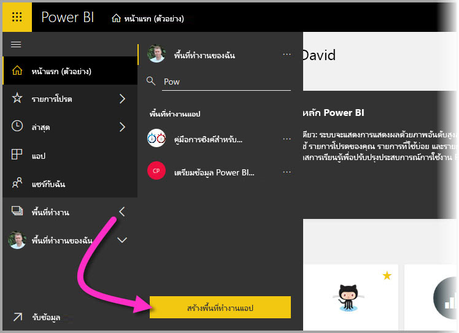
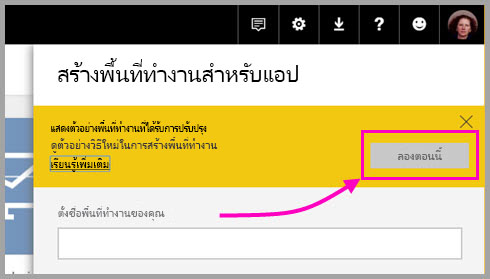
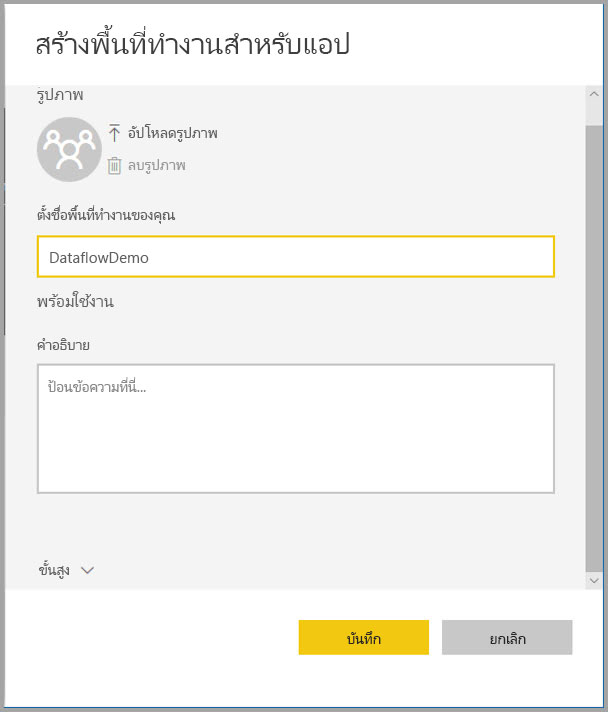
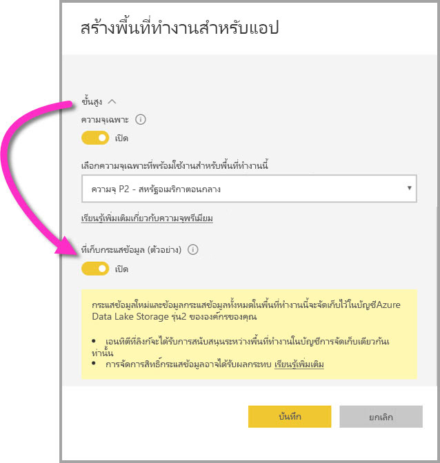
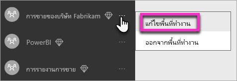
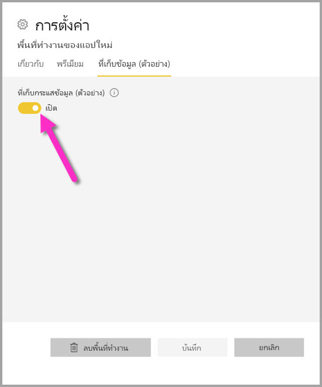
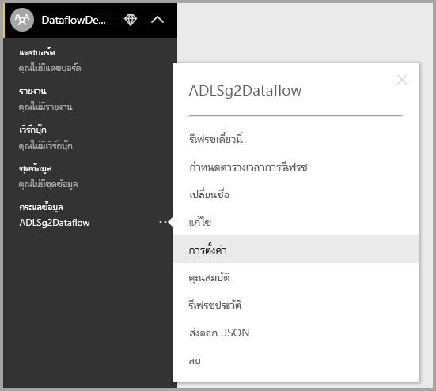
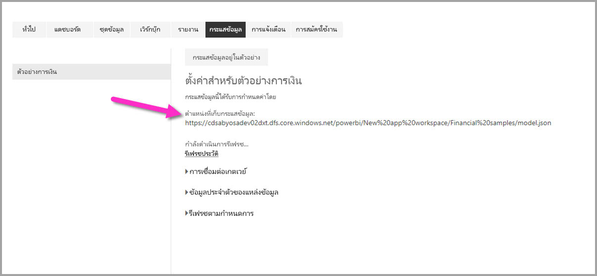

# การตั้งค่าตัวเลขกระแสข้อมูลในพื้นที่ทำงาน (ดูตัวอย่าง)

ด้วย Power BI และกระแสข้อมูล คุณสามารถเก็บไฟล์ข้อกำหนด กระแสข้อมูลและไฟล์ข้อมูลไว้ที่บัญชี Azure Data Lake Storage Gen2 ของคุณ ผู้ดูแลพื้นที่ทำงานสามารถกำหนดค่า Power BI ให้ทำเช่นนั้นได้ และบทความนี้จะแนะนำขั้นตอนที่จำเป็นต้องใช้เพื่อดำเนินการอย่างที่กล่าวมา 

ก่อนที่คุณสามารถกำหนดค่าของตำแหน่งที่เก็บกระแสข้อมูลของพื้นที่ทำงาน ผู้ดูแลระบบส่วนกลางของบริษัทคุณต้องเชื่อมต่อบัญชีที่เก็บข้อมูลองค์กรของคุณไปยัง Power BI และเปิดใช้งานการมอบหมายสิทธิ์การเก็บข้อมูลให้กับบัญชีที่จะใช้ดูแลการเก็บข้อมูลนั่น *[เชื่อมต่อ Azure Data Lake Storage Gen2 สำหรับการเก็บกระแสข้อมูล (ตัวอย่าง) ](service-dataflows-connect-azure-data-lake-storage-gen2.md)* 

มีสองวิธีในการกำหนดค่าการเก็บกระแสข้อมูลบนพื้นที่ทำงาน: 

* ช่วงระหว่างการสร้างพื้นที่ทำงาน
* โดยการแก้ไขพื้นที่ทำงานที่มีอยู่

เราจะไปดูกันในแต่ละส่วน 

> [!IMPORTANT]
> การเปลี่ยนแปลงการตั้งค่าพื้นที่ทำงานที่เก็บกระแสข้อมูลจะสามารถทำได้ก็ต่อเมื่อในพื้นที่ทำงานไม่มีกระแสข้อมูลอยู่ และฟีเจอร์นี้สามารถใช้ได้กับพื้นที่ทำงานใหม่เท่านั้น คุณสามารถเรียนรู้เพิ่มเติมเกี่ยวกับพื้นที่ทำงานใหม่ได้ในบทความ [การสร้างพื้นที่ทำงานใหม่ (ดูตัวอย่าง) ใน Power BI](service-create-the-new-workspaces.md)

## สร้างพื้นที่ทำงานใหม่ กำหนดค่าพื้นที่ทำงานที่เก็บกระแสข้อมูล

เมื่อต้องการสร้างพื้นที่ทำงานใหม่ในบริการของ Power BI ให้เลือก **พื้นที่ทำงาน > สร้างพื้นที่ทำงาน**

เมื่อต้องการสร้างกล่องโต้ตอบของพื้นที่ทำงาน อาจจะมีกล่องสีเหลืองปรากฏ ซึ่งเขียนข้อความว่า **แสดงตัวอย่างพื้นที่ทำงานที่ได้รับการปรับปรุง** หากเกิดกรณีนั้นให้เลือก **ลองเลยเดี๋ยวนี้**.

ในกล่องโต้ตอบที่ปรากฏ คุณสามารถตั้งชื่อพื้นที่ทำงานใหม่ของคุณได้ ห้ามเลือก **บันทึก**จนกว่าคุณจะต้องการดำเนินการตั้งค่าต่อ

ขั้นตอนต่อไป ขยายพื้นที่ **ขั้นสูง** ของกล่องโต้ตอบ **สร้างพื้นที่ทำงาน** ซึ่งคุณสามารถเปิดการตั้งค่า **ที่เก็บกระแสข้อมูล (แสดงตัวอย่าง)** ได้

เลือก**บันทึก**เพื่อสร้างพื้นที่ทำงานของคุณใหม่ กระแสข้อมูลใหม่ใด ๆ ที่สร้างขึ้นในพื้นที่ทำงานนี้ตอนนี้จะถูกจัดเก็บตามข้อกำหนดไฟล์ (ไฟล์ Model.json) และข้อมูลในบัญชี Azure Data Lake Storage Gen2 ขององค์กรคุณ 

## อัปเดตพื้นที่เก็บกระแสข้อมูลสำหรับพื้นที่ทำงานที่มีอยู่

อีกวิธีหนึ่งในการสร้างพื้นที่ทำงานใหม่ คุณสามารถอัปเดตพื้นที่ทำงานที่มีอยู่ในการเก็บแฟ้มข้อกำหนดและข้อมูลในบัญชี Azure Data Lake Storage Gen2 ขององค์กรคุณ โปรดทราบว่า การตั้งค่าที่เก็บกระแสข้อมูล สามารถเปลี่ยนได้เฉพาะตอนที่พื้นที่ทำงานไม่มีกระแสข้อมูลอยู่

หากต้องการแก้ไขพื้นที่ทำงาน ให้เลือกจุดไข่ปลา **(...)** แล้วเลือก **แก้ไขพื้นที่ทำงาน** 

ในการ**แก้ไขหน้าต่างพื้นที่ทำงาน**ที่เห็นว่าขยายอยู่ ให้เลือก**ขั้นสูง**แล้วใน**ที่เก็บกระแสข้อมูล (ตัวอย่าง)** ให้ตั้งค่าเป็น**เปิด** 

แล้วเลือก**บันทึก** และกระแสข้อมูลใหม่ใด ๆ ที่ถูกสร้างขึ้นในที่พื้นที่ทำงานนั้นจะถูกเก็บตามข้อกำหนดไฟล์และข้อมูลของบัญชี Azure Data Lake Storage Gen2 ขององค์กรคุณ

## รับ URI ของไฟล์กระแสข้อมูลที่ถูกจัดเก็บ

เมื่อคุณสร้างกระแสข้อมูลในพื้นที่ทำงานที่ถูกกำหนดให้บัญชี Azure Data Lake ขององค์กรคุณ คุณจะสามารถเข้าถึงไฟล์ข้อกำหนดและข้อมูลได้โดยตรง ตำแหน่งที่อยู่ของกระแสข้อมูลจะปรากฏอยู่บนหน้า **การตั้งค่ากระแสข้อมูล** หากต้องการเข้าถึงส่วนนั้นให้ทำตามขั้นตอนเหล่านี้:

เลือกจุดไข่ปลา **(...)** ถัดจากกระแสข้อมูลซึ่งถูกจัดแสดงเป็นรายการอยู่ใต้**กระแสข้อมูล**ในพื้นที่ทำงาน ในเมนูที่ปรากฏเลือก**การตั้งค่า**

ในข้อมูลที่แสดงนั้น ตำแหน่งโฟลเดอร์ CDM ของกระแสข้อมูลจะปรากฏภายใต้ **ตำแหน่งที่เก็บกระแสข้อมูล** ดังแสดงในภาพต่อไปนี้

> [!NOTE]
> Power BI กำหนดค่าให้เจ้าของกระแสข้อมูลสามารถให้ผู้อ่านเข้าถึงโฟลเดอร์ CDM ที่เก็บไฟล์กระแสข้อมูลอยู่ได้ สิทธิ์การอนุญาตให้ผู้อื่นหรือบริการอื่นเข้าถึงตำแหน่งที่เก็บกระแสข้อมูลต้องให้เจ้าของบัญชีที่เก็บข้อมูลอนุญาตใน Azure ก่อน

## ข้อควรพิจารณาและข้อจำกัด

บางฟีเจอร์ของกระแสข้อมูลไม่สามารถรองรับกับที่เก็บมูลใน Azure Data Lake Storage Gen2: 

พื้นที่ทำงานแบบฝังตัวสำหรับ power BI Pro, Premium:
* ฟีเจอร์**เอนทิตีที่ลิงก์**จะได้รับการรองรับระหว่างพื้นที่ทำงานในบัญชีการจัดเก็บเดียวกันเท่านั้น
* การอนุญาตให้เข้าใช้พื้นที่ทำงานไม่รองรับกับกระแสข้อมูลที่ถูกเก็บไว้ใน Azure Data Lake Storage Gen2 เฉพาะเจ้าของกระแสข้อมูลเท่านั้นที่สามารถเข้าถึงพื้นที่ได้
* มิเช่นนั้น ฟีเจอร์ข้อมูลที่ถูกเตรียมมาทั้งหมดจะเป็นกระแสข้อมูลเดียวกันกับข้อมูลที่เก็บไว้ใน Power BI

มีข้อควรพิจารณาเพิ่มเติมบางข้อเช่นกันซึ่งอธิบายไว้ในรายการต่อไปนี้:

* เมื่อมีการกำหนดค่าตำแหน่งที่เก็บกระแสข้อมูล จะไม่สามารถเปลี่ยนแปลงได้อีก
* เฉพาะเจ้าของกระแสข้อมูลที่ถูกเก็บไว้ใน Azure Data Lake Storage Gen2 เท่านั้นที่สามารถเข้าถึงข้อมูลได้
* แหล่งข้อมูลภายในองค์กรที่แชร์ความจุมาจาก Power BI ไม่สามารถเข้ากันได้กับกระแสข้อมูลที่ถูกเก็บไว้ใน Azure Data Lake Storage Gen2 ขององค์กรคุณ

ลูกค้า **Power BI Desktop** ไม่สามารถเข้าถึงกระแสข้อมูลที่เก็บไว้ในบัญชี Azure Data Lake Storage Gen2 ได้จนกว่าพวกเขาจะเป็นเจ้าของกระแสข้อมูล พิจารณาสถานการณ์ต่อไปนี้:

1.  แอนนาสร้างพื้นที่ทำงานใหม่และกำหนดค่าเพื่อจัดเก็บกระแสข้อมูลในทะเลสาบข้อมูล (Data Lake) ขององค์กร
2.  เบน (สมาชิกคนหนึ่งของพื้นที่ทำงานที่แอนนาสร้าง) ต้องการใช้ Power BI Desktop และตัวเชื่อมต่อกระแสข้อมูลเพื่อรับข้อมูลจากกระแสข้อมูลที่ แอนนาสร้าง
3.  เบนเจอข้อผิดพลาดเนื่องจากเบนไม่ได้ถูกเพิ่มให้เป็นผู้ใช้ที่ได้รับอนุญาตให้เข้าถึงโฟลเดอร์ CDM ของกระแสข้อมูลใน data lake

    

## ขั้นตอนถัดไป

บทความนี้มีคำแนะนำเกี่ยวกับวิธีการกำหนดค่าพื้นที่ทำงานที่เก็บกระแสข้อมูล สำหรับรายละเอียดเพิ่มเติม ดูที่บทความดังต่อไปนี้:

สำหรับข้อมูลเพิ่มเติมเกี่ยวกับกระแสข้อมูล, CDM, และ Azure Data Lake Storage Gen2 ดูบทความต่อไปนี้:

* [ การรวมกระแสข้อมูลและ Azure Data Lake (ตัวอย่าง)](service-dataflows-azure-data-lake-integration.md)
* [เพิ่มโฟลเดอร์ CDM ไปยัง Power BI เป็นกระแสข้อมูล (ตัวอย่าง)](service-dataflows-add-cdm-folder.md)
* [เชื่อมต่อ Azure Data Lake Storage Gen2 สำหรับที่เก็บกระแสข้อมูล (ตัวอย่าง)](service-dataflows-connect-azure-data-lake-storage-gen2.md)

สำหรับข้อมูลเกี่ยวกับกระแสข้อมูลโดยรวม ให้อ่านบทความเหล่านี้:

* [การสร้างและใช้กระแสข้อมูลใน Power BI](service-dataflows-create-use.md)
* [การใช้เอนทิตีที่คำนวณใน Power BI Premium (ตัวอย่าง)](service-dataflows-computed-entities-premium.md)
* [การใช้กระแสข้อมูลพร้อมแหล่งข้อมูลในองค์กร (ตัวอย่าง)](service-dataflows-on-premises-gateways.md)
* [แหล่งข้อมูลของนักพัฒนาสำหรับกระแสข้อมูล Power BI (ตัวอย่าง)](service-dataflows-developer-resources.md)

สำหรับข้อมูลเพิ่มเติมเกี่ยวกับพื้นที่เก็บข้อมูล Azure คุณสามารถอ่านบทความเหล่านี้:

* [คู่มือความปลอดภัยการเก็บข้อมูลของ Azure](https://docs.microsoft.com/azure/storage/common/storage-security-guide)
* [เริ่มต้นด้วยตัวอย่างของ github จากบริการข้อมูล Azure](https://aka.ms/cdmadstutorial)

สำหรับข้อมูลเพิ่มเติมเกี่ยวกับ Common Data Model สามารถดูได้ในบทความภาพรวม:

* [Common Data Model - ภาพรวม](https://docs.microsoft.com/powerapps/common-data-model/overview)
* [โฟลเดอร์ CDM ](https://go.microsoft.com/fwlink/?linkid=2045304)
* [นิยามของ ไฟล์รูปแบบ CDM](https://go.microsoft.com/fwlink/?linkid=2045521)

และคุณสามารถลอง[ถามคำถามในชุมชนของ Power BI](https://community.powerbi.com/) ได้เสมอ
