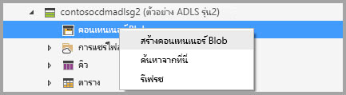
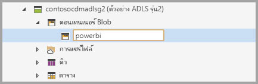
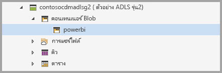
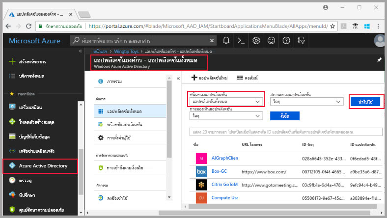
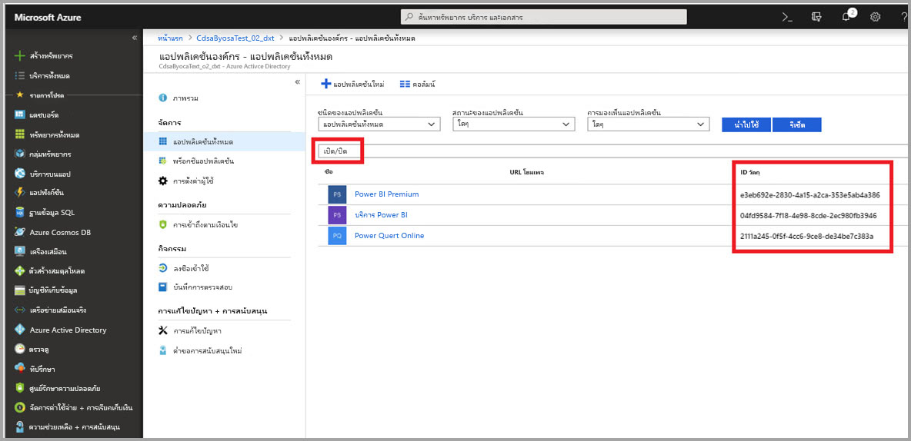
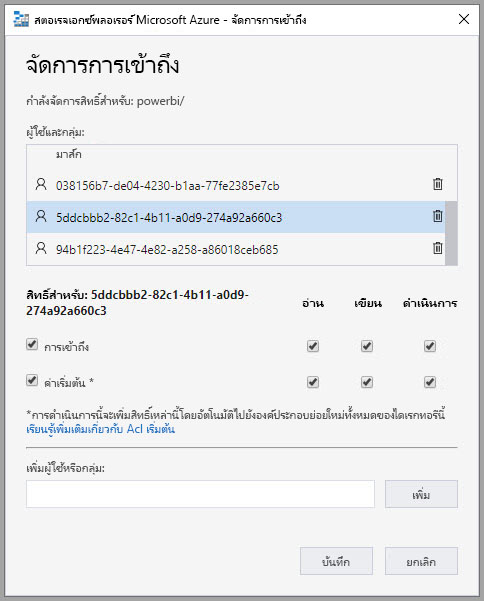
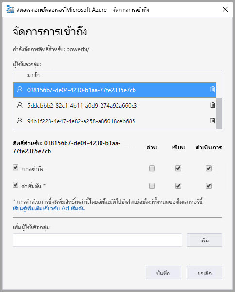
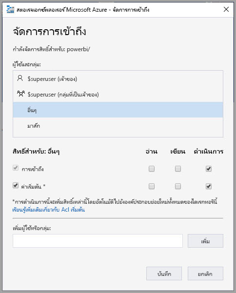
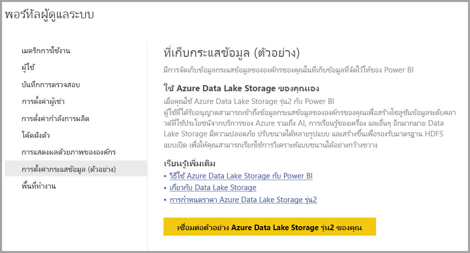

# เชื่อมต่อ Azure Data Lake Storage Gen2 สำหรับที่เก็บกระแสข้อมูล (ตัวอย่าง)

คุณสามารถกำหนดค่าให้พื้นที่ทำงาน Power BI จัดการจัดเก็บข้อมูลของกระแสข้อมูลไว้ในบัญชี Azure Data Lake Storage รุ่น 2 ขององค์กรได้ ภายในบทความนี้จะอธิบายขั้นตอนทั่วไปที่จำเป็นต้องปฏิบัติ และให้คำแนะนำพร้อมแนวทางปฏิบัติที่ดีที่สุด มีข้อดีหลายประการสำหรับการกำหนดค่าพื้นที่ทำงานเพื่อจัดเก็บข้อกำหนดกระแสข้อมูลและไฟล์ข้อมูลใน data lake ของคุณ ดังเช่นต่อไปนี้:

* Azure Data Lake Storage Gen2 มีพื้นที่อำนวยความสะดวกอย่างกว้างขวางและอำนวยความสะดวกให้ในการจัดเก็บข้อมูล
* นักพัฒนาแผนก IT ของคุณสามารถใช้ไฟล์ข้อมูลและข้อกำหนดกระแสข้อมูล ให้เกิดประโยชน์กับข้อมูลจาก Azure และบริการจากปัญญาประดิษฐ์ (AI) ตามที่สาธิตใน[ตัวอย่าง github จากบริการข้อมูล Azure](https://aka.ms/cdmadstutorial)
* ช่วยให้นักพัฒนาในองค์กรของคุณรวบรวมกระแสข้อมูล ลงในแอปพลิเคชันภายใน, การแก้ปัญหาทางธุรกิจ, การใช้ทรัพยากรของนักพัฒนาสำหรับกระแสข้อมูลและ Azure

เพื่อใช้ Azure Data Lake Storage Gen2 กับกระแสข้อมูล คุณต้องปฏิบัติดังต่อไปนี้:

* **ผู้เช่าใน Power BI**  - บัญชีในผู้เช่า Azure Active Directory (AAD) ของคุณอย่างน้อยหนึ่งบัญชีต้องลงชื่อสมัครใช้งาน Power BI
* **บัญชีผู้ดูแลระบบส่วนกลาง**- บัญชีนี้จะต้องมีการกำหนดค่าและเชื่อมต่อกับ Power BI จึงจะสามารถเก็บข้อกำหนดกระแสข้อมูลและข้อมูลในบัญชี Azure Data Lake Storage Gen2 ของคุณได้
* **การสมัครใช้งาน Azure** -คุณต้องสมัครใช้งาน Azure ก่อนเพื่อใช้ Azure Data Lake Storage Gen2
* **กลุ่มทรัพยากร:** ใช้กลุ่มทรัพยากรที่คุณมีอยู่หรือคุณสามารถสร้างกลุ่มใหม่
* **บัญชี Azure Data Lake Storage Gen2 พร้อมกับ Data Lake Storage Gen2 (ตัวอย่าง) ฟีเจอร์ถูกเปิดใช้งาน**- เพื่อเชื่อมต่อกับ Azure Data Lake Storage Gen2 คุณจำเป็นต้องลงชื่อเข้าใช้เพื่อดูตัวอย่างการแสดงผลในพื้นที่สาธารณะ

> [!TIP]
> ถ้าคุณยังไม่มีการสมัครใช้งาน Azure สร้าง[บัญชีฟรี](https://azure.microsoft.com/free/)ก่อนที่คุณจะเริ่ม

## เตรียมพร้อม Azure Data Lake Storage Gen2 ของคุณสำหรับ Power BI

คุณต้องสร้างและกำหนดค่าบัญชีเก็บข้อมูลก่อนที่คุณจะสามารถกำหนดค่า Power BI ด้วยบัญชี Azure Data Lake Storage Gen2 ได้ ลองมาดูข้อกำหนดสำหรับ Power BI:

1. ต้องสร้างบัญชีเก็บข้อมูลในพื้นที่เดียวกันกับที่เช่า AADในฐานะผู้เช่า Power BI ของคุณ
2. ต้องสร้างบัญชีเก็บข้อมูลในภูมิภาคเดียวกันกับผู้เช่า Power BI ของคุณ เมื่อต้องการกำหนดว่าผู้เช่า Power BI ของคุณอยู่ที่ใด ให้ดูที่ [ผู้เช่า Power BI ของฉันอยู่ที่ไหน](service-admin-where-is-my-tenant-located.md)
3. บัญชีเก็บข้อมูลต้องให้ฟีเจอร์*พื้นที่เก็บชื่อตามลำดับชั้น*เปิดใช้งาน
4. บริการ power BI ต้องมอบบทบาท*ผู้อ่าน*ให้กับบัญชีเก็บข้อมูล
5. ระบบไฟล์ชื่อว่า**powerbi**ต้องถูกสร้างขึ้น
6. บริการ Power BI ต้องได้รับอนุญาตจากระบบไฟล์**powerbi**ที่คุณสร้าง

ส่วนต่อไปนี้จะเป็นรายละเอียดขั้นตอนที่จำเป็นสำหรับการตั้งค่าบัญชี Azure Data Lake Storage Gen2 ของคุณ

> [!NOTE]
> ฟังก์ชันของกระแสข้อมูลอยู่ในช่วงตัวอย่าง และสามารถเปลี่ยนและอัปเดตได้ตามความพร้อมใช้งานทั่วไป

### สร้างบัญชีเก็บข้อมูล Azure

ทำตามขั้นตอนในบทความการ[สร้างบัญชี Azure Data Lake Storage Gen2 storage](https://docs.microsoft.com/azure/storage/blobs/data-lake-storage-quickstart-create-account)

1. ให้แน่ใจว่า คุณเลือกตำแหน่งที่ตั้งเดียวกันกับผู้เช่า Power BI ของคุณ และตั้งค่าการเก็บข้อมูลของคุณเป็น**StorageV2 (วัตถุประสงค์ทั่วไป v2)**
2. ให้แน่ใจว่า คุณเปิดใช้งานฟีเจอร์พื้นที่เก็บชื่อตามลำดับชั้น
3. แนะนำว่าให้ตั้งค่าการจำลองแบบเป็น**Read-access geo-redundant storage (RA-GRS)**

### อนุญาตให้บริการ Power BI เป็นบทบาทผู้อ่าน

ขั้นตอนถัดไป คุณต้องให้สิทธิ์บริการ Power BI เป็น บทบาทผู้อ่านในการสร้างบัญชีสำหรับเก็บข้อมูล เนื่องจากมีการกำหนดบทบาทมาในตัวอยู่แล้ว ดังนั้นขั้นตอนจึงไม่มีความซับซ้อน 

ทำตามขั้นตอนในบทความการ[กำหนดบทบาทให้บัญชีผู้ใช้ความปลอดภัยหลัก](https://docs.microsoft.com/azure/storage/common/storage-auth-aad-rbac#assign-a-role-to-a-security-principal)

ในหน้าต่าง**เพิ่มการกำหนดบทบาท** เลือกบทบาท**ผู้อ่าน**เพื่อกำหนดค่าการบริการ Power BI จากนั้นใช้การค้นหาเพื่อกำหนดที่ตั้ง**บริการ Power BI** รูปภาพต่อไปนี้แสดงบทบาทของ**ผุ้อ่าน**ที่ได้รับมอบหมายให้กับบริการ Power BI

### สร้างไฟล์ระบบสำหรับ Power BI

คุณต้องสร้างไฟล์ระบบชื่อว่า*powerbi*ก่อนที่บัญชีเก็บข้อมูลของคุณ จะสามารถเพิ่มเข้าไปยัง Power BI ได้ มีหลายวิธีในการสร้างไฟล์ระบบดังกล่าว รวมถึงการใช้ Azure Databricks, HDInsight, AZCopy หรือ Azure Storage Explorer ส่วนนี้แสดงวิธีการสร้างแฟ้มระบบโดยใช้ Azure Storage Explorer อย่างง่าย

ขั้นตอนนี้จำเป็นให้คุณต้องติดตั้ง Azure Storage Explorer เวอร์ชัน 1.6.2 หรือสูงกว่า เมื่อต้องการติดตั้ง Azure Storage Explorer สำหรับ Windows, Macintosh หรือ Linux ให้ดูที่[Azure Storage Explorer](https://azure.microsoft.com/features/storage-explorer/)

1. เมื่อคุณสำเร็จการติดตั้ง Azure Storage Explorer เรียบร้อยแล้ว ในการเปิดใช้งานครั้งแรกระบบจะมีการแสดหน้าต่างการเชื่อมต่อ Azure Microsoft Explorer ขึ้นมาให้เห็น แม้ว่า Storage Explorer จะมีหลายวิธีในการเชื่อมต่อเข้ากับบัญชีเก็บข้อมูล แต่ในขณะนี้มีเพียงวิธีเดียวเท่านั้นที่สามารถใช้ได้กับการติดตั้งตามที่กำหนด 

2. ในบานหน้าต่างด้านซ้าย ค้นหา และขยายบัญชีเก็บข้อมูลที่คุณสร้างไว้ข้างต้น

3. คลิกขวาที่ Blob Containers และจากเมนูตามเนื้อหา - เลือกสร้าง Blob Containers

   

4. กล่องข้อความจะปรากฏด้านล่างโฟลเดอร์ Blob Containers ใส่ชื่อ *powerbi* 

   

5. กด Enter เมื่อสร้าง blob container เสร็จสิ้น

   

ในส่วนถัดไป คุณอนุญาตให้บริการทั้งหมดของ Power BI สามารถเข้าถึงไฟล์ระบบที่คุณสร้างขึ้น 

### ให้สิทธิ์อนุญาตแก่ Power BI ให้เข้าถึงไฟล์ระบบ

ในการอนุญาตให้เข้าถึงไฟล์ระบบ คุณจะต้องตั้งค่าใน Access Control List (ACL) ให้ยอมรับการเข้าถึงของบริการ Power BI ขั้นแรกคือต้องมีข้อมูลประจำตัวบริการ Power BI ในผู้เช่าของคุณ คุณสามารถดู Azure Active Directory (AAD) แอปพลิเคชัน ของคุณใน **Enterprise apps**ซึ่งเป็นส่วนหนึ่งของพอร์ทัล Azure ได้

ในการหาผู้เช่าบนแอปพลิเคชั่นให้ทำตามขั้นตอนต่อไปนี้:

1. ใน [พอร์ทัล Azure](https://portal.azure.com/) เลือก **Azure Active Directory**จากบานหน้าต่างนำทางที่อยู่ด้านซ้าย
2. ใน Azure **Active Directory** blade เลือก**แอปพลิเคชันขององค์กร**
3. จากเมนูดรอปดาวน์**ชนิดแอปพลิเคชัน** เลือก**แอปพลิเคชันทั้งหมด**แล้วเลือก**นำไปใช้** ตัวอย่างของแอปพลิเคชันผู้เช่าของคุณที่ปรากฏมีความคล้ายกันกับรูปต่อไปนี้

    

4. ในแถบค้นหา พิมพ์*Power*และคอลเลกชันของ Object ID สำหรับแอปพลิเคชัน Power BI และ Power Query จะปรากฏขึ้น คุณจำเป็นต้องใช้ค่าสามค่าทั้งหมดในขั้นตอนต่อไป  

    

5. เลือกและคัดลอกทั้ง Object ID สำหรับบริการ Power BI และ Power BI premium จากผลลัพธ์การค้นหาของคุณ เตรียมพร้อมที่จะวางค่าตัวเลขเหล่านั้นในขั้นตอนต่อไป

7. ถัดไป ใช้**Azure Storage Explorer**เพื่อนำทางไปยังไฟล์ระบบ*powerbi*ที่คุณสร้างขึ้นในส่วนก่อนหน้านี้ ทำตามคำแนะนำในบทความ[การจัดการการเข้าถึง](https://docs.microsoft.com/azure/storage/blobs/data-lake-storage-how-to-set-permissions-storage-explorer#managing-access)ในส่วนของ[ตั้งค่าไฟล์และระดับสิทธิ์การให้อนญาตการเข้าถึงโดยใช้ Azure Storage explorer](https://docs.microsoft.com/azure/storage/blobs/data-lake-storage-how-to-set-permissions-storage-explorer)

8. สำหรับ Power BI Object ID แต่ละคู่ที่ถูกเก็บไว้ในขั้นตอนที่ 5 กำหนดให้ **อ่าน**, **เขียน**, **ดำเนินการ** เข้าถึงและตั้งเป็นค่าเริ่มต้น ACL ให้กับไฟล์ระบบ *powerbi* ของคุณ

   

9. สำหรับ Power Query Online Object ID ที่เก็บไว้ในขั้นตอนที่ 4 กำหนดให้ **เขียน**, **ดำเนินการ** เข้าถึงและตั้งเป็นค่าเริ่มต้น ACL ในระบบไฟล์*powerbi* ของคุณ

   

10. นอกจากนี้ สำหรับ**อื่น ๆ**, กำหนด**ดำเนินการ** เข้าถึงและตั้งเป็นค่าเริ่มต้น ACL เช่นกัน

    

## เชื่อมต่อ Azure Data Lake Storage Gen2 เข้ากับ Power BI ของคุณ

เมื่อคุณได้ตั้งค่าบัญชี Azure Data Lake Storage Gen2 ของคุณในพอร์ทัล Azure แล้ว คุณสามารถเชื่อมต่อมันเข้ากับ Power BI ใน**พอร์ทัลผู้ดูแลระบบ Power BI**ได้ คุณยังสามารถจัดการที่เก็บกระแสข้อมูล Power BI ในส่วนของการตั้งค่า**ที่เก็บกระแสข้อมูล (ตัวอย่าง)** ของพอร์ทัลผู้ดูแลระบบ Power BI สำหรับคำแนะนำอย่างละเอียดในการเปิดใช้งานเบื้องต้น ให้ดูที่[วิธีการเข้าถึงพอร์ทัลผู้ดูแล](service-admin-portal.md)

คุณสามารถเชื่อมต่อบัญชี **Azure Data Lake Storage Gen2** ของคุณตามขั้นตอนดังต่อไปนี้:

1. นำทางไปยังแท็บ**การตั้งค่ากระแสข้อมูล (ตัวอย่าง)** ของ**พอร์ทัลผู้ดูแลระบบ Power BI**

     

2. เลือกปุ่ม **เชื่อมต่อ Azure Data Lake Storage Gen2 (ตัวอย่าง) ของคุณ** หน้าต่างต่อไปนี้จะปรากฏขึ้น

     

3. ใส่ข้อมูล**ID การสมัครใช้งาน**ของบัญชีเก็บข้อมูล
4. ตั้ง**ชื่อกลุ่มทรัพยากร**ที่บัญชีเก็บข้อมูลถูกสร้างขึ้น
5. ตั้ง **ชื่อบัญชีที่เก็บข้อมูล**
6. เลือก **เชื่อมต่อ**

เมื่อดำเนินขั้นตอนเหล่านั้นจะเสร็จสมบูรณ์แล้ว บัญชี Azure Data Lake Storage Gen2 ของคุณจะถูกเชื่อมต่อกับ Power BI 

ขั้นตอนถัดไปคุณต้องอนุญาตให้บุคลากรในองค์กรสามารถกำหนดค่าในพื้นที่ทำงานได้เพื่อที่จะให้พวกเขาสามารถใช้บัญชีที่เก็บข้อมูลสำหรับข้อกำหนดกระแสข้อมูลและที่เก็บข้อมูล ลองทำแบบนั้นดูในส่วนถัดไป 

## อนุญาตให้ผู้ดูแลระบบเป็นผู้กำหนดพื้นที่ทำงาน

ตามค่าเริ่มต้น ข้อกำหนดกระแสข้อมูลและไฟล์ข้อมูลจะถูกเก็บอยู่ในที่เก็บข้อมูลซึ่งจัดหาโดย Power BI เมื่อต้องการเข้าถึงไฟล์กระแสข้อมูลในบัญชีที่เก็บข้อมูลของคุณ ผู้ดูแลพื้นที่ทำงานต้องกำหนดค่าพื้นที่ทำงานให้สามารถอนุญาตเก็บกระแสข้อมูลและมอบหมายงานในบัญชีเก็บข้อมูลใหม่ ก่อนที่ผู้ดูแลพื้นที่ทำงานจะสามารถกำหนดค่าในการตั้งค่าพื้นที่เก็บกระแสข้อมูล ผู้ดูแลคนนั้น ๆ จะต้องได้รับอนุญาตจากที่เก็บข้อมูลตามการมอบหมายใน **พอร์ทัลผู้ดูแลระบบ Power BI**.

เมื่อต้องให้สิทธิ์อนุญาตจากที่เก็บข้อมูลตามการมอบหมาย ให้ไปที่**การตั้งค่ากระแสข้อมูล (ตัวอย่าง)** ในแท็บการ**พอร์ทัลผู้ดูแลระบบ Power BI** จะมีปุ่มตัวเลือกว่า*อนุญาตให้ผู้ดูแลพื้นที่ทำงานเป็นผู้กำหนดพื้นที่ทำงานให้กับบัญชีที่เก็บข้อมูลนี้*ซึ่งต้องตั้งค่าเป็น**อนุญาต** เมื่อคุณเปิดใช้งานแถบเลื่อน ให้กดปุ่ม**นำไปใช้**เพื่อให้เปลี่ยนแปลงมีผลบังคับใช้ 

 

เท่านี้ก็เรียบร้อย ตอนนี้ผู้ดูแลพื้นที่ทำงาน Power BI สามารถกำหนดให้เวิร์กโฟลว์ไปยังไฟล์ระบบที่คุณสร้างขึ้นได้

## ข้อควรพิจารณาและข้อจำกัด

ฟีเจอร์นี้เป็นเพียงฟีเจอร์ตัวอย่าง ลักษณะการทำงานของฟีเจอร์อาจมีการเปลี่ยนแปลงในวันที่มีการปล่อยสู่สาธารณะ มีข้อควรพิจารณาและข้อจำกัดสองสามข้อที่ควรทราบเมื่อที่เก็บกระแสข้อมูลของคุณ:

* เมื่อมีการกำหนดค่าตำแหน่งที่เก็บกระแสข้อมูล จะไม่สามารถเปลี่ยนแปลงได้อีก
* เฉพาะเจ้าของกระแสข้อมูลที่ถูกเก็บไว้ใน Azure Data Lake Storage Gen2 เท่านั้นที่สามารถเข้าถึงข้อมูลที่เป็นค่าเริ่มต้นได้ หากคุณต้องการให้ผู้ใช้อื่นสามารถเข้าถึงกระแสข้อมูลที่ถูกเก็บไว้ใน Azure คุณต้องเพิ่มพวกเขาเหล่านั้นลงในกระแสข้อมูลโฟลเดอร์ CDM ก่อน 
* การสร้างกระแสข้อมูลพร้อมเอนทิตีที่มีการเชื่อมโยงสามารถทำได้เฉพาะเมื่อกระแสข้อมูลนั้นถูกเก็บไว้ในบัญชีเก็บข้อมูลเดียวกัน
* แหล่งข้อมูลภายในองค์กรที่แชร์ความจุมาจาก Power BI ไม่สามารถเข้ากันได้กับกระแสข้อมูลที่ถูกเก็บไว้ใน data lake ขององค์กรคุณ

และยังมีปัญหาอีกสองสามกรณีตามที่ได้อธิบายไว้ในส่วนนี้

ลูกค้า Power BI Desktop ไม่สามารถเข้าถึงกระแสข้อมูลที่เก็บไว้ในบัญชี **Azure Data Lake Storage Gen2** ได้จนกว่าพวกเขาจะเป็นเจ้าของกระแสข้อมูลเองหรือได้รับอนุญาตให้เข้าถึงโฟลเดอร์ CDM ใน data lake ได้ ต่อไปนี้คือสถานการณ์สมมติ:

1. แอนนาสร้างแอปพื้นที่ทำงานใหม่และกำหนดค่าเพื่อจัดเก็บกระแสข้อมูลใน data lake ขององค์กร 
2. เบน (สมาชิกคนหนึ่งของพื้นที่ทำงานที่แอนนาสร้าง) ต้องการใช้ Power BI Desktop และตัวเชื่อมต่อกระแสข้อมูลเพื่อรับข้อมูลจากกระแสข้อมูลที่ แอนนาสร้าง
3. เบนเจอข้อผิดพลาดคล้ายกันกับรูปดังต่อไปนี้เนื่องจากเขาไม่ได้รับอนุญาตไปยังโฟลเดอร์ CDM ของกระแสข้อมูลใน data lake

คำถามและคำตอบโดยทั่วไปมีดังนี้:

**คำถาม:** ถ้าก่อนหน้านี้ฉันเคยสร้างกระแสข้อมูลในพื้นที่ทำงาน และต้องการเปลี่ยนตำแหน่งที่เก็บข้อมูล ฉันจะต้องทำอย่างไร?

**คำตอบ:** คุณไม่สามารถเปลี่ยนตำแหน่งที่เก็บของกระแสข้อมูลได้ หลังจากที่ถูกสร้างขึ้น 

**คำถาม:** แล้วฉันจะสามารถเปลี่ยนตำแหน่งที่เก็บกระแสข้อมูลได้เมื่อไหร่?

**คำตอบ:** การเปลี่ยนตำแหน่งที่เก็บกระแสข้อมูลของพื้นที่ทำงานสามารถทำได้เฉพาะตอนนี้ไม่มีกระแสข้อมูลอยู่ในพื้นที่ทำงานนั้น ๆ แล้ว

## ขั้นตอนถัดไป

บทความนี้มีคำแนะนำเกี่ยวกับวิธีการเชื่อมต่อ Azure Data Lake Gen2 สำหรับที่เก็บกระแสข้อมูล สำหรับรายละเอียดเพิ่มเติม ดูที่บทความดังต่อไปนี้:

สำหรับข้อมูลเพิ่มเติมเกี่ยวกับกระแสข้อมูล, CDM, และ Azure Data Lake Storage Gen2 ดูบทความต่อไปนี้:

* [ การรวมกระแสข้อมูลและ Azure Data Lake (ตัวอย่าง)](service-dataflows-azure-data-lake-integration.md)
* [กำหนดการตั้งค่ากระแสข้อมูลพื้นที่ทำงาน (ตัวอย่าง)](service-dataflows-configure-workspace-storage-settings.md)
* [เพิ่มโฟลเดอร์ CDM ไปยัง Power BI เป็นกระแสข้อมูล (ตัวอย่าง)](service-dataflows-add-cdm-folder.md)

สำหรับข้อมูลเกี่ยวกับกระแสข้อมูลโดยรวม ให้อ่านบทความเหล่านี้:

* [การสร้างและใช้กระแสข้อมูลใน Power BI](service-dataflows-create-use.md)
* [การใช้เอนทิตีที่คำนวณใน Power BI Premium (ตัวอย่าง)](service-dataflows-computed-entities-premium.md)
* [การใช้กระแสข้อมูลพร้อมแหล่งข้อมูลในองค์กร (ตัวอย่าง)](service-dataflows-on-premises-gateways.md)
* [แหล่งข้อมูลของนักพัฒนาสำหรับกระแสข้อมูล Power BI (ตัวอย่าง)](service-dataflows-developer-resources.md)

สำหรับข้อมูลเพิ่มเติมเกี่ยวกับพื้นที่เก็บข้อมูล Azure คุณสามารถอ่านบทความเหล่านี้:
* [คู่มือความปลอดภัยการเก็บข้อมูลของ Azure](https://docs.microsoft.com/azure/storage/common/storage-security-guide)

สำหรับข้อมูลเพิ่มเติมเกี่ยวกับ Common Data Model สามารถดูได้ในบทความภาพรวม:
* [Common Data Model - ภาพรวม](https://docs.microsoft.com/powerapps/common-data-model/overview)
* [โฟลเดอร์ CDM ](https://go.microsoft.com/fwlink/?linkid=2045304)
* [นิยามของ ไฟล์รูปแบบ CDM](https://go.microsoft.com/fwlink/?linkid=2045521)

และคุณสามารถลอง[ถามคำถามในชุมชนของ Power BI](http://community.powerbi.com/) ได้เสมอ
