# การสร้างและการใช้กระแสข้อมูลใน Power BI

ด้วยการใช้การเตรียมข้อมูลขั้นสูงที่พร้อมใช้งานใน **Power BI** คุณจะสามารถสร้างคอลเลกชันข้อมูลที่เรียกว่ากระแสข้อมูลได้ ซึ่งคุณอาจทำไปใช้เชื่อมต่อข้อมูลธุรกิจจากแหล่งข้อมูลต่างๆ ได้ คุณอาจล้างข้อมูล แปลงแล้วอัปโหลดเข้าที่เก็บข้อมูลของ Power BI ได้

**กระแสข้อมูล** คือคอลเลกชันของ*เอนทิตี* (เอนทิตีนั้นคล้ายกับตาราง) ซึ่งสร้างและจัดการได้ในพื้นที่ทำงานในบริการของ Power BI คุณสามารถเพิ่มและแก้ไขเอนทิตีในกระแสข้อมูลได้ และสามารถจัดการกำหนดการรีเฟรชข้อมูลได้โดยตรงจากพื้นที่ทำงานที่ใช้สร้างกระแสข้อมูล

เมื่อคุณสร้างกระแสข้อมูล คุณอาจใช้ **Power BI Desktop** และ **บริการของ Power BI** เพื่อสร้างชุดข้อมูล รายงาน แดชบอร์ด และแอปที่ใช้ข้อมูลที่คุณป้อนเข้ากระแสข้อมูลของ Power BI ซึ่งจะช่วยให้คุณได้ข้อมูลเชิงลึกในกิจกรรมธุรกิจ

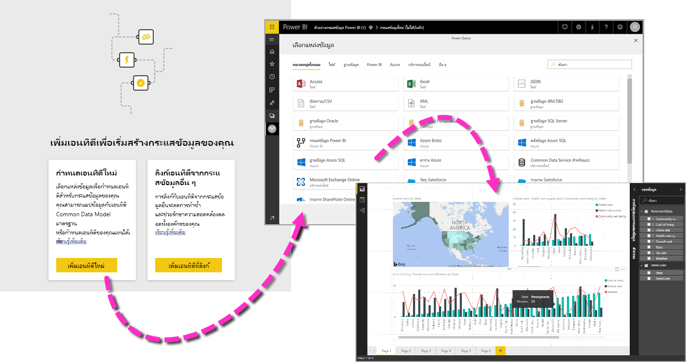

มีขั้นตอนหลักสามขั้นตอนในการใช้กระแสข้อมูล:

1. เขียนกระแสข้อมูลโดยใช้เครื่องมือ Microsoft ที่ออกแบบมาเพื่อการนั้นโดยเฉพาะ
2. วางกำหนดการความถี่ในการรีเฟรชข้อมูลที่คุณต้องการนำเข้ากระแสข้อมูล
3. ใช้กระแสข้อมูลสร้างชุดข้อมูลโดยใช้ Power BI Desktop 

ในส่วนต่อไปนี้ เราจะดูไปทีละขั้นตอนและทำความคุ้นเคยกับเครื่องมือที่ให้มาเพื่อทำตามขั้นตอนนั้นๆ มาเริ่มกันเลย!

## การสร้างกระแสข้อมูล
เมื่อต้องการสร้างกระแสข้อมูล ให้เปิดใช้บริการของ Power BI ในเบราว์เซอร์ จากนั้นเลือก **พื้นที่ทำงาน** (กระแสข้อมูลไม่พร้อมใช้งานใน *พื้นที่ทำงานของฉัน* ในบริการของ Power BI) จากบานหน้าต่างด้านซ้าย ดังที่แสดงในหน้าจอต่อไปนี้ คุณยังสามารถสร้างพื้นที่ทำงานใหม่ได้ ซึ่งใช้เพื่อสร้างกระแสข้อมูลชุดใหม่ 

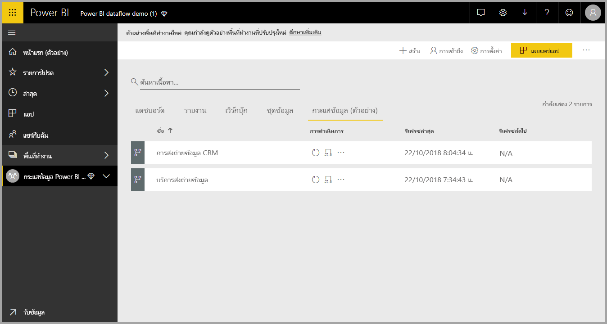

เมื่อคุณอยู่ในพื้นที่ **พื้นที่ทำงาน** ซึ่งคุณสามารถสร้างกระแสข้อมูลได้ จะมีปุ่ม **+ Create** ปรากฏขึ้นที่มุมบนขวาของพื้นที่ทำงาน เลือกปุ่ม **+ Create** จากนั้นเลือก**กระแสข้อมูล** จากรายการดรอปดาวน์ 

สิ่งสำคัญคือต้องทราบว่ามีเพียงเจ้าของกระแสข้อมูลเพียง*ผู้เดียว* ซึ่งก็คือผู้สร้างกระแสข้อมูลนั้น เจ้าของเท่านั้นที่สามารถแก้ไขกระแสข้อมูลได้ สมาชิกทั้งหมดของ **พื้นที่ทำงาน** ที่มีสิทธิ์ในการอ่านหรือการเขียนในพื้นที่ทำงานที่มีการสร้างกระแสข้อมูล จะสามารถเชื่อมต่อกับกระแสข้อมูลได้จากภายใน **Power BI Desktop** ตามที่จะอธิบายไว้ต่อไปในบทความนี้

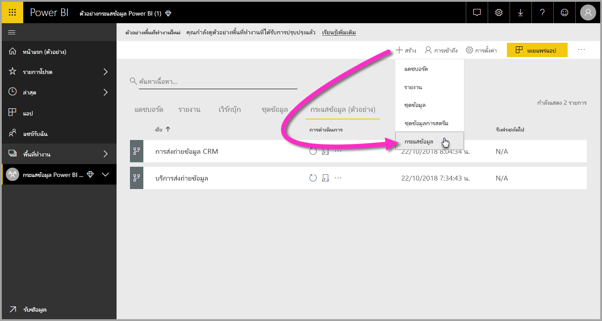

จากจุดนั้น ให้คุณเพิ่ม**เอนทิตี** ซึ่งเราจะอธิบายเพิ่มเติมในส่วนถัดไป

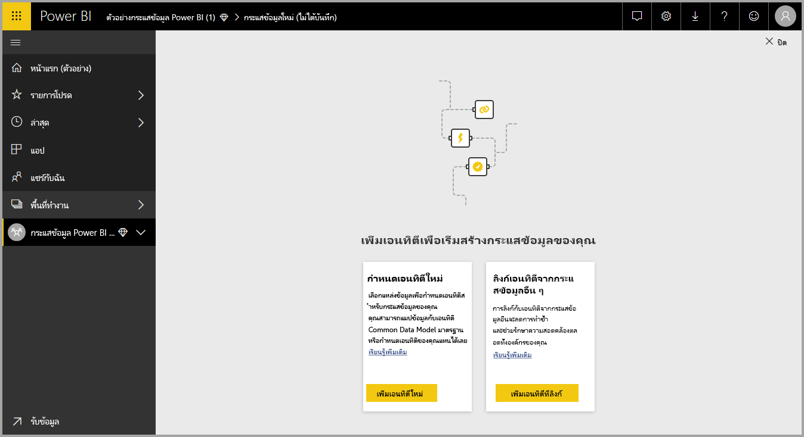

### เพิ่มเอนทิตี

**เอนทิตี**คือชุดเขตข้อมูลที่ใช้เพื่อเก็บข้อมูฃ โดยคล้ายคลึงกับตารางที่อยู่ภายในฐานข้อมูล ในรูปต่อไปนี้ คุณจะเห็นการเลือกแหล่งข้อมูลที่คุณสามารถใช้รวบรวมข้อมูลไปยัง Power BI ได้

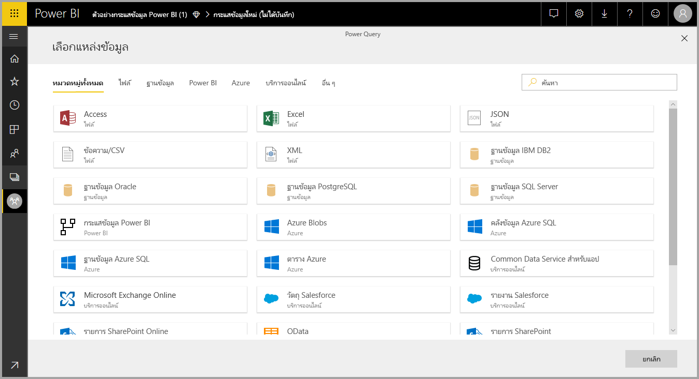

เมื่อคุณเลือกแหล่งข้อมูล คุณจะได้รับแจ้งเตือนให้ระบุการตั้งค่าการเชื่อมต่อ รวมถึงบัญชีที่ใช้เมื่อทำการเชื่อมต่อกับแหล่งข้อมูล ดังที่แสดงในรูปต่อไปนี้

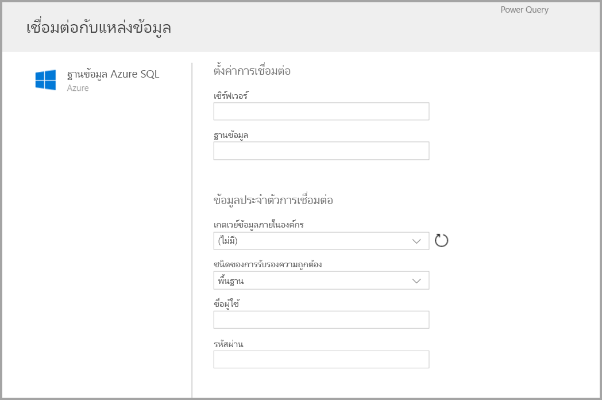

เมื่อเชื่อมต่อแล้ว คุณสามารถเลือกได้ว่าจะใช้ข้อมูลใดกับเอนทิตี เมื่อคุณเลือกข้อมูลและแหล่งข้อมูล จากนั้น Power BI จะเชื่อมต่อกับแหล่งข้อมูลอีกครั้งเพื่อเก็บข้อมูลในการรีเฟรชกระแสข้อมูล ตามความถี่ที่คุณจะได้เลือกในขั้นตอนถัดไป

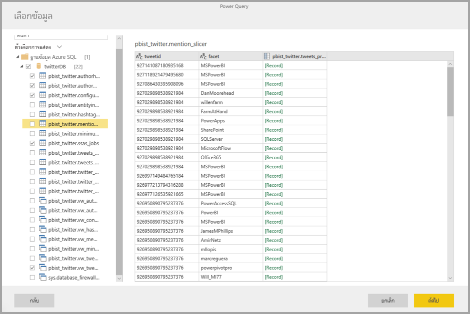

เมื่อคุณเลือกข้อมูลเพื่อใช้กับเอนทิตี คุณสามารถใช้ตัวแก้ไขกระแสข้อมูลเพื่อปรับแต่งหรือแปลงข้อมูลนั้นให้อยู่ในรูปแบบที่ต้องใช้งานในกระแสข้อมูลได้

### การใช้ตัวแก้ไขกระแสข้อมูล

เมื่อคุณเลือกว่าจะใช้ข้อมูลใดจากแหล่งข้อมูลกับเอนทิตี คุณจะสามารถปรับแต่งตัวเลือกข้อมูลนั้นให้อยู่ในรูปแบบที่ทำงานกับเอนทิตีของคุณได้ดีที่สุด โดยใช้งานการแก้ไข Power Query ซึ่งคล้ายคลึงกับ **Power Query Editor** ใน **Power BI Desktop** คุณสามารถเรียนรู้เพิ่มเติมเกี่ยวกับ Power Query ได้ (Power Query รวมอยู่ใน Power BI Desktop ในลักษณะที่เป็นตัวแก้ไข Power Query) ใน [บทความภาพรวมของ Query](desktop-query-overview.md) สำหรับ Power BI Desktop 

ถ้าคุณต้องการดูรหัสที่ตัวแก้ไขคิวรีสร้างในแต่ละขั้นตอน หรือต้องการสร้างรหัสของคุณเอง คุณสามารถใช้**ตัวแก้ไขขั้นสูง** 

### กระแสข้อมูลและ Common Data Model (CDM)

เอทิตีของกระแสข้อมูลมีเครื่องมือใหม่ๆ ที่จะแมปข้อมูลธุรกิจของคุณไปยัง Common Data Model ได้อย่างง่ายดาย (เค้าร่างมาตรฐานของ Microsoft) พร้อมยังปรับแต่งด้วย Microsoft และข้อมูลบุคคลภายนอก และทำให้เข้าถึงได้ง่ายเพื่อการเรียนรู้ของเครื่อง โดยสามารถใช้ประโยชน์ความสามารถใหม่ๆ เหล่านี้เพื่อให้ได้ข้อมูลเชิงลึกอันชาญฉลาดและสามารถใช้การได้เพิ่มเข้าไปในข้อมูลธุรกิจของคุณ เมื่อคุณเสร็จสิ้นการเปลี่ยนแปลงใดๆ ในขั้นตอนการแก้ไขคิวรีแล้ว คุณสามารถแมปคอลัมน์จากตารางแหล่งข้อมูลของคุณไปยังเขตข้อมูลเอนทิตีมาตรฐานได้ตามที่กำหนดไว้โดย Common Data Model เอนทิตีมาตรฐานมีเค้าร่างที่รู้จักและกำหนดโดยแบบจำลองข้อมูลทั่วไป

รับข้อมูลเพิ่มเติมเกี่ยวกับวิธีการนี้และ Common Data Model จากบทความ [Common Data Model คืออะไร](https://docs.microsoft.com/powerapps/common-data-model/overview)

คลิกที่**แมปไปยังการแปลงมาตรฐาน** ในไดอะล็อก **แก้ไขคิวรี** เพื่อใช้ประโยชน์จาก Common Data Model โดยใช้กระแสข้อมูลของคุณ ในหน้าจอ **แมปเอนทิตี** ที่ปรากฏขึ้น คุณสามารถเลือกเอนทิตีมาตรฐานที่คุณต้องการแมปได้

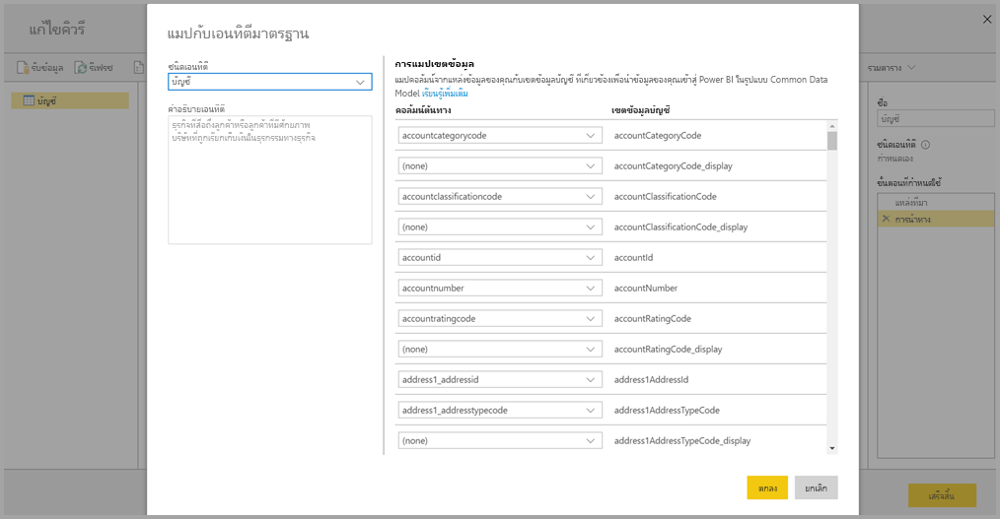

เมื่อคุณแมปคอลัมน์ต้นทางไปยังเขตข้อมูลมาตรฐาน สิ่งที่จะเกิดขึ้นมีดังต่อไปนี้:

1. คอลัมน์ต้นทางจะใช้ชื่อเขตข้อมูลมาตรฐาน (คอลัมน์จะเปลี่ยนชื่อหากชื่อนั้นต่างกัน)
2. คอลัมน์ต้นทางจะใช้ชนิดข้อมูลของเขตข้อมูลมาตรฐาน

เขตข้อมูลมาตรฐานทั้งหมดที่ไม่ได้แมปจะใช้ค่า *Null* เพื่อเก็บเอนทิตีมาตรฐานของ Common Data Model เอาไว้

คอลัมน์ต้นทางทั้งหมดที่ไม่ได้แมปจะยังคงเดิม เพื่อให้แน่ใจว่าผลลัพธ์ของการแมปคือเอนทิตีมาตรฐานพร้อมเขตข้อมูลแบบกำหนดเอง

เมื่อคุณเลือกเสร็จแล้วและเอนทิตีของคุณกับการตั้งค่าข้อมูลพร้อมสำหรับการบันทึกแล้ว คุณสามารถเลือก **บันทึก** ได้จากเมนู โปรดทราบว่าคุณสามารถสร้างเอนทิตีหลายชุดได้โดยเลือกที่ปุ่ม **เพิ่มเอนทิตี** และคุณสามารถแก้ไขเอนทิตีเพื่อปรับปรุงคิวรีและเอนทิตีที่คุณสร้างไว้ได้

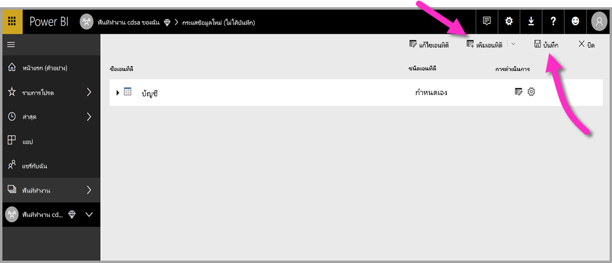

เมื่อคุณเลือก**บันทึก** คุณจะได้รับการแจ้งเตือนให้ตั้งชื่อกระแสข้อมูลของคุณพร้อมใส่คำอธิบาย

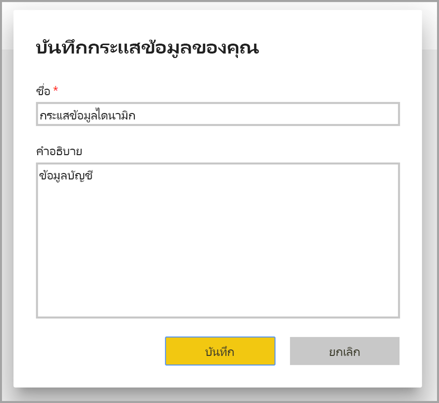

เมื่อคุณพร้อมและเลือกที่ปุ่ม **บันทึก** แล้ว จะมีหน้าต่างปรากฏขึ้นเพื่อแจ้งให้คุณทราบว่า **กระแสข้อมูล** ของคุณได้รับการสร้างขึ้นแล้ว 

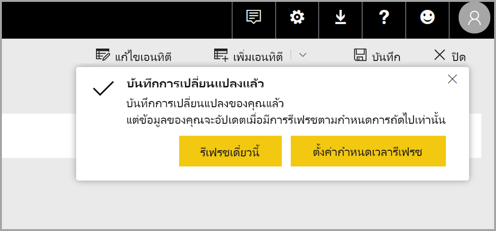

ยอดเยี่ยม – ในตอนนี้คุณก็พร้อมที่จะทำขั้นตอนถัดไป ซึ่งก็คือการกำหนดความถี่ในการรีเฟรชแหล่งข้อมูล

## กำหนดความถี่ในการรีเฟรช

เมื่อกระแสข้อมูลได้รับการบันทึกแล้ว ให้คุณกำหนดความถี่ในการรีเฟรชสำหรับแหล่งข้อมูลที่เชื่อมต่อไว้แต่ละแหล่ง

กระแสข้อมูล Power BI จะใช้ข้อมูลขั้นตอนการรีเฟรชข้อมูล Power BI เพื่อปรับปรุงให้ข้อมูลของคุณทันปัจจุบัน ใน**บริการของ Power BI** ในส่วน**พื้นที่ทำงาน** จะมีคอลเลกชันพื้นที่ซึ่งสามารถทำรายการข้อมูลและกระแสข้อมูลของคุณได้ ดังที่แสดงในภาพต่อไปนี้

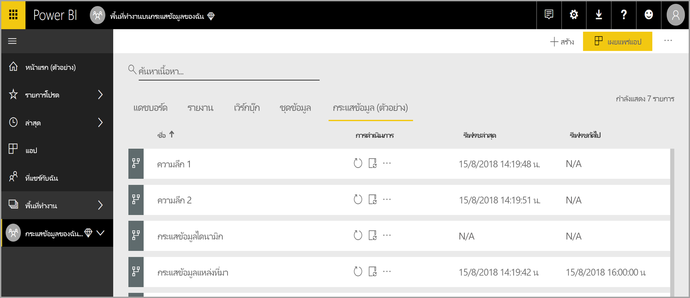

จุดรับเข้าของ*กระแสข้อมูลไดนามิก*ในรูปก่อนหน้าที่อยู่ในภาพก่อนหน้าคือกระแสข้อมูลที่เราสร้างไว้ในส่วนก่อนหน้า เลือกไอคอน **กำหนดการรีเฟรช** ที่อยู่ใต้ส่วน **การดำเนินการ** เพื่อกำหนดการรีเฟรช ดังที่แสดงในภาพต่อไปนี้ 

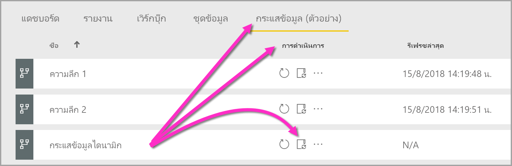

เมื่อคุณเลือกไอคอน **กำหนดการรีเฟรช** คุณจะไปยังแผง**กำหนดการรีเฟรช** ซึ่งจะให้คุณได้กำหนดความถี่และเวลาในการรีเฟรชกระแสข้อมูล

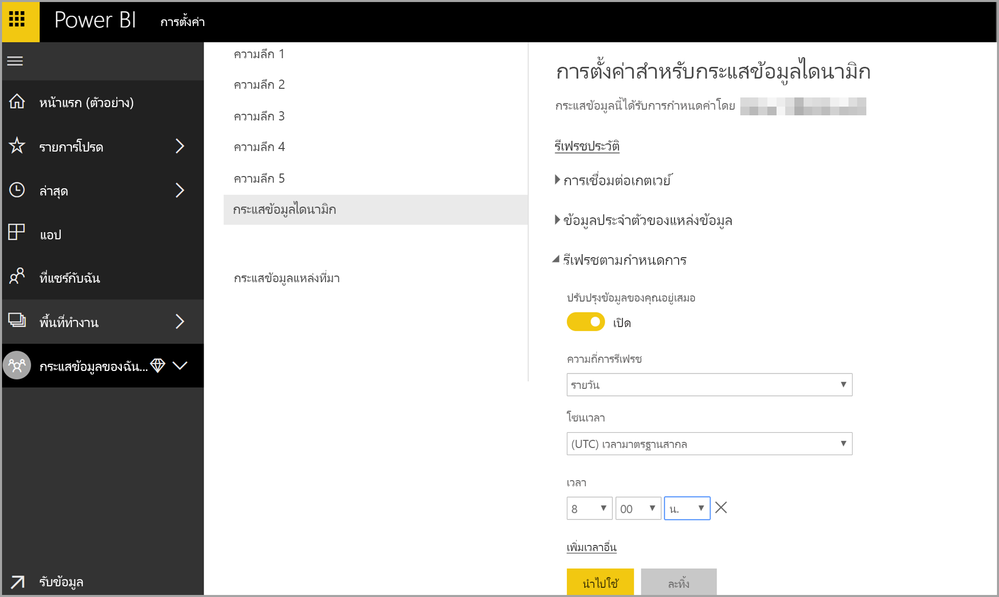

สำหรับข้อมูลเพิ่มเติมเกี่ยวกับการกำหนดการรีเฟรช โปรดดูที่บทความเกี่ยวกับ [การกำหนดค่าการรีเฟรชที่ตั้งไว้](refresh-scheduled-refresh.md) ซึ่งจะอธิบายถึงพฤติกรรมการรีเฟรชของชุดข้อมูล Power BI กระแสข้อมูลจะมีพฤติกรรมลักษณะเดียวกันกับชุดข้อมูลของ Power BI ในแง่ของการตั้งค่าการรีเฟรช 

## เชื่อมต่อกับกระแสข้อมูลใน Power BI Desktop

เมื่อคุณได้สร้างกระแสข้อมูลและกำหนดความถี่ในการรีเฟรชสำหรับแหล่งข้อมูลแต่ละแหล่งแล้ว ข้อมูลนั้นจะไปอยู่ในแบบจำลอง และคุณก็พร้อมสำหรับขั้นตอนที่สามซึ่งเป็นขั้นตอนสุดท้ายแล้ว ก็คือการเชื่อมต่อกับกระแสข้อมูลของคุณจากใน **Power BI Desktop** 

เมื่อต้องการเชื่อมต่อกับกระแสข้อมูล ไปที่ Power BI Desktop และเลือก **รับข้อมูล > Power BI > กระแสข้อมูล Power BI (รุ่นเบต้า)** ดังแสดงในภาพต่อไปนี้

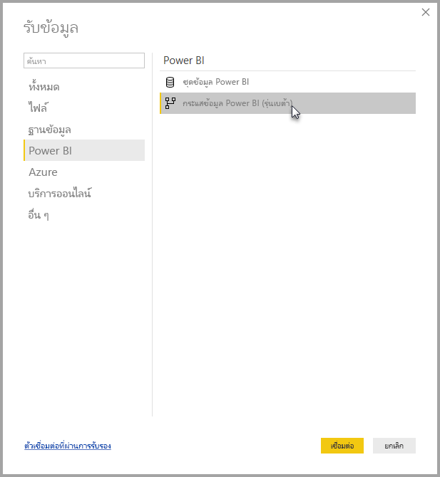

จากจุดนั้น ให้คุณไปยัง **พื้นที่ทำงาน** ที่ซึ่งคุณได้บันทึกกระแสข้อมูลไว้ เลือกกระแสข้อมูลนั้นแล้วเลือกเอนทิตีที่คุณสร้างไว้จากในรายการ

นอกจากนี้คุณยังอาจเลือก **แถบค้นหา** ที่อยู่ใกล้กับด้านบนของหน้าต่าง เพื่อหาชื่อของกระแสข้อมูลหรือเอนทิตีจากในบรรดาเอนทิตีกระแสข้อมูลนับไม่ถ้วนได้อย่างรวดเร็ว

เมื่อคุณเลือกเอนทิตีแล้วเลือกที่ปุ่ม **โหลด** จะมีเอนทิตีกรากฏในแผง**เขตข้อมูล** ใน **Power BI Desktop** และจะปรากฏในลักษณะเดียวกันกับ**ตาราง**จากชุดข้อมูลอื่นๆ

## การใช้กระแสข้อมูลที่ถูกจัดเก็บไว้ใน Azure Data Lake Storage Gen2

บางองค์กรอาจต้องการใช้ที่เก็บข้อมูลเป็นของตัวเองในการสร้างหรือจัดการกับกระแสข้อมูล คุณสามารถรวมกระแสข้อมูลเข้ากันกับ Azure Data Lake Storage Gen2 ถ้าคุณทำตามข้อกำหนดและจัดการสิทธิ์อย่างเหมาะสม เอกสารประกอบเกี่ยวกับข้อกำหนดทั้งหมดนี้สามารถดูได้ตั้งแต่ต้นที่ ภาพรวมของเอกสาร[การรวมกระแสข้อมูลและ Azure Data Lake (ตัวอย่าง)](service-dataflows-azure-data-lake-integration.md)

## การแก้ปัญหาการเชื่อมต่อข้อมูล

อาจมีในบางกรณีที่จะเกิดปัญหาในการเชื่อมต่อไปยังแหล่งข้อมูลสำหรับกระแสข้อมูล ส่วนเนื้อหานี้จะให้เคล็ดลับการแก้ปัญหาในกรณีเช่นนั้น 

* **ตัวเชื่อมต่อ Salesforce** - การใช้บัญชีทดลองใช้สำหรับ Salesforce พร้อมผลลัพธ์กระแสข้อมูลเมื่อการเชื่อมต่อผิดพลาดและไม่มีรายละเอียดให้ ในการแก้ปัญหานี้ ให้คุณใช้บัญชีการสร้างของ Salesforce หรือบัญชีนักพัฒนาเพื่อทำการทดสอบ

* **ตัวเชื่อมต่อ SharePoint** - ตรวจสอบให้แน่ใจว่าคุณได้ให้ที่อยู่ต้นของไซต์ SharePoint โดยไม่มีโฟลเดอร์ย่อยหรือเอกสารใด ตัวอย่างเช่น การใช้ลิงก์ที่คล้ายกับต่อไปนี้:[https://microsoft.sharepoint.com/teams/ObjectModel/](https://microsoft.sharepoint.com/teams/ObjectModel/ ) 

* **ตัวเชื่อมต่อไฟล์ JSON** -ในขณะนี้คุณสามารถเชื่อมต่อกับไฟล์ JSON โดยใช้การรับรองความถูกต้องพื้นฐานเท่านั้นได้  เชื่อมต่อกับไฟล์ JSON โดยใช้ข้อมูลประจำตัวภายใน URL (ตัวอย่างเช่น https://XXXXX.blob.core.windows.net/path/file.json?sv=2019-01-01&si=something&sr=c&sig=123456abcdefg.. ) ที่**ไม่ได้**รับการสนับสนุน  

* **Azure SQL Data Warehouse** - ขณะนี้ Dataflow ไม่สนับสนุนการรับรองความถูกต้อง Azure Active Directory (AAD) สำหรับ Azure SQL Data Warehouse ใช้การรับรองความถูกต้องพื้นฐานสำหรับสถานการณ์สมมตินี้

## ขั้นตอนถัดไป

บทความนี้อธิบายวิธีการสร้าง**กระแสข้อมูล** เป็นของตัวเอง และสร้างชุดข้อมูลและรายงานใน **Power BI Desktop** เพื่อใช้ประโยชน์จากสิ่งเหล่านั้น บทความต่อไปนี้มีประโยชน์ในการศึกษาข้อมูลเพิ่มเติมและสถานการณ์ต่างๆ เมื่อใช้กระแสข้อมูล:

* [การเตรียมข้อมูลด้วยตัวเองโดยใช้กระแสข้อมูล](service-dataflows-overview.md)
* [การใช้เอนทิตีที่คำนวณใน Power BI Premium](service-dataflows-computed-entities-premium.md)
* [การใช้กระแสข้อมูลกับแหล่งข้อมูลภายในองค์กร](service-dataflows-on-premises-gateways.md)
* [แหล่งข้อมูลของนักพัฒนาสำหรับกระแสข้อมูล Power BI](service-dataflows-developer-resources.md)
* [ การรวมกระแสข้อมูลและ Azure Data Lake (ตัวอย่าง)](service-dataflows-azure-data-lake-integration.md)

สำหรับข้อมูลเพิ่มเติมเกี่ยวกับ Common Data Model สามารถดูได้ในบทความภาพรวม:
* [Common Data Model - ภาพรวม](https://docs.microsoft.com/powerapps/common-data-model/overview)
* [เรียนรู้เพิ่มเติมเกี่ยวกับเค้าร่าง Common Data Model และเอนทิตีบน GitHub](https://github.com/Microsoft/CDM)

บทความ Power BI Desktop ที่เกี่ยวข้อง:

* [เชื่อมต่อชุดข้อมูลในบริการของ Power BI จาก Power BI Desktop](desktop-report-lifecycle-datasets.md)
* [ภาพรวมคิวรีใน Power BI Desktop](desktop-query-overview.md)

บทความบริการของ Power BI ที่เกี่ยวข้อง:
* [การกำหนดค่าการรีเฟรชตามกำหนดการ](refresh-scheduled-refresh.md)
