# เชื่อมต่อไปยังแหล่งข้อมูลสำหรับกระแสข้อมูล Power BI (ดูตัวอย่าง)

ด้วยกระแสข้อมูล Power BI คุณสามารถเชื่อมต่อกับแหล่งข้อมูลต่าง ๆ เพื่อสร้าง กระแสข้อมูลใหม่หรือเพิ่มเอนทิตีใหม่ไปยังกระแสข้อมูลที่มีอยู่ได้

บทความนี้แสดงรายการแหล่งข้อมูลที่มีอยู่มากมายสำหรับการสร้างหรือเพิ่มลงในกระแสข้อมูล และอธิบายถึงวิธีสร้างกระแสข้อมูลเหล่านั้นโดยใช้แหล่งข้อมูลเหล่านี้

สำหรับภาพรวมของวิธีการสร้างและใช้กระแสข้อมูล ให้ดู [การสร้างและการใช้กระแสข้อมูลใน Power BI (ดูตัวอย่าง)](service-dataflows-create-use.md)

## สร้างกระแสข้อมูลจากแหล่งข้อมูล

หากต้องการเชื่อมต่อข้อมูลจาก **บริการ Power BI** เลือกรายการเมนู **+ สร้าง** จากนั้นเลือก **กระแสข้อมูล** จากเมนูที่ปรากฏขึ้น เมื่อเลือกแล้ว รูปภาพต่อไปนี้จะปรากฏในพื้นที่ทำงานของบริการ Power BI 

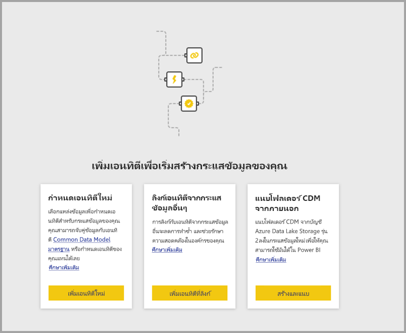

หากกระแสข้อมูลของคุณมีอยู่แล้ว คุณสามารถเพิ่มเอนทิตีใหม่ ๆ ลงในกระแสข้อมูลของคุณโดยเลือก **เพิ่มเอนทิตี** ที่แสดงด้านล่างหรือโดยการเลือก **รับข้อมูล** ในเครื่องมือสร้างกระแสข้อมูลได้

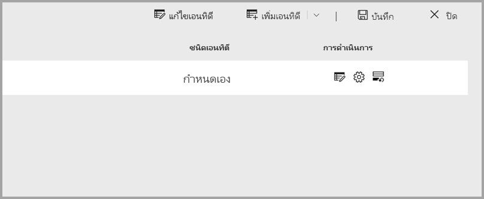

รูปภาพต่อไปนี้แสดงปุ่ม **รับข้อมูล** ในเครื่องมือสร้างกระแสข้อมูล 

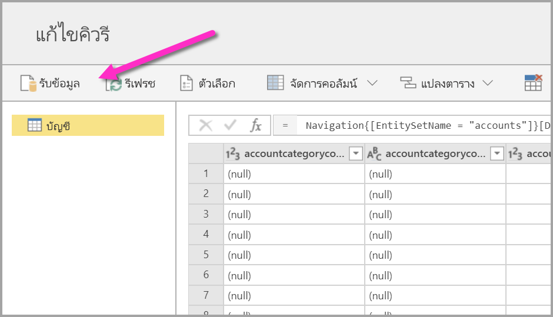

## แหล่งข้อมูลสำหรับกระแสข้อมูล

คุณสามารถดูแหล่งข้อมูลที่มีอยู่โดยเลือก **รับข้อมูล** จากเครื่องมือสร้างกระแสข้อมูลซึ่งจะแสดงกล่องโต้ตอบสำหรับการเลือกหมวดหมู่และแหล่งข้อมูลแต่ละแหล่งดังที่แสดงในภาพต่อไปนี้

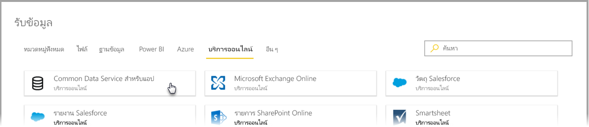

แหล่งข้อมูลสำหรับกระแสข้อมูลถูกจัดระเบียบเป็นหมวดหมู่ต่อไปนี้ ซึ่งปรากฏอยู่ด้านบนของกล่องโต้ตอบ **รับข้อมูล**:

* หมวดหมู่ทั้งหมด
* ไฟล์
* ฐานข้อมูล
* Power BI
* Azure
* บริการออนไลน์
* อื่น ๆ

หมวดหมู่แบบ **หมวดหมู่ทั้งหมด** มีแหล่งข้อมูลทั้งหมดจากทุกหมวดหมู่ 

หมวดหมู่ **ไฟล์** ประกอบด้วยการเชื่อมต่อข้อมูลที่ใช้ได้สำหรับกระแสข้อมูลต่อไปนี้:

* การเข้าถึง
* Excel
* JSON
* ข้อความ/CSV
* XML

หมวดหมู่ **ฐานข้อมูล** ประกอบด้วยการเชื่อมต่อข้อมูลที่ใช้ได้สำหรับกระแสข้อมูลต่อไปนี้:

* ฐานข้อมูล IBM DB2
* ฐานข้อมูล MySQL
* ฐานข้อมูล Oracle
* ฐานข้อมูล PostgreSQL
* ฐานข้อมูล SQL Server
* ฐานข้อมูล Sybase
* ฐานข้อมูล Teradata

หมวดหมู่ **Power BI** ประกอบด้วยการเชื่อมต่อข้อมูลที่ใช้ได้สำหรับกระแสข้อมูลต่อไปนี้:

* กระแสข้อมูล Power BI

หมวดหมู่ **Azure** ประกอบด้วยการเชื่อมต่อข้อมูลที่ใช้ได้สำหรับกระแสข้อมูลต่อไปนี้:

* Azure Blobs
* ตัวสำรวจข้อมูลของ Azure
* คลังข้อมูล Azure SQL
* ฐานข้อมูล Azure SQL
* ตาราง Azure

หมวดหมู่ **บริการออนไลน์** ประกอบด้วยการเชื่อมต่อข้อมูลที่ใช้ได้สำหรับกระแสข้อมูลต่อไปนี้:

* Common Data Service สำหรับแอป
* Microsoft Exchange Online
* ออบเจ็กต์ Salesforce
* รายงาน Salesforce
* รายการ SharePoint Online
* Smartsheet

หมวดหมู่ **อื่นๆ** ประกอบด้วยการเชื่อมต่อข้อมูลที่ใช้ได้สำหรับกระแสข้อมูลต่อไปนี้:

* Active Directory
* OData
* รายการ SharePoint
* เว็บ API
* เว็บเพจ
* ตารางว่างเปล่า
* คิวรีที่ว่างเปล่า

## เชื่อมต่อกับแหล่งข้อมูล

เมื่อต้องการเชื่อมต่อกับแหล่งข้อมูล ให้เลือกแหล่งข้อมูล เราจะใช้ตัวอย่างหนึ่งตัวอย่างเพื่อแสดงว่ากระบวนการทำงานอย่างไร แต่การเชื่อมต่อข้อมูลแต่ละครั้งสำหรับกระแสข้อมูลนั้นมีความคล้ายคลึงกันในกระบวนการ ตัวเชื่อมต่อที่แตกต่างกันอาจต้องการข้อมูลประจำตัวที่เฉพาะเจาะจงหรือข้อมูลอื่น ๆ แต่กระแสนั้นคล้ายกัน ในตัวอย่างของเรา คุณจะเห็นในภาพต่อไปนี้ที่เลือก **Common Data Service สำหรับแอป** จากหมวดหมู่การเชื่อมต่อข้อมูล **บริการออนไลน์**

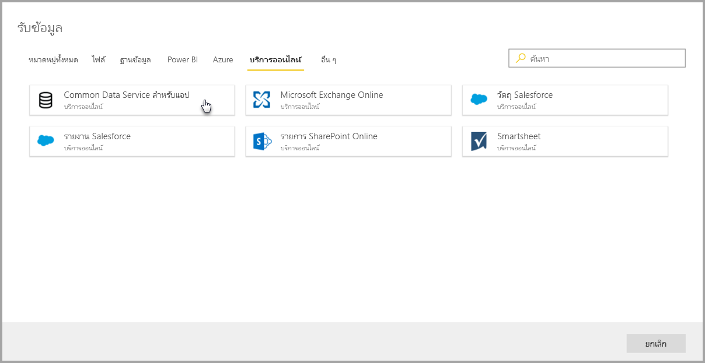

หน้าต่างการเชื่อมต่อสำหรับการเชื่อมต่อข้อมูลที่เลือกจะปรากฏขึ้น หากจำเป็นต้องมีข้อมูลประจำตัว คุณจะได้รับแจ้งให้ระบุข้อมูลประจำตัว รูปต่อไปนี้แสดง URL เซิร์ฟเวอร์ที่ป้อนเพื่อเชื่อมต่อไปยัง Common Data Service สำหรับเซิร์ฟเวอร์ของแอป

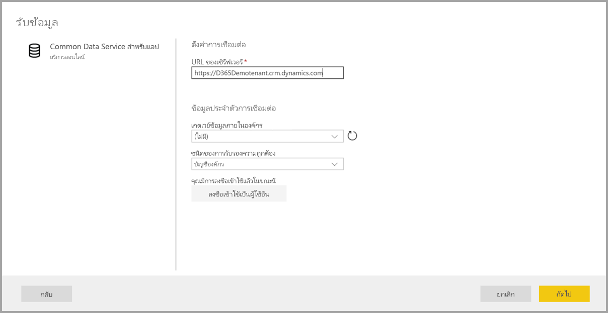

เมื่อระบุ URL เซิร์ฟเวอร์หรือข้อมูลการเชื่อมต่อทรัพยากรแล้ว ให้เลือก **ลงชื่อเข้าใช้** เพื่อป้อนข้อมูลประจำตัวที่จะใช้สำหรับการเข้าถึงข้อมูลจากนั้นเลือก **ถัดไป**

**Power Query Online** เริ่มต้นและสร้างการเชื่อมต่อกับแหล่งข้อมูล และจากนั้นแสดงตารางที่พร้อมใช้งานจากแหล่งข้อมูลนั้นในหน้าต่าง **นำทาง** ที่แสดงในภาพต่อไปนี้

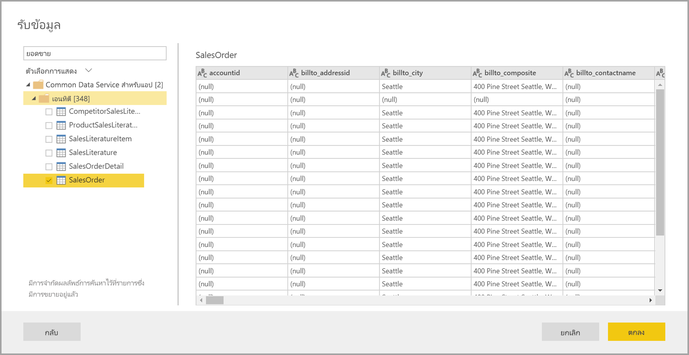

คุณสามารถเลือกตารางและข้อมูลที่จะโหลดได้โดยเลือกช่องทำเครื่องหมายถัดจากแต่ละรายการในบานหน้าต่างด้านซ้าย เมื่อต้องการโหลดข้อมูล เลือก **ตกลง** จากด้านล่างของบานแถบ **นำทาง** กล่องโต้ตอบ Power Query Online จะปรากฏขึ้นซึ่งคุณสามารถแก้ไขคิวรีและดำเนินการแปลงอื่น ๆ ที่คุณต้องการดำเนินการกับข้อมูลที่เลือก

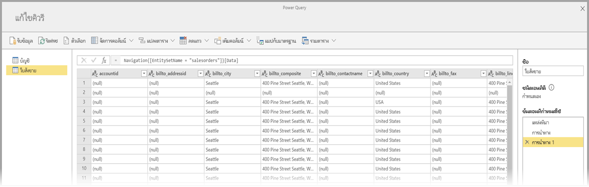

ขั้นตอนทั้งหมดก็มีเพียงเท่านี้ แหล่งข้อมูลอื่นมีกระแสที่คล้ายกัน และใช้ Power Query Online เพื่อแก้ไขและแปลงข้อมูลที่คุณนำเข้าสู่กระแสข้อมูลของคุณ

## กำลังเชื่อมต่อกับแหล่งข้อมูลเพิ่มเติม

มีตัวเชื่อมต่อข้อมูลเพิ่มเติมที่ไม่แสดงในส่วนต่อประสานกับผู้ใช้กระแสข้อมูล Power BI แต่ได้รับการสนับสนุนด้วยขั้นตอนเพิ่มเติมไม่กี่ขั้นตอน 

คุณสามารถทำตามขั้นตอนต่อไปนี้เพื่อสร้างการเชื่อมต่อกับตัวเชื่อมต่อที่ไม่ได้แสดงในส่วนต่อประสานกับผู้ใช้:

1. เปิด **Power BI Desktop** แล้วเลือก **รับข้อมูล**
2. เปิด **ตัวแก้ไข Power Query** ใน Power BI Desktop จากนั้นคลิกขวาที่คิวรีที่เกี่ยวข้องและเปิด **ตัวแก้ไขขั้นสูง** ดังที่แสดงในภาพต่อไปนี้ จากตรงนั้น คุณสามารถคัดลอกสคริปต์ M ที่ปรากฏในตัวแก้ไขขั้นสูง

    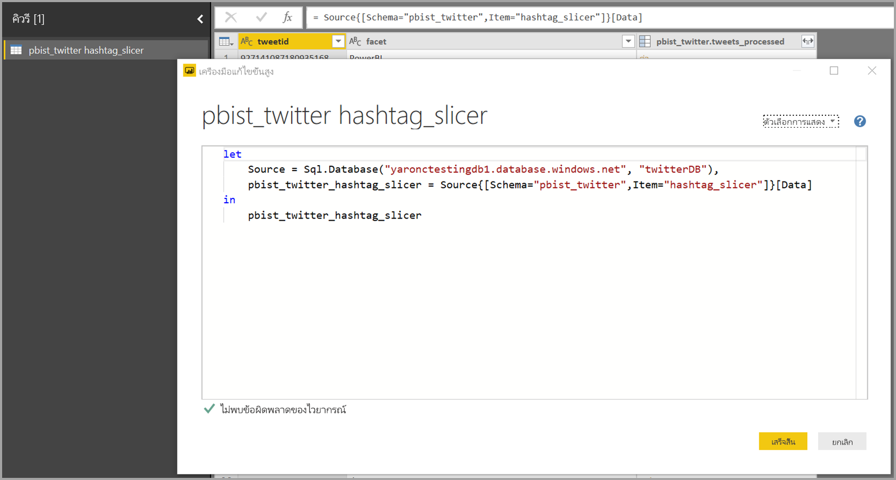 

3. เปิดกระแสข้อมูล Power Data และเลือก **รับข้อมูล** สำหรับคิวรี่ว่างเปล่าดังแสดงในภาพต่อไปนี้

    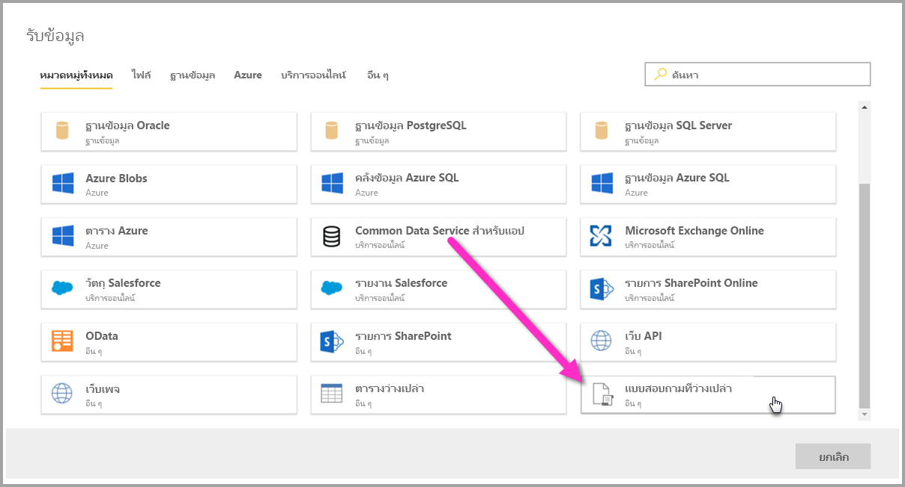 

4. วางคิวรี่ที่คัดลอกลงในคิวรี่ว่างเปล่าสำหรับกระแสข้อมูล

    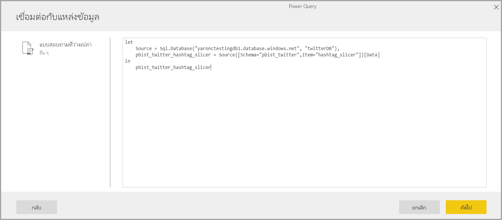 

และจากนั้น สคริปต์ของคุณจะเชื่อมต่อกับแหล่งข้อมูลที่คุณระบุ 

รายการต่อไปนี้แสดงว่าตัวเชื่อมต่อใดที่คุณสามารถใช้ได้ในปัจจุบันโดยการคัดลอกและวางคิวรี่ M ลงในคิวรี่ว่างเปล่า:

* Amazon Redshift
* SAP Business Warehouse 
* SAP HANA
* บริการด้านการวิเคราะห์
* Azure Analysis Services
* Google Analytics
* Adobe Analytics
* ODBC
* OLE DB
* โฟลเดอร์
* โฟลเดอร์ SharePoint Online
* โฟลเดอร์ SharePoint
* Hadoop HDFS
* Azure HDInsight (HDFS)
* ไฟล์ Hadoop (HDFS)
* Informix (เบต้า)
* Vertica

นั่นคือทั้งหมดของการเชื่อมต่อกับแหล่งข้อมูลในกระแสข้อมูล Power BI

## ขั้นตอนถัดไป

บทความนี้แสดงให้เห็นว่าแหล่งข้อมูลใดที่คุณสามารถเชื่อมต่อกับกระแสข้อมูลได้ บทความต่อไปนี้จะลงรายละเอียดที่ลึกขึ้นเกี่ยวกับสถานการณ์การใช้งานทั่วไปสำหรับกระแสข้อมูล 

* [การเตรียมข้อมูลด้วยตนเองใน Power BI (ตัวอย่าง)](service-dataflows-overview.md)
* [สร้างและใช้กระแสข้อมูลใน Power BI](service-dataflows-create-use.md)
* [การใช้เอนทิตีที่คำนวณใน Power BI Premium (ตัวอย่าง)](service-dataflows-computed-entities-premium.md)
* [การใช้กระแสข้อมูลพร้อมแหล่งข้อมูลในองค์กร (ตัวอย่าง)](service-dataflows-on-premises-gateways.md)
* [แหล่งข้อมูลของนักพัฒนาสำหรับกระแสข้อมูล Power BI (ตัวอย่าง)](service-dataflows-developer-resources.md)
* [ การรวมกระแสข้อมูลและ Azure Data Lake (ตัวอย่าง)](service-dataflows-azure-data-lake-integration.md)

สำหรับข้อมูลเพิ่มเติมเกี่ยวกับ Power Query และการรีเฟรชตามกำหนดการ สามารถดูได้ในบทความเหล่านี้:
* [ภาพรวมคิวรีใน Power BI Desktop](desktop-query-overview.md)
* [การกำหนดค่าการรีเฟรชตามกำหนดการ](refresh-scheduled-refresh.md)

สำหรับข้อมูลเพิ่มเติมเกี่ยวกับ Common Data Model สามารถดูได้ในบทความภาพรวม:
* [Common Data Model - ภาพรวม](https://docs.microsoft.com/powerapps/common-data-model/overview)

