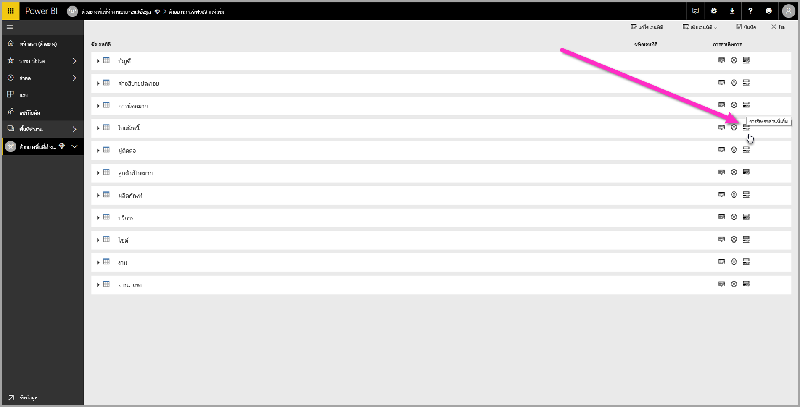
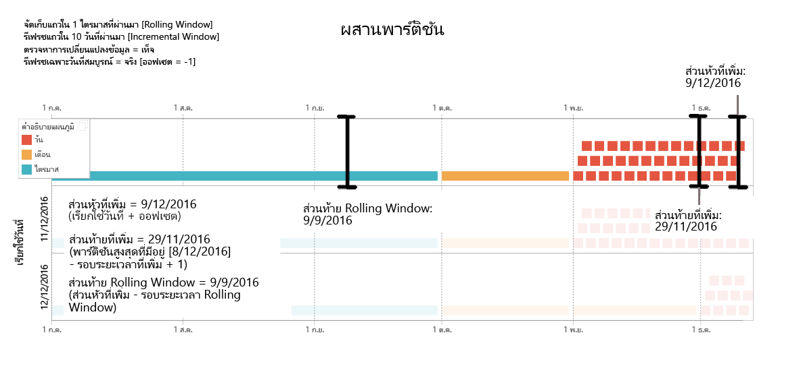
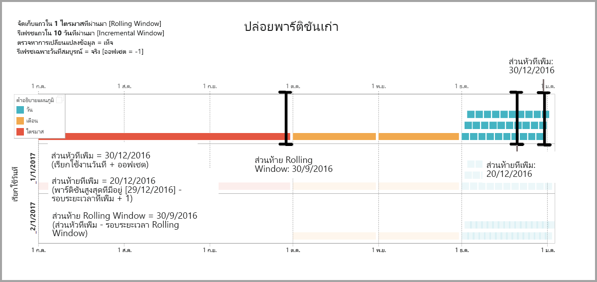
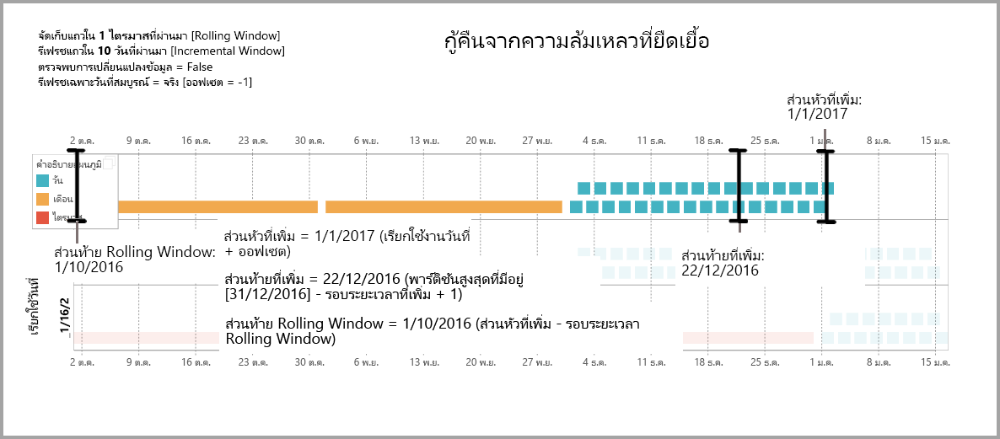

# การใช้การรีเฟรชแบบเพิ่มหน่วยสำหรับกระแสข้อมูล Power BI (ตัวอย่าง)

ด้วยกระแสข้อมูล คุณสามารถนำข้อมูลขนาดใหญ่เข้า Power BI ได้เพื่อสร้างรายงานและการวิเคราะห์ที่ดึงดูดความสนใจ อย่างไรก็ตาม ในบางกรณีจะไม่สามารถอัปเดตสำเนาเต็มของข้อมูลต้นทางในการรีเฟรชแต่ละครั้งได้ ทางเลือกที่ดีคือ**การรีเฟรชแบบเพิ่มหน่วย** ซึ่งให้ประโยชน์ต่อไปนี้กับกระแสข้อมูล:

* **รีเฟรชได้อย่างรวดเร็ว** - รีเฟรชเฉพาะข้อมูลที่มีการเปลี่ยนแปลง ตัวอย่างเช่น รีเฟรชเฉพาะห้าวันที่ผ่านมาของกระแสข้อมูล 10 ปี
* **การรีเฟรชน่าเชื่อถือมากขึ้น** - ตัวอย่างเช่น ไม่จำเป็นต้องรักษาการเชื่อมต่อระยะยาวกับระบบต้นทางที่ผันผวน
* **ปริมาณการใช้ทรัพยากรลดลง** - เมื่อต้องรีเฟรชข้อมูลน้อยลง ทำให้ปริมาณการใช้โดยรวมของความจำและทรัพยากรอื่นๆ ลดลงด้วย

การใช้การรีเฟรชแบบเพิ่มหน่วยสำหรับกระแสข้อมูล Power BI กำหนดว่าพื้นที่ทำงานที่มีกระแสข้อมูลต้องอยู่ใน[ความจุพรีเมียม](service-premium.md) เพื่อเรียกใช้ได้ และแหล่งข้อมูลที่ย่อยเป็นกระแสข้อมูลต้องมีเขตข้อมูล *datetime* ที่การรีเฟรชแบบเพิ่มหน่วยสามารถกรองได้ 

## การกำหนดค่าการรีเฟรชแบบเพิ่มหน่วยสำหรับกระแสข้อมูล

กระแสข้อมูลสามารถมีเอนทิตีหลายตัวได้ การรีเฟรชแบบเพิ่มหน่วยได้รับการตั้งค่าที่ระดับเอนทิตี โดยอนุญาตให้มีกระแสข้อมูลหนึ่งเก็บทั้งเอนทิตีที่รีเฟรชเสร็จแล้วและเอนทิตีที่รีเฟรชแบบเพิ่มหน่วย

เมื่อต้องการตั้งค่าเอนทิตีที่รีเฟรชแบบเพิ่มหน่วย ให้เริ่มโดยการกำหนดค่าเอนทิตีเช่นที่คุณจะกำหนดให้เอนทิตีอื่นๆ สำหรับการเรียนรู้เพิ่มเติมเกี่ยวกับการตั้งค่ากระแสข้อมูล โปรดดู [การเตรียมข้อมูลด้วยตนเองใน Power BI (ตัวอย่าง)](service-dataflows-overview.md)

เมื่อสร้างและบันทึกกระแสข้อมูลแล้ว ให้คุณเลือกไอคอน**การรีเฟรชแบบเพิ่มหน่วย**ในมุมมองเอนทิตี ดังที่แสดงในรูปต่อไปนี้:

เมื่อคุณคลิกที่ไอคอน หน้าต่าง**การตั้งค่าการรีเฟรชแบบเพิ่มหน่วย**จะปรากฏขึ้น เมื่อคุณสลับการรีเฟรชแบบเพิ่มหน่วยไปที่ตำแหน่ง **เปิด** คุณจะสามารถกำหนดค่าการรีเฟรชแบบเพิ่มหน่วยได้

รายการต่อไปนี้อธิบายการตั้งค่าในหน้าต่าง**การตั้งค่าการรีเฟรชแบบเพิ่มหน่วย** 

1. **การสลับเปิด/ปิดการรีเฟรชแบบเพิ่มหน่วย**– ตัวเลื่อนนี้จะสลับนโยบายการรีเฟรชแบบเพิ่มหน่วยให้เป็นเปิด/ปิดสำหรับเอนทิตีนั้น
2. **กรองเขตข้อมูลดรอปดาวน์** - เลือกเขตข้อมูลคิวรีที่จะใช้กรองเอนทิตีสำหรับการรีเฟรชแบบเพิ่มหน่วย เขตข้อมูลนี้มีเฉพาะเขตข้อมูล *datetime* เท่านั้น คุณไม่สามารถใช้การรีเฟรชแบบเพิ่มหน่วยได้หากเอนทิตีของคุณไม่มีเขตข้อมูล *datetime*
3. **เก็บแถวจากอตีตไว้** - ตัวอย่างต่อไปนี้จะช่วยอธิบายการตั้งค่าสองสามอย่างถัดไป

    ตัวอย่างเช่น เราได้กำหนดนโยบายการรีเฟรชให้เก็บข้อมูลทั้งหมดห้าปี และให้รีเฟรชเพิ่มหน่วยกับข้อมูล 10 วัน ถ้ามีการรีเฟรชเอนทิตีทุกวัน จะมีการดำเนินการต่อไปนี้ในการรีเฟรชแต่ละครั้ง:

    * เพิ่มข้อมูลของวันใหม่
    * รีเฟรชข้อมูล 10 วันจนถึงวันที่ปัจจุบัน
    * ลบปีปฏิทินที่เก่ากว่าห้าปีก่อนวันที่ปัจจุบัน ตัวอย่างเช่น หากวันที่ปัจจุบันคือ 1 มกราคม 2019 ปี 2013 จะถูกลบ

    การรีเฟรชกระแสข้อมูลครั้งแรกอาจใช้เวลาสักครู่ในการนำเข้าข้อมูลของทั้งห้าปี แต่การรีเฟรชครั้งถัดมาจะเสร็จสิ้นได้เร็วกว่าการรีเฟรชครั้งแรกอยู่มาก

4. **ตรวจหาการเปลี่ยนแปลงข้อมูล**-  การรีเฟรชแบบเพิ่มหน่วยของข้อมูล 10 วันจะมีประสิทธิภาพมากกว่าการรีเฟรชข้อมูลทั้ง 5 ปี แต่เราอาจทำให้ดีขึ้นได้ ถ้าคุณเลือกกล่องกาเครื่องหมาย **ตรวจพบการเปลี่ยนแปลงข้อมูล** คุณจะสามารถเลือกคอลัมน์วันที่/เวลาเพื่อระบุและรีเฟรชเฉพาะวันที่ข้อมูลเปลี่ยนแปลงได้ ซึ่งสมมติว่าคอลัมน์ดังกล่าวอยู่ในระบบแหล่งข้อมูล ซึ่งมีไว้สำหรับวัตถุประสงค์การตรวจสอบ ค่าสูงสุดของคอลัมน์นี้จะได้รับการประเมินสำหรับแต่ละช่วงเวลาในช่วงที่เพิ่มขึ้น ถ้าข้อมูลนั้นไม่ได้เปลี่ยนเลยตั้งแต่ที่มีการรีเฟรชครั้งก่อน ก็ไม่จำเป็นต้องรีเฟรชช่วงวันที่นั้น ตัวอย่างเช่น การทำเช่นนี้จะเป็นการลดจำนวนวันที่ต้องรีเฟรชแบบเพิ่มหน่วยจาก 10 วันเหลือประมาณสองวัน

> [!TIP]
> การออกแบบในปัจจุบันกำหนดให้คอลัมน์นั้นตรวจจับการเปลี่ยนแปลงข้อมูลว่าต้องคงเดิมและแคชลงในหน่วยความจำแล้ว คุณควรพิจารณาเทคนิคใดเทคนิคหนึ่งต่อไปนี้เพื่อลดการใช้งานข้อมูลและปริมาณการใช้หน่วยความจำ:
>
>    * คงไว้เฉพาะค่าสูงสุดของคอลัมน์นี้เมื่อรีเฟรช อาจใช้ฟังก์ชันของ Power Query
>    * ลดความแม่นยำเป็นระดับที่ยอมรับได้ของความต้องการความถี่การรีเฟรชของคุณ

5. **รีเฟรชเฉพาะช่วงเวลาที่สมบูรณ์** - ลองสมมุติให้การรีเฟรชของคุณทำงานทุกเช้าเวลา 4:00 น. ถ้าข้อมูลปรากฏในระบบต้นทางระหว่างช่วงสี่ชั่วโมงแรกของวันนั้น คุณคงไม่อยากเก็บมาใส่ใจหรอก เมตริกธุรกิจบางตัว เช่นปริมาณน้ำมันต่อวันในอุตสาหกรรมน้ำมันและแก๊ส ไม่ได้ใช้ได้จริงและไม่มีเหตุผลที่จะพิจารณาในบางวัน

    อีกตัวอย่างหนึ่งที่แสดงให้เห็นว่าเมื่อใดควรใช้การรีเฟรชทั้งช่วงเวลาก็คือเมื่อต้องการรีเฟรชข้อมูลจากระบบการเงิน ลองนึกถึงระบบการเงินที่มีการอนุมัติข้อมูลของเดือนที่แล้วทุกวันที่ 12 ของทุกเดือน คุณสามารถตั้งค่าการเว้นช่วงเป็น 1 เดือนและจัดกำหนดการให้เรียกใช้ใยวันที่ 12 ของทุกเดือน เมื่อเลือกตัวเลือกนี้ ระบบจะรีเฟรชข้อมูลเดือนมกราคม (ช่วงเดือนเต็มเดือนล่าสุด) ในวันที่ 12 กุมภาพันธ์

> [!NOTE]
> การรีเฟรชแบบเพิ่มหน่วยของกระแสข้อมูลจะกำหนดวันที่ตามตรรกะต่อไปนี้ คือ หากมีการกำหนดการรีเฟรชไว้แล้ว การรีเฟรชแบบเพิ่มหน่วยสำหรับกระแสข้อมูลจะใช้โซนเวลาที่กำหนดในนโยบายการรีเฟรช ถ้าไม่ได้กำหนดการรีเฟรชไว้ การรีเฟรชแบบเพิ่มหน่วยจะใช้เวลาจากเครื่องในการรีเฟรช

## คิวรีการรีเฟรชแบบเพิ่มหน่วย

เมื่อได้กำหนดค่าการรีเฟรชแบบเพิ่มหน่วยแล้ว กระแสข้อมูลจะดัดแปลงคิวรีของคุณให้เพิ่มตัวกรองตามวันที่ไว้ด้วยโดยอัตโนมัติ คุณสามารถแก้ไขคิวรีที่สร้างโดยอัตโนมัติได้โดยใช้ **Advanced Power Query Editor** เพื่อปรับแต่งหรือกำหนดการรีเฟรชด้วยตัวเอง อ่านเพิ่มเติมเกี่ยวกับการรีเฟรชแบบเพิ่มหน่วยพร้อมวิธีการทำงานในส่วนเนื้อหาต่อไปนี้

## การรีเฟรชแบบเพิ่มหน่วยและเอนทิตีที่เชื่อมโยงกับเอนทิตีที่คำนวณ

สำหรับเอนทิติที่*เชื่อมโยง* การรีเฟรชแบบเพิ่มหน่วยจะอัปเดตเอนทิตีต้นทาง เนื่องจากเอนทิตีที่เชื่อมโยงจะเป็นตัวชี้ไปหาเอนทิตีต้นทาง ทำให้การรีเฟรชแบบเพิ่มหน่วยไม่ส่งผลกระทบต่อเอนทิตีที่เชื่อมโยง เมื่อเอนทิตีต้นทางรีเฟรชตามนโยบายการรีเฟรชที่กำหนดไว้ เอนทิตีที่เชื่อมโยงใดก็ตามควรถือว่าข้อมูลในต้นทางนั้นได้รับการรีเฟรช

เอนทิตีที่*คำนวณ*นั้นมาจากคิวรีที่ทำงานในที่เก็บข้อมูล ซึ่งอาจเป็นกระแสข้อมูลอีกตัวหนึ่ง ดังนั้นแล้ว เอนทิตีที่คำนวณจึงมีพฤติกรรมแบบเดียวกับเอนทิตีที่เชื่อมโยง

เนื่องจากเอนทิตีที่คำนวณและเอนทิตีที่เชื่อมโยงต่างมีพฤติกรรมคล้ายกัน ดังนั้นข้อกำหนดและขั้นตอนการกำหนดค่าจึงเหมือนกัน ข้อแตกต่างหนึ่งก็คือเอนทิตีที่คำนวณ เมื่อใช้การกำหนดค่าบางอย่าง จะทำให้การรีเฟรชแบบเพิ่มหน่วยไม่สามารถทำงานได้ในลักษณะที่เหมาะสม เนื่องจากวิธีการที่มีการสร้างพาร์ติชัน 

## การเปลี่ยนระหว่างการรีเฟรชแบบเพิ่มหน่วยและการรีเฟรชทั้งหมด

กระแสข้อมูลจะรองรับการเปลี่ยนนโยบายการรีเฟรช ระหว่างการรีเฟรชแบบเพิ่มหน่วยและการรีเฟรชทั้งหมด ไม่ว่าจะมีการเปลี่ยนแปลงในทิศทางใดก็ตาม (จากรีเฟรชทั้งหมดเป็นเพิ่มหน่วย หรือจากเพิ่มหน่วยเป็นรีเฟรชทั้งหมด) การเปลี่ยนแปลงนั้นจะกระทบกับกระแสข้อมูลหลังจากการรีเฟรชครั้งถัดไป

เมื่อย้ายกระแสข้อมูลจากการรีเฟรชทั้งหมดไปยังการรีเฟรชแบบเพิ่มหน่วย ตรรกะการรีเฟรชใหม่จะอัปเดตกระแสข้อมูลที่ติดอยู่กับหน้าต่างการรีเฟรชและการเพิ่มหน่วยตามที่กำหนดในการตั้งค่าการรีเฟรชแบบเพิ่มหน่วย

เมื่อย้ายกระแสข้อมูลจากการีเฟรชแบบเพิ่มหน่วยไปยังการรีเฟรชทั้งหมด นโยบายที่กำหนดไว้ในการรีเฟรชทั้งหมดจะเขียนทับข้อมูลทั้งหมดที่สะสมอยู่ในการรีเฟรชแบบเพิ่มหน่วย คุณต้องอนุมัติการดำเนินการนี้

## การรีเฟรชแบบเพิ่มหน่วยของกระแสข้อมูลและชุดข้อมูล

การรีเฟรชกระแสข้อมูลแบบเพิ่มหน่วยและการรีเฟรชชุดข้อมูลแบบเพิ่มหน่วยออกแบบมาเพื่อให้ทำงานในหน่วยประมวลผลร่วมกัน โดยระบบยอมให้มีและรองรับเอนทิตีที่รีเฟรชแบบเพิ่มหน่วยในกระแสข้อมูล รวมทั้งเอนทิตีที่โหลดเป็นชุดข้อมูลอย่างสมบูรณ์หรือเอนทิตีที่โหลดอย่างสมบูรณ์ในกระแสข้อมูลที่โหลดแบบเพิ่มหน่วยเป็นชุดข้อมูล 

ซึ่งทั้งสองกรณีจะดำเนินการตามข้อกำหนดที่คุณระบุไว้ในการตั้งค่าการรีเฟรช
คุณสามารถอ่านเพิ่มเติมเกี่ยวกับการรีเฟรชแบบเพิ่มหน่วยได้ใน [การรีเฟรชแบบเพิ่มหน่วยใน Power BI Premium](service-premium-incremental-refresh.md)

## โซนเวลารองรับในการรีเฟรชแบบเพิ่มหน่วย

การรีเฟรชกระแสข้อมูลแบบเพิ่มหน่วยจะพึ่งพาเวลาที่เรียกใช้ การกรองคิวรีจะพึ่งพาวันที่ที่เรียกใช้

เพื่อให้สอดคล้องกับการพึ่งพาเหล่านั้นและเพื่อยืนยันความสอดคล้องของข้อมูล การรีเฟรชแบบเพิ่มหน่วยสำหรับกระแสข้อมูลจะใช้ฮิวริกติกต่อไปนี้สำหรับสถานการณ์ *รีเฟรชตอนนี้*:

* ในกรณีที่มีการกำหนดรอบการรีเฟรชไว้ในระบบแล้ว – การรีเฟรชแบบเพิ่มหน่วยจะใช้การตั้งค่าโซนเวลาจากรอบการรีเฟรชนั้น โดยจะเป็นการยืนยันว่าไม่ว่าผู้ที่ทำการรีเฟรชนั้นอยู่ในโซนเวลาใด การรีเฟรชก็จะสอดคล้องกับข้อกำหนดของระบบ

* ถ้าไม่มีการกำหนดรอบการรีเฟรชไว้ กระแสข้อมูลจะใช้โซนเวลาของคอมพิวเตอร์ผู้ที่ทำการรีเฟรช

การรีเฟรชแบบเพิ่มหน่วยอาจเรียกใช้โดยใช้ API ได้อีกด้วย ในกรณีดังกล่าว การเรียกใช้ API อาจยึดการตั้งค่าโซนเวลาที่ใช้ในการรีเฟรช การใช้ API อาจเป็นประโยชน์ในการทดสอบและการตรวจสอบความถูกต้อง

## รายละเอียดการใช้งานการรีเฟรชแบบเพิ่มหน่วย

กระแสข้อมูลจะใช้พาร์ติชันเพื่อการรีเฟรชแบบเพิ่มหน่วย เมื่อจุดสิ้นสุด XMLA พร้อมใช้งาน จะสามารถมองเห็นพาร์ติชันได้ การรีเฟรชแบบเพิ่มหน่วยในกระแสข้อมูลจะเก็บจำนวนพาร์ติชันขั้นต่ำไว้ให้เป็นไปตามข้อกำหนดของนโยบายการรีเฟรช พาร์ติชันเก่าที่อยู่นอกช่วงจะถูกข้ามไป และเก็บรักษาเฉพาะหน้าต่างการเลื่อน จะมีการผสานพาร์ติชันตามโอกาส เป็นการลดจำนวนรวมของพาร์ติชันที่จำเป็น โดยจะเป็นการปรับปรุงการบีบอัดและสามารถปรับปรุงประสิทธิภาพของคิวรีได้ในบางกรณี

ตัวอย่างในส่วนนี้ใช้นโยบายการรีเฟรชต่อไปนี้:

* จัดเก็บแถวใน 1 ไตรมาสที่ผ่านมา
* รีเฟรชแถวใน 10 วันที่ผ่านมา
* ตรวจพบการเปลี่ยนแปลงข้อมูล = False
* รีเฟรชเฉพาะวันที่สมบูรณ์ = True

### ผสานพาร์ติชัน

ในตัวอย่างนี้ จะมีการผสานพาร์ติชันวันโดยอัตโนมัติให้เป็นระดับเดือนเมื่อพาร์ติชันอยู่นอกช่วงการเพิ่มหน่วย พาร์ติชันในช่วงการเพิ่มหน่วยต้องได้รับการบำรุงรักษาทุกวันเพื่อให้มีการรีเฟรชพาร์ติชันวันได้
การดำเนินการรีเฟรชด้วย *เรียกใช้วันที่ 12/11/2016* จะผสานวันในเดือนพฤศจิกายน เพราะว่าอยู่นอกช่วงการเพิ่มหน่วย

### ลบพาร์ติชันเก่า

พาร์ติชันเก่าที่อยู่นอกช่วงรวมจะถูกลบ การดำเนินการรีเฟรชด้วย *เรียกใช้วันที่ 1/2/2017* จะลบพาร์ติชันสำหรับ Q3 2016 เพราะว่าอยู่นอกช่วงรวม

### กู้คืนจากความล้มเหลวที่ยืดเยื้อ

ตัวอย่างนี้จะจำลองวิธีการที่ระบบกู้คืนจากความล้มเหลวที่ยืดเยื้อได้อย่างนุ่มนวล สมมุติว่าการรีเฟรชทำงานไม่สำเร็จเพราะว่าข้อมูลประจำตัวของแหล่งข้อมูลหมดอายุ และปัญหานี้ต้องใช้เวลาแก้ 13 วัน ช่วงการเพิ่มหน่วยก็คือ 10 วันเท่านั้น

การดำเนินการรีเฟรชทั้งถัดไปด้วย *เรียกใช้วันที่ 1/15/2017* จะต้องเติม 13 วันที่หายไปนั้นกลับเข้ามาในการรีเฟรชด้วย นอกจากนี้ยังต้องรีเฟรช 9 วันก่อนหน้า เนื่องจากวันเหล่านั้นไม่ได้รีเฟรชตามกำหนดการปกติ อีกนัยหนึ่งคือ ช่วงการเพิ่มหน่วยเพิ่มขึ้นจาก 10 เป็น 22 วัน

การดำเนินการรีเฟรชครั้งถัดไปด้วย *เรียกใช้วันที่ 1/16/2017* จะใช้โอกาสนี้เพื่อผสานวันในเดือนธันวาคมกับเดือนอื่นๆ ใน Q4 2016

## ขั้นตอนถัดไป

บทความนี้อธิบายถึงการรีเฟรชกระแสข้อมูลแบบเพิ่มหน่วย ต่อไปนี้คือบทความที่อาจเป็นประโยชน์

* [การเตรียมข้อมูลด้วยตัวเองโดยใช้กระแสข้อมูล](service-dataflows-overview.md)
* [สร้างและใช้กระแสข้อมูลใน Power BI](service-dataflows-create-use.md)
* [การใช้กระแสข้อมูลพร้อมแหล่งข้อมูลในองค์กร (ตัวอย่าง)](service-dataflows-on-premises-gateways.md)
* [แหล่งข้อมูลของนักพัฒนาสำหรับกระแสข้อมูล Power BI (ตัวอย่าง)](service-dataflows-developer-resources.md)

สำหรับข้อมูลเพิ่มเติมเกี่ยวกับ Power Query และการรีเฟรชตามกำหนดการ สามารถดูได้ในบทความเหล่านี้:
* [ภาพรวมคิวรีใน Power BI Desktop](desktop-query-overview.md)
* [การกำหนดค่าการรีเฟรชตามกำหนดการ](refresh-scheduled-refresh.md)

สำหรับข้อมูลเพิ่มเติมเกี่ยวกับ Common Data Model สามารถดูได้ในบทความภาพรวม:
* [Common Data Model - ภาพรวม](https://docs.microsoft.com/powerapps/common-data-model/overview)

