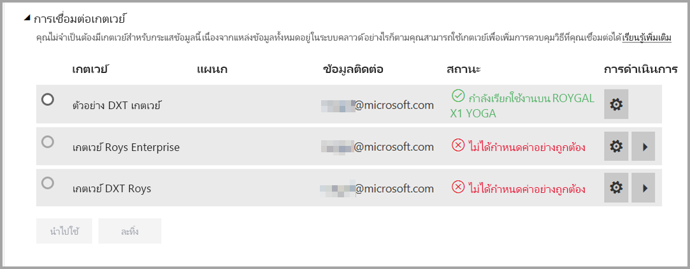
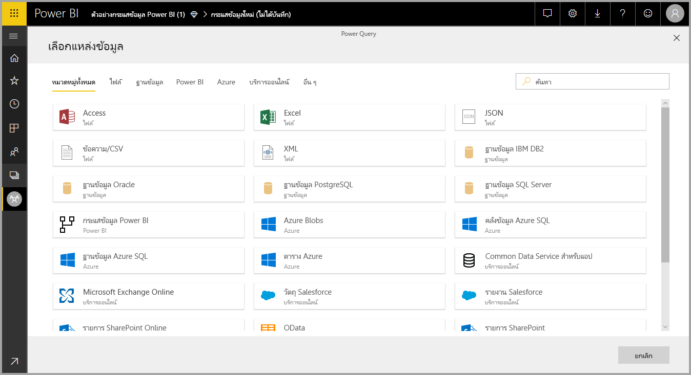
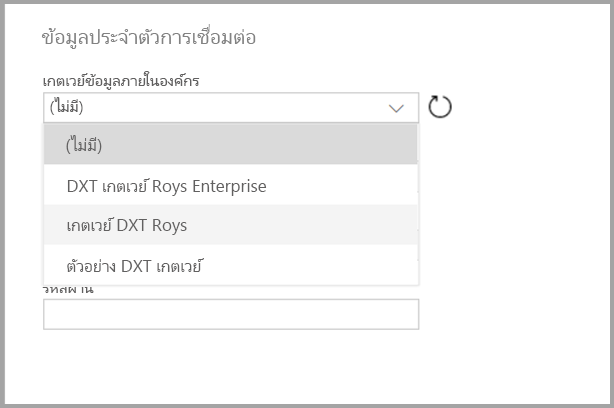

# การใช้กระแสข้อมูลกับแหล่งข้อมูลภายในองค์กร

ด้วย**กระแสข้อมูล** คุณสามารถสร้างคอลเลกชันข้อมูลจากแหล่งข้อมูลต่างๆ ได้ รวมทั้งล้างข้อมูล แปลง และโหลดเข้าที่เก็บข้อมูลของ Power BI เมื่อสร้างกระแสข้อมูล คุณควรใช้แหล่งข้อมูลในองค์กร บทความนี้ชี้แจงข้อกำหนดเกี่ยวกับการสร้างกระแสข้อมูล และชี้แจงการกำหนดค่า **เกตเวย์ของบริษัท** เพื่อเปิดใช้การเชื่อมต่อเหล่านั้น

## การกำหนดค่าเกตเวย์ของบริษัทเพื่อใช้กับกระแสข้อมูล

เมื่อต้องการใช้แหล่งข้อมูลในองค์กรในกระแสข้อมูล ผู้ใช้ที่สร้างกระแสข้อมูลต้องมี **เกตเวย์ของบริษัท** ติดตั้งและกำหนดค่าไว้เรียบร้อยแล้ว ผู้ใช้ที่สร้างกระแสข้อมูลต้องเป็นผู้ดูแลระบบของเกตเวย์ของบริษัท เพื่อใช้งานเกตเวย์สำหรับกระแสข้อมูลได้

> [!NOTE]
> กระแสข้อมูลได้รับการรองรับเมื่อใช้เกตเวย์ของบริษัทเท่านั้น

## การใช้แหล่งข้อมูลในองค์กรในกระแสข้อมูล

เมื่อทำการสร้างกระแสข้อมูล ให้คุณเลือกแหล่งข้อมูลในองค์กรจากในรายการแหล่งข้อมูล ดังที่แสดงในรูปต่อไปนี้

เมื่อคุณเลือก คุณจะได้รับแจ้งเตือนให้ระบุรายละเอียดการเชื่อมต่อสำหรับเกตเวย์ของบริษัทที่จะใช้ในการเข้าถึงข้อมูลในองค์กร คุณต้องเลือกเกตเวย์ แล้วให้ข้อมูลประจำตัวเกตเวย์ที่เลือก จะมีเฉพาะเกตเวย์ที่ผู้ใช้เป็นผู้ดูแลระบบเท่านั้นที่แสดงในรายการดรอปดาวน์

## การตรวจสอบเกตเวย์

คุณสามารถตรวจสอบเกตเวย์ของบริษัทสำหรับกระแสข้อมูลได้โดยใช้วิธีเดียวกันกับที่ใช้ตรวจสอบเกตเวย์ของชุดข้อมูล

ในหน้าจอการตั้งค่าของกระแสข้อมูลใน Power BI คุณอาจตรวจสอบสถานะเกตเวย์ในกระแสข้อมูลได้และกำหนดเกตเวย์ให้กระแสข้อมูลได้ ดังที่แสดงในรูปต่อไปนี้

## การเปลี่ยนเกตเวย์

คุณสามารถเปลี่ยนเกตเวย์ของบริษัทที่ใช้กับกระแสข้อมูลที่ให้มาได้สองวิธี:

1. **จากเครื่องมือการเขียน**– คุณสามารถเปลี่ยนเกตเวย์ที่กำหนดให้กับคิวรีได้โดยใช้เครื่องมือการเขียนกระแสข้อมูล

    > [!NOTE]
    > กระแสข้อมูลจะพยายามค้นหาหรือสร้างแหล่งข้อมูลที่จำเป็น โดยการใช้เกตเวย์ใหม่ ถ้าไม่สามารถทำได้ คุณจะไม่สามารถเปลี่ยนเกตเวย์ได้ จนกว่ากระแสข้อมูลที่จำเป็นทั้งหมดจะพร้อมใช้งานในเกตเวย์ที่เลือก

2. **จากหน้าจอการตั้งค่า** - คุณสามารถเปลี่ยนเกตเวย์ที่กำหนดได้โดยใช้หน้าจอการตั้งค่าสำหรับกระแสข้อมูลในบริการของ Power BI

โปรดดู [เกตเวย์ข้อมูลในองค์กร](service-gateway-onprem.md) เพื่อเรียนรู้เพิ่มเติมเกี่ยวกับเกตเวย์ของบริษัท

## ข้อควรพิจารณาและข้อจำกัด

ข้อจำกัดบางอย่างที่รู้จัก เกี่ยวกับการใช้เกตเวย์ของบริษัทและกระแสข้อมูล:

* กระแสข้อมูลแต่ละชุดจะใช้เกตเวย์เพียงตัวเดียว ดังนั้น คิวรีทั้งหมดควรกำหนดค่าโดยใช้เกตเวย์เดียวกัน
* การเปลี่ยนเกตเวย์จะส่งผลกระทบกับกระแสข้อมูลทั้งชุด
* ถ้าต้องใช้เกตเวย์จำนวนหนึ่ง ขอแนะนำให้สร้างกระแสข้อมูลไว้จำนวนหนึ่ง (หนึ่งชุดต่อเกตเวย์หนึ่งตัว) แล้วใช้การคำนวณหรือความสามารถในการอ้างอิงเอนทิตีเพื่อรวมข้อมูล
* กระแสข้อมูลได้รับการรองรับเมื่อใช้เกตเวย์ของบริษัทเท่านั้น เกตเวย์ส่วนตัวจะไม่พร้อมใช้งานในรายการดรอปดาวน์และหน้าจอตั้งค่า

## ขั้นตอนถัดไป

บทความนี้ให้ข้อมูลเกี่ยวกับการใช้แหล่งข้อมูลในองค์กรสำหรับกระแสข้อมูล และให้ข้อมูลวิธีการใช้และกำหนดค่าเกตเวย์เพื่อเข้าถึงข้อมูลนั้นๆ บทความต่อไปนี้อาจมีประโยชน์เช่นกัน

* [การเตรียมข้อมูลด้วยตัวเองโดยใช้กระแสข้อมูล](service-dataflows-overview.md)
* [การสร้างและใช้กระแสข้อมูลใน Power BI](service-dataflows-create-use.md)
* [การใช้เอนทิตีที่คำนวณใน Power BI Premium](service-dataflows-computed-entities-premium.md)
* [แหล่งข้อมูลของนักพัฒนาสำหรับกระแสข้อมูล Power BI](service-dataflows-developer-resources.md)

สำหรับข้อมูลเพิ่มเติมเกี่ยวกับ Power Query และการรีเฟรชตามกำหนดการ สามารถดูได้ในบทความเหล่านี้:
* [ภาพรวมคิวรีใน Power BI Desktop](desktop-query-overview.md)
* [การกำหนดค่าการรีเฟรชตามกำหนดการ](refresh-scheduled-refresh.md)

สำหรับข้อมูลเพิ่มเติมเกี่ยวกับ Common Data Model สามารถดูได้ในบทความภาพรวม:
* [Common Data Model - ภาพรวม](https://docs.microsoft.com/powerapps/common-data-model/overview)

