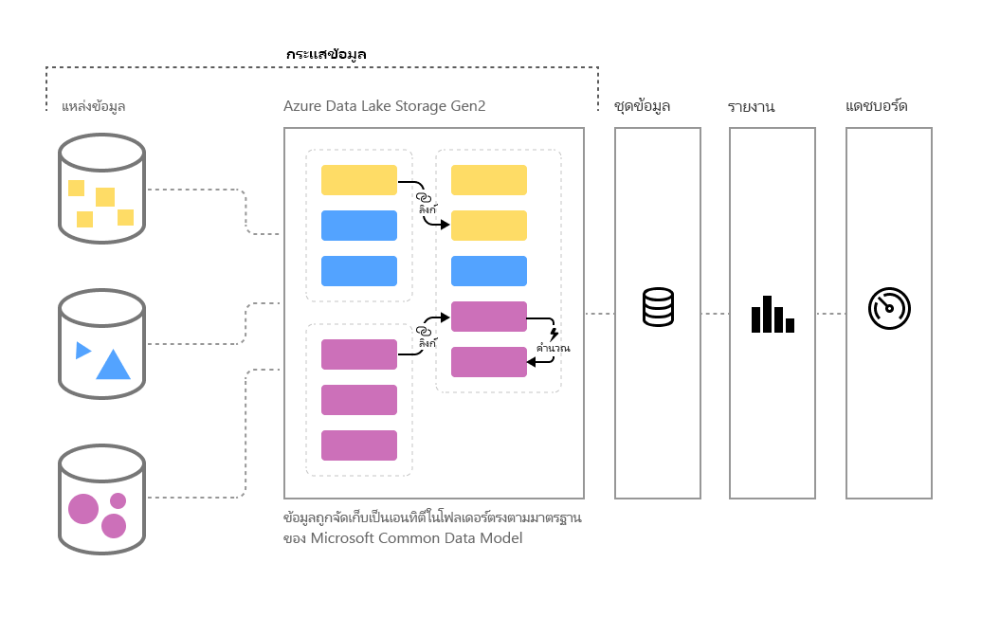

# การเตรียมข้อมูลด้วยตนเองใน Power BI (ตัวอย่าง)

เมื่อปริมาณข้อมูลเพิ่มขึ้นเรื่อยๆ ความท้าทายในการทำ Data Wrangling ให้ข้อมูลนั้นเป็นระเบียบและสามารถดำเนินการได้ก็เพิ่มขึ้นเช่นกัน เราต้องการข้อมูลที่พร้อมสำหรับการวิเคราะห์ เพื่อใช้กับวิชวล รายงานและแดชบอร์ด เพื่อให้เราเปลี่ยนปริมาณข้อมูลให้เป็นข้อมูลเชิงลึกที่ดำเนินการได้อย่างรวดเร็ว ด้วย**การเตรียมข้อมูลด้วยตนเอง** สำหรับข้อมูลใหญ่ใน Power BI คุณสามารถเปลี่ยนข้อมูลให้เป็นข้อมูลเชิงลึกของ Power BI ได้โดยคลิกเพียงไม่กี่ครั้ง

Power BI ได้ริเริ่ม**กระแสข้อมูล**เพื่อช่วยองค์กรต่างๆ รวมข้อมูลจากแหล่งข้อมูลที่แตกต่างกันอย่างสิ้นเชิง และเตรียมข้อมูลนั้นเพื่อทำแบบจำลอง นักวิเคราะห์สามารถสร้างกระแสข้อมูลได้ง่ายๆ ด้วยการใช้เครื่องมือแบบบริการตนเองที่คุ้นเคยกันดี มีการใช้กระแสข้อมูลเพื่อย่อย แปลง รวมและเติมแต่งข้อมูลขนาดใหญ่โดยการกำหนดการเชื่อมต่อของแหล่งข้อมูล, ตรรกะ ETL, กำหนดการรีเฟรช และอื่นๆ นอกจากนี้ กลไกการคำนวณที่ขับเคลื่อนด้วยแบบจำลองตัวใหม่ที่เป็นส่วนหนึ่งของกระแสข้อมูล จะทำให้ขั้นตอนการเตรียมข้อมูลสามารถบริหารจัดการได้มากขึ้น กำหนดได้มากขึ้น และลดความยุ่งยากเพื่อนักวิเคราะห์ข้อมูลและผู้สร้างรายงาน ในลักษณะที่คล้ายคลึงกับวิธีการที่สเปรดชีตทำการคำนวณซ้ำกับสูตรทั้งหมดที่ได้รับผลกระทบ กระแสข้อมูลเองก็จัดการการเปลี่ยงแปลงสำหรับเอนทิตีหรือองค์ประกอบข้อมูลแทนคุณเช่นกัน รวมถึงการอัปเดตอัตโนมัติ และการลดภาระจากการตรวจสอบตรรกะที่น่าเบื่อและกินเวลา แม้แต่ในการรีเฟรชข้อมูลพื้นฐาน ด้วยการใช้กระแสข้อมูล งานที่เคยต้องให้นักวิทยาศาสตร์ข้อมูลคอยเฝ้าดู (และกินเวลาหลายชั่วโมงหรือหลายวัน) สามารถจัดการได้โดยให้นักวิเคราะห์หรือผู้สร้างรายงานคลิกเพียงสองสามครั้ง 

ข้อมูลจัดเก็บเป็นเอนทิตีใน[**Common Data Model**](https://docs.microsoft.com/powerapps/common-data-model/overview) ใน Azure Data Lake Storage รุ่น 2 เมื่อใช้บริการของ Power BI จะสามารถสร้างและจัดการกระแสข้อมูลได้ในพื้นที่ทำงานของแอป  

> [!NOTE]
> ฟังก์ชันของกระแสข้อมูลอยู่ในช่วงตัวอย่าง และสามารถเปลี่ยนและอัปเดตได้ตามความพร้อมใช้งานทั่วไป

 
**กระแสข้อมูล**ออกแบบมาเพื่อใช้ **Common Data Model**, คอลเลกชันข้อมูลที่เป็นมาตรฐาน เป็นชุดและสามารถขยายได้ที่เผยแพร่โดย Microsoft ที่ออกแบบมาเพื่อทำให้การสร้าง ใช้และวิเคราะห์ข้อมูลง่ายขึ้น ด้วยแบบจำลองนี้ คุณสามารถเปลี่ยนเหล่งข้อมูลให้เป็นแดชบอร์ด Power BI ได้โดยที่แทบไม่มีความยุ่งยากเลย

คุณสามารถใช้กระแสข้อมูลเพื่อย่อยข้อมูลจากชุดข้อมูลที่ใหญ่และกำลังเพิ่มขึ้น ของแหล่งข้อมูลที่อยู่บนคลาวน์และที่อยู่ในองค์กร รวมทั้ง Dynamics 365, Salesforce, ฐานข้อมูล Azure SQL, Excel, SharePoint และอื่นๆ

คุณสามารถแมปข้อมูลไปยังเอนทิตีมาตรฐานใน Common Data Model แก้ไขและขยายเอนทิตีที่มีอยู่แล้ว และสร้างเอนทิตีแบบกำหนดเอง ผู้ใช้ระดับสูงสามารถสร้างกระแสข้อมูลแบบกำหนดเองทั้งหมดได้โดยการใช้ส่วนใช้งานการเขียน Power Query ที่ติดมาด้วย โดยเป็นแบบบริการตนเองรหัสต่ำ/ไม่มีรหัส ซึ่งคล้ายกับส่วนใช้งาน Power Query ที่ผู้ใช้ Power BI Desktop และ Excel นับล้านคนรู้จักอยู่แล้ว  

เมื่อคุณได้สร้างกระแสข้อมูล คุณจะสามารถใช้ Power BI Desktop และบริการของ Power BI เพื่อสร้างชุดข้อมูล รายงาน แดชบอร์ด และแอปที่ใช้ประโยชน์จากอำนาจของ Common Data Model เพื่อขับเคลื่อนข้อมูลเชิงลึกให้กับกิจกรรมทางธุรกิจของคุณ 

การวางกำหนดการรีเฟรชกระแสข้อมูลได้รับการจัดการโดยตรงจากพื้นที่ทำงานที่ใช้สร้างกระแสข้อมูล เช่นเดียวกับชุดข้อมูลของคุณ 

## วิธีการทำงานของกระแสข้อมูล

นี่คือตัวอย่างวิธีที่กระแสข้อมูลทำงานให้คุณ:

* องค์กรสามารถแมปข้อมูลไปยังเอนทิตีมาตรฐานได้ใน Common Data Model หรือสร้างเอนทิตีแบบกำหนดเองขึ้นมาได้ โดยเอนทิตีเหล่านี้สามารถใช้เป็นบล็อกสำเร็จรูปเพื่อสร้างรายงาน แดชบอร์ด และแอปที่ทำงานนอกกล่อง และแจกจ่ายให้ผู้ใช้ทั่วองค์กร 

* เมื่อใช้คอลเลกชันที่ครอบคลุมของตัวเชื่อมต่อข้อมูล Microsoft องค์กรจะสามารถเชื่อมต่อแหล่งข้อมูลของตนเองกับกระแสข้อมูลได้ โดยการใช้ Power Query เพื่อแมปข้อมูลจากแหล่งที่มาและนำเข้า Power BI เมื่อกระแสข้อมูลนำเข้าข้อมูล (และรีเฟรชตามความถี่ที่กำหนดไว้) เอนทิตีกระแสข้อมูลเหล่านั้นอาจใช้ในแอปพลิเคชัน Power BI Desktop เพื่อสร้างรายงานและแดชบอร์ดที่ดึงดูดความสนใจได้ 

## วิธีใช้กระแสข้อมูล

ส่วนเนื้อหาก่อนหน้านี้ได้อธิบายวิธีการใช้กระแสข้อมูลเพื่อสร้างการวิเคราะห์อันทรงพลังใน Power BI ไปบ้างแล้ว ในส่วนนี้ คุณจะได้ดูว่าคุณสามารถสร้างข้อมูลเชิงลึกโดยใช้กระแสข้อมูลในองค์กรได้รวดเร็วเพียงใด นอกจากนี้คุณจะได้ดูวิธีที่ BI Pro สร้างกระแสข้อมูลของตนเอง และกำหนดข้อมูลเชิงลึกเองสำหรับองค์กรนั้นๆ

### ขยายแบบจำลองข้อมูลทั่วไปเพื่อความต้องการของธุรกิจของคุณ
สำหรับองค์กรที่ต้องการขยาย Common Data Model (CDM) กระแสข้อมูลจะเปิดให้ผู้เชี่ยวชาญข่าวกรองธุรกิจได้กำหนดเอนทิตีมาตรฐานเองหรือสร้างอันใหม่ขึ้นมาก็ได้ กระบวนการที่ดำเนินการด้วยตนเองเพื่อการกำหนดแบบจำลองข้อมูลเองสามารถใช้กับกระแสข้อมูลเพื่อสร้างแอปและแดชบอร์ด Power BI ที่เหมาะเฉพาะกับองค์กรได้

### กำหนดกระแสข้อมูลโดยทางโปรแกรม
นอกจากนี้คุณควรพัฒนาโซลูชันทางโปรแกรมของคุณขึ้นมาเองเพื่อสร้างกระแสข้อมูล ด้วย API สาธารณะและความสามารถในการสร้างไฟล์ข้อกำหนดกระแสข้อมูลแบบกำหนดเองได้ (model.json) ในทางโปรแกรม คุณสามารถสร้างโซลูชันแบบกำหนดเองได้เพื่อให้เหมาะกับความต้องการในการวิเคราะห์และข้อมูลเฉพาะขององค์กร 

API สาธารณะช่วยให้นักพัฒนาได้ใช้วิธีการที่แสนเรียบง่ายในการโต้ตอบกับ Power BI และกระแสข้อมูล

### ขยายความสามารถของคุณด้วย Azure
Azure Data Lake Storagen รุ่น 2 มาพร้อมการสมัครใช้งานแบบมีค่าใช้จ่ายของ Power BI (10 GB ต่อผู้ใช้, 100 TB ต่อโหนด P1) ดังนั้น คุณจะสามารถเริ่มใช้งานการเตรียมข้อมูลด้วยตนเองได้ใน Azure Data Lake 

Power BI สามารถกำหนดค่าการจัดเก็บข้อมูลของกระแสข้อมูล ในบัญชี Azure Data Lake Storage รุ่น 2 ขององค์กรได้ เมื่อ Power BI เชื่อมต่อกับการสมัครใช้งาน Azure นักพัฒนาข้อมูลและนักวิทยาศาสตร์ข้อมูลจะสามารถใช้ประโยชน์ผลิตภัณฑ์ Azure อันทรงพลังได้ เช่น Azure Machine Learning, Azure Databricks, Azure Data Factory และอื่นๆ

Power BI ยังสามารถเชื่อมต่อกับโฟลเดอร์ที่มีข้อมูลแบบแผนในรูปแบบขอ Common Data Model ได้ ซึ่งจะถูกจัดเก็บในบัญชี Azure Data Lake Storage ขององค์กร โฟลเดอร์เหล่านี้สามารถสร้างได้โดยส่วนบริการ เช่น บริการข้อมูล Azure ด้วยการเชื่อมต่อโฟลเดอร์เหล่านี้ นักวิเคราะห์สามารถทำงานกับข้อมูลใน Power BI ได้อย่างราบรื่น 

สำหรับข้อมูลเพิ่มเติมเกี่ยวกับ Azure Data Lake Storage Gen2 และการรวมกระแสข้อมูล รวมถึงวิธีการสร้างกระแสข้อมูล ที่อยู่ภายในAzure Data Lake ขององค์กรคุณ ให้ดูที่[ การรวมกระแสข้อมูลและ Azure Data Lake (ตัวอย่าง)](service-dataflows-azure-data-lake-integration.md)

## ความสามารถของกระแสข้อมูลบน Power BI Premium

สำหรับฟีเจอร์ของกระแสข้อมูลและปริมาณงานที่จะทำการสมัครใช้งาน Power BI Premium นั้น ปริมาณงานของกระแสข้อมูลสำหรับความจุ Premium ต้องเปิดใช้งานอยู่ คุณสามารถเรียนรู้เพิ่มเติมเกี่ยวกับ Power BI Premium ได้ในบทความ[Power BI Premium คืออะไร](service-premium.md) 

ตารางต่อไปนี้อธิบายถึงฟีเจอร์ของกระแสข้อมูลและความสามารถเมื่อใช้บัญชี Power BI Pro และอธิบายการเปรียบเทียบกับการใช้ Power BI Premium

|ความจุของกระแสข้อมูล | Power BI Pro |   Power BI Premium |
|---------|---------|---------|
|รีเฟรชตามกำหนดการ| 8 ต่อวัน|  48|
|ที่เก็บข้อมูลทั้งหมด| 10 GB/ผู้ใช้  |100 TB/โหนด|
|การเขียนกระแสข้อมูลโดยใช้ Power Query Online|    +   |+|
|การจัดการกระแสข้อมูลภายใน Power BI|   +|  +|
|ตัวเชื่อมต่อข้อมูลของกระแสข้อมูลใน Power BI Desktop|  +|  +|
|การรวมกับ Azure|    +|  +|
|เอนทิตีที่คำนวณไว้ (การเปลงในที่จัดเก็บผ่าน M) | |   +|
|ตัวเชื่อมต่อใหม่|    +|  +|
|การรีเฟรชกระแสข้อมูลแบบเพิ่ม|  |   +|
|การทำงานบนความจุ Power BI Premium / การดำเนินการแบบขนานของการแปลง|   |   +|
|เอนทิตีที่เชื่อมต่อไว้ของกระแสข้อมูล| |        +|
|Schema ที่เป็นมาตรฐาน / ส่วนสนับสนุนในตัวสำหรับ Common Data Model|  +|  +|

สำหรับข้อมูลเพิ่มเติมเกี่ยวกับวิธีการเปิดใช้งานความจุของที่เก็บปริมาณกระแสข้อมูลแบบพรีเมียม ให้ไปดูที่บทความ[การกำหนดค่าปริมาณงาน](service-admin-premium-manage.md#configure-workloads)สำหรับ Power BI พรีเมียม ปริมาณงานในกระแสข้อมูลไม่พร้อมใช้งานในความจุแบบ muti-geo

## การสรุปของการเตรียมข้อมูลด้วยตนเองสำหรับข้อมูลขนาดใหญ่ใน Power BI
ตามที่ได้กล่าวไว้ก่อนหน้าในบทความนี้ มีสถานการณ์และตัวอย่างหลากหลายในการที่**กระแสข้อมูล**สามารถช่วยให้คุณได้การควบคุมที่ดีขึ้นข้อมูลเชิงลึกที่รวดเร็วขึ้น จากข้อมูลธุรกิจของคุณ เมื่อใช้แบบจำลองข้อมูลมาตรฐาน (Schema) ที่กำหนดโดย Common Data Model กระแสข้อมูลจะสามารถนำเข้าข้อมูลธุรกิจอันมีค่าและเตรียมข้อมูลให้พร้อมสำหรับการสร้างแบบจำลองและการสร้างข้อมูลเชิงลึก BI ในเวลาอันสั้นมากได้ จากที่เคยใช้เวลาเป็นเดือนๆ หรือนานกว่านั้น 

โดยการจัดเก็บข้อมูลธุรกิจในรูปแบบที่ได้มาตรฐานของ**Common Data Model** BI Pros (หรือนักพัฒนา) ของคุณสามารถสร้างแอปที่สร้างวิชวลและรายงานได้อย่างรวดเร็วและง่ายดาย ซึ่งรวมถึงแต่ไม่จำกัดอยู่เพียง:

* การแมปข้อมูลของคุณไปยังเอนทิตีมาตรฐานใน Common Data Model เพื่อรวมข้อมูลและใช้ประโยชน์ Schema ที่รู้จักในการขับเคลื่อนข้อมูลเชิงลึกที่อยู่นอกกรอบ
* การสร้างเอนทิตีแบบกำหนดเองเพื่อรวมข้อมูลจากทั่วทั้งองค์กร 
* ใช้และรีเฟรช**ข้อมูลภายนอก**ที่เป็นส่วนหนึ่งของกระแสข้อมูล และเปิดการนำเข้าข้อมูลนั้นเพื่อขับเคลื่อนข้อมูลเชิงลึก
* การเริ่มต้นใช้งานกระแสข้อมูลสำหรับนักพัฒนา

## ขั้นตอนถัดไป

บทความนี้ใช้ภาพรวมของการเตรียมข้อมูลด้วยตนเองสำหรับข้อมูลขนาดใหญ่ใน Power BI และวิธีการใช้งานหลายวิธี บทความต่อไปนี้จะลงรายละเอียดที่ลึกขึ้นเกี่ยวกับสถานการณ์การใช้งานทั่วไปสำหรับกระแสข้อมูล 

* [สร้างและใช้กระแสข้อมูลใน Power BI](service-dataflows-create-use.md)
* [การใช้เอนทิตีที่คำนวณใน Power BI Premium (ตัวอย่าง)](service-dataflows-computed-entities-premium.md)
* [การใช้กระแสข้อมูลพร้อมแหล่งข้อมูลในองค์กร (ตัวอย่าง)](service-dataflows-on-premises-gateways.md)
* [แหล่งข้อมูลของนักพัฒนาสำหรับกระแสข้อมูล Power BI (ตัวอย่าง)](service-dataflows-developer-resources.md)
* [ การรวมกระแสข้อมูลและ Azure Data Lake (ตัวอย่าง)](service-dataflows-azure-data-lake-integration.md)

สำหรับข้อมูลเพิ่มเติมเกี่ยวกับ Power Query และการรีเฟรชตามกำหนดการ สามารถดูได้ในบทความเหล่านี้:
* [ภาพรวมคิวรีใน Power BI Desktop](desktop-query-overview.md)
* [การกำหนดค่าการรีเฟรชตามกำหนดการ](refresh-scheduled-refresh.md)

สำหรับข้อมูลเพิ่มเติมเกี่ยวกับ Common Data Model สามารถดูได้ในบทความภาพรวม:
* [Common Data Model - ภาพรวม](https://docs.microsoft.com/powerapps/common-data-model/overview)

