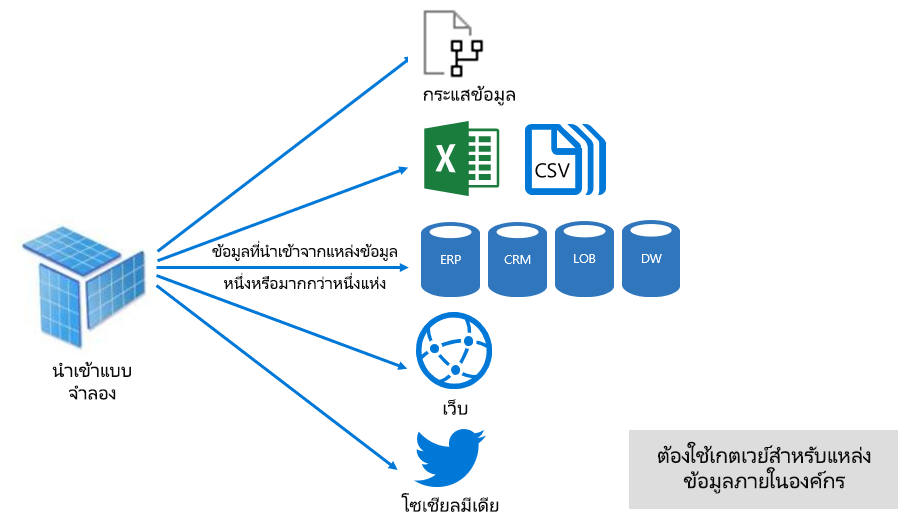
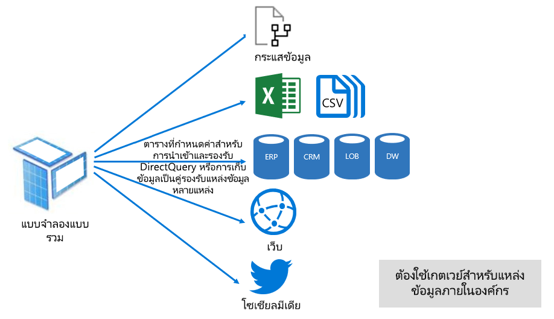

# โหมดชุดข้อมูลในบริการของ Power BI

บทความนี้แสดงคำอธิบายทางเทคนิคของโหมดชุดข้อมูล Power BI ซึ่งจะนำไปใช้กับชุดข้อมูลที่แสดงการเชื่อมต่อสดไปยังแบบจำลอง Analysis Services ที่โฮสต์ภายนอกและยังเป็นแบบจำลองที่พัฒนาใน Power BI Desktop บทความเน้นเหตุผลสำหรับแต่ละโหมดและผลกระทบที่เป็นไปได้บนทรัพยากรความจุของ Power BI

โหมดชุดข้อมูลที่สามคือ:

- [นำเข้า](#import-mode)
- [DirectQuery](#directquery-mode)
- [สีผสม](#composite-mode)

## โหมดการนำเข้า

โหมด_นำเข้า_  คือโหมดที่ใช้บ่อยที่สุดในการพัฒนาแบบจำลอง โหมดนี้ส่งผลให้ประสิทธิภาพการทำงานรวดเร็วมากด้วยการคิวรีในหน่วยความจำ นอกจากนี้ยังมีความยืดหยุ่นในการออกแบบเพื่อโมเดลและการสนับสนุนสำหรับฟีเจอร์บริการของ Power BI เฉพาะ (ถามตอบ ข้อมูลเชิงลึกด่วน ฯลฯ) เนื่องจากจุดแข็งเหล่านี้เป็นโหมดเริ่มต้นเมื่อสร้างโซลูชัน Power BI Desktop ใหม่

เป็นสิ่งสำคัญที่ต้องทำความเข้าใจว่าข้อมูลที่นำเข้าจะถูกจัดเก็บไว้ในดิสก์เสมอ เมื่อสอบถามหรือรีเฟรช ข้อมูลจะต้องโหลดลงในหน่วยความจำของความจุ Power BI แบบเต็ม เมื่ออยู่ในหน่วยความจำแบบจำลอง การนำสามารถเข้าทำให้พบผลลัพธ์แบบสอบถามได้อย่างรวดเร็ว คุณจะต้องเข้าใจว่าไม่มีแนวคิดเกี่ยวกับแบบจำลองการนำเข้าที่โหลดบางส่วนลงในหน่วยความจำ

เมื่อรีเฟรช ข้อมูลจะถูกบีบอัดและปรับให้เหมาะสม จากนั้นจึงเก็บข้อมูลลงในดิสก์โดยกลไกที่จัดเก็บข้อมูล VertiPaq เมื่อโหลดจากดิสก์ลงในหน่วยความจำ อาจเป็นไปได้ที่จะเห็นการบีบอัด10 เท่า ดังนั้นจึงเหมาะสมที่จะคาดหวังว่าข้อมูลต้นฉบับ 10 GB ที่สามารถบีบอัดได้ในขนาดประมาณ 1 GB ขนาดที่เก็บข้อมูลบนดิสก์สามารถลดลงได้ 20% จากการดำเนินการข้างต้น (ความแตกต่างในขนาดสามารถกำหนดได้โดยการเปรียบเทียบขนาดไฟล์ Power BI Desktop กับหน่วยความจำตัวจัดการงานที่ใช้สำหรับไฟล์ได้)

ความยืดหยุ่นในการออกแบบสามารถทำได้ในสามวิธี ผู้สร้างแบบจำลองข้อมูลสามารถที่จะ:

- รวมข้อมูลโดยการแคชข้อมูลจากกระแสข้อมูลและแหล่งข้อมูลภายนอก และประเภทแหล่งข้อมูลหรือรูปแบบก็ตาม
- ใช้ประโยชน์จากการตั้งค่าของฟังก์ชัน  [Power Query Formula Language](/powerquery-m/) (เรียกอย่างไม่เป็นทางการว่า M) ทั้งหมดเมื่อสร้างคิวรีการเตรียมข้อมูล
- ใช้ประโยชน์จากการตั้งค่าทั้งหมดของฟังก์ชัน [Data Analysis Expressions (DAX)](/dax/)  เมื่อปรับปรุงแบบจำลองที่มีตรรกะทางธุรกิจ ด้วยคอลัมน์จากการคำนวณ ตารางจากการคำนวณ และหน่วยวัด มีการรองรับสำหรับคอลัมน์จากการคำนวณ ตารางที่มีการคำนวณ และหน่วยวัด

ดังที่แสดงในรูปต่อไปนี้ แบบจำลองการนำเข้าสามารถรวมข้อมูลจากแหล่งข้อมูลที่สนับสนุนชนิดต่าง ๆ จำนวนเท่าใดก็ได้

อย่างไรก็ตาม ถึงแม้จะมีข้อได้เปรียบที่น่าสนใจที่เกี่ยวข้องกับแบบจำลองการนำเข้า แต่ก็มีข้อเสียเช่นกัน:

- ต้องโหลดแบบจำลองทั้งหมดลงในหน่วยความจำก่อน Power BI จึงสามารถคิวรีแบบจำลองได้ ซึ่งสามารถสร้างแรงกดดันต่อทรัพยากรที่มีอยู่เมื่อจำนวนและขนาดของแบบจำลองขยายขึ้น
- ข้อมูลแบบจำลองจะเป็นปัจจุบันเฉพาะในการรีเฟรชครั้งล่าสุดเท่านั้นดังนั้นจึงจำเป็นต้องรีเฟรชแบบจำลองการนำเข้าตามกำหนดเวลา
- การรีเฟรชเต็มรูปแบบจะลบข้อมูลทั้งหมดออกจากตารางทั้งหมด และโหลดจากแหล่งข้อมูลใหม่ ซึ่งอาจใช้ทรัพยากรสูงมากในแง่ของเวลาและทรัพยากรสำหรับบริการของ Power BI และแหล่งข้อมูล

    > [!NOTE]
    > Power BI สามารถทำการรีเฟรชแบบเพิ่มหน่วยเพื่อหลีกเลี่ยงการตัดทอนและโหลดตารางทั้งหมดได้ อย่างไรก็ตามคุณฟีเจอร์นี้ได้รับการสนับสนุนเฉพาะเมื่อมีการโฮสต์ชุดข้อมูลในพื้นที่ทำงานบนความจุ Premium สำหรับข้อมูลเพิ่มเติม โปรดดูที่บทความ[การรีเฟรชแบบเพิ่มทีละส่วนใน Power BI Premium](service-premium-incremental-refresh.md)

จากมุมมองแหล่งข้อมูลบริการ Power BI นำเข้าโมเดลจำเป็นต้องใช้:

- หน่วยความจำที่เพียงพอในการโหลดแบบจำลองเมื่อทำการคิวรีหรือรีเฟรช
- ทรัพยากรการประมวลผลและทรัพยากรหน่วยความจำเพิ่มเติมเพื่อรีเฟรชข้อมูล

## โหมด DirectQuery

_โหมด_ DirectQuery เป็นอีกทางเลือกในการนำเข้าโหมด แบบจำลองที่พัฒนาในโหมด DirectQuery จะไม่นำเข้าข้อมูล แต่โหมดนั้นๆ ประกอบด้วยเมตาดาต้าที่กำหนดโครงสร้างแบบจำลองเท่านั้น เมื่อคิวรีแบบจำลอง คิวรีเดิมจะถูกใช้เพื่อดึงข้อมูลจากแหล่งข้อมูลต้นทาง

มีสองเหตุผลหลักที่ควรพิจารณาในการพัฒนาแบบจำลอง DirectQuery ดังนี้:

- เมื่อปริมาณข้อมูลมีขนาดใหญ่เกินไป แม้ว่าจะใช้วิธีการลดข้อมูล[เพื่อโหลดข้อมูลลงในแบบจำลอง](guidance/import-modeling-data-reduction.md)หรือเพื่อรีเฟรชในทางปฏิบัติ
- เเมื่อรายงานและแดชบอร์ดต้องการนำเสนอข้อมูล "ที่ใกล้เคียงกับเวลาจริง" นอกเหนือจากสิ่งที่สามารถทำได้ภายในขีดจำกัดการรีเฟรชตามกำหนดเวลา (ขีดจำกัดการรีเฟรชตามกำหนดเวลาคือ แปดครั้งต่อวันสำหรับความจุที่ใช้ร่วมกัน และ48 ครั้งต่อวันสำหรับความจุแบบ  Premium)

มีข้อดีหลายอย่างที่เกี่ยวข้องกับแบบจำลอง DirectQuery:

- ไม่มีข้อจำกัดด้านขนาดของแบบจำลองการนำเข้า
- แบบจำลองไม่จำเป็นต้องรีเฟรช
- ผู้ใช้รายงานจะเห็นข้อมูลล่าสุดเมื่อมีการโต้ตอบกับตัวกรองรายงานและแบ่งส่วนข้อมูล นอกจากนี้ผู้ใช้ที่รายงานสามารถรีเฟรชรายงานทั้งหมดเพื่อดึงข้อมูลปัจจุบันได้
- สามารถพัฒนารายงานแบบเรียลไทม์ได้โดยใช้ฟีเจอร์[การรีเฟรชหน้า โดยอัตโนมัติ](desktop-automatic-page-refresh.md)
- ไทล์แดชบอร์ดที่เมื่อยึดตามแบบจำลอง DirectQuery สามารถอัปเดตโดยอัตโนมัติ บ่อยที่สุดทุก 15 นาที

อย่างไรก็ตาม จะมีข้อจำกัดบางประการเกี่ยวกับแบบจำลอง DirectQuery:

- สูตร DAX จะถูกจำกัดให้ใช้เฉพาะฟังก์ชันที่สามารถสลับเปลี่ยน คิวรีเดิมได้ที่ได้รับโดยแหล่งข้อมูล ตารางจากการคำนวณไม่ได้รับการสนับสนุน
- คุณลักษณะถามตอบและข้อมูลเชิงลึกด่วนที่ไม่ได้รับการสนับสนุน

จากมุมมองทรัพยากรบริการของ Power BI แบบจำลอง DirectQuery จำเป็นต้องใช้:

- หน่วยความจำน้อยที่สุดในการโหลดแบบจำลอง (เมตาดาต้าเท่านั้น) เมื่อมีการคิวรีแล้ว
- บางครั้งบริการของ Power BI ต้องใช้ทรัพยากรตัวประมวลผลที่สำคัญในการสร้างและประมวลผลคิวรีที่ส่งไปยังแหล่งข้อมูล เมื่อสถานการณ์นี้เกิดขึ้นอาจส่งผลกระทบต่อความเร็ว โดยเฉพาะเมื่อผู้ใช้คิวรีแบบจำลองพร้อมกัน

สำหรับข้อมูลเพิ่มเติม โปรดดู[ใช้ Direct Query ใน Power BI Desktop](desktop-use-directquery.md)

## โหมดแบบรวม

_โหมดแบบรวม_สามารถผสมโหมดการนำเข้าและ DirectQuery หรือรวมแหล่งข้อมูล DirectQuery หลายรายการได้ แบบจำลองที่พัฒนาขึ้นในโหมดแบบรวมรองรับโหมดที่เก็บข้อมูลสำหรับตารางแบบจำลองแต่ละรายการ นอกจากนี้โหมดนี้ยังรองรับตารางที่มีการคำนวณ (ที่กำหนดไว้กับ DAX)

โหมดที่เก็บข้อมูลสำหรับตารางสามารถกำหนดค่าเป็นนำเข้า DirectQuery หรือแบบคู่ได้ ตารางที่ได้รับการกำหนดค่าเป็นโหมดที่เก็บข้อมูลคู่คือทั้งนำเข้าและ DirectQuery และการตั้งค่านี้อนุญาตให้บริการของ Power BI ให้กำหนดโหมดที่มีประสิทธิภาพมากที่สุดในการใช้งานบนพื้นฐานของแต่ละคิวรี

แบบจำลองแบบรวมจะนำเสนอสิ่งที่ดีสุดของโหมดการนำเข้าและ DirectQuery เมื่อกำหนดค่าอย่างเหมาะสมจะสามารถรวมประสิทธิภาพการทำงานคิวรีของแบบจำลองในหน่วยความจำที่มีความสามารถในการดึงข้อมูลที่ใกล้เคียงกับข้อมูลแบบเรียลไทม์จากแหล่งข้อมูลได้

ข้อมูลโมเดลที่พัฒนาโมเดลแบบรวมมีแนวโน้มที่จะกำหนดค่าตารางชนิดมิติในการนำเข้าหรือโหมดที่เก็บข้อมูลคู่และตารางชนิดความจริงในโหมด DirectQuery สำหรับข้อมูลเพิ่มเติมเกี่ยวกับบทบาทของตารางแบบจำลอง โปรดดูหัวข้อ[ทำความเข้าใจ star schema และความสำคัญสำหรับ Power BI](guidance/star-schema.md)

ตัวอย่างเช่น พิจารณาแบบจำลองที่มีตารางชนิด**ผลิตภัณฑ์** ในโหมดคู่และตาราง**ยอดขาย**ชนิดความจริงในโหมด DirectQuery ตาราง**ผลิตภัณฑ์**อาจมีประสิทธิภาพและได้รับการคิวรีอย่างรวดเร็วจากในหน่วยความจำเพื่อแสดงตัวแบ่งส่วนข้อมูลรายงาน ตาราง**ยอดขาย**ยังได้รับการคิวรีในโหมด DirectQuery ด้วยตาราง**ผลิตภัณฑ์**ที่เกี่ยวข้องได้อีกด้วย คิวรีสุดท้ายสามารถเปิดใช้งานการสร้างคิวรี SQL แบบดั้งเดิมที่มีประสิทธิภาพเดียวซึ่งรวม**ผลิตภัณฑ์**และตาราง**ยอดขาย**และกรองตามค่าตัวแบ่งส่วนข้อมูล

โดยทั่วไปสำหรับโมเดลแบบรวม ข้อดีและข้อเสียเกี่ยวข้องกับการนำเข้าและ DirectQuery โดยขึ้นอยู่กับวิธีการกำหนดค่าในแต่ละตาราง

สำหรับข้อมูลเพิ่มเติม โปรดดูการ[ใช้โมเดลแบบรวมใน Power BI Desktop](desktop-composite-models.md)

## ขั้นตอนถัดไป

- [ชุดข้อมูลในบริการของ Power BI](service-dataset-modes-understand.md)
- [โหมดที่เก็บข้อมูลใน Power BI Desktop](desktop-storage-mode.md)
- [การใช้ DirectQuery ใน Power BI](desktop-directquery-about.md)
- [ใช้แบบจำลองแบบรวมใน Power BI Desktop](desktop-composite-models.md)
- มีคำถามเพิ่มเติมหรือไม่ [ลองถามชุมชน Power BI](https://community.powerbi.com/)
