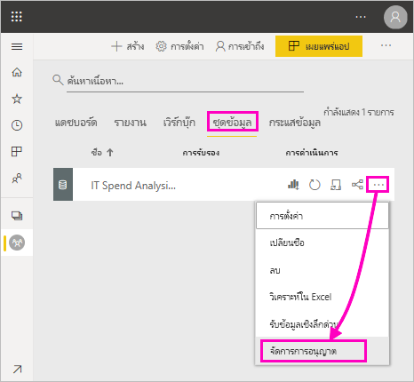
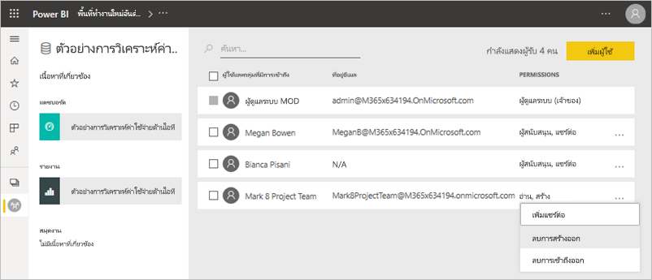
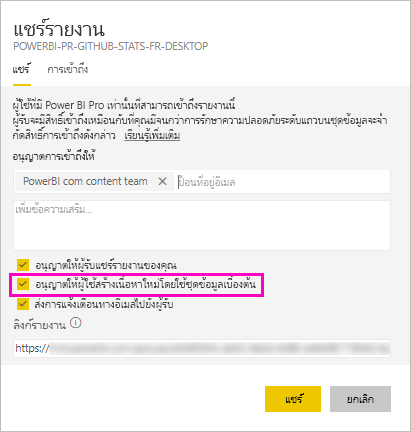
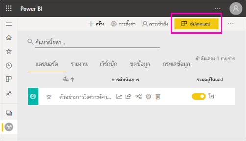
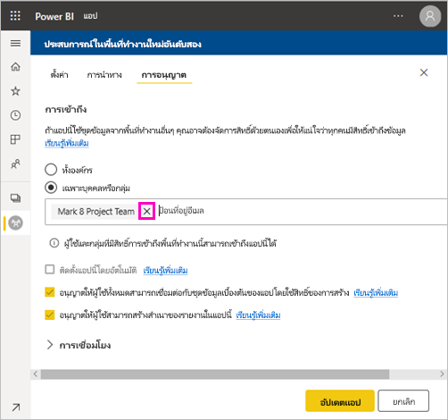
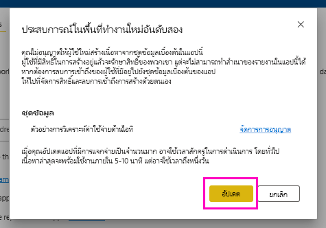

# สิทธิ์ในการสร้างสำหรับชุดข้อมูลที่แชร์ (ตัวอย่าง)

ในฐานะผู้สร้าง*แบบจำลองข้อมูล*ใน Power BI Desktop คุณสามารถแชร์เป็น*ชุดข้อมูล*ในบริการของ Power BI ได้ จากนั้นผู้สร้างรายงานสามารถค้นหา และนำชุดข้อมูลที่คุณแชร์กลับมาใช้ได้อย่างง่ายดาย เรียนรู้วิธีควบคุมผู้ที่สามารถเข้าถึงข้อมูลได้โดยใช้สิทธิ์ในการสร้าง

สิทธิ์ในการสร้างจะเกี่ยวข้องกับชุดข้อมูลเท่านั้น เมื่อคุณให้สิทธิ์ในการสร้างแก่ผู้ใช้ ผู้ใช้สามารถสร้างเนื้อหาใหม่ในชุดข้อมูล เช่น รายงาน แดชบอร์ด ไทล์ที่ปักหมุดไว้จากฟังก์ชันถามตอบ และการค้นพบข้อมูลเชิงลึกได้ นอกจากนี้ยังสามารถสร้างเนื้อหาใหม่บนชุดข้อมูลที่อยู่นอก Power BI เช่น แผ่นงาน Excel ที่ผ่านการวิเคราะห์ใน Excel, XMLA และส่งออกข้อมูลพื้นฐาน

## วิธีการให้สิทธิ์ในการสร้าง

คุณให้สิทธิ์ในการสร้างสำหรับชุดข้อมูลหนึ่ง ๆ ได้ด้วยสองสามวิธีต่อไปนี้:

- สมาชิกของพื้นที่ทำงานที่มีบทบาทผู้สนับสนุนอย่างน้อยหนึ่งบทบาทจะมีสิทธิ์ในการสร้างสำหรับชุดข้อมูลในพื้นที่ทำงานดังกล่าว และสิทธิ์ในการคัดลอกรายงานโดยอัตโนมัติ
 
- สมาชิกของพื้นที่ทำงานที่มีชุดข้อมูลสามารถกำหนดสิทธิ์ให้ผู้ใช้หรือกลุ่มความปลอดภัยที่เฉพาะเจาะจงในศูนย์การอนุญาต หากคุณเป็นสมาชิกของพื้นที่ทำงาน เลือกจุดไข่ปลา (... ) ที่อยู่ถัดจากชุดข้อมูล > **จัดการสิทธิ์**

    

    ซึ่งจะเปิดศูนย์การอนุญาตสำหรับชุดข้อมูลนั้นที่คุณสามารถตั้งค่าและเปลี่ยนแปลงสิทธิ

    

- ผู้ดูแลระบบหรือสมาชิกของพื้นที่ทำงานที่มีชุดข้อมูลสามารถตัดสินใจในระหว่างการเผยแพร่แอปว่าผู้ใช้ที่มีสิทธิสำหรับแอปจะได้รับสิทธิในการสร้างสำหรับชุดข้อมูลเบื้องต้นด้วย ดูรายละเอียดได้ใน[แชร์ชุดข้อมูล](service-datasets-share.md)

- สมมติว่าคุณมีการแชร์ต่อและสิทธิ์ในการสร้างในชุดข้อมูล เมื่อคุณแชร์รายงานหรือแดชบอร์ดที่สร้างขึ้นในชุดข้อมูลนั้น คุณสามารถระบุว่าผู้รับจะได้รับสิทธิ์ในการสร้างสำหรับชุดข้อมูลเบื้องต้นด้วย

    

คุณสามารถลบสิทธิ์ในการสร้างของบุคคลสำหรับชุดข้อมูลได้ ถ้าคุณทำเช่นนั้น พวกเขายังคงสามารถดูรายงานที่สร้างบนชุดข้อมูลที่ใช้ร่วมกัน แต่จะสามารถไม่แก้ไขได้ ดูรายละเอียดได้ในส่วนถัดไป

## ลบสิทธิ์ในการสร้างสำหรับชุดข้อมูล

ในบางกรณี คุณอาจจำเป็นต้องลบสิทธิ์ในการสร้างสำหรับบางผู้ใช้ของชุดข้อมูลที่แชร์ 

1. ในพื้นที่ทำงาน ให้ไปที่หน้ารายการ**ชุดข้อมูล** 
1. เลือกจุดไข่ปลา (...) ที่อยู่ถัดจากชุดข้อมูล > **จัดการสิทธิ์**

    

1. เลือกจุดไข่ปลา (...) ที่อยู่ถัดจากชื่อ > **ลบการสร้าง**

    

    ผู้ใช้ยังคงสามารถดูรายงานที่สร้างไว้ในชุดข้อมูลที่แชร์ แต่จะไม่สามารถแก้ไขได้

### ลบสิทธิ์ในการสร้างสำหรับชุดข้อมูลในแอป

สมมติว่าคุณแจกจ่ายแอปจากพื้นที่ทำงานไปยังกลุ่มบุคคล หลังจากนั้น คุณตัดสินใจที่จะลบการเข้าถึงแอปสำหรับบุคคลบางคน การลบการเข้าถึงแอปของบุคคลจะไม่ลบสิทธิ์ในการสร้างและแชร์โดยอัตโนมัติ นี่เป็นขั้นตอนพิเศษ 

1. ในหน้ารายการพื้นที่ทำงาน ให้เลือก**อัปเดตแอป** 

    

1. ในแท็บ**สิทธิ์** ให้เลือก **X** เพื่อลบบุคคลหรือกลุ่ม 

    
1. เลือก**อัปเดตแอป**

    คุณจะเห็นข้อความที่อธิบายว่าคุณจำเป็นต้องไปที่**จัดการสิทธิ์**เพื่อลบสิทธิ์ในการสร้างสำหรับผู้ใช้ที่มีการเข้าถึงอยู่ 

    

1. เลือก**อัปเดต**

1. ในพื้นที่ทำงาน ให้ไปที่หน้ารายการ**ชุดข้อมูล** 
1. เลือกจุดไข่ปลา (...) ที่อยู่ถัดจากชุดข้อมูล > **จัดการสิทธิ์**

    

1. เลือกจุดไข่ปลา (...) ที่อยู่ถัดจากชื่อ > **ลบการสร้าง**

    

    ผู้ใช้ยังคงสามารถดูรายงานที่สร้างไว้ในชุดข้อมูลที่แชร์ แต่จะไม่สามารถแก้ไขได้

## สิทธิที่แยกย่อยมากขึ้น

Power BI เปิดตัวสิทธิ์ในการสร้างในเดือนมิถุนายน 2019 ซึ่งเป็นส่วนเสริมของสิทธิ์ที่มีอยู่ อ่านและแชร์ต่อ ผู้ใช้ทั้งหมดที่อยู่มีสิทธิ์ในการอ่านสำหรับชุดข้อมูลผ่านการอนุญาตของแอป การแชร์ หรือการเข้าถึงพื้นที่ทำงานในขณะนั้น ยังได้รับสิทธิ์ในการสร้างสำหรับชุดข้อมูลเดียวกันเหล่านั้นด้วย โดยจะได้รับสิทธิในการสร้างอัตโนมัติเนื่องจากสิทธิในการอ่านได้ให้สิทธิในการสร้างเนื้อหาใหม่ที่ด้านบนของชุดข้อมูล โดยใช้การวิเคราะห์ใน Excel หรือส่งออก

ด้วยสิทธิในการสร้างที่แยกย่อยมากขึ้นนี้ คุณสามารถเลือกผู้ที่สามารถดูได้เฉพาะเนื้อหาในรายงานหรือแดชบอร์ดที่มีอยู่เท่านั้น และผู้ที่สามารถสร้างเนื้อหาที่เชื่อมต่อกับชุดข้อมูลเบื้องต้น

ถ้าชุดข้อมูลของคุณกำลังถูกใช้โดยรายงานที่อยู่นอกพื้นที่ทำงานชุดข้อมูล คุณไม่สามารถลบชุดข้อมูลนั้น แต่คุณสามารถดูข้อความแสดงข้อผิดพลาดได้

คุณสามารถลบสิทธิ์ในการสร้างได้ ถ้าคุณทำเช่นนั้น บุคคลที่คุณยกเลิกสิทธิ์ไปแล้วจะยังสามารถเห็นรายงานได้ แต่ไม่สามารถแก้ไขรายงานหรือส่งออกข้อมูลพื้นฐานได้อีก เฉพาะผู้ใช้ที่มีสิทธิ์ในการอ่านเท่านั้นที่ยังสามารถส่งออกข้อมูลสรุปได้ 

## ขั้นตอนถัดไป

- [ใช้ชุดข้อมูลทั้งพื้นที่ทำงาน (ดูตัวอย่าง)](service-datasets-across-workspaces.md)
- มีคำถามหรือไม่ [ลองถามชุมชน Power BI](http://community.powerbi.com/)
