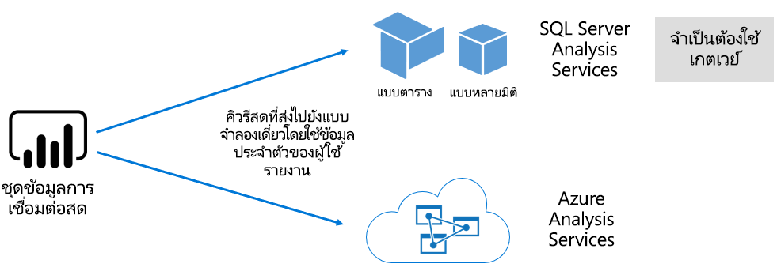

# ชุดข้อมูลในบริการ Power BI

บทความนี้ให้คำอธิบายทางเทคนิคของชุดข้อมูล Power BI

## ประเภทชุดข้อมูล

ชุดข้อมูล Power BI แสดงแหล่งข้อมูลที่พร้อมสำหรับการรายงานและการแสดงภาพ มีประเภทของชุดข้อมูล 5 แบบที่สร้างในวิธีการต่อไปนี้

- การเชื่อมต่อกับแบบจำลองข้อมูลที่มีอยู่ซึ่งไม่ได้โฮสต์ในพื้นที่ของ Power BI
- อัปโหลดไฟล์ Power BI Desktop ที่ประกอบด้วยแบบจำลอง
- การอัปโหลดเวิร์กบุ๊ก Excel (มีตาราง Excel และ/หรือแบบจำลองข้อมูลเวิร์กบุ๊กอย่างน้อย 1 รายการ) หรือการอัปโหลดไฟล์ CSV (ค่าที่คั่นด้วยจุลภาค)
- การใช้บริการ Power BI เพื่อสร้าง[ชุดข้อมูลแบบพุช](developer/automation/walkthrough-push-data.md)
- การใช้บริการ Power BI เพื่อสร้าง[ชุดข้อมูลสตรีมมิ่งหรือสตรีมมิ่งแบบไฮบริด](service-real-time-streaming.md)

ชุดข้อมูลที่แสดงถึงรูปแบบข้อมูลซึ่งใช้เทคโนโลยีการสร้างแบบจำลองเป็นผู้ใหญ่ของ [Analysis Services](/analysis-services/analysis-services-overview)

> [!NOTE]
> ในเอกสารประกอบของเรา บางครั้งคำศัพท์_ชุดข้อมูล_และ_แบบจำลอง_จะมีการใช้งานสลับกัน โดยทั่วไป ในมุมมองบริการ Power BI จะใช้คำว่า**ชุดข้อมูล** และจากมุมมองการพัฒนาจะใช้คำว่า**แบบจำลอง** ในบริบทของเอกสารประกอบนั้นหมายถึงสิ่งเดียวกัน

### แบบจำลองที่โฮสต์ภายนอก

มีแบบจำลองที่โฮสต์ภายนอก 2 ประเภทดังนี้ SQL Server Analysis Services และ [Azure Analysis Services](/azure/analysis-services/analysis-services-overview)

การเชื่อมต่อกับแบบจำลอง SQL Server Analysis Services จะเกี่ยวข้องกับการติดตั้ง [เกตเวย์ข้อมูลภายในองค์กร](service-gateway-onprem.md) ไม่ว่าจะอยู่ภายในองค์กรหรือโครงสร้างพื้นฐานที่เป็นบริการที่โอสต์โดย VM (IaaS) Azure Analysis Services ไม่จำเป็นต้องใช้เกตเวย์

การเชื่อมต่อกับ Analysis Services จะใช้งานได้เมื่อมีการลงทุนแบบจำลองที่มีอยู่ซึ่งโดยทั่วไปแล้วจะเป็นส่วนหนึ่งของคลังข้อมูลองค์กร (EDW) Power BI จะทำการ _การเชื่อมต่อสด_ ไปยัง Analysis Services โดยบังคับใช้สิทธิ์ของข้อมูลด้วยตัวตนของผู้ใช้รายงาน Power BI สำหรับ SQL Server Analysis Services รองรับทั้งแบบจำลองหลายมิติ (คิวบ์) และแบบจำลองแบบตาราง ดังแสดงในรูปต่อไปนี้ ชุดข้อมูลการเชื่อมต่อสดส่งผ่านคิวรีไปยังแบบจำลองที่โฮสต์ภายนอก

### แบบจำลอง Power BI Desktop ที่พัฒนา

Power BI Desktop - แอปพลิเคชันไคลเอ็นต์ที่มีไว้สำหรับการพัฒนา Power BI ใช้เพื่อพัฒนาแบบจำลองได้ แบบจำลองนี้เป็นแบบจำลองตาราง Analysis Services ที่มีประสิทธิภาพ แบบจำลองสามารถพัฒนาได้โดยการนำเข้าข้อมูลจากกระแสข้อมูลซึ่งผสานรวมกับแหล่งข้อมูลภายนอกได้ ในขณะที่ข้อมูลเฉพาะเกี่ยวกับวิธีการสร้างแบบจำลองสามารถทำได้นอกขอบเขตของบทความนี้ สิ่งสำคัญคือต้องเข้าใจว่ามีแบบจำลอง 3 ประเภทหรือ_โหมด_ที่แตกต่างกันที่พัฒนาได้ด้วย Power BI Desktop โหมดเหล่านี้กำหนดว่าจะนำเข้าข้อมูลลงในแบบจำลอง หรือจะยังคงไว้อยู่ในแหล่งข้อมูล สามโหมดคือ: นำเข้า, DirectQuery และแบบผสม สำหรับข้อมูลเพิ่มเติมเกี่ยวกับแต่ละโหมด โปรดดูบทความ [โหมดชุดข้อมูลในบริการของ Power BI](service-dataset-modes-understand.md)

แบบจำลองที่โฮสต์ภายนอกและแบบจำลอง Power BI Desktop สามารถบังคับใช้การรักษาความปลอดภัยระดับแถว (RLS) เพื่อจำกัดข้อมูลที่ถูกดึงมาสำหรับผู้ใช้บางรายได้ ตัวอย่างเช่น ผู้ใช้ที่กำหนดให้กับกลุ่มความปลอดภัยของ**พนักงานขาย** จะดูข้อมูลรายงานสำหรับภูมิภาคการขายที่พวกเขาได้รับมอบหมายเท่านั้น บทบาท RLS จะเป็นแบบ_ไดนามิก_หรือ_คงที่_ บทบาทแบบไดนามิกจะกรองตามผู้ใช้รายงาน ในขณะที่บทบาทแบบคงที่จะใช้ตัวกรองเดียวกันสำหรับผู้ใช้ทั้งหมดที่กำหนดให้กับบทบาทดังกล่าว สำหรับข้อมูลเพิ่มเติม โปรดดู [การรักษาความปลอดภัยระดับแถว (RLS) ด้วย Power BI](service-admin-rls.md)

### แบบจำลองงเวิร์กบุ๊ก Excel

การสร้างชุดข้อมูลที่ยึดตาม[เวิร์กบุ๊ก Excel](service-excel-workbook-files.md) หรือ[ไฟล์ CSV](service-comma-separated-value-files.md)  จะส่งผลให้เกิดการสร้างแบบจำลองโดยอัตโนมัติ ตาราง excel และข้อมูล CSV จะถูกนำเข้าเพื่อสร้างตารางแบบจำลองในขณะที่แบบจำลองข้อมูลเวิร์กบุ๊ก Excel จะถูกย้ายเพื่อสร้างแบบจำลอง Power BI ในกรณีทั้งหมด ไฟล์ข้อมูลจะถูกนำเข้าไปในแบบจำลอง

## สรุป

จากนั้น ความแตกต่างสามารถเกิดขึ้นได้เกี่ยวกับชุดข้อมูล Power BI ที่แสดงแบบจำลอง:

- ทั้งสองแบบจะโฮสต์ในบริการ Power BI หรือโอสต์ภายนอกโดย Analysis Services
- ซึ่งเก็บข้อมูลที่นำเข้าหรือข้ามคำขอไปยังแหล่งข้อมูลหรือใช้ทั้งสองอย่างร่วมกันได้

นี่คือข้อมูลสรุปของข้อมูลสำคัญเกี่ยวกับชุดข้อมูล Power BI ที่แสดงแบบจำลอง:

- แบบจำลองที่โฮสต์ SQL Server Analysis Services จำเป็นต้องใช้เกตเวย์เพื่อดำเนินการคิวรี่การเชื่อมต่อสด
- แบบจำลองที่โฮสต์ Power BI ที่นำเข้าข้อมูลต้องดำเนินการต่อไปนี้
  - ต้องโหลดลงในหน่วยความจำอย่างเต็มที่เพื่อให้สามารถทำการคิวรี่ได้
  - จำเป็นต้องมีการรีเฟรชเพื่อเก็บข้อมูลปัจจุบันและต้องเกี่ยวข้องกับเกตเวย์เมื่อข้อมูลต้นทางไม่สามารถเข้าถึงได้โดยตรงผ่านทางอินเทอร์เน็ต
- แบบจำลองที่โฮสต์ Power BI ที่ใช้โหมดที่เก็บข้อมูล [DirectQuery](desktop-directquery-about.md) จำเป็นต้องมีการเชื่อมต่อกับข้อมูลต้นทาง เมื่อมีการคิวรีแบบจำลอง Power BI จะปล่อยคิวรีไปยังแหล่งข้อมูลเพื่อเรียกใช้ข้อมูลที่เป็นปัจจุบัน โหมดนี้ต้องเกี่ยวข้องกับเกตเวย์เมื่อข้อมูลต้นทางไม่สามารถเข้าถึงได้โดยตรงผ่านทางอินเทอร์เน็ต
- แบบจำลองอาจบังคับใช้กฎ RLS โดยบังคับใช้ตัวกรองเพื่อจำกัดการเข้าถึงข้อมูลของผู้ใช้บางราย

## ข้อควรพิจารณา

สิ่งสำคัญคือต้องทำความเข้าใจแบบจำลองที่โฮสต์ โหมดที่เก็บข้อมูล การอ้างอิงใดๆ บนเกตเวย์ ขนาดของข้อมูลที่นำเข้า และชนิดการรีเฟรชและความถี่เพื่อใช้งานและจัดการ Power BI ได้อย่างสมบูรณ์ การกำหนดค่าเหล่านี้ทั้งหมดจะมีผลกระทบต่อทรัพยากรความจุ Power BI ได้อย่างมีนัยสำคัญ นอกจากนี้ การออกแบบแบบจำลอง รวมถึงคิวรีการเตรียมข้อมูล ความสัมพันธ์ และการคำนวณจะเพิ่มไปยังผลของการพิจารณา

สิ่งสำคัญที่ต้องทำความเข้าใจคือแบบจำลองการนำเข้าที่โฮสต์ Power BI สามารถรีเฟรชตามกำหนดการหรือถูกทริกเกอร์ตามความต้องการโดยผู้ใช้ในบริการ Power BI ได้

## ขั้นตอนถัดไป

- [โหมดชุดข้อมูลในบริการ Power BI](service-dataset-modes-understand.md)
- มีคำถามเพิ่มเติมหรือไม่ [ลองถามชุมชน Power BI](https://community.powerbi.com/)
