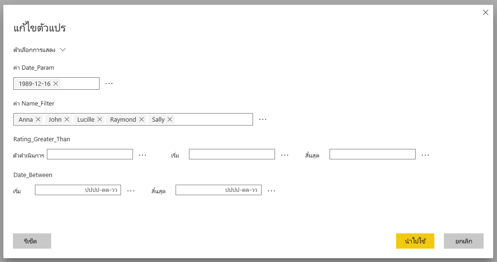
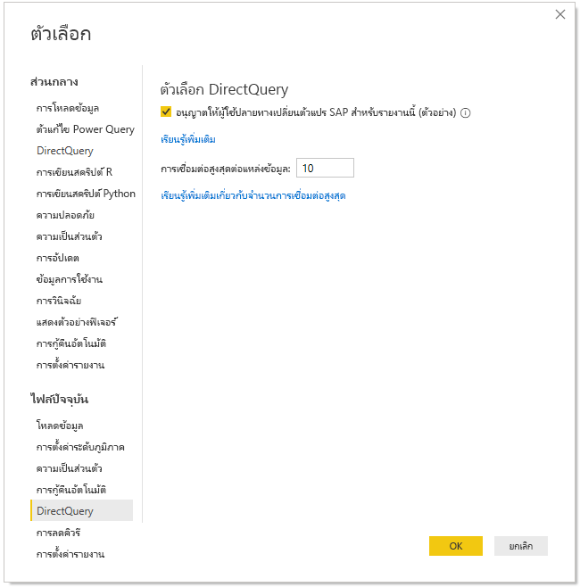
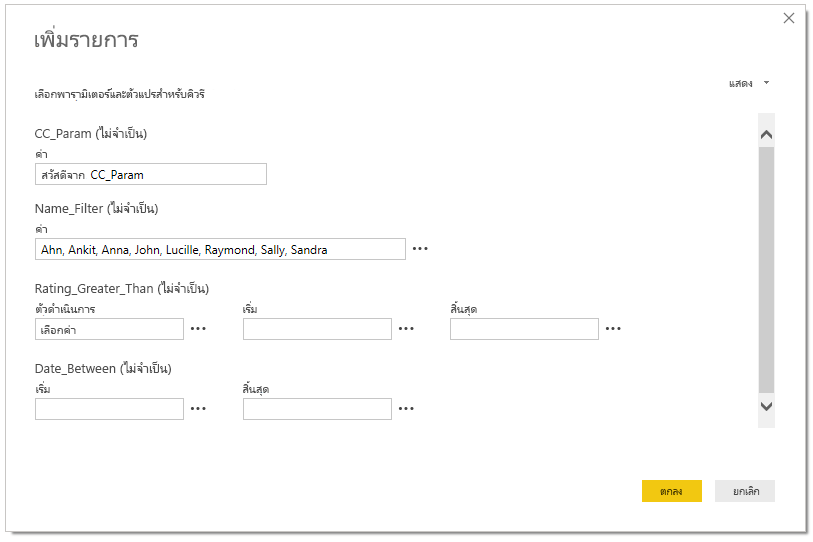
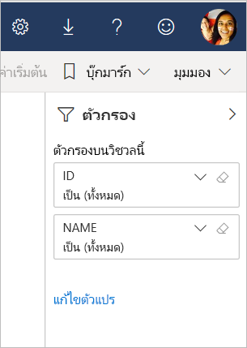

# แก้ไขตัวแปร SAP ในบริการของ Power BI (ตัวอย่าง)

เมื่อใช้งาน SAP Business Warehouse หรือ SAP HANA ด้วย DirectQuery ปัจจุบันผู้เขียนรายงานสามารถอนุญาตให้ผู้ใช้ปลายทางแก้ไขตัวแปร SAP ใน **บริการของ Power BI** สำหรับพื้นที่ทำงานพรีเมียม

เอกสารนี้อธิบายถึงข้อกำหนดสำหรับการแก้ไขตัวแปรใน Power BI วิธีการเปิดใช้งานคุณลักษณะการแสดงตัวอย่างนี้และตำแหน่งที่จะแก้ไขตัวแปรในบริการของ Power BI

## ข้อกำหนดสำหรับตัวแปรแก้ไข SAP

มีข้อกำหนดบางอย่างสำหรับการใช้คุณลักษณะตัวแปรแก้ไขของ SAP รายการต่อไปนี้แสดงข้อกำหนดเหล่านี้

**จำเป็นต้องมีประสบการณ์การใช้งานตัวกรองใหม่** – คุณต้องมี[ประสบการณ์ตัวกรองใหม่](power-bi-report-filter.md)ที่เปิดใช้งานสำหรับรายงานของคุณ นี่คือวิธีที่คุณสามารถเปิดใช้งานสำหรับรายงานของคุณใน Power BI Desktop:
- ใน Power BI Desktop เลือกตัวเลือก **ไฟล์** > **และตัวเลือก** > **การตั้งค่า**
- ในแถบนำทางด้านซ้าย ภายใต้ **แฟ้มปัจจุบัน** เลือก **ตั้งค่ารายงาน**
- ภายใต้**ประสบการณ์การกรอง** ให้เลือก**เปิดใช้งานบานหน้าต่างตัวกรองที่อัปเดตแล้ว**

**จำเป็นต้องมีการเชื่อมต่อ DirectQuery** – คุณต้องเชื่อมต่อกับแหล่งข้อมูล SAP โดยใช้ DirectQuery การเชื่อมต่อการนำเข้าไม่ได้รับการสนับสนุน

**จำเป็นต้องมีการสมัครใช้งาน Power BI Premium** – คุณลักษณะตัวแปรแก้ไข SAP ในขณะนี้ใช้ได้เฉพาะในการสมัครใช้งาน Power BI Premium เท่านั้น

**จำเป็นต้องตั้งค่า SSO** – เพื่อให้คุณลักษณะนี้ใช้งานได้ ต้องกำหนดค่าการลงชื่อเข้าระบบครั้งเดียว (SSO) ดู[ภาพรวมของการลงชื่อเข้าใช้ครั้งเดียว (SSO)](service-gateway-sso-overview.md) สำหรับข้อมูลเพิ่มเติม

**จำเป็นต้องมีเกตเวย์บิตใหม่** - ดาวน์โหลดเกตเวย์ล่าสุดและอัปเดตเกตเวย์ที่มีอยู่ของคุณ ดู[เกตเวย์บริการ](service-gateway-onprem.md)สำหรับข้อมูลเพิ่มเติม

**หลายมิติสำหรับ SAP HANA เท่านั้น** - สำหรับ SAP HANA, คุณสมบัติตัวแปรแก้ไข SAP จะทำงานร่วมกับแบบจำลองหลายมิติเท่านั้นและไม่ทำงานกับแหล่งข้อมูลเชิงสัมพันธ์

**ไม่ได้รับการสนับสนุนในบริการคลาวด์สาธารณะ** – ขณะนี้ Power Query ออนไลน์ไม่สามารถใช้งานได้ในบริการคลาวด์สาธารณะ ดังนั้นคุณลักษณะนี้ยังไม่ได้รับการสนับสนุนในบริการคลาวด์สาธารณะ

## วิธีการเปิดใช้งานคุณลักษณะ

เมื่อต้องการเปิดใช้งานคุณลักษณะ**ตัวแปรแก้ไข SAP** ใน Power BI Desktop เชื่อมต่อกับแหล่งข้อมูล SAP HANA หรือ SAP BW จากนั้นไปที่**ไฟล์ > ตัวเลือกและการตั้งค่า > ตัวเลือก** จากนั้นในส่วนไฟล์ปัจจุบันในบานหน้าต่างด้านซ้าย ให้เลือก **DirectQuery** เมื่อคุณเลือกนั้น ในบานหน้าต่างด้านขวาคุณจะเห็นตัวเลือก DirectQuery และกล่องกาเครื่องหมายที่คุณสามารถ**อนุญาตให้ผู้ใช้สามารถเปลี่ยนแปลงตัวแปร SAP ในรายงาน (ตัวอย่าง)** ดังที่แสดงในรูปต่อไปนี้

## ใช้ตัวแปรแก้ไข SAP ใน Power BI Desktop

เมื่อใช้ตัวแปรแก้ไข SAP ใน Power BI Desktop คุณสามารถแก้ไขตัวแปรได้โดยการเลือกลิงก์แก้ไขตัวแปรจากเมนู**แก้ไขคิวรี** ในริบบอน จากที่นี่ หน้าต่างกล่องโต้ตอบต่อไปนี้ปรากฏขึ้น คุณลักษณะนี้มีให้ใช้งานใน Power BI Desktop ชั่วขณะ ผู้สร้างรายงานสามารถเลือกตัวแปรสำหรับรายงานโดยใช้กล่องโต้ตอบต่อไปนี้

## ใช้ตัวแปรแก้ไข SAP ในบริการ

เมื่อรายงานถูกเผยแพร่ไปยังบริการของ Power BI ผู้ใช้สามารถดูลิงก์**แก้ไขตัวแปร**ในบานหน้าต่างตัวกรองใหม่ ถ้าคุณกำลังเผยแพร่รายงานเป็นครั้งแรก อาจใช้เวลาสูงสุด 5 นาทีก่อนที่ลิงก์แก้ไขตัวแปรจะปรากฏขึ้น ถ้าลิงก์ไม่ปรากฏขึ้น คุณจะต้องรีเฟรชชุดข้อมูลด้วยตนเอง
คุณสามารถทำได้โดย:

1. ในบริการของ Power BI ให้เลือกแท็บ**ชุดข้อมูล**ในรายการเนื้อหาสำหรับพื้นที่ทำงาน

2. ค้นหาชุดข้อมูลที่คุณจำเป็นต้องรีเฟรชและเลือกไอคอน**รีเฟรช**

    

3. การเลือกลิงก์แก้ไขตัวแปรจะเปิดกล่องโต้ตอบ**แก้ไขตัวแปร** ซึ่งผู้ใช้สามารถแทนที่ตัวแปรได้ การเลือกปุ่ม**รีเซ็ต**จะรีเซ็ตตัวแปรเป็นค่าเดิมที่ปรากฏขึ้นเมื่อเปิดกล่องโต้ตอบนี้

    

4. การเปลี่ยนแปลงใดๆ ในกล่องโต้ตอบ**แก้ไขตัวแปร** ยังคงอยู่เฉพาะสำหรับผู้ใช้รายนี้เท่านั้น (คล้ายกับลักษณะการทำงานที่มีอยู่อื่นๆ ใน Power BI) การเลือก**รีเซ็ตเป็นค่าเริ่มต้น** ที่แสดงในรูปต่อไปนี้จะรีเซ็ตค่ารายงานให้เป็นสถานะเดิมของผู้สร้างรายงาน รวมถึงตัวแปร

    

เมื่อทำงานกับรายงานที่เผยแพร่ในบริการของ Power BI ที่ใช้ SAP Hana หรือ SAP BW ด้วยคุณลักษณะ**แก้ไขตัวแปร** ที่เปิดใช้งาน เจ้าของรายงานสามารถเปลี่ยนค่าเริ่มต้นเหล่านั้นได้ เจ้าของรายงานสามารถเปลี่ยนตัวแปรในโหมดแก้ไขและบันทึกรายงานเพื่อเปิดใช้งานการตั้งค่าเหล่านั้นเพื่อให้กลายเป็น*การตั้งค่าเริ่มต้นใหม่*สำหรับรายงานนั้น ผู้ใช้รายอื่นที่เข้าถึงรายงานหลังจากมีการเปลี่ยนแปลงโดยเจ้าของรายงานจะเห็นการตั้งค่าใหม่เหล่านั้นเป็นค่าเริ่มต้น

## ปัญหาและข้อควรพิจารณา

ในขณะนี้ คุณลักษณะตัวแปรแก้ไขของ SAP ไม่ได้รับการสนับสนุนในแอป

## ขั้นตอนถัดไป

สำหรับข้อมูลเพิ่มเติมเกี่ยวกับ SAP HANA, SAP BW หรือ DirectQuery กรุณาอ่านบทความต่อไปนี้:

- [ใช้ SAP HANA ใน Power BI Desktop](desktop-sap-hana.md)
- [DirectQuery และ SAP Business Warehouse (BW)](desktop-directquery-sap-bw.md)
- [DirectQuery และ SAP HANA](desktop-directquery-sap-hana.md)
- [การใช้ DirectQuery ใน Power BI](desktop-directquery-about.md)