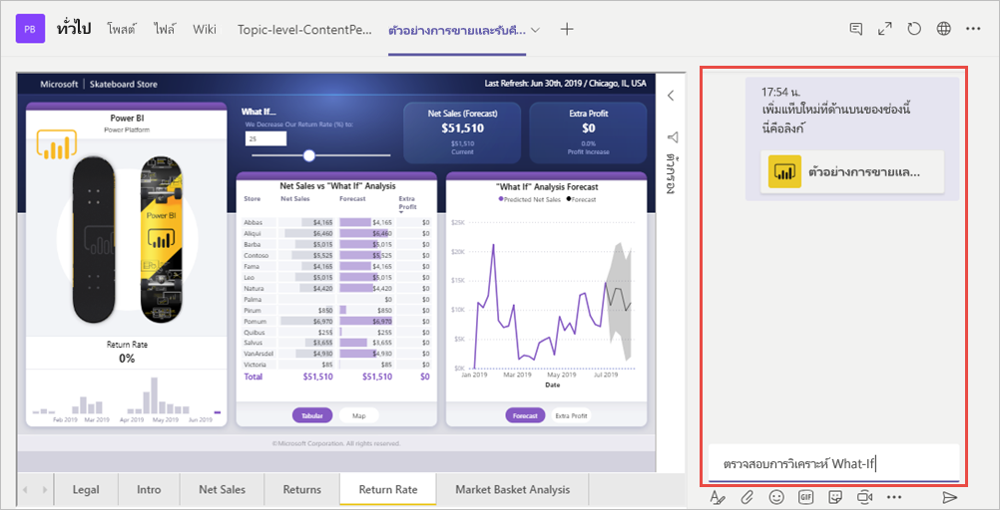

# รายงานที่ฝังใน Microsoft Teams ด้วยแท็บ Power BI

ด้วยแท็บ Power BI ที่อัปเดตใหม่สำหรับ Microsoft Teams คุณสามารถฝังรายงานแบบโต้ตอบในแชนเนลและแชทของ Microsoft Teams ได้อย่างง่ายดาย ใช้แท็บ Power BI สำหรับ Microsoft Teams เพื่อช่วยเพื่อนร่วมงานของคุณค้นหาข้อมูลที่ทีมของคุณใช้และเพื่อพูดคุยเกี่ยวกับข้อมูลภายในแชนเนลของทีมคุณ  เมื่อคุณวางลิงก์ไปยังรายงาน แดชบอร์ด และแอปของคุณลงในกล่องข้อความ Microsoft Teams การแสดงตัวอย่างลิงก์จะแสดงข้อมูลเกี่ยวกับรายการเหล่านั้น ผู้ใช้ของคุณสามารถทำความเข้าใจรายการที่ลิงก์นำไปใช้ได้ง่ายขึ้น

## ข้อกำหนด

เพื่อทำให้**แท็บ Power BI สำหรับ Microsoft Teams** ทำงาน ตรวจสอบให้แน่ใจว่า:

- ผู้ใช้ของคุณสิทธิ์การใช้งาน Power BI Pro หรือรายงานที่มีอยู่ในความจุ [Power BI Premium (EM หรือ P SKU)](service-premium-what-is.md) พร้อมสิทธิ์การใช้งาน Power BI
- Microsoft Teams มีแท็บ Power BI
- ผู้ใช้ได้ลงชื่อเข้าใช้ในบริการของ Power BI เพื่อเปิดใช้สิทธิ์การใช้งาน Power BI ของตนสำหรับการใช้รายงาน
- ผู้ใช้ต้องมีสิทธิ์ในการดูรายงาน

นอกจากนี้ เพื่อทำให้**การแสดงตัวอย่างลิงก์** ให้แน่ใจว่า:
- ผู้ใช้จะต้องเป็นไปตามข้อกำหนดในการใช้แท็บ Power BI สำหรับ Microsoft Teams
- ผู้ใช้ได้ลงชื่อเข้าในบริการของ Power BI Bot 

## ฝังรายงานของคุณ

ทำตามขั้นตอนเหล่านี้เพื่อฝังรายงานของคุณลงในแชนเนลหรือแชทของ Microsoft Teams

1. เปิดแชนเนลหรือแชทใน Microsoft Teams และเลือกไอคอน **+**

    

2. เลือกแท็บ Power BI

    

3. ใช้ตัวเลือกที่ให้มาเพื่อเลือกรายงานจากพื้นที่ทำงาน ที่แชร์กับฉัน หรือแอป Power BI

    

4. ชื่อแท็บจะได้รับการอัปเดตโดยอัตโนมัติเพื่อให้ตรงกับชื่อของชื่อรายงาน แต่คุณสามารถเปลี่ยนแปลงค่าได้ 

5. กด **บันทึก**

## รายงานที่รองรับสำหรับการฝังแท็บ Power BI
คุณสามารถฝังรายงานประเภทต่อไปนี้บนแท็บ Power BI:

- รายงานแบบโต้ตอบและรายงานที่มีการแบ่งหน้า
- รายงานในพื้นที่ทำงานของฉัน ประสบการณ์พื้นที่ทำงานใหม่ และพื้นที่ทำงานแบบคลาสสิก
- รายงานในแอป Power BI

## รับตัวอย่างลิงก์

ทำตามขั้นตอนเหล่านี้เพื่อรับการแสดงตัวอย่างลิงก์สำหรับเนื้อหาในบริการของ Power BI

1. คัดลอกลิงก์ไปยังรายงาน แดชบอร์ด หรือแอปในบริการของ Power BI ตัวอย่างเช่น คัดลอกลิงก์จากแถบที่อยู่เบราว์เซอร์

2. วางลิงก์ไปยังกล่องข้อความของ Microsoft Teams ลงชื่อเข้าใช้บริการการแสดงตัวอย่างลิงก์ถ้าได้รับพร้อมท์ คุณอาจต้องรอสองสามวินาทีในการโหลดการแสดงตัวอย่างลิงก์

    

3. การแสดงตัวอย่างลิงก์เบื้องต้นจะแสดงขึ้นมาหลังจากลงชื่อเข้าใช้เรียบร้อยแล้ว

    

4. เลือกไอคอนขยายเพื่อแสดงการ์ดแสดงตัวอย่างแบบผสม

    

5. การ์ดแสดงตัวอย่างลิงก์แบบผสมจะแสดงลิงก์และปุ่มการดำเนินการที่เกี่ยวข้อง

    

6. ส่งข้อความ

## อนุญาตการเข้าถึงรายงาน

การฝังรายงานใน Microsoft Teams หรือการส่งลิงก์ไปยังรายการไม่ให้สิทธิ์ผู้ใช้ในการดูรายงานโดยอัตโนมัติ คุณต้อง [อนุญาตให้ผู้ใช้ดูรายงานใน Power BI](service-share-dashboards.md) คุณสามารถใช้กลุ่ม Office 365 สำหรับทีมของคุณเพื่อทำให้ง่ายขึ้น 

> [!IMPORTANT]
> ให้ตรวจสอบให้แน่ใจว่าว่าใครสามารถดูรายงานภายใน Power BI service และอนุญาตให้เข้าถึงสิ่งที่ไม่ได้อยู่ในรายการ

วิธีหนึ่งในการตรวจสอบให้แน่ใจว่าทุกคนในทีมของคุณมีสิทธิ์เข้าถึงรายงาน คือการวางรายงานเหล่านั้นไว้ในพื้นที่ทำงานแบบเดียวใน Power BI และให้ Office 365 Group แก่ทีมของคุณเข้าถึงพื้นที่ทำงาน

## การแสดงตัวอย่างลิงก์ 

การแสดงตัวอย่างลิงก์มีไว้สำหรับรายการต่อไปนี้ใน Power BI:
- รายงาน
- แดชบอร์ด
- แอป

บริการการแสดงตัวอย่างลิงก์ต้องการให้ผู้ใช้ของคุณลงชื่อเข้าใช้ หากต้องการลงชื่อออก ให้เลือกไอคอน Power BI ที่ด้านล่างของกล่องข้อความจากนั้นเลือกลงชื่อออก

## เริ่มการสนทนา

เมื่อคุณเพิ่มแท็บรายงาน Power BI ไปยัง Teams แล้ว Teams จะสร้างการสนทนาแบบแท็บโดยอัตโนมัติสำหรับรายงาน 

- เลือก **แสดงการสนทนาแบบแท็บ** ในมุมบนขวา

    

    ข้อคิดเห็นแรกคือการเชื่อมโยงไปยังรายงาน ทุกคนในช่องของ Teams นั้นสามารถดูและพูดคุยเกี่ยวกับรายงานในการสนทนาได้

    

## ปัญหาและขีดจำกัดที่ทราบแล้ว

- Power BI ไม่รองรับภาษาที่แปลเป็นภาษาท้องถิ่นเช่นเดียวกับที่ Microsoft Teams รองรับ ผลที่ได้คือคุณอาจไม่เห็นการแปลที่เหมาะสมภายในรายงานแบบฝังตัว
- คุณไม่สามารถฝังแดชบอร์ด Power BI ในแท็บ Power BI สำหรับ Microsoft Teams ได้
- ผู้ใช้ที่ไม่มีสิทธิ์การใช้งาน Power BI หรือสิทธิ์การใช้งานในรายงานจะเห็นข้อความ "เนื้อหาไม่พร้อมใช้งาน"
- คุณอาจมีปัญหาถ้าใช้ Internet Explorer 10 <!--You can look at the [browsers support for Power BI](consumer/end-user-browsers.md) and for [Office 365](https://products.office.com/office-system-requirements#Browsers-section). -->
- ไม่รองรับ [ตัวกรอง URL](service-url-filters.md) ด้วยแท็บ Power BI สำหรับ Microsoft Teams
- ในระบบคลาวด์ภายในประเทศ แท็บ Power BI ใหม่ไม่พร้อมใช้งาน รุ่นที่เก่ากว่าอาจพร้อมใช้งานที่ไม่รองรับพื้นที่ทำงานใหม่ พื้นที่ทำงานที่เคยทำ หรือรายงานในแอป Power BI 
- หลังจากที่คุณบันทึกแท็บแล้ว คุณจะไม่สามารถเปลี่ยนชื่อแท็บผ่านการตั้งค่าแท็บได้ ใช้ตัวเลือกเปลี่ยนชื่อเพื่อดำเนินการเปลี่ยนชื่อ
- การลงชื่อเข้าระบบครั้งเดียวไม่ได้รับการรองรับสำหรับบริการการแสดงตัวอย่างลิงก์
- การแสดงตัวอย่างลิงก์ไม่ทำงานในแชทการประชุมหรือแชนเนลส่วนตัว

## ขั้นตอนถัดไป
- [แชร์แดชบอร์ดกับเพื่อนร่วมงานและคนอื่นๆ](service-share-dashboards.md)  
- [สร้างและกระจายแอปฯใน Power BI](service-create-distribute-apps.md)  
- [Power BI Premium คืออะไร?](service-premium-what-is.md)

มีคำถามเพิ่มเติมหรือไม่ [ลองถามชุมชน Power BI](https://community.powerbi.com/)
