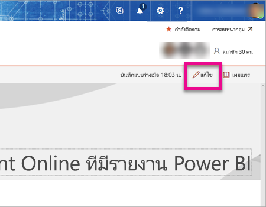
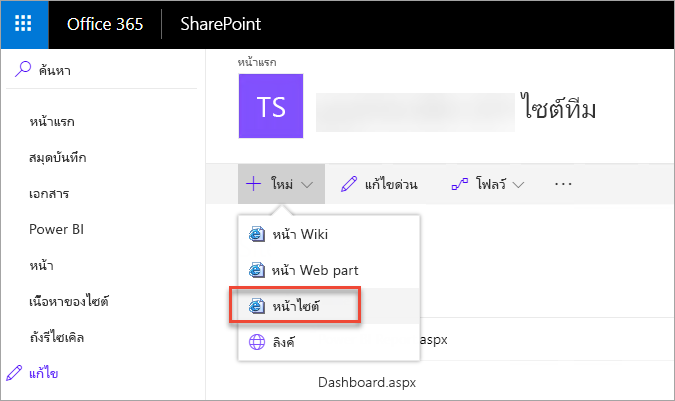
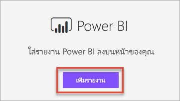
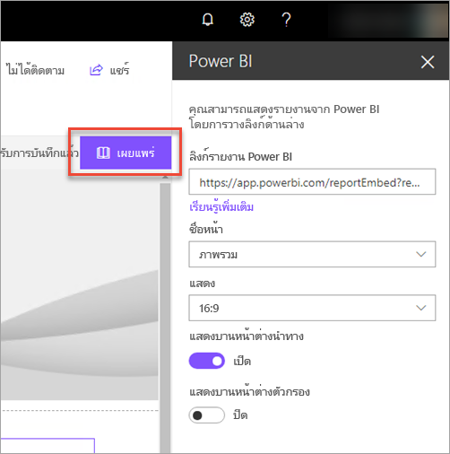
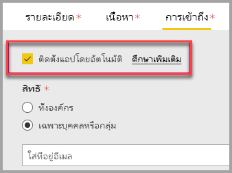
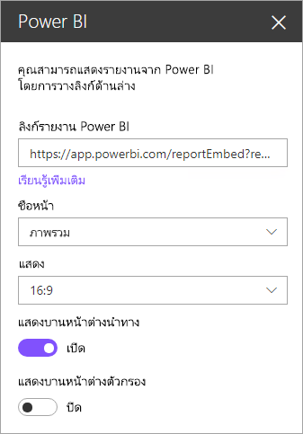
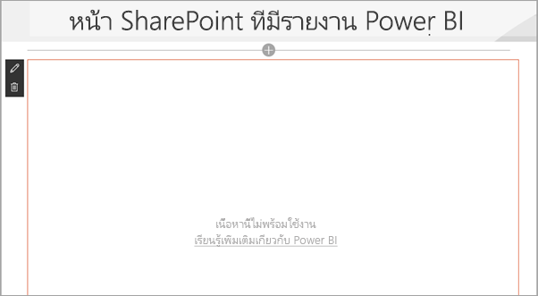

# ฝังส่วนเว็บรายงานใน SharePoint Online

ด้วยส่วยรายงานเว็บ Power BI ใหม่ สำหรับ SharePoint Online คุณสามารถฝังรายงาน Power BI แบบโต้ตอบได้อย่างง่ายดายในหน้า SharePoint Online

เมื่อใช้ตัวเลือก**การฝังใน SharePoint Online** รายงานที่ฝังตัวนั้นมีความปลอดภัยทั้งหมด ดังนั้นคุณจะสามารถสร้างพอร์ทัลความปลอดภัยภายในได้อย่างง่ายดาย

## ข้อกำหนด

สำหรับรายงาน**ที่ฝังใน SharePoint Online**เพื่อทำงาน ต้องมี:

* สิทธิการใช้งาน Power BI Pro หรือความจุ [Power BI Premium (EM หรือ P SKU)](service-premium-what-is.md) พร้อมสิทธิการใช้งาน Power BI
* Power BI web part สำหรับ SharePoint Online จำเป็นต้องใช้[หน้าที่ทันสมัย](https://support.office.com/article/Allow-or-prevent-creation-of-modern-site-pages-by-end-users-c41d9cc8-c5c0-46b4-8b87-ea66abc6e63b)
* ในการใช้รายงานแบบฝัง ผู้ใช้ต้องลงชื่อเข้าใช้ในบริการของ Power BI เพื่อเปิดใช้สิทธิ์การใช้งาน Power BI ของพวกเขา

## ฝังรายงานของคุณ
ในการฝังรายงานของคุณลงใน SharePoint Online คุณจะต้องได้รับ URL ของรายงานและใช้กับ Web Part ของ Power BI ของ SharePoint Online

### รับ URL ของรายงาน

1. ภายใน Power BI ดูรายงาน

2. บนเมนูดรอปดาวน์ **ตัวเลือกเพิ่มเติม (...)** เลือก **ฝัง** > **SharePoint Online**

    

3. คัดลอก URL ของรายงานจากกล่องโต้ตอบ

    

### เพิ่มรายงาน Power BI ลงในหน้า SharePoint Online

1. เปิดหน้าเป้าหมายใน SharePoint Online และเลือก**แก้ไข**

    

    หรือสร้างไซต์ที่ทันสมัยใหม่โดยการเลือก **+ ใหม่**ภายใน SharePoint Online

    

2. เลือกรายงานดรอปดาวน์ **+** แล้วเลือก Web Part ของ **Power BI**

    

3. เลือก**เพิ่มรายงาน**

      

4. วาง URL ของรายงานที่คัดลอกก่อนหน้านี้ไว้ที่บานหน้าต่าง **ลิงก์รายงาน Power BI** รายงานโหลดโดยอัตโนมัติ

    

5. เลือก**เผยแพร่**เพื่อทำการเปลี่ยนแปลงการมองเห็นให้ผู้ใช้ SharePoint Online ของคุณ

    

## อนุญาตการเข้าถึงรายงาน

การฝังรายงานใน SharePoint Online ไม่ให้สิทธิผู้ใช้ในการดูรายงานโดยอัตโนมัติ คุณต้องตั้งค่าสิทธิการดูใน Power BI

> [!IMPORTANT]
> ให้ตรวจสอบให้แน่ใจว่าว่าใครสามารถดูรายงานภายใน Power BI service และอนุญาตให้เข้าถึงสิ่งที่ไม่ได้อยู่ในรายการ

มีสองวิธีที่ให้สิทธิการเข้าถึงรายงานใน Power BI วิธีแรก ถ้าคุณกำลังใช้กลุ่ม Office 365 เพื่อสร้างไซต์ทีม SharePoint Online ของคุณ แสดงว่าคุณได้สร้างรายการผู้ใช้ในฐานะสมาชิกของ **พื้นที่ทำงานภายในบริการของ Power BI** และ **หน้า SharePoint** สำหรับข้อมูลเพิ่มเติม ดูวิธีการ[จัดการพื้นที่ทำงาน](service-manage-app-workspace-in-power-bi-and-office-365.md)

วิธีสองคือการฝังรายงานภายในแอป และแชร์โดยตรงกับผู้ใช้:  

1. ผู้เขียนซึ่งต้องเป็นผู้ใช้ระดับ Pro จะสร้างรายงานในพื้นที่ทำงาน หากต้องการแชร์กับ*ผู้ใช้ฟรีของ Power BI* ให้ตั้งค่าพื้นที่ทำงานเป็น *พื้นที่ทำงานแบบพรีเมียม*

2. ผู้เขียนจะเผยแพร่แอป จากนั้นจะติดตั้งแอป ผู้เขียนต้องติดตั้งแอปเพื่อให้แอปเข้าถึง URL ของรายงานที่ใช้สำหรับการฝังใน SharePoint Online

3. ในขั้นนี้ ผู้ใช้ทั้งหมดจำเป็นต้องติดตั้งแอปเช่นเดียวกัน คุณยังสามารถใช้คุณลักษณะ **ติดตั้งแอปโดยอัตโนมัติ** ซึ่งสามารถเปิดใช้งานได้ใน [พอร์ทัลผู้ดูแลระบบ Power BI](service-admin-portal.md) เพื่อให้แอปติดตั้งล่วงหน้าสำหรับผู้ใช้ปลายทาง

   

4. ผู้เขียนเปิดแอปและไปยังรายงาน

5. ผู้เขียนคัดลอก URL ของรายงานแบบฝังตัวจากรายงานที่แอปติดตั้ง อย่าใช้ URL ของรายงานต้นฉบับจากพื้นที่ทำงาน

6. สร้างไซต์ทีมใหม่ใน SharePoint Online

7. เพิ่ม URL ของรายงานที่คัดลอกก่อนนี้ใน Web Part ของ Power BI

8. เพิ่มผู้ใช้ปลายทางและ/หรือกลุ่มทั้งหมดที่จะใช้ข้อมูลบนหน้า SharePoint Online และในแอป Power BI ที่คุณสร้างขึ้น

    > [!NOTE]
    > **ผู้ใช้หรือกลุ่มจำเป็นต้องเข้าถึงทั้งหน้า SharePoint Online และรายงานในแอป Power BI เพื่อดูรายงานบนหน้า SharePoint**

ในตอนนี้ ผู้ใช้ปลายทางสามารถไปยังไซต์ทีมใน SharePoint Online และดูรายงานบนหน้าได้แล้ว

## การรับรองตัวตนแบบหลายปัจจัย

ถ้าสภาพแวดล้อม Power BI ของคุณทำให้คุณต้องลงชื่อเข้าใช้ด้วยการใช้การรับรองความถูกต้องแบบหลายปัจจัย คุณอาจถูกขอให้ลงชื่อเข้าใช้ด้วยอุปกรณ์ความปลอดภัยเพื่อยืนยันข้อมูลประจำตัวของคุณ ซึ่งเกิดขึ้นถ้าคุณไม่ได้ไม่ลงชื่อเข้าใช้ SharePoint Online โดยใช้การรับรองความถูกต้องแบบหลายปัจจัยแต่สภาพแวดล้อม Power BI ของคุณ กำหนดให้อุปกรณ์ความปลอดภัยตรวจสอบบัญชีผู้ใช้

> [!NOTE]
> Power BI ยังไม่สนับสนุนการรับรองความถูกต้องโดยใช้หลายปัจจัยด้วย Azure Active Directory 2.0 - ผู้ใช้จะเห็นข้อความแสดงข้อผิดพลาด ถ้าผู้ใช้ลงชื่อเข้าใช้ SharePoint Online อีกครั้งโดยใช้อุปกรณ์ความปลอดภัยของพวกเขา พวกเขาอาจสามารถดูรายงานได้

## ตั้งค่า web part

ด้านล่างคือการตั้งค่าที่คุณสามารถปรับเปลี่ยนสำหรับ Web Part ของ Power BI สำหรับ SharePoint Online

| คุณสมบัติ | คำอธิบาย |
| --- | --- |
| ชื่อหน้า |ตั้งค่าหน้าเริ่มต้นของ Web Part เลือกค่าจากรายการแบบดรอปดาวน์ ถ้าไม่มีการแสดงหน้า รายงานของคุณมีหน้าหนึ่ง หรือ URL ที่คุณวางมีชื่อหน้า ลบส่วนของรายงานจาก URL เมื่อต้องเลือกหน้าใดหน้าหนึ่ง |
| แสดง |ปรับวิธีการจัดรายงานให้พอดีกับหน้า SharePoint Online |
| แสดงบานหน้าต่างนำทาง |แสดงหรือซ่อนบานหน้าหน้าต่างนำทาง |
| แสดงบานหน้าต่างตัวกรอง |แสดงหรือซ่อนบานหน้าต่างตัวกรอง |

## รายงานที่โหลดไม่ได้

หากรายงานของคุณอาจไม่โหลดภายใน Web Part ของ Power BI คุณอาจแสดงข้อความแสดงข้อผิดพลาดต่อไปนี้

มีเหตุผลโดยทั่วไปสำหรับข้อความนี้สองตัว

1. คุณไม่มีสิทธิเข้าถึงรายงาน
2. รายงานถูกลบ

ติดต่อกับเจ้าของหน้า SharePoint Online เพื่อช่วยแก้ไขปัญหาได้

## สิทธิ์การใช้งาน

การที่ผู้ใช้ดูรายงานใน SharePoint ต้องมี**ใบอนุญาตใช้งาน Power BI Pro** หรือไม่เช่นนั้นเนื้อหาต้องอยู่ในพื้นที่ทำงานที่อยู่ใน **[ความจุพรีเมียมของ Power BI (EM หรือ P SKU)](service-admin-premium-purchase.md)**

## ปัญหาและขีดจำกัดที่ทราบแล้ว

* ข้อผิดพลาด: "เกิดข้อผิดพลาด โปรดลองออกจากระบบ และย้อนกลับมา แล้วเข้ามาเยี่ยมชมหน้านี้อีกครั้ง ID สหสัมพันธ์: ไม่ได้กำหนด http สถานะการตอบสนอง: 400 รหัสผิดพลาดของเซิร์ฟเวอร์ 10001 ข้อความ: รีเฟรชโทเค็นหายไป
  
  ถ้าคุณได้รับข้อผิดพลาดนี้ โปรดทำตามขั้นตอนการแก้ปัญหาขั้นตอนใดขั้นตอนหนึ่งด้านล่าง
  
  1. ลงชื่อออกจาก SharePoint และลงชื่อกลับเข้าใช้ ตรวจสอบให้แน่ใจว่าปิดหน้าต่างเบราว์เซอร์ทั้งหมดก่อนที่ลงชื่อกลับเข้าใช้

  2. ถ้าบัญชีผู้ใช้ของคุณจำเป็นต้องใช้การรับรองความถูกต้องโดยใช้หลายปัจจัย (MFA) ให้ลงชื่อเข้าใช้ SharePoint โดยใช้อุปกรณ์ MFA (แอปโทรศัพท์ สมาร์ทการ์ด และอื่น ๆ)
  
  3. บัญชีผู้ใช้ Azure B2B Guest ไม่ได้รับการสนับสนุน ผู้ใช้เห็นโลโก้ Power BI ที่แสดงส่วนที่กำลังโหลด แต่ไม่ได้แสดงรายงาน

* Power BI ไม่รองรับภาษาเดียวกับที่ SharePoint Online รองรับ ผลที่ได้คือคุณอาจไม่เห็นการแปลที่เหมาะสมภายในรายงานแบบฝังตัว

* คุณอาจพบปัญหาถ้าใช้ Internet Explorer 10 <!--You can look at the [browsers support for Power BI](consumer/end-user-browsers.md) and for [Office 365](https://products.office.com/office-system-requirements#Browsers-section). -->

* Web part Power BI จะไม่พร้อมใช้งานสำหรับ [ระบบคลาวด์แห่งชาติ](https://powerbi.microsoft.com/clouds/)

* SharePoint Server แบบคลาสสิกไม่ได้รับการสนับสนุนด้วย web part นี้

* [ตัวกรอง URL](service-url-filters.md) จะไม่ได้รับการสนับสนุนด้วย SPO web part

## ขั้นตอนถัดไป

* [อนุญาตหรือป้องกันไม่ให้สร้างไซต์แบบสมัยใหม่โดยผู้ใช้ปลายทาง](https://support.office.com/article/Allow-or-prevent-creation-of-modern-site-pages-by-end-users-c41d9cc8-c5c0-46b4-8b87-ea66abc6e63b)  
* [สร้างและกระจายแอปฯใน Power BI](service-create-distribute-apps.md)  
* [แชร์แดชบอร์ดกับเพื่อนร่วมงานและคนอื่นๆ](service-share-dashboards.md)  
* [Power BI Premium คืออะไร?](service-premium-what-is.md)
* [ฝังรายงานในพอร์ทัลความปลอดภัยหรือเว็บไซต์](service-embed-secure.md)

มีคำถามเพิ่มเติมหรือไม่ [ลองถามชุมชน Power BI](https://community.powerbi.com/)
