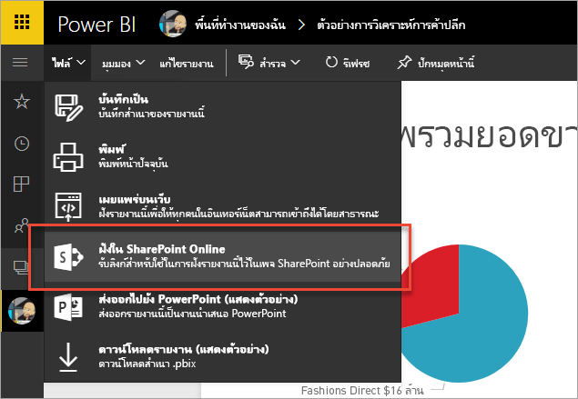

# ฝังด้วยส่วนเว็บรายงานใน SharePoint Online

ด้วยส่วยรายงานเว็บ Power BI ใหม่ สำหรับ SharePoint Online คุณสามารถฝังรายงาน Power BI แบบโต้ตอบได้อย่างง่ายดายในหน้า SharePoint Online

เมื่อใช้ตัวเลือกใหม่**ฝังใน SharePoint Online** รายงานที่ฝังตัวนั้นมีความปลอดภัยโดยทั้งหมด ดังนั้นคุณจะสามารถสร้างพอร์ทัลความปลอดภัยภายใน

## ข้อกำหนด

มีความต้องการบางตัวสำหรับรายงานที่**ฝังใน SharePoint Online**เพื่อทำงาน

* คุณต้องมีสิทธิ์การใช้งาน Power BI Pro หรือความจุ [Power BI Premium (EM หรือ P SKU)](service-premium.md#premium-capacity-nodes) พร้อมสิทธิ์การใช้งาน Power BI
* Power BI web part สำหรับ SharePoint Online จำเป็นต้องใช้[หน้าที่ทันสมัย](https://support.office.com/article/Allow-or-prevent-creation-of-modern-site-pages-by-end-users-c41d9cc8-c5c0-46b4-8b87-ea66abc6e63b)

## ฝังรายงานของคุณ

เมื่อต้องฝังรายงานของคุณลงใน SharePoint Online ก่อนอื่นคุณต้องรับ URL สำหรับรายงาน และจากนั้น ใช้ URL นั้นกับส่วน web ใหม่ของ Power BI ภายใน SharePoint Online

### รับ URL ลงในรายงานของคุณ

1. ภายใน Power BI service

2. เลือกเมนู**แฟ้ม**

3. เลือก**ฝังใน SharePoint Online**

    

4. คัดลอก URL จากกล่องโต้ตอบ

    

### เพิ่มรายงาน Power BI ลงในหน้า SharePoint Online

1. เปิดหน้าที่ต้องการใน SharePoint Online และเลือก**แก้ไข**

    

    หรือ สร้างไซต์ที่ทันสมัยใหม่ โดยการเลือก **+ ใหม่**ภายใน SharePoint Online

    

2. เลือก **+** และเลือก**Power BI** web part

    

3. เลือก**เพิ่มรายงาน**

    

4. ส่ง URL ของรายงานไปยังบานหน้าต่างคุณสมบัติ URL รายงานนี้คือ URL ที่คุณคัดลอกจากขั้นตอนด้านบน รายงานโหลดโดยอัตโนมัติ

    

5. เลือก**เผยแพร่**เพื่อทำการเปลี่ยนแปลงการมองเห็นให้ผู้ใช้ SharePoint Online ของคุณ

    

## อนุญาตการเข้าถึงรายงาน

ฝังรายงานใน SharePoint Online ไม่ให้ผู้ใช้สิทธิ์ในการดูรายงานโดยอัตโนมัติ สิทธิ์ในการดูรายงานถูกตั้งค่าใน Power BI service

> [!IMPORTANT]
> ให้ตรวจสอบให้แน่ใจว่าว่าใครสามารถดูรายงานภายใน Power BI service และอนุญาตให้เข้าถึงสิ่งที่ไม่ได้อยู่ในรายการ

มีสองวิธีที่จะเข้าถึงรายงานภายใน Power BI service ถ้าคุณกำลังใช้กลุ่ม Office 365 เพื่อสร้างไซต์ทีม SharePoint Online ของคุณ คุณได้สร้างรายการผู้ใช้ในฐานะสมาชิกของ **พื้นที่ทำงานแอปภายในบริการ Power BI** และ **หน้า SharePoint** สำหรับข้อมูลเพิ่มเติม ดูวิธีการ[จัดการพื้นที่ทำงานแอป](service-manage-app-workspace-in-power-bi-and-office-365.md)

อีกวิธีหนึ่งคือคุณสามารถแชร์รายงานกับผู้ใช้โดยตรงได้ ด้วยการฝังรายงานไว้ในแอป โดยมีขั้นตอนเล็กน้อยสำหรับที่ต้องทำสำหรับการฝังรายงานภายในแอป  

1. ผู้เขียนแอปคือผู้ใช้แบบ Pro

2. ผู้เขียนสร้างรายงานในพื้นที่ทำงานแอป หากต้องการ *แชร์กับ **ผู้ใช้ Power BI** ที่ไม่ต้องเสียค่าธรรมเนียม ให้ตั้งค่าพื้นที่ทำงานแอปเป็น **พื้นที่ทำงาน Premium***

3. ผู้เขียนเผยแพร่แอป จากนั้นติดตั้งแอป *ผู้เขียนจำเป็นต้องตรวจสอบให้แน่ใจว่าได้ติดตั้งแอปเพื่อเข้าถึง URL ของรายงานที่ถูกใช้เพื่อฝังใน SharePoint Online*

4. ในขั้นนี้ ผู้ใช้ทั้งหมดจำเป็นต้องติดตั้งแอปเช่นเดียวกัน อย่างไรก็ตาม คุณสามารถตั้งค่าแอปให้ติดตั้งล่วงหน้าสำหรับผู้ใช้ปลายทาง โดยใช้คุณลักษณะ **ติดตั้งแอปโดยอัตโนมัติ** ซึ่งสามารถเปิดใช้งานได้ใน [พอร์ทัลผู้ดูแลระบบ Power BI](service-admin-portal.md)

   

5. ผู้เขียนเปิดแอปและไปยังรายงาน

6. ผู้เขียนคัดลอก URL ของรายงานแบบฝังตัวจากรายงานที่ติดตั้ง โดยแอป *อย่าใช้ URL ของรายงานต้นฉบับจากพื้นที่ทำงานแอป*

7. สร้างไซต์ทีมใหม่ใน SharePoint Online

8. เพิ่ม URL ของรายงานที่คัดลอกจากขั้นตอนที่ 6 ไปยัง Web Part ของ Power BI

9. เพิ่มผู้ใช้ปลายทางและ/หรือกลุ่มทั้งหมดที่จะใช้ข้อมูลบนหน้า SharePoint Online และในแอป Power BI ที่คุณสร้างขึ้น

    > [!NOTE]
    > **ผู้ใช้หรือกลุ่มจำเป็นต้องเข้าถึงทั้งหน้า SharePoint Online และรายงานในแอป Power BI เพื่อดูรายงานบนหน้า SharePoint**

10. ในตอนนี้ ผู้ใช้ปลายทางสามารถไปยังไซต์ทีมใน SharePoint Online และดูรายงานบนหน้าได้แล้ว

## การรับรองตัวตนแบบหลายปัจจัย

ถ้าสภาพแวดล้อม Power BI ของคุณทำให้คุณต้องลงชื่อเข้าใช้ด้วยการใช้การรับรองความถูกต้องแบบหลายปัจจัย คุณอาจถูกขอให้ลงชื่อเข้าใช้ด้วยอุปกรณ์ความปลอดภัยเพื่อยืนยันข้อมูลประจำตัวของคุณ ซึ่งเกิดขึ้นถ้าคุณไม่ได้ไม่ลงชื่อเข้าใช้ SharePoint Online โดยใช้การรับรองความถูกต้องแบบหลายปัจจัยแต่สภาพแวดล้อม Power BI ของคุณ กำหนดให้ต้องตรวจสอบบัญชีผู้ใช้โดยอุปกรณ์ความปลอดภัย

> [!NOTE]
> การรับรองความถูกต้องโดยใช้หลายปัจจัยยังไม่รองรับ Azure Active Directory 2.0 ผู้ใช้ได้รับข้อความที่แสดง*ข้อผิดพลาด* ถ้าผู้ใช้ลงชื่อเข้าใช้ SharePoint Online อีกครั้งโดยใช้อุปกรณ์ความปลอดภัยของพวกเขา พวกเขาอาจสามารถดูรายงานได้

## ตั้งค่า web part

ด้านล่างเป็นคำอธิบายของการตั้งค่าที่สามารถปรับปรุงของ Power BI web part สำหรับ SharePoint Online

| คุณสมบัติ | คำอธิบาย |
| --- | --- |
| ชื่อหน้า |ตั้งค่าหน้าเริ่มต้นที่แสดง โดย web part เลือกค่าจากรายการแบบดรอปดาวน์ ถ้าไม่มีการแสดงหน้า รายงานของคุณมีหน้าหนึ่ง หรือ URL ที่คุณวางมีชื่อหน้า ลบส่วนของรายงานจาก URL เมื่อต้องเลือกหน้าใดหน้าหนึ่ง |
| แสดง |ตัวเลือกวิธีปรับปรุงรายงานให้พอดีกับหน้า SharePoint Online |
| แสดงบานหน้าต่างนำทาง |แสดงหรือซ่อนบานหน้าหน้าต่างนำทาง |
| แสดงบานหน้าต่างตัวกรอง |แสดงหรือซ่อนบานหน้าต่างตัวกรอง |

## รายงานที่โหลดไม่ได้

รายงานของคุณอาจไม่โหลดภายใน web part ของ Power BI และอาจแสดงข้อความต่อไปนี้

*เนื้อหานี้ไม่พร้อมใช้งาน*

มีเหตุผลโดยทั่วไปสำหรับข้อความนี้สองตัว

1. คุณไม่สามารถเข้าถึงรายงาน
2. รายงานถูกลบ

ติดต่อกับเจ้าของหน้า SharePoint Online เพื่อช่วยให้คุณสามารถแก้ไขปัญหาได้

## สิทธิ์การใช้งาน

การที่ผู้ใช้ดูรายงานใน SharePoint ต้องมี**ใบอนุญาตใช้งาน Power BI Pro** หรือไม่เช่นนั้นเนื้อหาต้องอยู่ในพื้นที่ทำงานที่อยู่ใน **[ความจุพรีเมียมของ Power BI (EM หรือ P SKU)](service-admin-premium-purchase.md)**

## ปัญหาและขีดจำกัดที่ทราบแล้ว

* ข้อผิดพลาด: "เกิดข้อผิดพลาด โปรดลองออกจากระบบ และย้อนกลับมา แล้วเข้ามาเยี่ยมชมหน้านี้อีกครั้ง ID สหสัมพันธ์: ไม่ได้กำหนด http สถานะการตอบสนอง: 400 รหัสผิดพลาดของเซิร์ฟเวอร์ 10001 ข้อความ: รีเฟรชโทเค็นหายไป
  
  ถ้าคุณได้รับข้อผิดพลาดนี้ โปรดทำตามขั้นตอนการแก้ปัญหาขั้นตอนใดขั้นตอนหนึ่งด้านล่าง
  
  1. ลงชื่อออกจาก SharePoint และลงชื่อกลับเข้าใช้ ตรวจสอบให้แน่ใจว่าปิดหน้าต่างเบราว์เซอร์ทั้งหมดก่อนที่ลงชื่อกลับเข้าใช้

  2. ถ้าบัญชีผู้ใช้ของคุณจำเป็นต้องใช้การรับรองความถูกต้องแบบหลายปัจจัย (MFA) ทำให้แน่ใจว่า คุณลงชื่อเข้าใช้ SharePoint โดยใช้อุปกรณ์รับรองความถูกต้องแบบหลายปัจจัยของคุณ (แอปโทรศัพท์ สมาร์ทการ์ด และอื่น ๆ)
  
  3. บัญชีผู้ใช้ Azure B2B Guest ไม่ได้รับการสนับสนุน ผู้ใช้เห็นโลโก้ Power BI ที่แสดงส่วนที่กำลังโหลด แต่ไม่ได้แสดงรายงาน

* Power BI ไม่รองรับภาษาเดียวกับที่ SharePoint Online รองรับ ผลที่ได้คือคุณอาจไม่เห็นการแปลที่เหมาะสมภายในรายงานแบบฝังตัว

* คุณอาจพบปัญหาถ้าใช้ Internet Explorer 10 คุณสามารถค้นหาที่[เบราว์เซอร์ที่รองรับ Power BI](consumer/end-user-browsers.md)และสำหรับ[Office 365](https://products.office.com/office-system-requirements#Browsers-section)ได้

* Web part Power BI จะไม่พร้อมใช้งานใน [sovereign cloud](https://powerbi.microsoft.com/clouds/)

* SharePoint Server แบบคลาสสิกไม่ได้รับการสนับสนุนด้วย web part นี้

* [ตัวกรอง URL](service-url-filters.md) จะไม่ได้รับการสนับสนุนด้วย SPO web part

## ขั้นตอนถัดไป

* [อนุญาตหรือป้องกันไม่ให้สร้างไซต์แบบสมัยใหม่โดยผู้ใช้ปลายทาง](https://support.office.com/article/Allow-or-prevent-creation-of-modern-site-pages-by-end-users-c41d9cc8-c5c0-46b4-8b87-ea66abc6e63b)  
* [สร้างและกระจายแอปฯใน Power BI](service-create-distribute-apps.md)  
* [แชร์แดชบอร์ดกับเพื่อนร่วมงานและคนอื่นๆ](service-share-dashboards.md)  
* [Power BI Premium คืออะไร?](service-premium.md)
* [ฝังรายงานในพอร์ทัลความปลอดภัยหรือเว็บไซต์](service-embed-secure.md)

มีคำถามเพิ่มเติมหรือไม่? [ลองถามชุมชน Power BI](http://community.powerbi.com/)