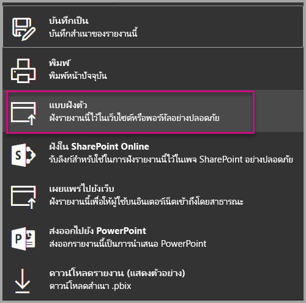
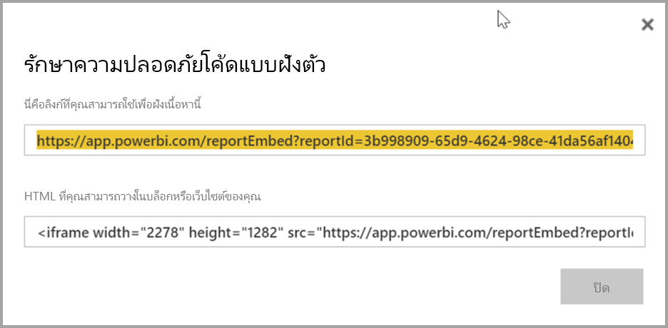
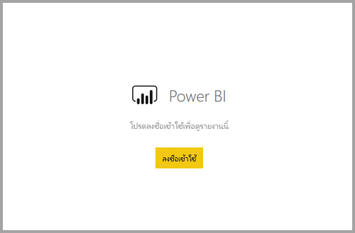

# <a name="embed-a-report-in-a-secure-portal-or-website"></a>ฝังรายงานในพอร์ทัลความปลอดภัยหรือเว็บไซต์

ด้วยตัวเลือก**ฝังตัว** ใหม่สำหรับรายงาน Power BI คุณสามารถฝังรายงานได้อย่างง่ายดายและปลอดภัยในเว็บพอร์ทัลภายใน พอร์ทัลเหล่านี้สามารถอยู่ **บนคลาวด์** หรือ **ที่โฮสต์ในองค์กร** เช่น SharePoint 2019 ก็ได้ รายงานแบบฝังจะคำนึงถึงการอนุญาตรายการทั้งหมดและความปลอดภัยของข้อมูลผ่าน[การรักษาความปลอดภัยระดับแถว (RLS)](service-admin-rls.md) ฟีเจอร์นี้ถูกออกแบบมาเพื่อให้ไม่มีโค้ดที่ฝังลงในพอร์ทัลใดก็ตามที่ยอมรับ URL หรือ iFrame 

ตัวเลือก**ฝังตัว** รองรับ [ตัวกรอง URL](service-url-filters.md) และการตั้งค่า URL ซึ่งช่วยให้คุณสามารถบูรณาการร่วมกับพอร์ทัลโดยใช้วิธีการที่เขียนโค้ดน้อยมากซึ่งต้องการเพียงความรู้พื้นฐาน HTML และ JavaScript เท่านั้น

## <a name="how-to-embed-power-bi-reports-into-portals"></a>วิธีการ**ฝัง**รายงาน Power BI ลงในพอร์ทัล

1. ใหม่**ฝัง**ตัวเลือกจะพร้อมใช้งานบนการ**ไฟล์**เมนูสำหรับรายงานในบริการ Power BI

    

2. เลือกตัวเลือก**ฝังตัว** เพื่อเปิดกล่องโต้ตอบที่จัดเตรียมลิงก์และ iFrame ที่คุณสามารถใช้เพื่อฝังรายงานได้อย่างปลอดภัย

    

3. ไม่ว่าผู้ใช้จะเปิด URL รายงานโดยตรงหรือฝังอยู่ในเว็บพอร์ทัล การเข้าถึงรายงานต้องมีการรับรองความถูกต้อง หน้าจอต่อไปนี้จะปรากฏขึ้นหากผู้ใช้ไม่ได้ลงชื่อเข้าใช้ Power BI ในเซสชันเบราว์เซอร์ เมื่อพวกเขาเลือก **ลงชื่อเข้าใช้** หน้าต่างเบราว์เซอร์หรือแท็บใหม่อาจเปิดขึ้น ให้พวกเขาตรวจสอบตัวบล็อกป๊อปอัปหากไม่ได้รับพร้อมท์แจ้งให้ลงชื่อเข้าใช้

    

4. หลังจากผู้ใช้ลงชื่อเข้าใช้ รายงานจะเปิดขึ้น แสดงข้อมูลและอนุญาตให้ใช้งานการนำทางระหว่างหน้าและการตั้งค่าตัวกรอง เฉพาะผู้ใช้ที่มีสิทธิ์ดูเท่านั้นที่สามารถดูรายงานใน Power BI กฎ[การรักษาความปลอดภัยระดับแถว (RLS)](service-admin-rls.md) ทั้งหมดจะถูกนำไปใช้เช่นกัน สุดท้ายนี้ ผู้ใช้จะต้องมีงสิทธิ์อย่างถูกต้อง – ไม่ว่าพวกเขาต้องการให้สิทธิ์การใช้งาน Power BI Pro หรือรายงานต้องอยู่ในพื้นที่ทำงานที่อยู่ในความจุ Power BI Premium ก็ตาม ผู้ใช้ต้องลงชื่อเข้าใช้ทุกครั้งที่เปิดหน้าต่างเบราว์เซอร์ใหม่ อย่างไรก็ตามเมื่อลงชื่อเข้าใช้แล้ว รายงานอื่นจะโหลดขึ้นโดยอัตโนมัติ

    

5. เมื่อใช้ iFrame คุณอาจต้องแก้ไข**ความสูง**และ**ความกว้าง** เพื่อปรับให้พอดีกับหน้าเว็บพอร์ทัลของคุณ

    

## <a name="granting-report-access"></a>ให้สิทธิ์การเข้าถึงรายงาน

ตัวเลือก**ฝังตัว**ตัวไม่อนุญาตให้ผู้ใช้ดูรายงานโดยอัตโนมัติ คุณสามารถตั้งค่าสิทธิ์ในการดูได้ในบริการของ Power BI

ในบริการของ Power BI คุณสามารถแชร์รายงานแบบฝังกับผู้ใช้ที่ต้องการการเข้าถึง หากคุณกำลังใช้ Office 365 Group คุณสามารถแสดงรายชื่อผู้ใช้ในฐานะสมาชิกของพื้นที่ทำงาน สำหรับข้อมูลเพิ่มเติม โปรดดูวิธีการ [จัดการพื้นที่ทำงานใน Power BI และ Office 365](service-manage-app-workspace-in-power-bi-and-office-365.md)

## <a name="licensing"></a>สิทธิ์การใช้งาน

หากต้องการดูรายงานแบบฝังตัว ผู้ใช้จำเป็นต้องมีสิทธิการใช้งาน Power BI Pro หรือไม่เช่นนั้นเนื้อหาต้องอยู่ในพื้นที่ทำงานที่อยู่ใน [ความจุพรีเมียมของ Power BI (EM หรือ P SKU)](service-admin-premium-purchase.md)

## <a name="customize-your-embed-experience-using-url-settings"></a>กำหนดการใช้งานการฝังตัวของคุณโดยใช้การตั้งค่า URL

คุณสามารถปรับแต่งประสบการณ์ผู้ใช้โดยใช้การตั้งค่าการป้อนข้อมูลของ URL แบบฝังตัวได้ ใน iFrame ที่ให้มาคุณสามารถอัปเดตการตั้งค่า **src** ของ URL ได้

| คุณสมบัติ  | คำอธิบาย  |  |  |  |
|--------------|-----------------------------------------------------------------------------------------------------------------------------------------------------------------------------------------------------------------------|---|---|---|
| pageName  | คุณสามารถใช้พารามิเตอร์ของสตริงคิวรี **pageName** เพื่อตั้งค่าหน้ารายงานที่จะเปิดได้ ค่คุณสามารถค้นหาค่านี้ได้ที่ส่วนท้าย URL รายงานเมื่อดูรายงานในบริการของ Power BI ดังที่แสดงด้านล่าง |  |  |  |
| ตัวกรอง URL  | คุณสามารถใช้[ตัวกรอง URL](service-url-filters.md)ใน URL แบบฝังที่คุณได้รับจาก UI ของ Power BI เพื่อกรองเนื้อหาการฝัง วิธีนี้คุณสามารถสร้างการรวมรหัสแบบต่ำด้วยการใช้งาน HTML และ JavaScript ขั้นพื้นฐานเท่านั้น  |  |  |  |

## <a name="set-which-page-opens-for-an-embedded-report"></a>ตั้งค่าเพจที่จะเปิดขึ้นสำหรับรายงานแบบฝังตัว 

คุณสามารถค้นหาค่า **pageName** ที่ส่วนท้ายของ URL ของรายงานเมื่อดูรายงานในบริการ Power BI

1. เปิดรายงานจากบริการ Power BI ในเว็บเบราว์เซอร์ของคุณ และจากนั้น คัดลอก URL จากแถบที่อยู่

    

2. ผนวกการตั้งค่า**pageName**เป็น URL

    

## <a name="filter-report-content-using-url-filters"></a>กรองเนื้อหารายงานโดยใช้ตัวกรอง URL 

คุณสามารถใช้ [ตัวกรอง URL](service-url-filters.md) เพื่อให้มุมมองรายงานที่แตกต่างกัน ตัวอย่างเช่น URL ด้านล่างจะกรองรายงานเพื่อแสดงข้อมูลสำหรับอุตสาหกรรมพลังงาน

ใช้ชุดของ**pageName**และ[ตัวกรอง URL](service-url-filters.md)จะทำให้มีประสิทธิภาพมากขึ้น คุณสามารถสร้างประสบการณ์การใช้งานที่ใช้ HTML และ JavaScript พื้นฐานได้

ตัวอย่างเช่น นี่คือปุ่มที่คุณสามารถเพิ่มไปยังหน้า HTML:

```html
<button class="textLarge" onclick='show("ReportSection", "Energy");' style="display: inline-block;">Show Energy</button>
```

เมื่อเลือกแล้วปุ่มจะเรียกใช้ฟังก์ชันเพื่ออัปเดต iFrame ที่มี URL ที่อัปเดตแล้ว ซึ่งรวมถึงตัวกรองสำหรับอุตสาหกรรมพลังงาน

```javascript
function show(pageName, filterValue)

{

var newUrl = baseUrl + "&pageName=" + pageName;

if(null != filterValue && "" != filterValue)

{

newUrl += "&$filter=Industries/Industry eq '" + filterValue + "'";

}

//Assumes there's an iFrame on the page with id="iFrame"

var report = document.getElementById("iFrame")

report.src = newUrl;

}
```


คุณสามารถเพิ่มปุ่มได้มากเท่าที่คุณต้องการเพื่อสร้างประสบการณ์แบบกำหนดเองด้วยการใช้รหัสต่ำ 

## <a name="considerations-and-limitations"></a>ข้อควรพิจารณาและข้อจำกัด

* สนับสนุนรายงานที่มีการแบ่งหน้าพร้อมสถานการณ์การฝังที่ปลอดภัย และยังสนับสนุนรายงานที่มีการแบ่งหน้าพร้อมพารามิเตอร์ URL ด้วย อ่านเพิ่มเติมเกี่ยวกับ [การส่งผ่านพารามิเตอร์รายงานใน URL สำหรับรายงานที่มีการแบ่งหน้า](paginated-reports/report-builder-url-pass-parameters.md)

* ไม่สนับสนุนผู้เยี่ยมชมภายนอก ด้วย Azure เพื่อธุรกิจ (B2B)

* ฝังการรักษาความปลอดภัยสำหรับรายงานที่เผยแพร่ไปยังบริการ Power BI

* ผู้ใช้ต้องลงชื่อเข้าใช้เพื่อดูรายงานทุกครั้งที่เปิดหน้าต่างเบราว์เซอร์ใหม่

* เบราว์เซอร์บางตัวต้องการให้คุณรีเฟรชหน้าเว็บหลังจากลงชื่อเข้าใช้โดยเฉพาะเมื่อใช้โหมด InPrivate หรือไม่ระบุตัวตน

* คุณอาจพบปัญหาหากใช้เบราว์เซอร์รุ่นที่ไม่สนับสนุน Power BI รองรับ [เบราว์เซอร์ต่อไปนี้](power-bi-browsers.md)

* เซิร์ฟเวอร์ SharePoint แบบคลาสสิกไม่ได้รับการสนับสนุน เนื่องจากจำเป็นต้องมี Internet Explorer เวอร์ชันเก่ากว่า 11 หรือเปิดใช้งานโหมดมุมมองที่เข้ากันได้

* เพื่อให้ได้รับประสบการณ์การลงชื่อเข้าใช้เพียงครั้งเดียว ให้ใช้ [ตัวเลือกฝังใน SharePoint Online](service-embed-report-spo.md) หรือสร้างการบูรณาการแบบกำหนดเองโดยวิธีการฝังตัวแบบ [ผู้ใช้เป็นเจ้าของข้อมูล](developer/embedded/embed-sample-for-your-organization.md) 

* ความสามารถในการรับรองความถูกต้องโดยอัตโนมัติที่มาพร้อมกับการ**ฝัง**ตัวเลือกที่ไม่ทำงานกับ Power BI JavaScript API สำหรับ Power BI JavaScript API ให้ใช้วิธีการฝังตัวแบบ [ผู้ใช้เป็นเจ้าของข้อมูล](developer/embedded/embed-sample-for-your-organization.md) 

* อายุการใช้งานโทเค็นการรับรองความถูกต้องจะถูกควบคุมตามการตั้งค่า AAD ของคุณ เมื่อโทเค็นการรับรองความถูกต้องหมดอายุ ผู้ใช้จะต้องรีเฟรชเบราว์เซอร์เพื่อรับโทเค็นการรับรองความถูกต้องที่อัปเดตแล้ว อายุการใช้งานเริ่มต้นคือหนึ่งชั่วโมง แต่อาจมีความยาวน้อยกว่าหรือนานกว่าในองค์กรของคุณ

## <a name="next-steps"></a>ขั้นตอนถัดไป

* [วิธีการแชร์งานของคุณใน Power BI](service-how-to-collaborate-distribute-dashboards-reports.md)

* [กรองรายงานโดยใช้พารามิเตอร์ของสตริงคิวรีใน URL](service-url-filters.md)

* [ฝังด้วยส่วนเว็บรายงานใน SharePoint Online](service-embed-report-spo.md)

* [เผยแพร่บนเว็บจาก Power BI](service-publish-to-web.md)
