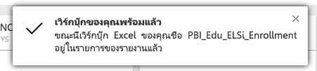

# รับข้อมูลจากไฟล์สมุดงาน Excel

Microsoft Excel เป็นหนึ่งในแอปพลิเคชันทางธุรกิจที่ใช้งานอย่างกว้างขวางที่สุด นอกจากนี้ Excel เป็นหนึ่งในวิธีที่ใช้ทั่วไปมากที่สุดในการรับข้อมูลของคุณลงใน Power BI

## Power BI สนับสนุนสมุดงานชนิดใดบ้าง?
Power BI สนับสนุนการนำเข้าหรือเชื่อมต่อไปยังสมุดงานที่สร้างขึ้นใน Excel 2007 และเวอร์ชันที่ใหม่กว่า สมุดงานต้องถูกบันทึกเป็นชนิดไฟล์ .xlsx หรือ.xlsm และมีขนาดน้อยกว่า 1 GB บางคุณลักษณะที่อธิบายไว้ในบทความนี้มีอยู่ใน Excel เวอร์ชั่นที่ใหม่กว่าเท่านั้น

### สมุดงานที่มีช่วงหรือตารางของข้อมูล
ถ้าสมุดงานของคุณมีแผ่นงานแบบง่ายที่มีหลายช่วงข้อมูล เพื่อให้ได้ประโยชน์สูงสุดจากข้อมูลของคุณใน Power BI ตรวจสอบให้แน่ใจว่ามีการจัดรูปแบบช่วงเหล่านั้นเป็นตาราง ด้วยวิธีนี้ เมื่อสร้างรายงานใน Power BI คุณจะเห็นตารางที่มีชื่อและคอลัมน์ในพื้นที่เขตข้อมูล ทำให้ง่ายมากขึ้นในการแสดงภาพข้อมูลของคุณ

### สมุดงานที่มีแบบจำลองข้อมูล
สมุดงานสามารถประกอบด้วยแบบจำลองข้อมูลที่มีหนึ่ง ตารางขึ้นไปของข้อมูลที่โหลดลงในแบบจำลองนั้นโดยใช้ตาราง Power Query (รับและแปลงใน Excel 2016), หรือ Power Pivot ที่เชื่อมโยง Power BI สนับสนุนทุกคุณสมบัติแบบจำลองข้อมูล เช่น ความสัมพันธ์ หน่วยวัด ลำดับชั้น และ KPI

> [!NOTE]
> สมุดงานที่มีแบบจำลองข้อมูลไม่สามารถแชร์กับผู้เช่าทั้งทั้ง Power BI ได้ ตัวอย่างเช่น ผู้ใช้ที่ลงชื่อเข้าใช้ใน Power BI โดยใช้บัญชี *contoso.com* ผู้ใช้ไม่สามารถแชร์สมุดงาน Excel กับผู้ใช้ที่ลงชื่อเข้าสู่ระบบโดยใช้ Power BI จาก *woodgrovebank.com* ได้
> 
> 

### สมุดงานที่มีการเชื่อมต่อกับแหล่งข้อมูลภายนอก
ถ้าคุณใช้ Excel เพื่อเชื่อมต่อกับแหล่งข้อมูลภายนอก เมื่อสมุดงานของคุณอยู่ใน Power BI คุณสามารถสร้างรายงานและแดชบอร์ดที่ยึดตามข้อมูลจากแหล่งข้อมูลที่เชื่อมต่อนั้นได้ นอกจากนี้ คุณยังสามารถตั้งค่าการกำหนดการรีเฟรชเพื่อเชื่อมต่อกับแหล่งข้อมูลได้ทันทีโดยอัตโนมัติและรับการอัปเดต คุณไม่จำเป็นต้องรีเฟรชด้วยตนเองจาก Ribbon ข้อมูลใน Excel อีกต่อไป การแสดงภาพใด ๆ ในรายงานและไทล์ในแดชบอร์ดที่ยึดตามข้อมูลจากแหล่งข้อมูลนั้นจะอัปเดตโดยอัตโนมัติ เมื่อต้องการเรียนรู้เพิ่มเติม ดู[รีเฟรชข้อมูลใน Power BI](refresh-data.md)

### สมุดงานที่มีแผ่นงาน Power View, Pivottable และแผนภูมิ
วิธีการที่แผ่นงาน PowerView และ Pivottable และแผนภูมิของคุณปรากฏหรือไม่ปรากฏใน Power BI ขึ้นอยู่กับตำแหน่งที่คุณบันทึกไฟล์สมุดงานของคุณและวิธีการที่คุณเลือกเพื่อใส่ลงใน Power BI เราจะลงรายละเอียดในส่วนนี้เพิ่มเติมที่ด้านล่าง

## ประเภทข้อมูล
Power BI รองรับประเภทข้อมูลต่อไปนี้: จำนวนเต็ม เลขทศนิยม สกุลเงิน วันที่ True/False ข้อความ การทำเครื่องหมายข้อมูลเป็นชนิดข้อมูลที่เฉพาะเจาะจงใน Excel จะช่วยเพิ่มประสบการณ์การใช้งาน Power BI

## เตรียมสมุดงานของคุณสำหรับ Power BI
ดูวิดีโอที่มีประโยชน์นี้เมื่อต้องการเรียนรู้เพิ่มเติมเกี่ยวกับวิธีการตรวจสอบให้แน่ใจว่าสมุดงาน Excel ของคุณพร้อมสำหรับ Power BI หรือไม่

<iframe width="500" height="281" src="https://www.youtube.com/embed/l2wy4XgQIu0" frameborder="0" allowfullscreen></iframe>

## ตำแหน่งที่คุณบันทึกสมุดงานสร้างความแตกต่างได้
**ภายในเครื่อง** - ถ้าคุณบันทึกสมุดงานของคุณลงในไดรฟ์ภายในเครื่องคอมพิวเตอร์ของคุณ หรือตำแหน่งที่ตั้งอื่นในองค์กรของคุณ จาก Power BI คุณสามารถโหลดไฟล์ของคุณไปยัง Power BI ได้ ไฟล์ของคุณจะยังคงอยู่บนไดรฟ์ในเครื่อง ดังนั้นจึงไม่มีการนำเข้าใน Power BI จริง ๆ สิ่งที่เกิดขึ้นจริง ๆ คือ ชุดข้อมูลใหม่จะถูกสร้างขึ้นใน Power BI และข้อมูลและแบบจำลองข้อมูล (หากมี) จากสมุดงานจะโหลดลงในชุดข้อมูลดังกล่าว ถ้าสมุดงานของคุณมีแผ่นงาน Power View ใด ๆ แผ่นงานเหล่านั้นจะปรากฏในไซต์ Power BI ของคุณภายใต้ รายงาน นอกจากนี้ Excel 2016 ยังมีคุณลักษณะ**เผยแพร่** (ใต้เมนู**ไฟล์**) การใช้**เผยแพร่**จะให้ผลเหมือนกับการใช้**รับข้อมูล > ไฟล์ > ไฟล์ภายในเครื่อง**จาก Power BI แต่มักง่ายกว่าในการอัปเดตชุดข้อมูลของคุณใน Power BI ถ้าคุณทำการเปลี่ยนแปลงไปยังสมุดงานอยู่เป็นประจำ

**OneDrive - ธุรกิจ**– ถ้าคุณมี OneDrive for Business และคุณลงชื่อเข้าใช้ด้วยบัญชีเดียวกันกับที่คุณลงชื่อเข้าใช้ Power BI ปัจจุบัน นี่คือวิธีที่มีประสิทธิภาพที่สุดในการเก็บงานใน Excel และชุดข้อมูล รายงาน และแดชบอร์ดใน Power BI ของคุณให้รวมกัน เนื่องจากทั้ง Power BI และ OneDrive อยู่ในระบบคลาวด์ Power BI จะ*เชื่อมต่อ*ไปยังไฟล์สมุดงานของคุณบน OneDrive ประมาณทุกชั่วโมง ถ้าพบการเปลี่ยนแปลงใด ๆ ก็ตาม Power BI จะอัปเดต ชุดข้อมูล รายงาน และแดชบอร์โดยอัตโนมัติ เช่นเดียวกับการที่คุณได้บันทึกสมุดงานของคุณลงในไดรฟ์ภายในเครื่อง คุณสามารถใช้ เผยแพร่ เพื่ออัปเดตชุดข้อมูลและรายงานของคุณใน Power BI ได้ทันที มิฉะนั้น Power BI จะรวมกันโดยอัตโนมัติ โดยปกติแล้วภายในหนึ่งชั่วโมง

**OneDrive - ส่วนบุคคล** – ถ้าคุณบันทึกไฟล์สมุดงานของคุณไปยังบัญชี OneDrive ของคุณเอง คุณจะยังได้รับประโยชน์หลายอย่างแบบเดียวกับที่คุณได้จาก OneDrive for Business ความแตกต่างที่สำคัญที่สุด คือเมื่อคุณเชื่อมต่อกับไฟล์ของคุณ (โดยใช้ รับข้อมูล > ไฟล์ > OneDrive – ส่วนบุคคล) คุณจำเป็นต้องลงชื่อเข้าใช้ OneDrive ของคุณด้วยบัญชี Microsoft ของคุณ ซึ่งโดยปกติแล้วจะแตกต่างจากที่คุณใช้ลงชื่อเข้าใช้ Power BI เมื่อลงชื่อเข้าใช้ OneDrive ของคุณด้วยบัญชี Microsoft ให้แน่ใจว่าได้เลือกตัวเลือก คงการลงชื่อเข้าใช้ของฉันไว้เสมอ ด้วยวิธีนี้ Power BI จะสามารถเชื่อมต่อกับไฟล์สมุดงานของคุณประมาณทุกชั่วโมง และแน่ใจว่าชุดข้อมูลและรายงานของคุณใน Power BI มีข้อมูลที่ตรงกัน

**SharePoint - ของไซต์ของทีม** การบันทึกไฟล์ Power BI Desktop ของคุณไปยัง SharePoint ไซต์ของทีมจะเหมือนกับการบันทึกไปยัง OneDrive for Business มาก ความแตกต่างที่สำคัญที่สุดคือ วิธีที่คุณเชื่อมต่อไปยังไฟล์จาก Power BI คุณสามารถระบุ URL หรือเชื่อมต่อไปยังโฟลเดอร์รากฐานได้

## หนึ่งสมุดงาน Excel – สองวิธีในการใช้งาน
ถ้าคุณบันทึกไฟล์สมุดงานของคุณไปยัง**OneDrive** จะมีสองสามวิธีที่คุณสามารถใช้สำรวจข้อมูลของคุณใน Power BI ได้

### นำเข้าข้อมูล Excel ลงใน Power BI
เมื่อคุณเลือกนำเข้า **ข้อมูลใด** ๆ ที่สนับสนุนในตารางและ/หรือแบบจำลองข้อมูลจะถูกนำเข้าเป็นชุดข้อมูลใหม่ใน Power BI ถ้าคุณมีแผ่นงาน Power View ใด ๆ แผ่นงานเหล่านั้นจะถูกสร้างอีกครั้งใน Power BI เป็นรายงาน

คุณสามารถทำการแก้ไขสมุดงานของคุณต่อได้ เมื่อบันทึกการเปลี่ยนแปลงของคุณ การเปลี่ยนแปลงเหล่านั้นจะถูกรวมเข้ากับชุดข้อมูลใน Power BI โดยปกติแล้วจะรวมภายในประมาณหนึ่งชั่วโมง ถ้าคุณต้องการความพึงพอใจมากขึ้นในทันที คุณเพียงแค่คลิกเผยแพร่อีกครั้ง และการเปลี่ยนแปลงของคุณจะถูกส่งออกทันทีที่นั่น การแสดงภาพใด ๆ ที่คุณมีในรายงานและแดชบอร์ดจะถูกอัปเดตด้วยเช่นกัน

เลือกตัวเลือกนี้ถ้าคุณเคยใช้ รับและแปลงข้อมูล หรือ Power Pivot เพื่อโหลดข้อมูลลงในแบบจำลองข้อมูล หรือถ้าสมุดงานของคุณมีแผ่นงาน Power View ที่มีการแสดงเป็นภาพที่คุณต้องการเห็นใน Power BI

ใน Excel 2016 คุณยังสามารถใช้เผยแพร่ > ส่งออกได้ ซึ่งเป็นลักษณะเดียวกัน เมื่อต้องการเรียนรู้เพิ่มเติม ดู[เผยแพร่ไปยัง Power BI จาก Excel 2016](service-publish-from-excel.md)

### เชื่อมต่อ จัดการ และดู Excel ใน Power BI
เมื่อคุณเลือก**เชื่อมต่อ** สมุดงานของคุณจะปรากฏใน Power BI เช่นเดียวกับที่ปรากฏใน Excel Online แต่ไม่เหมือนกับ Excel Online เนื่องจากคุณจะมีคุณลักษณะบางอย่างที่ช่วยให้คุณสามารถปักหมุดองค์ประกอบต่าง ๆ จากแผ่นงานของคุณไปยังแดชบอร์ดได้ทันที

คุณไม่สามารถแก้ไขสมุดงานของคุณใน Power BI ได้ แต่ถ้าคุณจำเป็นต้องทำการเปลี่ยนแปลงบางอย่าง คุณสามารถคลิก แก้ไข แล้วเลือกแก้ไขสมุดงานของคุณใน Excel Online หรือเปิดใน Excel บนคอมพิวเตอร์ของคุณ การเปลี่ยนแปลงใด ๆ ที่คุณดำเนินการจะถูกบันทึกไปยังสมุดงานบน OneDrive

เลือกตัวเลือกนี้ถ้าคุณมีข้อมูลในแผ่นงานเท่านั้น หรือคุณมีช่วงต่าง ๆ Pivottable และแผนภูมิที่คุณต้องการปักหมุดไปยังแดชบอร์ด

ใน Excel 2016 คุณยังสามารถใช้เผยแพร่ > อัปโหลดได้ ซึ่งเป็นลักษณะเดียวกัน เมื่อต้องการเรียนรู้เพิ่มเติม ดู[เผยแพร่ไปยัง Power BI จาก Excel 2016](service-publish-from-excel.md)

## นำเข้าหรือเชื่อมต่อกับสมุดงาน Excel จาก Power BI
1. ใน Power BI ที่บานหน้าต่างนำทาง ให้คลิก **รับข้อมูล**
   
   
2. ในไฟล์ คลิก**รับ**
   
   
3. ค้นหาไฟล์ของคุณ
   
   
4. ถ้าไฟล์สมุดงานของคุณอยู่บน OneDrive หรือ SharePoint บนไซต์ของทีม เลือก**นำเข้า**หรือ**เชื่อมต่อ**

## สมุดงาน Excel ภายในเครื่อง
นอกจากนี้ คุณยังสามารถใช้ไฟล์ Excel ภายในเครื่อง และอัปโหลดลงใน Power BI ได้ เพียงแค่เลือก**ไฟล์ภายในเครื่อง**จากเมนูก่อนหน้า จากนั้นนำทางไปยังตำแหน่งที่คุณบันทึกสมุดงาน Excel ของคุณไว้

หลังจากเลือกแล้ว ให้เลือกอัปโหลดไฟล์ของคุณลงใน Power BI

เมื่อสมุดงานของคุณได้รับการอัปโหลดแล้ว คุณได้รับการแจ้งว่าสมุดงานนั้นพร้อมใช้งาน

เมื่อสมุดงานนั้นพร้อมใช้งาน คุณสามารถค้นหาสมุดงานได้ในส่วน**รายงาน**ของ Power BI

## เผยแพร่จาก Excel 2016 ไปยังไซต์ Power BI ของคุณ
การใช้คุณลักษณะ**เผยแพร่ไปยัง Power BI**ใน Excel 2016 จะได้ผลเหมือนกับการใช้**รับข้อมูล**ใน Power BI เพื่อนำเข้าหรือเชื่อมต่อกับไฟล์ของคุณ เราจะไม่ลงในรายละเอียดที่นี่ แต่คุณสามารถดู[เผยแพร่ไปยัง Power BI จาก Excel 2016](service-publish-from-excel.md)ได้เพื่อเรียนรู้เพิ่มเติม

## การแก้ไขปัญหา
ไฟล์สมุดงานใหญ่เกินไปใช่หรือไม่? ดู [ลดขนาดของสมุดงาน Excel เพื่อดูใน Power BI](reduce-the-size-of-an-excel-workbook.md)

ขณะนี้ เมื่อคุณเลือกนำเข้า Power BI จะนำเข้าข้อมูลที่เป็นส่วนหนึ่งของตารางที่มีชื่อหรือแบบจำลองข้อมูลเท่านั้น ผลที่ได้คือ ถ้าสมุดงานประกอบด้วยตาราง แผ่นงาน Power View หรือแบบจำลองข้อมูล Excel ที่ไม่มีชื่อ คุณอาจเห็นข้อผิดพลาดนี้: **"เราไม่พบข้อมูลใด ๆ ในสมุดงาน Excel ของคุณ"** [บทความนี้](service-admin-troubleshoot-excel-workbook-data.md)อธิบายถึงวิธีการแก้ไขสมุดงานของคุณ และนำเข้าอีกครั้ง

## ขั้นตอนถัดไป
**สำรวจข้อมูลของคุณ** เมื่อคุณได้รับข้อมูลและรายงานจากไฟล์ของคุณลงใน Power BI แล้ว นั่นก็ถึงเวลาการสำรวจ เพียงคลิกขวาที่ชุดข้อมูลใหม่ จากนั้นคลิกสำรวจ ถ้าคุณเลือกที่จะเชื่อมต่อกับไฟล์สมุดงานบน OneDrive ในขั้นตอนที่ 4 สมุดงานของคุณจะปรากฏในรายงานต่าง ๆ เมื่อคุณคลิกที่สมุดงานดังกล่าว สมุดงานจะเปิดใน Power BI เหมือนกับที่ทำงานได้ใน Excel Online

**รีเฟรชตามกำหนดการ**- ถ้าไฟล์สมุดงาน Excel ของคุณเชื่อมต่อกับแหล่งข้อมูลภายนอก หรือคุณนำเข้าจากในไดรฟ์ภายในเครื่อง คุณสามารถตั้งค่ารีเฟรชตามกำหนดการได้ เพื่อให้แน่ใจว่าชุดข้อมูลของคุณหรือรายงานเป็นปัจจุบันอยู่เสมอ กรณีส่วนใหญ่ การตั้งค่ารีเฟรชตามกำหนดการจะค่อนข้างง่าย แต่การลงในรายละเอียดอยู่นอกขอบเขตของบทความนี้ ดู[รีเฟรชข้อมูลใน Power BI](refresh-data.md)เมื่อต้องการเรียนรู้เพิ่มเติม

[เผยแพร่ไปยัง Power BI จาก Excel 2016](service-publish-from-excel.md)

[การรีเฟรชข้อมูลใน Power BI](refresh-data.md)

