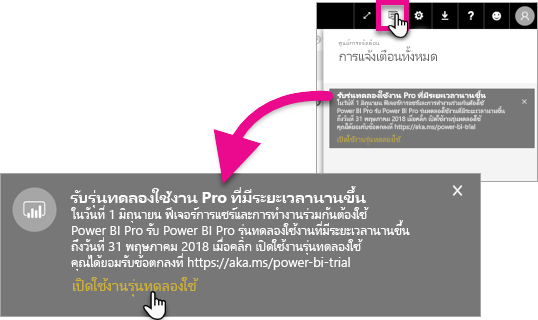
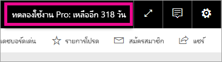

# การเปิดใช้งานรุ่นทดลองใช้ Pro ถูกขยายเวลา
เริ่มจากวันที่ 1 มิถุนายน 2017 ผู้ใช้มีสิทธิ์ทั้งหมดจะสามารถเลือก Power BI service รุ่น Extended Pro Trial ได้

<iframe width="640" height="360" src="https://www.youtube.com/embed/tPsNoPyY9aA?showinfo=0" frameborder="0" allowfullscreen></iframe>

นอกจาก[ประกาศของ Power BI Premium วันที่ 3 พฤษภาคม 2017 ](https://powerbi.microsoft.com/blog/microsoft-accelerates-modern-bi-adoption-with-power-bi-premium/)แล้ว Microsoft ได้แจ้งการเปลี่ยนแปลงบริการฟรีของ Power BI ตั้งแต่วันที่ 1 มิถุนายน 2017 เปลี่ยนแปลงเหล่านี้รวมถึงการขยายการเข้าถึงแหล่งข้อมูลทั้งหมด เพิ่มขีดจำกัดพื้นที่จัดเก็บพื้นที่ทำงาน การรีเฟรชและอัตราสตรีมมิ่งไปยังบริการฟรี ทำเทียบเท่ากับ Power BI Pro

นอกจากนี้ยังประกาศว่าการใช้งานร่วมกันและฟีเจอร์การทำงานร่วมกันจะเป็นสิทธิ์เฉพาะของกับผู้ใช้ Power BI Pro รวมถึงการแชร์แดชบอร์ดแบบเพียร์ทูเพียร์ กลุ่มพื้นที่ทำงาน (ตอนนี้เรียก app workspaces) การส่งออกไปยัง PowerPoint และการวิเคราะห์ใน Excel ด้วยแอป Power BI การส่งออกไปยัง CSV/Excel และ PowerPoint นั้นถูกระบุในประกาศวันที่ 3 พฏฤษภาคม ว่าจะเป็นความสามารถที่จำกัดไว้สำหรับ Power BI Pro แต่หลังจากได้รับการตอบรับจากชุมชนผู้ใช้ที่กว้างขวาง ได้เปลี่ยนกลยุทธ์ให้ผู้ใช้บริการฟรีเป็นพร้อมใช้งานความสามารถนี้ได้ด้วย

ตั้งแต่วันที่ 1 มิถุนายน 2017 ผู้ใช้บริการฟรีที่มีการใช้งานอยู่ภายในปีที่ผ่านมา (ในช่วง 2 พฤษภาคม 2017 หรือก่อนหน้า) จะมีสิทธิ์ใช้เวอร์ชันทดลองใช้แบบขยายเวลาของ Power BI Pro ฟรี 12 เดือน ข้อเสนอนี้จะช่วยให้ผู้ใช้ได้ใช้ประโยชน์จากความสามารถทั้งหมดของ Power BI Pro ในปีถัดไป ซึ่งเป็นเครื่องหมายแสดงความเคารพชุมชนผู้ใช้ และเพื่อให้ผู้ใช้มีระยะเวลาการปรับตัวสำหรับการเปลี่ยนแปลง

ในวันที่ 1 มิถุนายน 2017 ผู้ใช้ที่มีสิทธิ์จะได้รับการแจ้งเตือนเมื่อพวกเขาลงชื่อเข้าใช้บริการเพื่อแจ้งให้ทราบการเปลี่ยนแปลง พร้อมกับแสดงหน้าต่างลงทะเบียนทดลองใช้ Power BI Pro เวอร์ชั่นแบบขยายเวลา ผู้ใช้ระดับผู้ดูแลระบบ IT จะไม่ควบคุมการแจ้งเตือนในผลิตภัณฑ์ และจะไม่สามารถลงทะเบียนทดลองใช้ Power BI Pro แบบขยายเวลาในฐานผู้ใช้ได้ ผู้ใช้ที่มีสิทธิ์แต่ละคนต้องต้องดำเนินการเพื่อเสร็จสิ้นกระบวนการนี้ด้วยตนเอง

ผู้ใช้สามารถเลือกที่จะลงทะเบียนสำหรับข้อเสนอนี้ตลอดเวลาภายในระยะเวลา 12 เดือน แต่การทดลองใช้ Extended Pro จะจบลงในวันที่ 31 พฤษภาคม 2018 สำหรับผู้ใช้ทั้งหมด โดยไม่คำนึงว่าได้ยอมรับข้อเสนอเมื่อใด ในขณะนี้ ผู้ใช้จะสามารถเลือกได้ว่าจะซื้อ Power BI Pro หรือจะเปลี่ยนเป็นเวอร์ชันฟรีของ Power BI ซึ่งไม่สามารถแชร์และทำงานร่วมกันได้ ถ้าพวกเขาเลือกที่จะไม่เพื่อดำเนินการและซื้อ Power BI Pro

ไม่มีการแปลงใน Power BI Pro ผู้ใช้เหล่านี้ไม่ได้รับผลกระทบ และจะไม่ได้รับการแจ้งเตือนเมื่อลงชื่อเข้าใช้บริการ ในวันที่ 1 มิถุนายน 2017 หรือหลังจากนั้น ผู้ใช้ที่ปฏิเสธข้อเสนอการทดลองใช้ Power BI Pro แบบขยายเวลาหรือผู้ไม่มีสิทธรับข้อเสนอ จะยังคงใช้ Power BI เวอร์ชันฟรได้ี ซึ่งจะไม่มีความสามารถแชร์และความสามารถแบบทำงานร่วมกันได้ พวกเขาสามารถลงทะเบียนเพื่อทดลองใช้ Power BI Pro เป็นเวลา 60 วันได้ตอลอดเวลา ที่ [เว็บไซต์](https://powerbi.microsoft.com/get-started/) Power BI

## มีสิทธิ์ทดลองใช้งานรุ่น Extended Pro
บัญชีของคุณต้องตรงกับความต้องการต่อไปนี้เพื่อให้มีสิทธิ์ทดลองใช้งานรุ่น Extended Pro

* ฟรีผู้ใช้ของ Power BI ที่ใช้งานระหว่างวันที่ 3 พฤษภาคม 2016 และ 2 พฤษภาคม 2017 จะมีสิทธิ์ใช้เวอร์ชันทดลองใช้ Extended Pro
* ผู้ใช้ที่ใช้ก่อนหน้า หรืออยู่ช่วงใช้*เวอร์ชั่น Pro แบบ 60 วัน*  จะยังคงมีสิทธิ์ในเวอร์ชันทดลองใช้รุ่น Extended Pro

> [!NOTE]
> ผู้ใช้ที่มีสิทธิ์การใช้งานที่มอบหมายจาก Power BI Pro หรือเป็นสมาชิก Power BI Pro เวอร์ชันทดลองใช้ ภายใน Office 365 จะถูกไม่มีสิทธิ์ในข้อเสนอนี้
> 
> 

## วิธีการเปิดใช้งาน
มีสองวิธีในการเปิดใช้งานเวอร์ชันทดลองใช้รุ่น Extended Pro สิ่งแรกคือเมื่อคุณลงชื่อเข้า Power BI ถ้าคุณได้ยกเลิกแล้ว คุณจะเห็นตัวเลือกภายในพื้นที่การแจ้งเตือน

> [!NOTE]
> การสื่อสารภายในผลิตภัณฑ์ไม่ได้รับการควบคุมโดยผู้ดูแลระบบ และจะเข้าไปหาผู้ใช้ที่มีสิทธิ์
> 
> 

### ประสบการณ์การใช้งานที่ลงชื่อเข้าใช้
เมื่อคุณลงชื่อเข้าใช้บริการ Power BI และคุณก็สิทธิ์ใช์ คุณจะได้รับการแจ้งเตือนแบบป็อปอัพ โดยเลือก**เปิดใช้งานเวอร์ชันทดลองใช้**จะเริ่มต้นใช้เวอร์ชันทดลองใช้รุ่น Extended Pro จะต้องไมต้องทำอะไรเพิ่ม

จากนั้นคุณจะมีความสามารถในการเข้าถึงแดชบอร์ดแบบใช้ร่วมกันที่มีในระบบและรายงานทั้งหมดตลอดระยะเวลาการทดลองใช้

ถ้าคุณเลือก**ไม่ใช่ตอนนี้** เวอร์ชั่นทดลองใช้งานรุ่น Extended Pro จะสามารถเรียกใช้ได้จนถึงวันสิ้นสุดของช่วงทดลองใช้งาน ในวันที่ 31 พฤษภาคม 2018

### เปิดใช้งานภายหลัง
ถ้าคุณยกเลิกเมนูที่แสดงขึ้นมา โดยการเลือก**ไม่ใช่ตอนนี้** เวอร์ชั่นทดลองใช้งานรุ่น Extended Pro จะสามารถเรียกใช้ได้จนถึงวันสิ้นสุดของช่วงทดลองใช้งาน ในวันที่ 31 พฤษภาคม 2018 ซึ่งสามารถทำได้ใน**ศูนย์การแจ้งเตือน**

ภายในศูนย์การแจ้งเตือน คุณจะเห็นการแจ้งเตือนเกี่ยวกับเวอร์ชั่นทดลองใช้งานรุ่น Extended Pro การแจ้งเตือนจะแสดงอยู่งานจนกว่าผู้ใช้จะกดยกเลิก

ภายในการแจ้งเตือน คุณสามารถเลือก**เปิดใช้งานเวอร์ชันทดลองใช้**เพื่อเริ่มการทดลองใช้งานได้ จะต้องไมต้องทำอะไรเพิ่ม

จากนั้นคุณจะมีความสามารถในการเข้าถึงแดชบอร์ดแบบใช้ร่วมกันที่มีในระบบและรายงานทั้งหมดตลอดระยะเวลาการทดลองใช้

## หลังจากเปิดใช้งาน
หลังจากเปิดใช้งาน คุณจะเห็นจำนวนวันที่เหลือในการทดลองใช้ของคุณด้านบนขวา

คุณสามารถตรวจอ่านข้อตกลงภายในการ[ข้อกำหนดและเงื่อนไขของเวอร์ชั่นทดลองใช้งานรุ่น Extended Pro ](https://aka.ms/power-bi-trial)ได้ สำหรับผู้ใช้ที่มีสิทธิ์ทั้งหมดเวอร์ชั่นทดลองใช้งานรุ่น Extended Pro นั้นจะทำงานถึงวันที่ 31 พฤษภาคม 2018

## คำถามที่ถามบ่อย
**เกิดอะไรขึ้นกับผู้ใช้ใหม่ที่ลงทะเบียนหลังจาก 3 พฤษภาคม 2017**

ผู้ใช้ที่ลงทะเบียนกับ Power BI ฟรี ตั้งแต่วันที่ 3 พฤษภาคม 2017 จะไม่มีสิทธิ์สำหรับในเวอร์ชันทดลองใช้ Extended Pro อย่างไรก็ตาม พวกเขาจะมีสิทธิ์ในการทดลองใช้งานรุ่น Pro แบบมาตรฐาน 60 วัน

**ฉันจะค้นหาใครในองค์กรของฉันที่มีสิทธิ์ในเวอร์ชันทดลองใช้ Extended Pro ได้อย่างไร**

ในขณะที่ไม่มีวิธีโดยตรงเพื่อค้นหาสิ่งนี้ คุณสามารถดูรายงาน Azure Active Directory Integrated Applications สำหรับ Power BI เพื่อดูผู้ใช้ผู้ใช้ที่ใช้งานอยู่ภายในองค์กรของคุณภายใน 30 วันที่ผ่านมา ซึ่งอาจทำให้คุณทราบว่าใครมีสิทธิ์ได้บ้าง สำหรับข้อมูลเพิ่มเติม ให้ดู[ค้นหาผู้ใช้ Power BI ที่มีการลงชื่อเข้าใช้](service-admin-access-usage.md)

ผู้ใช้งานในรอบระยะเวลามีคุณสมบัติเหมาะสม และผู้ที่อยู่ในสิทธิ์การใช้งานฟรี จะได้รับการแจ้งเตือนแบบป๊อบอัพ 

> [!NOTE]
> รายงาน Azure AD ไม่ได้แจงว่าผู้ใช้เป็นเป็นแบบผู้ใช้ฟรีหรือ Pro ภายใน Power BI รายงานเฉพาะผู้ใช้ที่ลงชื่อเข้าใช้ Power BI และเมื่อเข้าสู่ระบบ ถ้าผู้ใช้มีช่ื่อแสดงอยู่ในรายงานนี้ นั่นไม่ไดหมายความว่าพวกเขามีสิทธิ์ในเวอร์ชั่นทดลองใช้ Extended Pro
> 
> 

**ผู้ดูแลระบบสามารถจำกัดการผู้ใช้จากการเปิดใช้งานเวอร์ชั่นทดลองใช้ Extended Pro หรือไม่**

หมายเลข ผู้ดูแลระบบมีวิธีการที่จะจำกัดผู้ใชไม่ให้เปิดใช้งานเวอร์ชั่นทดลองใช้ Extended Pro หรือการทดลองใช้ 60 วันของ Power BI Pro

## ขั้นตอนถัดไป
[ข้อกำหนดในการให้บริการ Extended Pro Trial](https://aka.ms/power-bi-trial)  
[ข้อตกลงการให้บริการ Power BI สำหรับแต่ละผู้ใช้](https://powerbi.microsoft.com/terms-of-service/)  
[ประกาศ Power BI Premium ](https://aka.ms/pbipremium-announcement)  
[ค้นหาผู้ใช้ Power BI ที่มีการลงชื่อเข้าใช้](service-admin-access-usage.md)

มีคำถามเพิ่มเติมหรือไม่ [ลองถามชุมชน Power BI](https://community.powerbi.com/)

