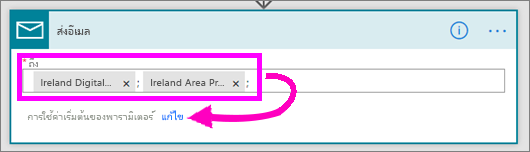
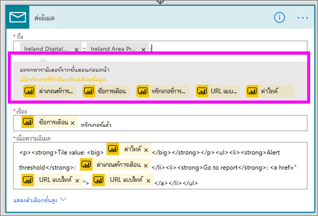
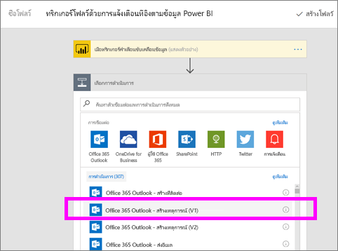
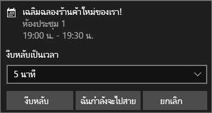

# Microsoft Flow และ Power BI

[Microsoft Flow](https://flow.microsoft.com/documentation/getting-started)คือ SaaS ที่นำเสนอสำหรับการทำงานอัตโนมัติสำหรับเวิร์กโฟลว์ในแอปพลิเคชันที่หลากหลายและบริการ SaaS ที่ผู้ใช้ทางธุรกิจใช้อยู่ ด้วยโฟลว์ คุณสามารถทำงานโดยอัตโนมัติ โดยการรวมแอปโปรดของคุณและบริการที่ (รวมถึง Power BI) เพื่อรับการแจ้งเตือน การซิงโครไนซ์ไฟล์ การเก็บรวบรวมข้อมูล และอื่น ๆ การทำงานซ้ำ ๆ กลายเป็นเรื่องง่าย ด้วยเวิร์คโฟลว์อัตโนมัติ

[เริ่มต้นใช้งานโฟลว์ตอนนี้เลย](https://flow.microsoft.com/documentation/getting-started)

ดู Sirui สร้างโฟลว์ที่ส่งอีเมลที่มีลายละเอียดให้เพื่อนร่วมงาน เมื่อการแจ้งเตือนของ Power BI ถูกทริกเกอร์ แล้ว ทำตามคำแนะนำทีละขั้นตอนด้านล่างวิดีโอเพื่อลองทำด้วยตนเอง

<iframe width="560" height="315" src="https://www.youtube.com/embed/YhmNstC39Mw" frameborder="0" allowfullscreen></iframe>

## สร้างโฟลว์ที่ทริกเกอร์ โดยข้อมูลการแจ้งเตือนของ Power BI

### ข้อกำหนดเบื้องต้น
บทเรียนนี้จะแสดงวิธีการสร้างโฟลว์ที่แตกต่างกันสองโฟลว์ หนึ่งโฟลว์จากเทมเพลตและอีกหนึ่งทำมาจากเริ่มต้น เพื่อทำตาม[สร้างการแจ้งเตือนข้อมูลใน Power BI](service-set-data-alerts.md)สร้างบัญชีผู้ใช้ฟรีของ Slack และ[ลงชื่อเข้าใช้ Microsoft Flow](https://flow.microsoft.com/#home-signup) (ซึ่งใช้ฟรี)

## สร้างโฟลว์ที่ใช้ Power BI จากเทมเพลต
ในงานนี้ เราจะใช้เทมเพลตเพื่อสร้างโฟลว์อย่างง่ายที่จะถูกทริกเกอร์ โดยการแจ้งเตือนข้อมูล Power BI (notification)

1. ลงชื่อเข้าใช้ Microsoft Flow (flow.microsoft.com)
2. ให้เลือก**โฟลว์ของฉัน**
   
   
3. ให้เลือก**สร้างจากเทมเพลต**
   
    
4. ใช้กล่องค้นหาเพื่อค้นหาเทมเพล Power BI และให้เลือก**ส่งอีเมลถึงผู้ชมใดๆ เมื่อการแจ้งเตือนข้อมูล Power BI ถูกทริกเกอร์ > ดำเนินการต่อ**
   
    

### สร้างโฟลว์
เทมเพลตนี้มีหนึ่งทริกเกอร์ (ข้อมูลแจ้งเตือน Power BI สำหรับเหรียญรโอลิมปิกใหม่ของไอร์แลนด์) และการดำเนินการหนึ่งอย่าง (ส่งอีเมล) เมื่อคุณเลือกเขตข้อมูล โฟลว์จะแสดงเนื้อหาแบบไดนามิกที่คุณสามารถรวม  ในตัวอย่างนี้ เราจะรวมค่าไทล์และ URL ไทล์ในเนื้อหาข้อความ

1. จากเมนูดรอปดาวน์ทริกเกอร์ ให้เลือกการแจ้งเตือนข้อมูล Power BI ให้เลือก**เหรียญรางวัลใหม่สำหรับไอร์แลนด์** เมื่อต้องการเรียนรู้วิธีการสร้างการแจ้งเตือน ให้ดู[การแจ้งเตือนข้อมูลใน Power BI](service-set-data-alerts.md)
   
   
2. ใส่ที่อยู่อีเมลที่ถูกต้องอย่างน้อยหนึ่งอีเมล์ จากนั้นให้เลือก**แก้ไข** (แสดงด้านล่าง) หรือ**เพิ่มเนื้อหาแบบไดนามิก** 
   
   

3. ขั้นตอนสร้างชื่อเรื่องและข้อความสำหรับคุณ ซึ่งคุณสามารถเก็บหรือปรับเปลี่ยนได้ ค่าทั้งหมดที่คุณตั้งค่าเมื่อคุณได้สร้างการแจ้งเตือนใน Power BI มันจะพร้อมใช้งาน เพียงแค่วางเคอร์เซอร์ของคุณ และเลือกจากพื้นที่การเน้นสีเทา 

   

1.  ตัวอย่างเช่น ถ้าคุณสร้างชื่อเรื่องการแจ้งเตือนใน Power BI เรื่อง**เราชนะเหรียญรางวัลอื่น**คุณสามาจะรถเลือก**ชื่อเรื่องการแจ้งเตือน**เพื่อเพิ่มข้อความนั้นลงในเช่องชื่อเรื่องอีเมลของคุณได้

    

    และคุณสามารถใช้เนื้อความอีเมลเริ่มต้น หรือสร้างด้วยตนเองได้ ตัวอย่างข้างต้นประกอบด้วยการปรับเปลี่ยนข้อความเพียงไม่กี่จุด

1. เมื่อคุณทำเสร็จแล้ว ให้เลือก**สร้างโฟลว์**หรือ**บันทึกโฟลว์**  ขั้นตอนถูกสร้างขึ้นและถูกประเมิน  ขั้นตอนช่วยให้คุณทราบถ้าพบข้อผิดพลาด
2. ถ้าพบข้อผิดพลาด ให้เลือก**แก้ไขโฟลว์**เมื่อต้องการแก้ไขปัญหาเหล่านั้น ถ้าไม่ ให้เลือก**เสร็จแล้ว**เพื่อเรียกใช้โฟลว์ใหม่
   
   
5. เมื่อการแจ้งเตือนข้อมูลถูกทริกเกอร์ อีเมลที่จะถูกส่งไปยังที่อยู่คุณระบุ  
   
   

## สร้างโฟลว์ที่ใช้ Power BI แบบตั้งแต่เริ่มต้น (ว่าง)
ในงานนี้ เราจะสร้างโฟลว์ง่ายๆ ตั้งแต่เริ่มต้น ซึ่งจะถูกทริกเกอร์โดยการแจ้งเตือนข้อมูล Power BI (notification)

1. ลงชื่อเข้าใช้ Microsoft Flow
2. ให้เลือก**โฟลว์ของฉัน** > **สร้างจากเอกสารเปล่า**
   
   
3. ใช้กล่องค้นหาเพื่อค้นหาทริกเกอร์ Power BI และเลือก**Power BI เมื่อการแจ้งเตือนข้อมูลถูกทริกเกอร์**

### สร้างโฟลว์ของคุณ
1. จากรายการแบบดร๊อปดาวน์ ให้เลือกชื่อของการแจ้งเตือนของคุณ  เมื่อต้องการเรียนรู้วิธีการสร้างการแจ้งเตือน ให้ดู[การแจ้งเตือนข้อมูลใน Power BI](service-set-data-alerts.md)
   
    
2. เลือก**ขั้นตอนใหม่** > **เพิ่มแอคชัน**
   
   
3. ให้ค้นหา**Outlook**และให้เลือก**สร้างเหตุการณ์**
   
   
4. กรอกเขตข้อมูลในช่องเหตุการณ์ เมื่อคุณเลือกเขตข้อมูล โฟลว์จะแสดงเนื้อหาแบบไดนามิกที่คุณสามารถรวม
   
   
5. ให้เลือก **สร้างโฟลว์**เมื่อทำเสร็จแล้ว  โฟลว์จะบันทึกและประเมิน ถ้าไม่ มีข้อผิดพลาด ให้เลือก**เสร็จสิ้น**เพื่อเรียกใช้โฟลว์นี้  ขั้นตอนใหม่ถูกเพิ่มลงในหน้า**โฟลว์ของฉัน**
   
   
6. เมื่อโฟลว์ถูกทริกเกอร์ โดยการแจ้งเตือนข้อมูล Power BI คุณจะได้รับการแจ้งเตือนเหตุการณ์บน Outlook ที่คล้ายกัน
   
    

## ขั้นตอนถัดไป
* [เริ่มต้นใช้งาน Microsoft Flow](https://flow.microsoft.com/documentation/getting-started/)
* [ตั้งค่าการแจ้งเตือนข้อมูลใน Power BI service](service-set-data-alerts.md)
* [ตั้งค่าการแจ้งเตือนข้อมูลบน iPhone ของคุณ](consumer/mobile/mobile-set-data-alerts-in-the-mobile-apps.md)
* [ตั้งค่าการแจ้งเตือนข้อมูลในแอป Power BI สำหรับอุปกรณ์เคลื่อนที่สำหรับ Windows 10](consumer/mobile/mobile-set-data-alerts-in-the-mobile-apps.md)
* มีคำถามเพิ่มเติมหรือไม่? [ลองไปที่ชุมชน Power BI](http://community.powerbi.com/)

