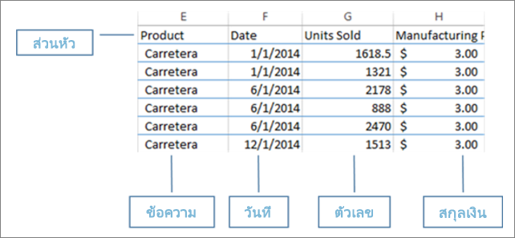
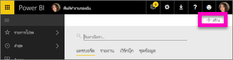
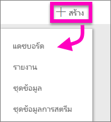
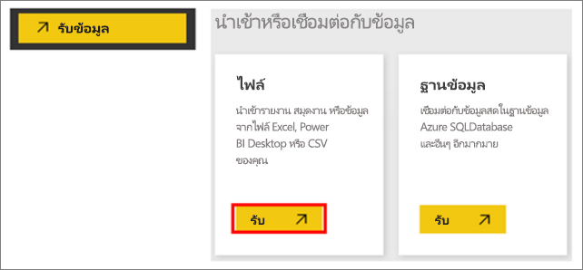
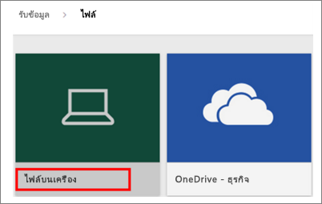
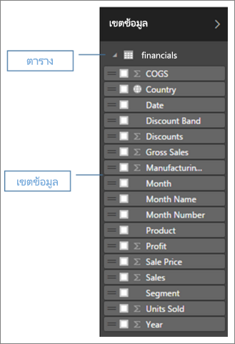
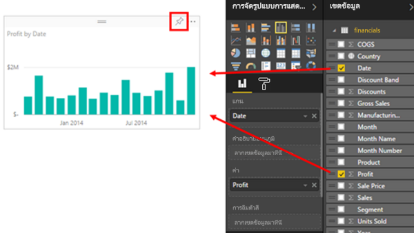
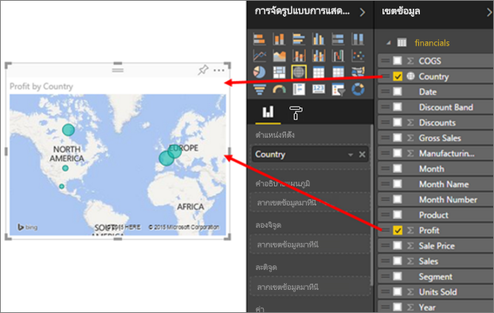
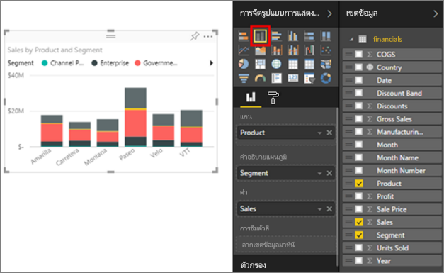
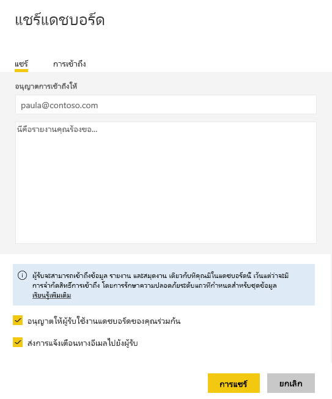

# จากสมุดงาน Excel สู่รายงานอันน่าตื่นตาตื่นใจเพียงครู่เดียว
ผู้จัดการต้องการดูรายงานตัวเลขยอดขายของคุณที่รวมข้อมูลที่น่าประทับใจจากแคมเปญล่าสุดภายในวันนี้ แต่ข้อมูลล่าสุดอยู่ในระบบของบุคคลที่สามต่าง ๆ และบนไฟล์ในคอมพิวเตอร์โน๊ตบุ๊คของคุณ ในอดีตต้องใช้เวลาหลายชั่วโมงในการสร้างภาพและจัดรูปแบบรายงาน คุณเริ่มรู้สึกตื่นตระหนก

ไม่ต้องกังวล ด้วย Power BI คุณสามารถสร้างรายงานอันน่าทึ่งได้ในเพียงน้อยนิด

ในตัวอย่างนี้ เราจะอัปโหลดไฟล์ Excel จากระบบภายใน สร้างรายงานใหม่ และแชร์กับเพื่อนร่วมงาน ทั้งหมดนี้ทำได้ภายใน Power BI

## จัดเตรียมข้อมูลของคุณ
เราใช้ไฟล์ Excel ง่าย ๆ เพื่อแสดงเป็นตัวอย่าง ก่อนที่คุณสามารถโหลดไฟล์ Excel ของคุณลงใน Power BI คุณต้องจัดระเบียบข้อมูลของคุณในตารางเดียวก่อน ซึ่งหมายความว่า แต่ละคอลัมน์ประกอบด้วยข้อมูลประเภทเดียวกัน ตัวอย่างเช่น ข้อความ วันที่ ตัวเลข หรือสกุลเงิน ตอนนี้คุณควรมีแถวส่วนหัว แต่ไม่ควรมีคอลัมน์หรือแถวที่แสดงผลรวมใด ๆ

ถัดไป จัดรูปแบบข้อมูลของคุณเป็นหนึ่งตาราง ใน Excel ที่แถบ Home ในกลุ่มสไตล์ เลือก**จัดรูปแบบเป็นตาราง** เลือกลักษณะตารางที่จะนำไปใช้กับแผ่นงานของคุณ ขณะนี้แผ่นงาน Excel ของคุณพร้อมที่จะโหลดลงใน Power BI

## อัปโหลดไฟล์ Excel ของคุณไปยัง Power BI
Power BI เชื่อมต่อกับแหล่งข้อมูลจำนวนมาก รวมถึงไฟล์ Excel ที่อยู่บนคอมพิวเตอร์ของคุณ ลงชื่อเข้าบริการ Power BI เพื่อเริ่มใช้งาน หากคุณยังไม่ได้ลงทะเบียน[คุณสามารถทำได้โดยไม่มีค่าใช้จ่าย](https://powerbi.com)

คุณต้องการสร้างแดชบอร์ดใหม่ เปิด**พื้นที่ทำงานของฉัน**และเลือกไอคอน **+ สร้าง**

เลือก**แดชบอร์ด** ใส่ชื่อ และเลือก**สร้าง** แดชบอร์ดใหม่แสดงขึ้น - ที่ไม่มีข้อมูล

ที่ด้านล่างของพื้นที่นำทางด้านซ้าย เลือก**รับข้อมูล** ที่หน้าการรับข้อมูล ใต้การนำเข้าหรือเชื่อมต่อกับข้อมูลในกล่องแฟ้ม เลือก**รับ**

ที่หน้าไฟล์ เลือก**ไฟล์ภายในเครื่อง** นำทางไปยังแฟ้มสมุดงาน Excel บนคอมพิวเตอร์ของคุณ และเลือกไฟล์ดังกล่าวเพื่อโหลดลงใน Power BI เลือก**นำเข้า**

> **หมายเหตุ**: การทำตามส่วนที่เหลือของบทช่วยสอนนี้ ให้ใช้[สมุดงานตัวอย่างการเงิน](sample-financial-download.md)
> 
> 

## บันทึกรายงานของคุณ
หลังจาก Power BI นำเข้าไฟล์ Excel ของคุณแล้ว คุณเริ่มสร้างรายงานของคุณได้ เมื่อข้อความ **ชุดข้อมูลของคุณพร้อม** ปรากฏขึ้น ให้เลือก**ดูชุดข้อมูล**  Power BI เปิดขึ้นในมุมมองการแก้ไขและแสดงพื้นที่รายงาน ที่ด้านขวาคือการแสดงภาพ ตัวกรอง และพื้นที่ข้อมูล

โปรดสังเกตว่า ข้อมูลในตารางสมุดงาน Excel ของคุณปรากฏในพื้นที่ข้อมูลดังกล่าว ที่ใต้ชื่อของตาราง Power BI แสดงรายการของส่วนหัวของคอลัมน์เป็นแต่ละช่อง

ตอนนี้คุณสามารถเริ่มต้นสร้างการแสดงภาพได้ ผู้จัดการของคุณต้องการดูกำไรในช่วงเวลาที่ผ่านมา ในพื้นที่ช่องข้อมูล ลาก**กำไร**ไปยังพื้นที่ของรายงาน Power BI แสดงแผนภูมิแท่งตามค่าเริ่มต้น ถัดไป ลาก**วันที่**ไปยังพื้นที่ของรายงาน Power BI อัปเดตแผนภูมิแท่งเพื่อแสดงกำไรตามวันที่

> **คำแนะนำ**: ถ้าแผนภูมิของคุณดูไม่เหมือนกับที่คุณคาดหวังไว้ ตรวจสอบการรวมข้อมูลของคุณ ตัวอย่างเช่น ในบริเวณ**ค่า** คลิกขวาที่ช่องข้อมูลที่คุณเพิ่งเพิ่มเข้ามา และตรวจสอบให้แน่ใจว่าข้อมูลรวมกันด้วยวิธีที่ีคุณต้องการ  ในตัวอย่างนี้ เรากำลังใช้**ผลรวม**
> 
> 

ผู้จัดการของคุณต้องการทราบว่าประเทศใดทำกำไรมากที่สุด สร้างความประทับใจให้กับผู้จัดการโดยแสดงภาพแผนที่ เลือกพื้นที่ว่างบนพื้นที่ของคุณ และจากพื้นที่ช่องข้อมูล เพียงลาก**ประเทศ**มา จากนั้นลากช่อง**กำไร** Power BI สร้างภาพแผนที่พร้อมฟองอากาศที่เป็นตัวแทนผลกำไรของแต่ละพื้นที่

คุณต้องการแสดงภาพที่นำเสนอยอดขายตามภาคส่วนผลิตภัณฑ์และการตลาดหรือไม่? ทำได้ง่าย ในช่องพื้นที่ข้อมูล เลือกกล่องข้อความถัดจากช่องการขาย ผลิตภัณฑ์ และภาคส่วน Power BI สร้างแผนภูมิแท่งได้ทันที เปลี่ยนชนิดของแผนภูมิโดยการเลือกหนึ่งในไอคอนในเมนูการสร้างภาพข้อมูล เช่น เปลี่ยนเป็นแผนภูมิแท่งแบบเรียงซ้อนกัน  เมื่อต้องการเรียงลำดับแผนภูมิ เลือกจุดไข่ปลา (...) > **เรียงลำดับตาม**

ปักหมุดภาพทั้งหมดของคุณไปยังแดชบอร์ด คุณพร้อมที่จะแชร์กับเพื่อนร่วมงานของคุณ

## แชร์แดชบอร์ดของคุณ
คุณต้องการแชร์แดชบอร์ดของคุณกับผู้จัดการ นั่นคือ Paula คุณสามารถแชร์แดชบอร์ดและรายงานที่สำคัญของคุณกับเพื่อนร่วมงานที่มีบัญชี Power BI บุคคลเหล่านี้สามารถโต้ตอบกับรายงานของคุณ แต่ไม่สามารถบันทึกการเปลี่ยนแปลงได้

เมื่อต้องการแชร์รายงานของคุณ ที่ด้านบนสุดของแดชบอร์ด ให้เลือก**แชร์**

Power BI แสดงหน้าแชร์แดชบอร์ด ในพื้นที่ด้านบนสุด ใส่ที่อยู่อีเมลผู้รับ เพิ่มข้อความในช่องข้อมูลด้านล่าง เมื่อต้องการอนุญาตให้ผู้รับแชร์แดชบอร์ดของคุณกับผู้อื่น เลือก**อนุญาตให้ผู้รับแชร์แดชบอร์ดของคุณ** เลือก**แชร์**

ขั้นตอนถัดไป

* [เริ่มต้นใช้งานบริการ Power BI](service-get-started.md)
* [เริ่มต้นใช้งาน Power BI Desktop](desktop-getting-started.md)
* [Power BI - แนวคิดพื้นฐาน](consumer/end-user-basic-concepts.md)
* มีคำถามเพิ่มเติมหรือไม่ [ลองไปที่ชุมชน Power BI](http://community.powerbi.com/)

