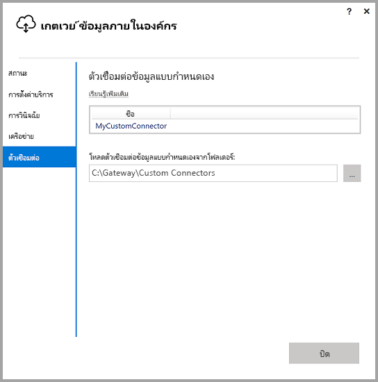
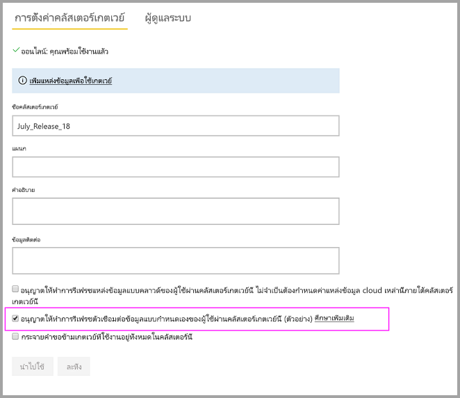
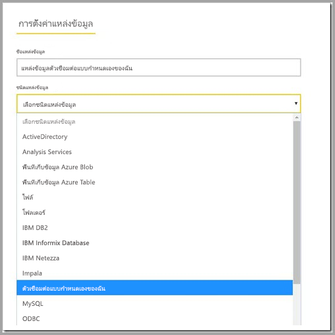

# ใช้ตัวเชื่อมต่อข้อมูลแบบกำหนดเองกับเกตเวย์ข้อมูลภายในองค์กร

[!INCLUDE [gateway-rewrite](includes/gateway-rewrite.md)]

ด้วยความสามารถของตัวเชื่อมต่อข้อมูลสำหรับ Power BI คุณสามารถเชื่อมต่อและเข้าถึงข้อมูลจากแอปพลิเคชัน บริการ หรือแหล่งข้อมูล คุณสามารถพัฒนาตัวเชื่อมต่อข้อมูลแบบกำหนดเอง และใช้งานได้ใน Power BI Desktop

เมื่อต้องการเรียนรู้เพิ่มเติมเกี่ยวกับวิธีการพัฒนาตัวเชื่อมต่อข้อมูลแบบกำหนดเองสำหรับ Power BI ให้ดู [หน้า SDK GitHub ของตัวเชื่อมต่อข้อมูล](https://aka.ms/dataconnectors) เว็บไซต์นี้มีข้อมูลเกี่ยวกับวิธีเริ่มต้นใช้งานและตัวอย่างสำหรับ Power BI และ Power Query

เมื่อคุณสร้างรายงานใน Power BI Desktop ที่ใช้ตัวเชื่อมต่อข้อมูลแบบกำหนดเอง คุณสามารถใช้เกตเวย์ข้อมูลภายในองค์กรเพื่อรีเฟรชรายงานเหล่านั้นจากบริการของ Power BI

## เปิดใช้งานและใช้ความสามารถนี้

เมื่อคุณติดตั้งเกตเวย์ข้อมูลภายในองค์กรเวอร์ชันเดือนกรกฎาคม 2018 หรือเวอร์ชันที่ใหม่กว่า คุณสามารถดูแท็บ **ตัวเชื่อมต่อ** ในเกตเวย์ข้อมูลภายในองค์กร ในกล่อง **โหลดตัวเชื่อมต่อข้อมูลแบบกำหนดเองจากโฟลเดอร์** ให้เลือกโฟลเดอร์ที่สามารถเข้าถึงได้โดยผู้ใช้ที่ใช้บริการเกตเวย์ ผู้ใช้ค่าเริ่มต้น คือ *NT SERVICE\PBIEgwService.* เกตเวย์จะโหลดไฟล์ตัวเชื่อมต่อแบบกำหนดเองที่อยู่ในโฟลเดอร์นั้นโดยอัตโนมัติ ซึ่งจะปรากฏในรายการตัวเชื่อมต่อข้อมูล

ถ้าคุณกำลังใช้เกตเวย์ข้อมูลภายในองค์กร (โหมดส่วนบุคคล) คุณจะสามารถอัปโหลดรายงาน Power BI ของคุณไปยังบริการของ Power BI และใช้เกตเวย์เพื่อรีเฟรช

สำหรับเกตเวย์ข้อมูลภายในองค์กร คุณจำเป็นต้องสร้างแหล่งข้อมูลสำหรับตัวเชื่อมต่อแบบกำหนดเองของคุณ ในหน้าการตั้งค่าเกตเวย์ในบริการ Power BI คุณควรเห็นตัวเลือกเมื่อคุณเลือกคลัสเตอร์เกตเวย์เพื่ออนุญาตให้ใช้ตัวเชื่อมต่อแบบกำหนดเองที่มีคลัสเตอร์นี้ ตรวจสอบให้แน่ใจว่าเกตเวย์ทั้งหมดในคลัสเตอร์มีรุ่นอัปเดตเดือนกรกฎาคม 2018 หรือใหม่กว่าสำหรับตัวเลือกนี้เพื่อให้พร้อมใช้งาน เลือกตัวเลือกนั้นเพื่อเปิดใช้งานโดยใช้ตัวเชื่อมต่อแบบกำหนดเองที่มีคลัสเตอร์นี้

เมื่อคุณเปิดใช้งานตัวเลือกนี้ คุณเห็นตัวเชื่อมต่อแบบกำหนดเองของคุณเป็นแหล่งข้อมูลที่พร้อมใช้งานที่คุณสามารถสร้างภายใต้คลัสเตอร์เกตเวย์นี้ หลังจากคุณสร้างแหล่งข้อมูลโดยใช้ตัวเชื่อมต่อแบบกำหนดเองของคุณใหม่ คุณสามารถรีเฟรชรายงาน Power BI โดยใช้ตัวเชื่อมต่อแบบกำหนดเองนั้นในบริการ Power BI

## ข้อควรพิจารณาและข้อจำกัด

* ตรวจสอบให้แน่ใจว่าโฟลเดอร์ที่คุณสร้างจะสามารถเข้าถึงบริการเกตเวย์พื้นหลัง โดยทั่วไปแล้ว โฟลเดอร์ภายใต้โฟลเดอร์ Windows หรือโฟลเดอร์ระบบของผู้ใช้ของคุณจะไม่สามารถเข้าถึงได้ แอปเกตเวย์ข้อมูลภายในองค์กรจะแสดงข้อความถ้าไม่สามารถเข้าถึงโฟลเดอร์ได้ คำแนะนำนี้ใช้ไม่ได้กับเกตเวย์ข้อมูลภายในองค์กร (โหมดส่วนบุคคล)
* สำหรับตัวเชื่อมต่อแบบกำหนดเองเพื่อทำงานกับเกตเวย์ข้อมูลภายในองค์กร พวกเขาจำเป็นต้องใช้ส่วน "TestConnection" ในรหัสของตัวเชื่อมต่อแบบกำหนดเอง ส่วนนี้ไม่จำเป็นเมื่อคุณใช้ตัวเชื่อมต่อแบบกำหนดเองกับ Power BI Desktop ด้วยเหตุผลนี้ คุณสามารถมีตัวเชื่อมต่อที่ใช้งานได้กับ Power BI Desktop แต่ไม่ใช่กับเกตเวย์ สำหรับข้อมูลเพิ่มเติมเกี่ยวกับวิธีการใช้งาน TestConnection โปรดดู [เอกสารนี้](https://github.com/Microsoft/DataConnectors/blob/master/docs/m-extensions.md#implementing-testconnection-for-gateway-support)

## ขั้นตอนถัดไป

* [จัดการแหล่งข้อมูลของคุณ - Analysis Services](service-gateway-enterprise-manage-ssas.md)  
* [จัดการแหล่งข้อมูลของคุณ - SAP HANA](service-gateway-enterprise-manage-sap.md)  
* [จัดการแหล่งข้อมูลของคุณ - SQL Server](service-gateway-enterprise-manage-sql.md)  
* [จัดการแหล่งข้อมูลของคุณ - Oracle](service-gateway-onprem-manage-oracle.md)  
* [จัดการแหล่งข้อมูลของคุณ - นำเข้า/รีเฟรชตามกำหนดการ](service-gateway-enterprise-manage-scheduled-refresh.md)
* [กำหนดค่าการตั้งค่าพร็อกซีสำหรับเกตเวย์ข้อมูลภายในองค์กร](/data-integration/gateway/service-gateway-proxy)
* [ใช้ Kerberos สำหรับลงชื่อเข้าใช้ครั้งเดียว (SSO) จาก Power BI ไปยังแหล่งข้อมูลภายในองค์กร](service-gateway-sso-kerberos.md)  

มีคำถามเพิ่มเติมหรือไม่? ลองถาม[ชุมชน Power BI](https://community.powerbi.com/)
