# จัดการแหล่งข้อมูล

[!INCLUDE [gateway-rewrite](includes/gateway-rewrite.md)]

Power BI สนับสนุนแหล่งข้อมูลภายในองค์กรมากมาย ซึ่งแต่ละชนิดข้อกำหนดของตนเอง สามารถใช้เกตเวย์สำหรับแหล่งข้อมูลเดียวหรือหลายแหล่งข้อมูล สำหรับตัวอย่างนี้ เราจะแสดงให้คุณเห็นวิธีการเพิ่ม SQL Server เป็นแหล่งข้อมูล ขั้นตอนก็จะคล้ายกับแหล่งข้อมูลอื่น ๆ

การดำเนินการจัดการแหล่งข้อมูลส่วนใหญ่สามารถดำเนินการได้โดยใช้ API ด้วยเช่นกัน สำหรับข้อมูลเพิ่มเติม ดู[Rest APIs (เกตเวย์)](/rest/api/power-bi/gateways)

## เพิ่มแหล่งข้อมูล

1. ที่มุมบนขวาของบริการของ Power BI เลือกไอคอนรูปเฟือง  > **จัดการเกตเวย์**

    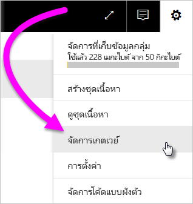

2. เลือกเกตเวย์แล้วเลือก**เพิ่มแหล่งข้อมูล** หรือไปที่**เกตเวย์** > **เพิ่มแหล่งข้อมูล**

    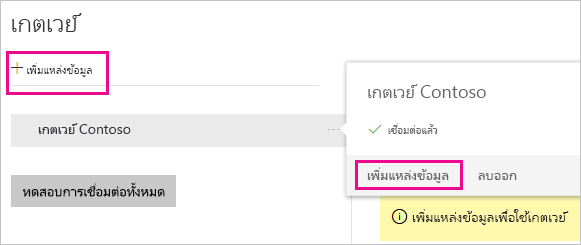

3. เลือก**ชนิดแหล่งข้อมูล**

    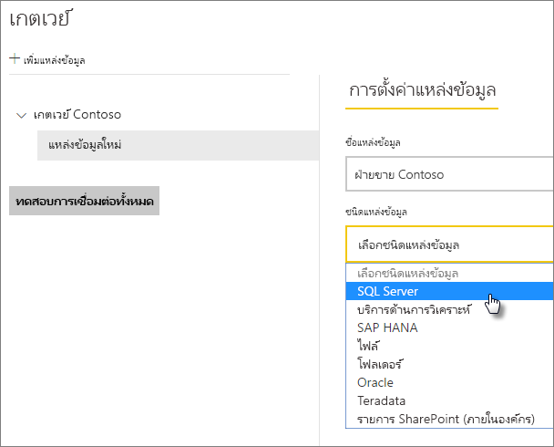

4. ป้อนข้อมูลสำหรับแหล่งข้อมูล สำหรับตัวอย่างนี้ มี**เซิร์ฟเวอร์**, **ฐานข้อมูล** และข้อมูลอื่น ๆ 

    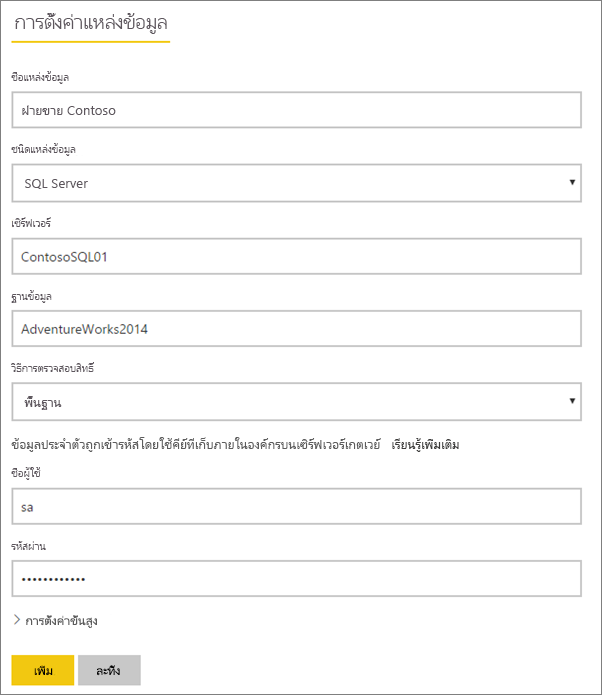

5. สำหรับ SQL Server คุณต้องเลือก**วิธีการรับรองความถูกต้อง**ของ **Windows** หรือ**พื้นฐาน** (การรับรองความถูกต้อง SQL) ถ้าคุณเลือกแบบ**พื้นฐาน** ใส่ข้อมูลประจำตัวสำหรับแหล่งข้อมูลของคุณ

6. ภายใต้**การตั้งค่าขั้นสูง** อาจกำหนดค่า[ระดับความเป็นส่วนตัว](https://support.office.com/article/Privacy-levels-Power-Query-CC3EDE4D-359E-4B28-BC72-9BEE7900B540) สำหรับแหล่งข้อมูลของคุณ (ไม่ใช้กับ [DirectQuery](desktop-directquery-about.md))

    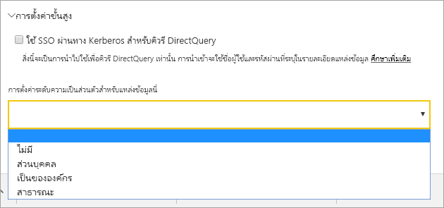

7. เลือก**เพิ่ม** คุณจะเห็นข้อความ*การเชื่อมต่อเป็นที่สำเร็จ* ถ้ากระบวนการสำเร็จ

    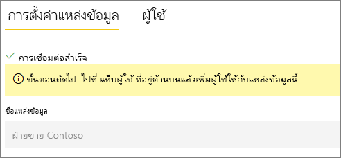

ตอนนี้คุณสามารถใช้แหล่งข้อมูลนี้เพื่อรวมข้อมูลจาก SQL Server ลงในแดชบอร์ดและรายงาน Power BI ของคุณ

## ลบแหล่งข้อมูล

คุณสามารถลบแหล่งข้อมูลออกถ้าคุณไม่ใช้อีกต่อไป การลบแหล่งข้อมูลออกจะทำให้แดชบอร์ดและรายงานที่ขึ้นกับแหล่งข้อมูลนั้นไม่ทำงาน

เพื่อลบแหล่งข้อมูล ให้ไปยังแหล่งข้อมูลแล้วเลือก**ลบออก**

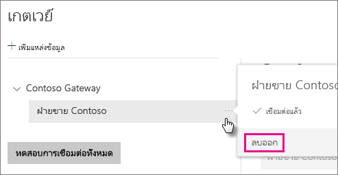

## ใช้แหล่งข้อมูลสำหรับการรีเฟรชตามกำหนดการหรือ DirectQuery

หลังจากที่คุณสร้างแหล่งข้อมูล รายการนี้จะพร้อมใช้งานเมื่อต้องใช้ทั้งกับการเชื่อมต่อ DirectQuery หรือการเชื่อมต่อสดผ่านการรีเฟรชตามกำหนดการ

> [!NOTE]
>ชื่อเซิร์ฟเวอร์และชื่อฐานข้อมูลจะต้องตรงกับ Power BI Desktop และแหล่งข้อมูลภายในเกตเวย์ข้อมูลภายในองค์กร

การเชื่อมโยงระหว่างชุดข้อมูลของคุณและแหล่งข้อมูลในเกตเวย์จะเป็นไปตามชื่อเซิร์ฟเวอร์และชื่อฐานข้อมูลของคุณ ชื่อเหล่านี้ต้องตรงกัน ตัวอย่างเช่น ถ้าคุณใส่ที่อยู่ IP สำหรับชื่อเซิร์ฟเวอร์ ใน Power BI Desktop คุณต้องใช้ที่อยู่ IP สำหรับแหล่งข้อมูลในการกำหนดค่าเกตเวย์ด้วยเช่นกัน ถ้าคุณใช้ *SERVER\INSTANCE* ใน Power BI Desktop คุณต้องใช้ชื่อเดียวกันในแหล่งข้อมูลที่กำหนดค่าไว้สำหรับเกตเวย์ดังกล่าว

ถ้าคุณอยู่ในแท็บ **ผู้ใช้** ของแหล่งข้อมูลที่กำหนดค่าไว้ในเกตเวย์ และชื่อเซิร์ฟเวอร์และชื่อฐานข้อมูลตรงกัน คุณจะเห็นเกตเวย์เป็นตัวเลือกเพื่อใช้กับการรีเฟรชตามกำหนดการ

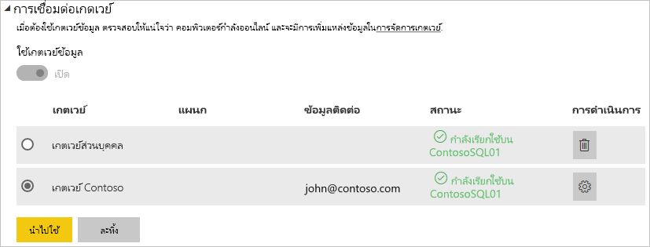

> [!WARNING]
> ถ้าชุดข้อมูลของคุณประกอบด้วยแหล่งข้อมูลหลายแหล่ง คุณต้องเพิ่มแต่ละแหล่งข้อมูลในเกตเวย์ดังกล่าว ถ้าไม่ได้เพิ่มแหล่งข้อมูลอย่างน้อยหนึ่งแหล่งเข้าไปในเกตเวย์ คุณจะไม่เห็นเกตเวย์ดังกล่าวเป็นสถานะพร้อมใช้งานสำหรับการรีเฟรชตามกำหนดการ

### ข้อจำกัด

OAuth เป็นเค้าร่างการรับรองความถูกต้องที่ได้รับการสนับสนุนเฉพาะสำหรับการเชื่อมต่อกับเกตเวย์ข้อมูลภายในองค์กรเท่านั้น คุณไม่สามารถเพิ่มแหล่งข้อมูลที่ต้องใช้ OAuth ได้ ถ้าชุดข้อมูลของคุณมีแหล่งข้อมูลที่ต้องมี OAuth และชุดข้อมูลนี้ไม่ใช่ตัวเชื่อมต่อแบบกำหนดเอง คุณจะไม่สามารถใช้เกตเวย์ดังกล่าวสำหรับการรีเฟรชตามกำหนดการได้

## จัดการผู้ใช้

หลังจากที่คุณเพิ่มแหล่งข้อมูลให้กับเกตเวย์แล้ว คุณสามารถให้สิทธิการเข้าถึงแหล่งข้อมูลที่กำหนดแก่ผู้ใช้และกลุ่มความปลอดภัยที่เปิดใช้งานอีเมล (ไม่ใช่ทั้งเกตเวย์) รายชื่อผู้ใช้ของแหล่งข้อมูล ควบคุมว่าใครสามารถเผยแพร่รายงานที่รวมข้อมูลจากแหล่งข้อมูลนั้น เจ้าของรายงานสามารถสร้างแดชบอร์ด ชุดเนื้อหา และแอป จากนั้นแชร์รายการเหล่านั้นให้กับผู้ใช้รายอื่นได้

คุณยังสามารถให้ผู้ใช้และกลุ่มความปลอดภัย เข้าถึงเกตเวย์ในระดับผู้ดูแล

### เพิ่มผู้ใช้ไปยังแหล่งข้อมูล

1. ที่มุมบนขวาของบริการของ Power BI เลือกไอคอนรูปเฟือง  > **จัดการเกตเวย์**

2. เลือกแหล่งข้อมูลที่คุณต้องการเพิ่มผู้ใช้

3. เลือก**ผู้ใช้** และป้อนผู้ใช้จากองค์กรของคุณ ที่คุณต้องการให้สิทธิ์การเข้าถึงแหล่งข้อมูลที่เลือก ตัวอย่างเช่น ในหน้าจอต่อไปนี้ คุณเพิ่ม Maggie และ Adam

    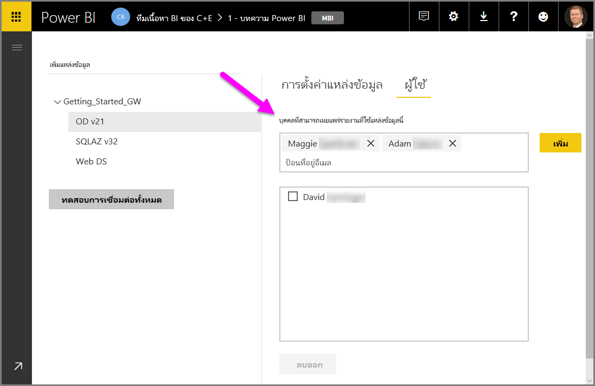

4. เลือก**เพิ่ม** และชื่อของสมาชิกที่เพิ่มจะแสดงขึ้นในกล่อง

    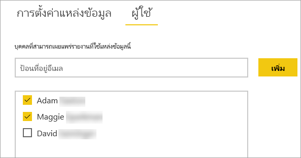

โปรดทราบคุณต้องเพิ่มผู้ใช้ไปยังแต่ละแหล่งข้อมูลที่คุณต้องการให้สิทธิ์เข้าใช้ แต่ละแหล่งข้อมูลมีรายการชื่อผู้ใช้ที่แยกต่างหาก เพิ่มผู้ใช้ไปยังแต่ละแหล่งข้อมูลแยกต่างหาก

### เอาผู้ใช้ออกจากแหล่งข้อมูล

บนแท็บ**ผู้ใช้**สำหรับแหล่งข้อมูล คุณสามารถเอาผู้ใช้และกลุ่มความปลอดภัยที่ใช้แหล่งข้อมูลนี้ออกได้

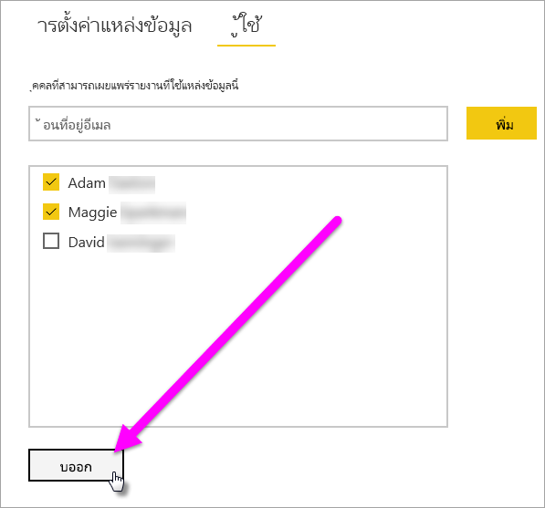

## จัดเก็บข้อมูลประจำตัวเข้ารหัสลับในระบบคลาวด์

เมื่อคุณเพิ่มแหล่งข้อมูลกับเกตเวย์ คุณต้องใส่ข้อมูลประจำตัวสำหรับแหล่งข้อมูลนั้น คิวรีทั้งหมดที่ไปยังแหล่งข้อมูลจะทำงานโดยใช้ข้อมูลประจำตัวเหล่านี้ ข้อมูลประจำตัวจะมีการเข้ารหัสลับอย่างปลอดภัย โดยการใช้การเข้ารหัสลับสมมาตรเพื่อให้ไม่สามารถถอดรหัสในระบบคลาวด์ก่อนที่จะถูกจัดเก็บในระบบคลาวด์ ข้อมูลประจำตัวถูกส่งไปยังเครื่องที่เรียกใช้เกตเวย์ภายในองค์กร ที่ข้อมูลเหล่านี้จะถูกถอดรหัสลับเมื่อมีการเข้าถึงแหล่งข้อมูล

## รายการของชนิดแหล่งข้อมูลที่พร้อมใช้งาน

เกตเวย์ข้อมูลภายในองค์กรสนับสนุนแหล่งข้อมูลต่อไปนี้สำหรับ Power BI นอกเหนือจากแหล่งข้อมูลภายในองค์กร แหล่งที่มาที่อยู่เบื้องหลังไฟร์วอลล์, VPN หรือเครือข่ายเสมือนอาจจำเป็นต้องใช้เกตเวย์ข้อมูลด้วย

| **แหล่งข้อมูล** | **Live/DirectQuery** | **การรีเฟรชด้วยตนเองหรือตามกำหนดการ (ผู้ใช้กำหนดค่า)** |
| --- | --- | --- |
| Amazon Redshift |ใช่ |ใช่ |
| คิวบ์ AtScale |ใช่ |ใช่ |
| Azure Active Directory |ไม่ใช่ |ใช่ |
| Azure Analysis Services |ใช่ |ใช่ |
| พื้นที่เก็บข้อมูล Azure Blob |ไม่ใช่ |ใช่ |
| Azure DevOps Server |ไม่ใช่ |ใช่ |
| พื้นที่เก็บข้อมูล Azure Table |ไม่ใช่ |ใช่ |
| BI Connector |ใช่ |ใช่ |
| Denodo |ใช่ |ใช่ |
| Dremio |ใช่ |ใช่ |
| EmigoDataSourceConnector |ไม่ใช่ |ใช่ |
| Essbase |ใช่ |ใช่ |
| Exasol |ใช่ |ใช่ |
| ไฟล์ |ไม่ใช่ |ใช่ |
| โฟลเดอร์ |ไม่ใช่ |ใช่ |
| Paxata |ไม่ใช่ |ใช่ |
| IBM DB2 |ใช่ |ใช่ |
| ฐานข้อมูล IBM Informix |ไม่ใช่ |ใช่ |
| IBM Netezza |ใช่ |ใช่ |
| Impala |ใช่ |ใช่ |
| Jethro ODBC |ใช่ |ใช่ |
| Kyligence Enterprise |ใช่ |ใช่ |
| MarkLogic ODBC |ใช่ |ใช่ |
| การรักษาความปลอดภัยของ Microsoft Graph |ไม่ใช่ |ใช่ |
| MySQL |ไม่ใช่ |ใช่ |
| ODBC |ไม่ใช่ |ใช่ |
| OData |ไม่ใช่ |ใช่ |
| OLE DB |ไม่ใช่ |ใช่ |
| Oracle |ใช่ |ใช่ |
| PostgreSQL |ไม่ใช่ |ใช่ |
| QubolePresto |ใช่ |ใช่ |
| Quick Base Connector |ไม่ใช่ |ใช่ |
| เซิร์ฟเวอร์ข้อความ SAP Business Warehouse |ใช่ |ใช่ |
| เซิร์ฟเวอร์ SAP Business Warehouse |ใช่ |ใช่ |
| SAP HANA |ใช่ |ใช่ |
| เซิร์ฟเวอร์ SQL |ใช่ |ใช่ |
| SharePoint |ไม่ใช่ |ใช่ |
| Snowflake |ใช่ |ใช่ |
| Spark |ใช่ |ใช่ |
| SurveyMonkey |ไม่ใช่ |ใช่ |
| Sybase |ไม่ใช่ |ใช่ |
| TeamDesk.Database |ไม่ใช่ |ใช่ |
| Teradata |ใช่ |ใช่ |
| Vertica |ใช่ |ใช่ |
| เว็บ |ไม่ใช่ |ใช่ |
| Workforce Dimensions |ไม่ใช่ |ใช่ |

## ขั้นตอนถัดไป

* [จัดการแหล่งข้อมูลของคุณ - Analysis Services](service-gateway-enterprise-manage-ssas.md)
* [จัดการแหล่งข้อมูลของคุณ - SAP HANA](service-gateway-enterprise-manage-sap.md)
* [จัดการแหล่งข้อมูลของคุณ - SQL Server](service-gateway-enterprise-manage-sql.md)
* [จัดการแหล่งข้อมูลของคุณ - Oracle](service-gateway-onprem-manage-oracle.md)
* [จัดการแหล่งข้อมูลของคุณ - นำเข้า/รีเฟรชตามกำหนดการ](service-gateway-enterprise-manage-scheduled-refresh.md)
* [คำแนะนำสำหรับการปรับใช้เกตเวย์ข้อมูล](service-gateway-deployment-guidance.md)

มีคำถามเพิ่มเติมหรือไม่? ลองไปที่ [ชุมชน Power BI](http://community.powerbi.com/)
