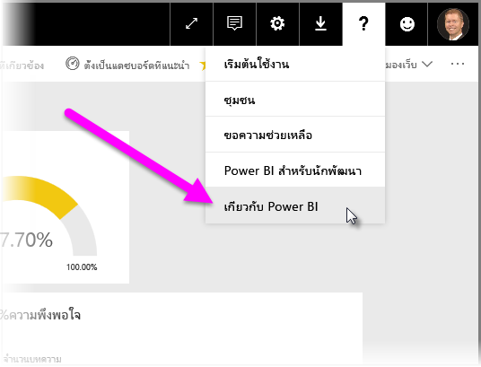

# คำแนะนำสำหรับการปรับใช้เกตเวย์ข้อมูลจาก Power BI

[!INCLUDE [gateway-rewrite](includes/gateway-rewrite.md)]

บทความนี้มีคำแนะนำและข้อควรพิจารณาสำหรับการปรับใช้เกตเวย์ข้อมูลสำหรับ Power BI ในสภาพแวดล้อมเครือข่ายของคุณ

สำหรับข้อมูลเกี่ยวกับวิธีการดาวน์โหลด ติดตั้ง กำหนดค่า และจัดการเกตเวย์ข้อมูลภายในองค์กร ให้ดูที่ [เกตเวย์ข้อมูลภายในองค์กรคืออะไร](/data-integration/gateway/service-gateway-onprem) นอกจากนี้ คุณยังสามารถเรียนรู้เพิ่มเติมเกี่ยวกับเกตเวย์ข้อมูลภายในองค์กรและ Power BI ได้โดยการเยี่ยมชมบล็อก [Microsoft Power ](https://powerbi.microsoft.com/blog/)และไซต์ [Microsoft Power BI Community](https://community.powerbi.com/)

## ข้อควรพิจารณาเกี่ยวกับการติดตั้งเกตเวย์ข้อมูลภายในองค์กร

ก่อนที่คุณจะติดตั้งเกตเวย์ข้อมูลภายในองค์กรสำหรับบริการคลาวด์ของ Power BI มีข้อควรพิจารณาบางประการที่คุณควรต้องทราบไว้ ส่วนต่อไปนี้อธิบายถึงข้อควรพิจารณาเหล่านี้

### จำนวนผู้ใช้

จำนวนผู้ใช้ที่ใช้รายงานที่มีการใช้เกตเวย์เป็นเมตริกสำคัญในการตัดสินใจของคุณว่าจะติดตั้งเกตเวย์ที่ใด นี่คือคำถามบางประการที่ควรพิจารณา:

* ผู้ใช้กำลังใช้รายงานเหล่านี้ในเวลาที่แตกต่างของวันหรือไม่
* การเชื่อมต่อชนิดใดบ้างที่พวกเขาใช้ (DirectQuery หรือการนำเข้า)
* ผู้ใช้ทั้งหมดใช้รายงานเดียวกันหรือไม่

ถ้าผู้ใช้ทั้งหมดเข้าถึงรายงานที่กำหนดในเวลาเดียวกันในแต่ละวัน คุณควรตรวจสอบให้แน่ใจว่าคุณได้ติดตั้งเกตเวย์บนเครื่องที่สามารถจัดการการร้องขอเหล่านั้นทั้งหมดได้หรือไม่ ดูส่วนต่อไปนี้สำหรับตัวนับประสิทธิภาพการทำงานและความต้องการขั้นต่ำที่สามารถช่วยให้คุณตัดสินใจว่าเครื่องมีประสิทธิภาพเพียงพอหรือไม่

ข้อจำกัดใน Power BI อนุญาตให้มีเพียง*หนึ่ง*เกตเวย์ต่อ*รายงาน*เท่านั้น แม้ว่ารายงานจะยึดตามแหล่งข้อมูลหลายแหล่ง แต่แหล่งข้อมูลดังกล่าวทั้งหมดต้องผ่านเกตเวย์เดียว ถ้าแดชบอร์ดจะยึดตามรายงาน*หลาย*รายกา รคุณสามารถใช้เกตเวย์เฉพาะสำหรับแต่ละรายงานที่ส่งไปยังแดชบอร์ด ด้วยวิธีนี้ คุณกระจายโหลดเกตเวย์ไปยังรายงานทั้งหลายที่ส่งไปยังแดชบอร์ดเดียว

### ชนิดการเชื่อมต่อ

Power BI มีชนิดของการเชื่อมต่อสองชนิด: DirectQuery และ การนำเข้า แหล่งข้อมูลทั้งหมดไม่สนับสนุนชนิดการเชื่อมต่อทั้งสองประเภท ปัจจัยหลายอย่างอาจมีส่วนร่วมในตัวเลือกของคุณมากกว่าหนึ่งรายการ เช่น ข้อกำหนดด้านความปลอดภัย ประสิทธิภาพ ขีดจำกัดข้อมูล และขนาดของแบบจำลองข้อมูล หากต้องการเรียนรู้เพิ่มเติมเกี่ยวกับชนิดการเชื่อมต่อ และแหล่งข้อมูลที่ได้รับการสนับสนุน โปรดดู [รายการของส่วนชนิดแหล่งข้อมูลที่พร้อมใช้งาน](service-gateway-data-sources.md#list-of-available-data-source-types)

การใช้เกตเวย์สามารถแตกต่างกันขึ้นอยู่กับชนิดของการเชื่อมต่อที่จะใช้ ตัวอย่างเช่น ลองแยกแหล่งข้อมูล DirectQuery จากแหล่งข้อมูลแบบรีเฟรชตามกำหนดเวลาเมื่อใดก็ตามที่เป็นไปได้ สมมติฐานคือว่าแหล่งข้อมูลเหล่านั้นอยู่ในรายงานที่แตกต่างกันและสามารถแยกออกได้ การแยกแหล่งข้อมูลจะป้องกันไม่ให้เกตเวย์มีคำขอ DirectQuery ที่เข้าคิวรอจำนวนหลายพัน ในเวลาเดียวกันกับการรีเฟรชแบบจำลองข้อมูลขนาดใหญ่ตามกำหนดการในตอนเช้าที่ใช้สำหรับแดชบอร์ดหลักของบริษัท 

นี่คือสิ่งที่ต้องพิจารณาสำหรับแต่ละตัวเลือก:

* **รีเฟรชตามกำหนดเวลา**: ขึ้นอยู่กับขนาดของแบบสอบถามและจำนวนของการรีเฟรชที่เกิดขึ้นในแต่ละวัน คุณสามารถเลือกที่จะใช้กับข้อกำหนดฮาร์ดแวร์ขั้นต่ำที่แนะนำ หรืออัปเกรดไปยังเครื่องที่มีประสิทธิภาพสูงกว่าได้ ถ้าไม่ได้ห่อหุ้มคิวรีที่ระบุ การแปลงจะเกิดขึ้นบนเครื่องเกตเวย์ ด้วยเหตุนี้คุณจะได้รับประโยชน์จากเครื่องเกตเวย์ที่มี RAM ที่พร้อมใช้งานมากขึ้น

* **DirectQuery**: คิวรีจะถูกส่งไปยังผู้ใช้ที่เปิดรายงาน หรือดูข้อมูลในแต่ละครั้ง ถ้าคุณคาดว่าจะมีผู้ใช้มากกว่า 1,000 ราย ที่เข้าถึงข้อมูลพร้อมกัน คุณควรตรวจสอบให้แน่ใจว่าคอมพิวเตอร์ของคุณมีส่วนประกอบฮาร์ดแวร์ที่มีประสิทธิภาพและมีความสามารถ แกนประมวลผล CPU ส่งผลต่อปริมาณที่สามารถประมวลผลได้ดียิ่งขึ้นสำหรับการเชื่อมต่อ DirectQuery

สำหรับข้อกำหนดในการติดตั้งเครื่อง ให้ดู[ข้อกำหนดในการติดตั้ง](/data-integration/gateway/service-gateway-install#requirements)เกตเวย์ข้อมูลภายในองค์กร

### ตำแหน่งที่ตั้ง

ตำแหน่งของการติดตั้งเกตเวย์สามารถมีผลกระทบต่อประสิทธิภาพการทำงานของคิวรีของคุณได้อย่างมีนัยสำคัญ ลองตรวจสอบให้แน่ใจว่าเกตเวย์ของคุณ ตำแหน่งแหล่งข้อมูล และผู้เช่า Power BI อยู่ใกล้เคียงกันมากที่สุดเท่าที่เป็นไปได้เพื่อลดเวลาแฝงของเครือข่ายให้เหลือน้อยที่สุด เมื่อต้องกำหนดตำแหน่งของผู้เช่า Power BI ให้เลือกไอคอน **?** ในบริการ Power BI ไอคอนที่มุมขวาบน จากนั้นเลือก **เกี่ยวกับ Power BI**

ถ้าคุณต้องการใช้เกตเวย์ Power BI กับ Azure Analysis Services โปรดตรวจสอบให้แน่ใจว่าขอบเขตข้อมูลทั้งสองตรงกัน สำหรับข้อมูลเพิ่มเติมเกี่ยวกับวิธีการตั้งค่าขอบเขตข้อมูลสำหรับบริการหลายรายการ ให้ดู[วิดีโอนี้](https://guyinacube.com/2018/01/power-bi-azure-analysis-services-gateway-data-region/)

## ขั้นตอนถัดไป

* [กำหนดการตั้งค่าพร็อกซี](/data-integration/gateway/service-gateway-proxy)  
* [แก้ไขปัญหาเกตเวย์-Power BI](service-gateway-onprem-tshoot.md)  
* [คำถามที่ถามบ่อยเกี่ยวกับเกตเวย์ข้อมูลภายในองค์กร - Power BI](service-gateway-power-bi-faq.md)  

มีคำถามเพิ่มเติมหรือไม่? ลองไปที่[ชุมชน Power BI](http://community.powerbi.com/)

