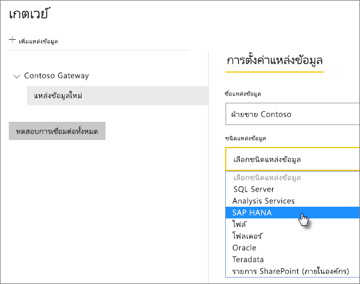
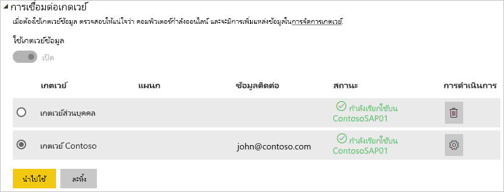

# จัดการแหล่งข้อมูล SAP HANA ของคุณ
เมื่อคุณได้ติดตั้งเกตเวย์ข้อมูลในองค์กรแล้ว คุณจะต้องเพิ่มแหล่งข้อมูลที่สามารถใช้กับเกตเวย์ดังกล่าวได้ บทความนี้เราจะดูวิธีการทำงานกับเกตเวย์และแหล่งข้อมูล คุณสามารถใช้แหล่งข้อมูล SAP HANA สำหรับการรีเฟรชตามกำหนดการหรือสำหรับ DirectQuery ได้

## ดาวน์โหลดและติดตั้งเกตเวย์
คุณสามารถดาวน์โหลดเกตเวย์จากบริการ Power BI ได้ เลือก**ดาวน์โหลด** > **เกตเวย์ข้อมูล**หรือ โดยไป[หน้าดาวน์โหลดเกตเวย์](https://go.microsoft.com/fwlink/?LinkId=698861)

## เพิ่มเกตเวย์
ในการเพิ่มเกตเวย์ เพียงแค่[ดาวน์โหลด](https://go.microsoft.com/fwlink/?LinkId=698861)และติดตั้งเกตเวย์บนเซิร์ฟเวอร์ในสภาพแวดล้อมของคุณ หลังจากที่คุณได้ติดตั้งเกตเวย์แล้ว ระบบจะแสดงในรายการของเกตเวย์ภายใต้หัวข้อ**จัดการเกตเวย์**

> [!NOTE]
> **จัดการเกตเวย์**จะไม่แสดงขึ้นจนกว่าคุณจะได้เป็นผู้ดูแลระบบของเกตเวย์อย่างน้อยหนึ่งเกตเวย์ ซึ่งสามารถเกิดขึ้นได้โดยการได้รับการเพิ่มให้เป็นผู้ดูแล หรือคุณเป็นคนติดตั้งและกำหนดค่าเกตเวย์
> 
> 

## ลบเกตเวย์
การลบเกตเวย์จะเป็นการลบแหล่งข้อมูลต่าง ๆ ที่อยู่ภายใต้เกตเวย์นั้น ๆ ด้วยเช่นกัน  ซึ่งจะเป็นการทำให้แดชบอร์ดและรายงานใด ๆ ที่ขึ้นกับแหล่งข้อมูลเหล่านั้นแยกจากกันได้

1. เลือกไอคอนรูปเฟืองที่มุมบนขวา > **จัดการเกตเวย์**
2. เกตเวย์ >**ลบ**
   
   

## เพิ่มแหล่งข้อมูล
คุณสามารถเพิ่มแหล่งข้อมูลได้โดยทั้งการเลือกเกตเวย์และคลิก**เพิ่มแหล่งข้อมูล** หรือโดยการไปยังเกตเวย์ > **เพิ่มแหล่งข้อมูล**

จากนั้นคุณสามารถเลือก**ชนิดแหล่งข้อมูล**จากรายการได้

จากนั้นคุณจะต้องกรอกข้อมูลสำหรับแหล่งข้อมูลที่รวมถึง**เซิร์ฟเวอร์** **ชื่อผู้ใช้**และ**รหัสผ่าน**

> [!NOTE]
> แบบสอบถามทั้งหมดที่ไปยังแหล่งข้อมูลจะทำงานโดยใช้ข้อมูลประจำตัวเหล่านี้ สำหรับข้อมูลเพิ่มเติม ให้ดูบทความเกตเวย์ข้อมูลหลักภายในองค์กรเพื่อเรียนรู้เพิ่มเติมเกี่ยวกับวิธีการจัดเก็บ[ข้อมูลประจำตัว](service-gateway-onprem.md#credentials)
> 
> 

คุณสามารถคลิก**เพิ่ม**หลังจากที่คุณได้กรอกทุกอย่างครบถ้วนแล้ว  คุณสามารถใช้แหล่งข้อมูลนี้สำหรับการรีเฟรชตามกำหนดการหรือ DirectQuery เทียบกับเซิร์ฟเวอร์ SAP HANA ที่อยู่ภายในองค์กรได้ คุณจะเห็น*เชื่อมต่อสำเร็จ* หากการดำเนินการเสร็จสมบูรณ์แล้ว

### การตั้งค่าขั้นสูง
คุณสามารถกำหนดค่าระดับความเป็นส่วนตัวให้กับแหล่งข้อมูลของคุณได้ ซึ่งจะเป็นการควบคุมการปะปนของข้อมูล โดยจะใช้เฉพาะสำหรับการรีเฟรชตามกำหนดการ ซึ่งจะไม่นำไปใช้กับ DirectQuery [เรียนรู้เพิ่มเติม](https://support.office.com/article/Privacy-levels-Power-Query-CC3EDE4D-359E-4B28-BC72-9BEE7900B540)

## ลบแหล่งข้อมูล
การลบแหล่งข้อมูลจะตัดแดชบอร์ดหรือรายงานทุกชนิดที่ขึ้นกับแหล่งข้อมูลที่ระบุ  

ในการลบแหล่งข้อมูล ให้ไปที่แหล่งข้อมูล > **ลบ**

## จัดการผู้ดูแลระบบ
บนแถบผู้ดูแลสำหรับเกตเวย์ คุณสามารถเพิ่มและลบผู้ใช้ (หรือกลุ่มการรักษาความปลอดภัย) ที่สามารถเข้ามาดูแลระบบเกตเวย์ได้

## จัดการผู้ใช้
บนแถบผู้ใช้สำหรับแหล่งข้อมูล คุณสามารถเพิ่มและลบผู้ใช้ หรือกลุ่มความปลอดภัยที่สามารถใช้แหล่งข้อมูลนี้ได้

> [!NOTE]
> รายการผู้ใช้จะควบคุมเพียงแค่ผู้ที่สามารถเผยแพร่รายงานได้เท่านั้น เจ้าของรายงานสามารถสร้างแดชบอร์ดหรือชุดเนื้อหา และนำมาแชร์ร่วมกับผูใช้คนอื่นได้
> 
> 

## การใช้แหล่งข้อมูล
หลังจากที่คุณได้สร้างแหล่งข้อมูล รายการนี้จะพร้อมใช้งานเมื่อต้องใช้ทั้งกับการเชื่อมต่อ DirectQuery หรือผ่านการรีเฟรชตามกำหนดการ

> [!NOTE]
> ชื่อเซิร์ฟเวอร์และชื่อฐานข้อมูลจะต้องตรงกับชื่อระหว่าง Power BI Desktop และแหล่งข้อมูลในเกตเวย์ข้อมูลภายในองค์กร!
> 
> 

การเชื่อมโยงระหว่างชุดข้อมูลของคุณและแหล่งข้อมูลภายในเกตเวย์จะเป็นไปตามชื่อเซิร์ฟเวอร์และชื่อฐานข้อมูลของคุณ สิ่งเหล่านี้จำเป็นต้องตรงกัน ตัวอย่างเช่น ถ้าคุณใส่ที่อยู่ IP สำหรับชื่อเซิร์ฟเวอร์ ภายใน Power BI Desktop คุณจะต้องใช้ที่อยู่ IP สำหรับแหล่งข้อมูลภายในการกำหนดค่าเกตเวย์ด้วย ถ้าคุณใช้ *SERVER\INSTANCE* ใน Power BI Desktop คุณจำเป็นต้องใช้ชื่อเดียวกันภายในแหล่งข้อมูลที่กำหนดค่าไว้สำหรับเกตเวย์ดังกล่าว

นี่คือกรณีสำหรับทั้ง DirectQuery และการรีเฟรชตามกำหนดการ

### การใช้แหล่งข้อมูลที่มีการเชื่อมต่อ DirectQuery
คุณจะต้องตรวจสอบให้แน่ใจว่าเซิร์ฟเวอร์และฐานข้อมูลชื่อตรงกันระหว่าง Power BI Desktop และแหล่งข้อมูลที่กำหนดค่าไว้สำหรับเกตเวย์ คุณจะยังจำเป็นต้องตรวจสอบให้แน่ใจว่า ผู้ใช้ของคุณแสดงอยู่ในแท็บ**ผู้ใช้**ของแหล่งข้อมูลเพื่อที่เผยแพร่ชุดข้อมูล DirectQuery ตัวเลือกสำหรับ DirectQuery จะเกิดขึ้นภายใน Power BI Desktop ตอนที่คุณนำเข้าข้อมูลครั้งแรก [เรียนรู้เพิ่มเติม](desktop-use-directquery.md)

หลังจากที่คุณเผยแพร่แล้ว ไม่ว่าจาก Power BI Desktop หรือ**รับข้อมูล** รายงานของคุณควรเริ่มการทำงานแล้ว อาจใช้เวลาเชื่อมต่อหลายนาที หลังจากการสร้างแหล่งข้อมูลภายในเกตเวย์จนกว่าจะสามารถใช้งานได้

### การใช้แหล่งข้อมูลที่มีการรีเฟรชตามกำหนดการ
ถ้าคุณอยู่ในแถบ**ผู้ใช้**ของแหล่งข้อมูลที่กำหนดค่าภายในเกตเวย์ และชื่อเซิร์ฟเวอร์และชื่อฐานข้อมูลตรงกัน คุณจะเห็นเกตเวย์เป็นหนึ่งตัวเลือกในการใช้กับการรีเฟรชตามกำหนดการ

## ขั้นตอนถัดไป
[เกตเวย์ข้อมูลภายในองค์กร](service-gateway-onprem.md)  
[เกตเวย์ข้อมูลในองค์กร - เชิงลึก](service-gateway-onprem-indepth.md)  
[การแก้ไขปัญหาเกตเวย์ข้อมูลในองค์กร](service-gateway-onprem-tshoot.md)  
มีคำถามเพิ่มเติมหรือไม่? [ลองไปที่ชุมชน Power BI](http://community.powerbi.com/)

