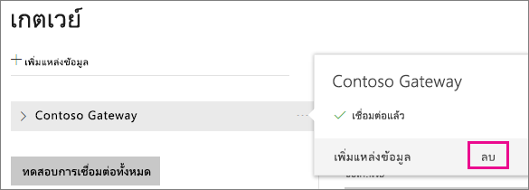
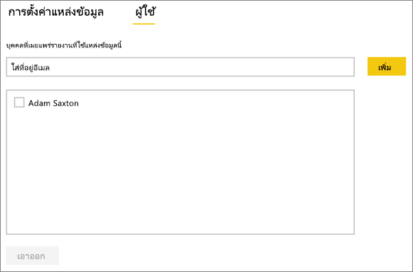
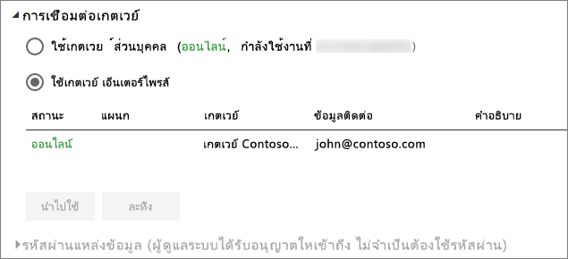

# จัดการแหล่งข้อมูลของคุณ - นำเข้า/รีเฟรชตามตารางเวลา
เมื่อคุณได้ติดตั้งเกตเวย์ข้อมูลในองค์กรแล้ว คุณจะต้องเพิ่มแหล่งข้อมูลที่สามารถใช้ได้กับเกตเวย์ดังกล่าว บทความนี้จะดูที่วิธีการทำงานกับเกตเวย์และแหล่งข้อมูลที่จะใช้สำหรับการรีเฟรชตามกำหนดการที่ตรงกันข้ามกับ DirectQuery หรือการเชื่อมต่อแบบสด

## ดาวน์โหลดและติดตั้งเกตเวย์
คุณสามารถดาวน์โหลดเกตเวย์จากบริการ Power BI ได้ เลือก**ดาวน์โหลด** > **เกตเวย์ข้อมูล**หรือไปที่[หน้าดาวน์โหลดเกตเวย์](https://go.microsoft.com/fwlink/?LinkId=698861)

## เพิ่มเกตเวย์
ในการเพิ่มเกตเวย์ เพียงแค่[ดาวน์โหลด](https://go.microsoft.com/fwlink/?LinkId=698863)และติดตั้งเกตเวย์บนเซิร์ฟเวอร์ขององค์กรในสภาพแวดล้อมของคุณ หลังจากที่คุณได้ติดตั้งเกตเวย์แล้ว ระบบจะแสดงในรายการของเกตเวย์ภายใต้หัวข้อ**จัดการเกตเวย์**

> [!NOTE]
> **จัดการเกตเวย์**จะไม่แสดงขึ้นจนกว่าคุณจะได้เป็นผู้ดูแลระบบของเกตเวย์อย่างน้อยหนึ่งเกตเวย์ ซึ่งสามารถเกิดขึ้นได้โดยการได้รับการเพิ่มให้เป็นผู้ดูแล หรือคุณเป็นคนติดตั้งและกำหนดค่าเกตเวย์
> 
> 

## ลบเกตเวย์
การลบเกตเวย์จะเป็นการลบแหล่งข้อมูลต่าง ๆ ที่อยู่ภายใต้เกตเวย์นั้น ๆ ด้วยเช่นกัน  ซึ่งจะเป็นการทำลายแดชบอร์ดและรายงานอิงกับแหล่งข้อมูลเหล่านั้น

1. เลือกไอคอนรูปเฟืองที่มุมบนขวา > **จัดการเกตเวย์**
2. เกตเวย์ >**ลบ**
   
   

## เพิ่มแหล่งข้อมูล
คุณสามารถเพิ่มแหล่งข้อมูลได้โดยเลือกเกตเวย์ และคลิก**เพิ่มแหล่งข้อมูล** หรือไปที่ “เกตเวย์” > **เพิ่มแหล่งข้อมูล**

จากนั้นคุณสามารถเลือก**ชนิดแหล่งข้อมูล**จากรายการได้ แหล่งข้อมูลทั้งหมดที่อยู่ในรายการสามารถใช้สำหรับการรีเฟรชตามกำหนดการกับเกตเวย์ขององค์กรได้ Analysis Services, SQL Server และ SAP HANA สามารถใช้สำหรับรีเฟรชตามกำหนดการ หรือการเชื่อมต่อ DirectQuery/การเชื่อมต่อสดได้

จากนั้นคุณจะต้องใส่ข้อมูลสำหรับแหล่งข้อมูล ซึ่งรวมถึงข้อมูลแหล่งที่มาและข้อมูลประจำตัวที่ใช้เพื่อเข้าถึงแหล่งข้อมูล

> [!NOTE]
> แบบสอบถามทั้งหมดที่ไปยังแหล่งข้อมูลจะทำงานโดยใช้ข้อมูลประจำตัวเหล่านี้ สำหรับข้อมูลเพิ่มเติม ให้ดูบทความเกตเวย์ข้อมูลหลักภายในองค์กรเพื่อเรียนรู้เพิ่มเติมเกี่ยวกับวิธีการจัดเก็บ[ข้อมูลประจำตัว](service-gateway-onprem.md#credentials)
> 
> 

คุณสามารถคลิก**เพิ่ม**หลังจากที่คุณได้กรอกทุกอย่างครบถ้วนแล้ว  ตอนนี้คุณสามารถใช้แหล่งข้อมูลนี้สำหรับการรีเฟรชตามกำหนดการกับข้อมูลภายในองค์กรของคุณได้แล้ว คุณจะเห็น*เชื่อมต่อสำเร็จ* หากการดำเนินการเสร็จสมบูรณ์แล้ว

<!-- Shared Install steps Include -->
[!INCLUDE [gateway-onprem-datasources-include](./includes/gateway-onprem-datasources-include.md)]

### การตั้งค่าขั้นสูง
คุณสามารถกำหนดค่าระดับความเป็นส่วนตัวให้กับแหล่งข้อมูลของคุณ ซึ่งจะช่วยควบคุมการปะปนของข้อมูล โดยจะใช้เฉพาะสำหรับการรีเฟรชตามกำหนดการ [เรียนรู้เพิ่มเติม](https://support.office.com/article/Privacy-levels-Power-Query-CC3EDE4D-359E-4B28-BC72-9BEE7900B540)

## ลบแหล่งข้อมูล
การลบแหล่งข้อมูลจะทำลายแดชบอร์ดหรือรายงานต่างๆ ที่อิงกับแหล่งข้อมูลที่ระบุ  

หากต้องหารลบแหล่งข้อมูลให้ไปที่ แหล่งข้อมูล > **ลบ**

## จัดการผู้ดูแลระบบ
บนแถบผู้ดูแลสำหรับเกตเวย์ คุณสามารถเพิ่มและลบผู้ใช้ที่สามารถเข้ามาดูแลระบบเกตเวย์ได้ คุณสามารถเพิ่มผู้ใช้ในขณะนี้ได้เท่านั้น ไม่สามารถเพิ่มกลุ่มความปลอดภัยได้

## จัดการผู้ใช้
บนแท็บผู้ใช้สำหรับแหล่งข้อมูล คุณสามารถเพิ่มและลบผู้ใช้ หรือกลุ่มความปลอดภัยที่สามารถใช้แหล่งข้อมูลนี้ได้

> [!NOTE]
> รายชื่อผู้ใช้จะควบคุมผู้ที่ได้รับอนุญาตให้เผยแพร่รายงานเท่านั้น เจ้าของรายงานสามารถสร้างแดชบอร์ดหรือชุดเนื้อหา และนำมาแชร์ร่วมกับผูใช้คนอื่นได้
> 
> 

## การใช้แหล่งข้อมูลสำหรับการรีเฟรชตามกำหนดการ
หลังจากที่คุณได้สร้างแหล่งข้อมูล รายการนี้จะพร้อมใช้งานเมื่อต้องใช้ทั้งกับการเชื่อมต่อ DirectQuery หรือผ่านการรีเฟรชตามกำหนดการ

> [!NOTE]
> ชื่อเซิร์ฟเวอร์และชื่อฐานข้อมูลจะต้องตรงกับ Power BI Desktop และแหล่งข้อมูลในเกตเวย์ข้อมูลภายในองค์กร!
> 
> 

การเชื่อมโยงระหว่างชุดข้อมูลของคุณและแหล่งข้อมูลภายในเกตเวย์จะเป็นไปตามชื่อเซิร์ฟเวอร์และชื่อฐานข้อมูลของคุณ สิ่งเหล่านี้จำเป็นต้องตรงกัน ตัวอย่างเช่น ถ้าคุณใส่ที่อยู่ IP สำหรับชื่อเซิร์ฟเวอร์ ภายใน Power BI Desktop คุณจะต้องใช้ที่อยู่ IP สำหรับแหล่งข้อมูลภายในการกำหนดค่าเกตเวย์ด้วย ถ้าคุณใช้ *SERVER\INSTANCE* ใน Power BI Desktop คุณจำเป็นต้องใช้ชื่อเดียวกันภายในแหล่งข้อมูลที่กำหนดค่าไว้สำหรับเกตเวย์ดังกล่าว

ถ้าคุณอยู่ในแถบ**ผู้ใช้**ของแหล่งข้อมูลที่กำหนดค่าภายในเกตเวย์ และชื่อเซิร์ฟเวอร์และชื่อฐานข้อมูลตรงกัน คุณจะเห็นเกตเวย์เป็นหนึ่งตัวเลือกในการใช้กับการรีเฟรชตามกำหนดการ

> [!WARNING]
> ถ้าชุดข้อมูลของคุณประกอบด้วยแหล่งข้อมูลหลายแหล่ง คุณต้องเพิ่มแต่ละแหล่งข้อมูลภายในเกตเวย์ดังกล่าว ถ้าไม่ได้เพิ่มแหล่งข้อมูลอย่างน้อยหนึ่งแหล่งเข้าไปในเกตเวย์ คุณจะไม่เห็นเกตเวย์ดังกล่าวเป็น พร้อมใช้งาน สำหรับการรีเฟรชตามกำหนดการ
> 
> 

## ข้อจำกัด
* OAuth ไม่ใช่เค้าร่างการรับรองความถูกต้องที่สนับสนุนกับเกตเวย์ข้อมูลในองค์กร คุณไม่สามารถเพิ่มแหล่งข้อมูลที่จำเป็นสำหรับ OAuth ได้ ถ้าชุดข้อมูลของคุณมีแหล่งข้อมูลที่ต้องมีี OAuth คุณจะไม่สามารถใช้เกตเวย์ดังกล่าวสำหรับการรีเฟรชตามกำหนดการได้

## ขั้นตอนถัดไป
[เกตเวย์ข้อมูลภายในองค์กร](service-gateway-onprem.md)  
[เกตเวย์ข้อมูลในองค์กร - เชิงลึก](service-gateway-onprem-indepth.md)  
[การแก้ไขปัญหาเกตเวย์ข้อมูลในองค์กร](service-gateway-onprem-tshoot.md)  
มีคำถามเพิ่มเติมหรือไม่? [ลองไปที่ชุมชน Power BI](http://community.powerbi.com/)

