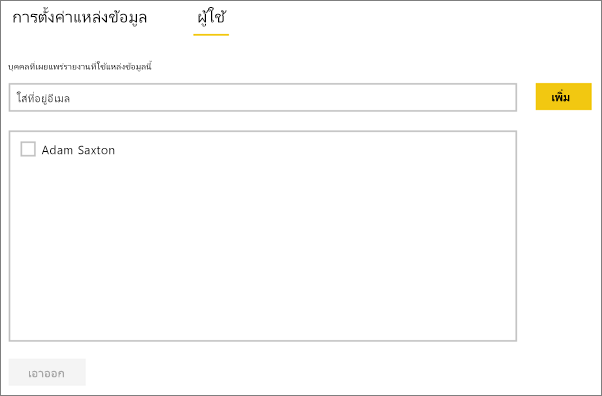

# จัดการแหล่งข้อมูลของคุณ - SQL Server
เมื่อคุณติดตั้งเกตเวย์ข้อมูลในองค์กรแล้ว คุณจะสามารถเพิ่มแหล่งข้อมูลที่สามารถใช้กับเกตเวย์ดังกล่าวได้ บทความนี้จะอธิบายวิธีการทำงานกับเกตเวย์และแหล่งข้อมูล คุณสามารถใช้แหล่งข้อมูล SQL Server สำหรับรีเฟรชตามกำหนดการ หรือ สำหรับ DirectQuery ได้

## ดาวน์โหลดและติดตั้งเกตเวย์
คุณสามารถดาวน์โหลดเกตเวย์จากบริการ Power BI ได้ เลือก**ดาวน์โหลด** > **เกตเวย์ข้อมูล**หรือไปที่[หน้าดาวน์โหลดเกตเวย์](https://go.microsoft.com/fwlink/?LinkId=698861)

## เพิ่มเกตเวย์
หากต้องการเพิ่มเกตเวย์ เพียงแค่[ดาวน์โหลด](https://go.microsoft.com/fwlink/?LinkId=698861)และติดตั้งเกตเวย์บนเซิร์ฟเวอร์ในสภาพแวดล้อมของคุณ หลังจากที่คุณติดตั้งเกตเวย์แล้ว เกตเวย์จะแสดงในรายการของเกตเวย์ใต้**จัดการเกตเวย์**

> [!NOTE]
> **จัดการเกตเวย์**จะไม่แสดงจนกว่าคุณจะเป็นผู้ดูแลระบบของเกตเวย์อย่างน้อยหนึ่งเกตเวย์ ซึ่งคุณจะสามารถเป็นผู้ดูแลระบบได้เมื่อคุณถูกเพิ่มให้เป็นผู้ดูแลระบบเกตเวย์ หรือเมื่อคุณติดตั้งและกำหนดค่าเกตเวย์ด้วยตัวคุณเอง
> 
> 

## ลบเกตเวย์
การลบเกตเวย์จะเป็นการลบแหล่งข้อมูลต่าง ๆ ที่อยู่ภายใต้เกตเวย์นั้น ๆ ด้วยเช่นกัน  ซึ่งจะเป็นการทำลายแดชบอร์ดและรายงานอิงกับแหล่งข้อมูลเหล่านั้น

1. เลือกไอคอนรูปเฟืองที่มุมบนขวา > **จัดการเกตเวย์**
2. เกตเวย์ >**ลบ**
   
   

## เพิ่มแหล่งข้อมูล
คุณสามารถเพิ่มแหล่งข้อมูลได้โดยเลือกเกตเวย์ และคลิก**เพิ่มแหล่งข้อมูล** หรือไปที่ “เกตเวย์” > **เพิ่มแหล่งข้อมูล**

จากนั้นคุณสามารถเลือก**ชนิดแหล่งข้อมูล**ได้จากรายการ

> [!NOTE]
> เมื่อใช้ DirectQuery เกตเวย์สนับสนุนเฉพาะ**SQL Server 2012 SP1**และเวอร์ชันถัดมา
> 
> 

จากนั้นคุณจะต้องกรอกข้อมูลเกี่ยวกับแหล่งข้อมูลซึ่งประกอบด้วย**เซิร์ฟเวอร์**และ**ฐานข้อมูล**  

และคุณจะต้องเลือก**วิธีการรับรองความถูกต้อง**ด้วย  ซึ่งสามารถเลือกเป็น**Windows**หรือ**Basic**ได้  คุณควรเลือก**Basic**ถ้าคุณต้องการใช้การรับรองความถูกต้องของ SQL แทนการรับรองความถูกต้องของ Windows จากนั้นใส่ข้อมูลประจำตัวที่จะใช้สำหรับแหล่งข้อมูลนี้

> [!NOTE]
> คิวรีทั้งหมดที่ไปยังแหล่งข้อมูลจะทำงานโดยใช้ข้อมูลประจำตัวเหล่านี้ เว้นแต่ว่า Kerberos Single Sign On (SSO) ได้รัับการกำหนดค่า และเปิดใช้งานสำหรับแหล่งข้อมูล SSO จะทำให้ชุดข้อมูลนำเข้าใช้ข้อมูลประจำตัวที่จัดเก็บไว้ แต่ชุดข้อมูล DirectQuery จะใช้ผู้ใช้ Power BI ปัจจุบันเพื่อดำเนินการคิวรีโดยใช้ SSO โปรดดูที่บทความเกตเวย์ข้อมูลภายในองค์กรเพื่อเรียนรู้เพิ่มเติมเกี่ยวกับวิธีการจัดเก็บ[ข้อมูลประจำตัว](service-gateway-onprem.md#credentials) หรือดูที่บทความที่อธิบายวิธีการ[ใช้ Kerberos สำหรับ SSO (single sign-on) จาก Power BI ไปยังแหล่งข้อมูลภายในองค์กร](service-gateway-kerberos-for-sso-pbi-to-on-premises-data.md)
> 
> 

คุณสามารถคลิก**เพิ่ม**หลังจากที่คุณได้กรอกทุกอย่างครบถ้วนแล้ว  ขณะนี้คุณสามารถใช้แหล่งข้อมูลนี้สำหรับการรีเฟรชตามกำหนดการ หรือ DirectQuery กับ SQL Server ที่อยู่ภายในองค์กร คุณจะเห็น*การเชื่อมต่อสำเร็จ* หากการดำเนินการเสร็จสมบูรณ์แล้ว

### การตั้งค่าขั้นสูง
คุณสามารถกำหนดค่าระดับความเป็นส่วนตัวให้กับแหล่งข้อมูลของคุณ ซึ่งจะช่วยควบคุมการปะปนของข้อมูล และใช้ได้เฉพาะกับการรีเฟรชตามกำหนดการเท่านั้น ไม่สามารถนำไปใช้กับ DirectQuery [เรียนรู้เพิ่มเติม](https://support.office.com/article/Privacy-levels-Power-Query-CC3EDE4D-359E-4B28-BC72-9BEE7900B540)

## ลบแหล่งข้อมูล
การลบแหล่งข้อมูลจะทำลายแดชบอร์ดหรือรายงานต่างๆ ที่อิงกับแหล่งข้อมูลที่ระบุ  

หากต้องหารลบแหล่งข้อมูลให้ไปที่ แหล่งข้อมูล > **ลบ**

## จัดการผู้ดูแลระบบ
ในแถบผู้ดูแลสำหรับเกตเวย์ คุณสามารถเพิ่มและลบผู้ใช้ (หรือกลุ่มการรักษาความปลอดภัย) ที่สามารถเข้ามาดูแลระบบเกตเวย์ได้

## จัดการผู้ใช้
บนแท็บผู้ใช้สำหรับแหล่งข้อมูล คุณสามารถเพิ่มและลบผู้ใช้ หรือกลุ่มความปลอดภัยที่สามารถใช้แหล่งข้อมูลนี้ได้

> [!NOTE]
> รายชื่อผู้ใช้จะควบคุมผู้ที่ได้รับอนุญาตให้เผยแพร่รายงานเท่านั้น เจ้าของรายงานสามารถสร้างแดชบอร์ด หรือชุดเนื้อหา และนำมาแชร์ร่วมกับผู้ใช้อื่นๆ ได้
> 
> 

## การใช้แหล่งข้อมูล
หลังจากที่คุณสร้างแหล่งข้อมูลแล้ว แหล่งข้อมูลนั้นจะพร้อมใช้งานกับการเชื่อมต่อ DirectQuery หรือใช้งานผ่านการรีเฟรชตามกำหนดการ

> [!NOTE]
> ชื่อเซิร์ฟเวอร์และชื่อฐานข้อมูลจะต้องตรงกับ Power BI Desktop และแหล่งข้อมูลในเกตเวย์ข้อมูลภายในองค์กร!
> 
> 

การเชื่อมโยงระหว่างชุดข้อมูลของคุณและแหล่งข้อมูลภายในเกตเวย์จะเป็นไปตามชื่อเซิร์ฟเวอร์และชื่อฐานข้อมูลของคุณ ซึ่งจำเป็นต้องตรงกัน ตัวอย่างเช่น ถ้าคุณใส่ที่อยู่ IP สำหรับชื่อเซิร์ฟเวอร์ ใน**Power BI Desktop**คุณจะต้องใช้ที่อยู่ IP สำหรับแหล่งข้อมูลภายในการกำหนดค่าเกตเวย์ด้วยเช่นกัน ถ้าคุณใช้ *SERVER\INSTANCE* ใน Power BI Desktop คุณจะต้องใช้ชื่อเดียวกันในแหล่งข้อมูลที่กำหนดค่าไว้สำหรับเกตเวย์ดังกล่าว

นี่คือกรณีสำหรับทั้ง DirectQuery และการรีเฟรชตามกำหนดการ

### การใช้แหล่งข้อมูลที่มีการเชื่อมต่อ DirectQuery
คุณจะต้องตรวจสอบให้แน่ใจว่าตรงกับชื่อเซิร์ฟเวอร์และชื่อฐานข้อมูลตรงกันระหว่าง**Power BI Desktop**และแหล่งข้อมูลที่กำหนดค่าไว้สำหรับเกตเวย์ และคุณยะงต้องตรวจสอบให้แน่ใจอีกว่า ผู้ใช้ของคุณแสดงอยู่ในแท็บ**ผู้ใช้**ของแหล่งข้อมูลเพื่อให้สามารถเผยแพร่ชุดข้อมูล DirectQuery ได้ เมื่อคุณนำเข้าข้อมูลครั้งแรก การเลือกสำหรับ DirectQuery จะเกิดขึ้นภายใน Power BI Desktop [เรียนรู้เพิ่มเติม](desktop-use-directquery.md)

หลังจากที่คุณเผยแพร่ชุดข้อมูลจาก Power BI Desktop หรือ**รับข้อมูล** รายงานของคุณควรเริ่มการทำงาน อาจจะใช้เวลาหลายนาทีเพื่อให้การเชื่อมต่อสามารถใช้งานได้ หลังจากการสร้างแหล่งข้อมูลภายในเกตเวย์

### การใช้แหล่งข้อมูลที่มีการรีเฟรชตามกำหนดการ
ถ้าคุณได้รับการระบุให้อยู่ในแท็บ**ผู้ใช้**ของแหล่งข้อมูลที่กำหนดค่าไว้ภายในเกตเวย์ และชื่อเซิร์ฟเวอร์และชื่อฐานข้อมูลตรงกัน คุณจะเห็นเกตเวย์เป็นตัวเลือกเพื่อใช้กับการรีเฟรชตามกำหนดการ

## ขั้นตอนถัดไป
* [เกตเวย์ข้อมูลภายในองค์กร](service-gateway-onprem.md)  
* [เกตเวย์ข้อมูลในองค์กร - เชิงลึก](service-gateway-onprem-indepth.md)  
* [แก้ไขปัญหาเกตเวย์ข้อมูลภายในองค์กร](service-gateway-onprem-tshoot.md)
* [ใช้ Kerberos สำหรับ SSO (ลงชื่อเข้าใช้ครั้งเดียว) จาก Power BI ไปยังแหล่งข้อมูลภายในองค์กร](service-gateway-kerberos-for-sso-pbi-to-on-premises-data.md) 
* มีคำถามเพิ่มเติมหรือไม่ [ลองไปที่ชุมชน Power BI](http://community.powerbi.com/)

