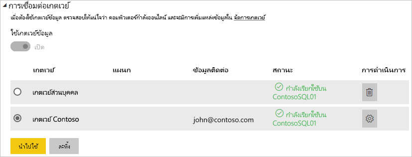

# จัดการแหล่งข้อมูลของคุณ - SQL Server

[!INCLUDE [gateway-rewrite](includes/gateway-rewrite.md)]

เมื่อคุณ [ติดตั้งเกตเวย์ข้อมูลในองค์กรแล้ว](/data-integration/gateway/service-gateway-install) คุณจะสามารถ [เพิ่มแหล่งข้อมูล](service-gateway-data-sources.md#add-a-data-source) ที่สามารถใช้กับเกตเวย์ดังกล่าวได้ บทความนี้จะดูวิธีการทำงานกับเกตเวย์และแหล่งข้อมูล SQL Server ที่ใช้สำหรับการรีเฟรชตามกำหนดการหรือสำหรับ DirectQuery

## เพิ่มแหล่งข้อมูล

สำหรับข้อมูลเกี่ยวกับวิธีการเพิ่มแหล่งข้อมูล ให้ดู[เพิ่มแหล่งข้อมูล](service-gateway-data-sources.md#add-a-data-source)

> [!NOTE]
> เมื่อใช้ DirectQuery เกตเวย์สนับสนุนเฉพาะ**SQL Server 2012 SP1**และเวอร์ชันถัดมา

จากนั้นคุณจะต้องกรอกข้อมูลเกี่ยวกับแหล่งข้อมูล ซึ่งประกอบด้วย**เซิร์ฟเวอร์**และ**ฐานข้อมูล**  

นอกจากนี้ คุณยังต้องเลือก**วิธีการรับรองความถูกต้อง**ด้วย ซึ่งสามารถเลือกเป็น**Windows**หรือ**Basic**ได้ คุณจะต้องเลือก**พื้นฐาน**ถ้าคุณต้องการใช้การรับรองความถูกต้องของ SQL แทนการรับรองความถูกต้องของ Windows จากนั้นใส่ข้อมูลประจำตัวที่จะใช้สำหรับแหล่งข้อมูลนี้

> [!NOTE]
> คิวรีทั้งหมดที่ไปยังแหล่งข้อมูลจะทำงานโดยใช้ข้อมูลประจำตัวเหล่านี้ เว้นแต่ว่า Kerberos Single Sign On (SSO) ได้รัับการกำหนดค่า และเปิดใช้งานสำหรับแหล่งข้อมูล SSO จะทำให้ชุดข้อมูลนำเข้าใช้ข้อมูลประจำตัวที่จัดเก็บไว้ แต่ชุดข้อมูล DirectQuery จะใช้ผู้ใช้ Power BI ปัจจุบันเพื่อดำเนินการคิวรีโดยใช้ SSO เพื่อเรียนรู้เพิ่มเติมเกี่ยวกับวิธีการจัดเก็บข้อมูลประจำตัว ดูที่ [การจัดเก็บข้อมูลประจำตัวที่เข้ารหัสในระบบคลาวด์](service-gateway-data-sources.md#storing-encrypted-credentials-in-the-cloud) หรือดูที่บทความที่อธิบายวิธีการ[ใช้ Kerberos สำหรับ SSO (single sign-on) จาก Power BI ไปยังแหล่งข้อมูลภายในองค์กร](service-gateway-sso-kerberos.md)

เลือก**เพิ่ม**หลังจากที่คุณได้กรอกทุกอย่างครบถ้วนแล้ว ขณะนี้คุณสามารถใช้แหล่งข้อมูลนี้สำหรับการรีเฟรชตามกำหนดการ หรือ DirectQuery กับ SQL Server ที่อยู่ภายในองค์กร คุณจะเห็น*การเชื่อมต่อสำเร็จ* หากการดำเนินการเสร็จสมบูรณ์แล้ว

### การตั้งค่าขั้นสูง

อีกทางหนึ่งคือคุณสามารถกำหนดค่าระดับความเป็นส่วนตัวให้กับแหล่งข้อมูลของคุณ ซึ่งจะช่วยควบคุมการรวมข้อมูลได้ และใช้ได้เฉพาะกับการรีเฟรชตามกำหนดการเท่านั้น ไม่สามารถนำไปใช้กับ DirectQuery หากต้องการเรียนรู้เพิ่มเติมเกี่ยวกับระดับความเป็นส่วนตัวสำหรับแหล่งข้อมูลของคุณ ให้ดู [ระดับความเป็นส่วนตัว (Power Query)](https://support.office.com/article/Privacy-levels-Power-Query-CC3EDE4D-359E-4B28-BC72-9BEE7900B540)

## การใช้แหล่งข้อมูล

หลังจากที่คุณได้สร้างแหล่งข้อมูลแล้ว แหล่งข้อมูลนี้จะพร้อมใช้งานเมื่อต้องใช้ทั้งกับการเชื่อมต่อ DirectQuery หรือผ่านการรีเฟรชตามกำหนดการ

> [!NOTE]
> ชื่อเซิร์ฟเวอร์และชื่อฐานข้อมูลจะต้องตรงกับ Power BI Desktop และแหล่งข้อมูลในเกตเวย์ข้อมูลภายในองค์กร

การเชื่อมโยงระหว่างชุดข้อมูลของคุณและแหล่งข้อมูลภายในเกตเวย์จะเป็นไปตามชื่อเซิร์ฟเวอร์และชื่อฐานข้อมูลของคุณ ซึ่งจำเป็นต้องตรงกัน ตัวอย่างเช่น ถ้าคุณใส่ที่อยู่ IP สำหรับชื่อเซิร์ฟเวอร์ ใน **Power BI Desktop** คุณจะต้องใช้ที่อยู่ IP สำหรับแหล่งข้อมูลภายในการกำหนดค่าเกตเวย์ด้วยเช่นกัน ถ้าคุณใช้ *SERVER\INSTANCE* ใน Power BI Desktop คุณจะต้องใช้ชื่อเดียวกันในแหล่งข้อมูลที่กำหนดค่าไว้สำหรับเกตเวย์ดังกล่าว

นี่คือกรณีสำหรับทั้ง DirectQuery และการรีเฟรชตามกำหนดการ

### การใช้แหล่งข้อมูลที่มีการเชื่อมต่อ DirectQuery

คุณจะต้องตรวจสอบให้แน่ใจว่าชื่อเซิร์ฟเวอร์และชื่อฐานข้อมูลตรงกันระหว่าง **Power BI Desktop** และแหล่งข้อมูลที่กำหนดค่าไว้สำหรับเกตเวย์ และคุณยังต้องตรวจสอบให้แน่ใจอีกว่า ผู้ใช้ของคุณแสดงอยู่ในแท็บ**ผู้ใช้**ของแหล่งข้อมูลเพื่อให้สามารถเผยแพร่ชุดข้อมูล DirectQuery ได้ เมื่อคุณนำเข้าข้อมูลครั้งแรก การเลือกสำหรับ DirectQuery จะเกิดขึ้นภายใน Power BI Desktop สำหรับข้อมูลเพิ่มเติมเกี่ยวกับ DirectQuery ให้ดู[ ใช้ DirectQuery ใน Power BI Desktop](desktop-use-directquery.md)

หลังจากที่คุณเผยแพร่ชุดข้อมูลจาก Power BI Desktop หรือ**รับข้อมูล** รายงานของคุณควรเริ่มการทำงาน อาจจะใช้เวลาหลายนาทีเพื่อให้การเชื่อมต่อสามารถใช้งานได้ หลังจากการสร้างแหล่งข้อมูลภายในเกตเวย์

### การใช้แหล่งข้อมูลที่มีการรีเฟรชตามกำหนดการ

ถ้าคุณอยู่ในแท็บ**ผู้ใช้**ของแหล่งข้อมูลที่กำหนดค่าไว้ภายในเกตเวย์ และชื่อเซิร์ฟเวอร์และชื่อฐานข้อมูลตรงกัน คุณจะเห็นเกตเวย์เป็นตัวเลือกเพื่อใช้กับการรีเฟรชตามกำหนดการ

## ขั้นตอนถัดไป

* [เชื่อมต่อกับข้อมูลภายในองค์กรใน SQL Server](service-gateway-sql-tutorial.md)
* [การแก้ไขปัญหาเกตเวย์ข้อมูลภายในองค์กร](/data-integration/gateway/service-gateway-tshoot)
* [แก้ไขปัญหาเกตเวย์-Power BI](service-gateway-onprem-tshoot.md)
* [ใช้ Kerberos สำหรับ SSO (ลงชื่อเข้าใช้ครั้งเดียว) จาก Power BI ไปยังแหล่งข้อมูลภายในองค์กร](service-gateway-sso-kerberos.md)

มีคำถามเพิ่มเติมหรือไม่ [ลองไปที่ชุมชน Power BI](http://community.powerbi.com/)

