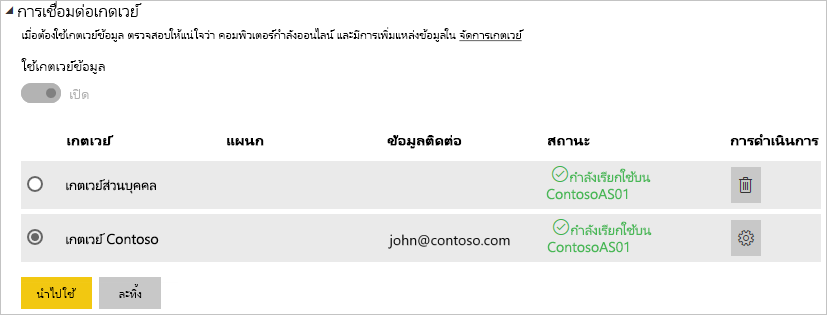

# <a name="manage-your-data-source---analysis-services"></a>จัดการแหล่งข้อมูลของคุณ - Analysis Services

[!INCLUDE [gateway-rewrite](includes/gateway-rewrite.md)]

หลังจากคุณ[ติดตั้งเกตเวย์ข้อมูลภายในองค์กรแล้ว](/data-integration/gateway/service-gateway-install) คุณจะต้อง[เพิ่มแหล่งข้อมูล](service-gateway-data-sources.md#add-a-data-source)ที่สามารถใช้ได้กับเกตเวย์ดังกล่าว บทความนี้จะดูวิธีการทำงานกับเกตเวย์และแหล่งข้อมูล SQL Server Analysis Services (SSAS) ที่ใช้สำหรับการรีเฟรชตามกำหนดการหรือสำหรับการเชื่อมต่อสด

หากต้องการเรียนรู้เพิ่มเติมเกี่ยวกับวิธีการตั้งค่าการเชื่อมต่อสดไปยัง Analysis Services [ดูวิดีโอนี้](https://www.youtube.com/watch?v=GPf0YS-Xbyo&feature=youtu.be)

> [!NOTE]
> ถ้าคุณมีแหล่งข้อมูล Analysis Services คุณจะต้องติดตั้งเกตเวย์บนคอมพิวเตอร์ที่เข้าร่วมฟอเรสต์/โดเมนเดียวกับเซิร์ฟเวอร์ Analysis Services ของคุณ

## <a name="add-a-data-source"></a>เพิ่มแหล่งข้อมูล

สำหรับข้อมูลเกี่ยวกับวิธีการเพิ่มแหล่งข้อมูล ให้ดู[เพิ่มแหล่งข้อมูล](service-gateway-data-sources.md#add-a-data-source) เลือก **Analysis Services** สำหรับ**ชนิดแหล่งข้อมูล** ถ้าคุณกำลังเชื่อมต่อกับเซิร์ฟเวอร์หลายมิติ หรือเซิร์ฟเวอร์แบบตาราง


กรอกข้อมูลเกี่ยวกับแหล่งข้อมูล ซึ่งประกอบด้วย**เซิร์ฟเวอร์**และ**ฐานข้อมูล** ข้อมูลที่คุณป้อนสำหรับ**ชื่อผู้ใช้**และ**รหัสผ่าน**ถูกใช้โดยเกตเวย์เพื่อเชื่อมต่อกับอินสแตนซ์ Analysis Services

> [!NOTE]
> บัญชีผู้ใช้ Windows คุณกรอกนั้นจะต้องได้รับอนุญาตจากผู้ดูแลเซิร์ฟเวอร์สำหรับอินสแตนซ์ที่คุณกำลังทำการเชื่อมต่อด้วย ถ้ารหัสผ่านของบัญชีนี้ถูกตั้งค่าให้หมดอายุ ผู้ใช้อาจจะเจอข้อผิดพลาดในการเชื่อมต่อหากไม่มีการอัปเดตรหัสผ่านสำหรับแหล่งข้อมูลนั้น ๆ หากต้องการเรียนรู้เพิ่มเติมเกี่ยวกับวิธีการจัดเก็บข้อมูลประจำตัว ให้ดู [การจัดเก็บข้อมูลประจำตัวที่เข้ารหัสไว้ในระบบคลาวด์](service-gateway-data-sources.md#store-encrypted-credentials-in-the-cloud)


หลังจากที่คุณกรอกข้อมูลทุกอย่างแล้ว ให้เลือก**เพิ่ม** ในตอนนี้ คุณสามารถใช้แหล่งข้อมูลนี้ในการรีเฟรชตามกำหนดการ หรือ การเชื่อมต่อแบบสดกับอินสแตนซ์ Analysis Services ที่อยู่ภายในองค์กรแล้ว คุณจะเห็น*การเชื่อมต่อสำเร็จ* หากการดำเนินการเสร็จสมบูรณ์แล้ว


### <a name="advanced-settings"></a>การตั้งค่าขั้นสูง

อีกทางหนึ่งคือคุณสามารถกำหนดค่าระดับความเป็นส่วนตัวให้กับแหล่งข้อมูลของคุณ การตั้งค่านี้จะช่วยควบคุมการรวมข้อมูลได้ ซึ่งใช้ได้เฉพาะกับการรีเฟรชตามกำหนดการเท่านั้น การตั้งค่าระดับความเป็นส่วนตัวจะไม่นำไปใช้กับการเชื่อมต่อแบบสด หากต้องการเรียนรู้เพิ่มเติมเกี่ยวกับระดับความเป็นส่วนตัวสำหรับแหล่งข้อมูลของคุณ ให้ดู [ระดับความเป็นส่วนตัว (Power Query)](https://support.office.com/article/Privacy-levels-Power-Query-CC3EDE4D-359E-4B28-BC72-9BEE7900B540)


## <a name="user-names-with-analysis-services"></a>ชื่อผู้ใช้ที่มี Analysis Services

<iframe width="560" height="315" src="https://www.youtube.com/embed/Qb5EEjkHoLg" frameborder="0" allowfullscreen></iframe>

แต่ละครั้งที่ผู้ใช้โต้ตอบกับรายงานที่เชื่อมต่อกับ Analysis Services ชื่อผู้ใช้ที่มีผลบังคับใช้ถูกส่งผ่านไปยังเกตเวย์ แล้วส่งต่อไปยังเซิร์ฟเวอร์ Analysis Services ภายในองค์กรของคุณ ที่อยู่อีเมลที่คุณนำมาลงชื่อเข้าใช้กับ Power BI จะถูกส่งผ่านไปยัง Analysis Services ในฐานะที่เป็นผู้ใช้ที่มีผลบังคับใช้ ซึ่งจะถูกส่งผ่านในคุณสมบัติการเชื่อมต่อ [EffectiveUserName](https://msdn.microsoft.com/library/dn140245.aspx#bkmk_auth) 

ที่อยู่อีเมลนี้ต้องตรงกับชื่อหลักของผู้ใช้ (UPN) ที่กำหนดไว้ภายในโดเมน Active Directory ภายในเครื่อง UPN เป็นคุณสมบัติของบัญชีผู้ใช้ Active Directory บัญชีผู้ใช้ Windows นั้นจึงต้องมีอยู่ในบทบาท Analysis Services ถ้าหาค่าตรงกันไม่พบใน Active Directory การเข้าสู่ระบบจะไม่ประสบความสำเร็จ หากต้องการเรียนรู้เพิ่มเติมเกี่ยวกับ Active Directory และการตั้งชื่อผู้ใช้ ให้ดู [แอตทริบิวต์การตั้งชื่อผู้ใช้](https://msdn.microsoft.com/library/ms677605.aspx)

คุณยังสามารถ[แมปชื่อที่ใช้ในการลงชื่อเข้าใช้ใน Power BI กับไดเรกทอรีภายในเครื่อง UPN ได้ด้วย](service-gateway-enterprise-manage-ssas.md#map-user-names-for-analysis-services-data-sources)

## <a name="map-user-names-for-analysis-services-data-sources"></a>การแมปชื่อผู้ใช้สำหรับแหล่งข้อมูล Analysis Services

<iframe width="560" height="315" src="https://www.youtube.com/embed/eATPS-c7YRU" frameborder="0" allowfullscreen></iframe>

Power BI อนุญาตสำหรับการแมปชื่อผู้ใช้สำหรับแหล่งข้อมูล Analysis Services คุณสามารถกำหนดค่ากฎการแมปชื่อผู้ใช้ที่ลงชื่อเข้าสู่ระบบด้วย Power BI เป็นชื่อที่ถูกส่งผ่านสำหรับ EffectiveUserName บนการเชื่อมต่อ Analysis Services ได้ คุณลักษณะการแมปชื่อผู้ใช้เป็นวิธีที่ยอดเยี่ยมในการแก้ไขปัญหาเมื่อชื่อผู้ใช้ของคุณใน Azure Active Directory (Azure AD) ไม่ตรงกับ UPN ในอินสแตนซ์ Active Directory ภายในเครื่องของคุณ ตัวอย่างเช่น ถ้าที่อยู่อีเมลของคุณคือnancy@contoso.onmicrsoft.com คุณสามารถแมปเข้ากับnancy@contoso.com และค่านั้นจะถูกส่งผ่านไปยังเกตเวย์

คุณสามารถแมปชื่อผู้ใช้สำหรับ Analysis Services ได้สองวิธี:

* แมปผู้ใช้ด้วยตนเองอีกครั้ง
* ใช้การค้นหา (Lookup) คุณสมบัติใน Active Directory ภายในองค์กรเพื่อแมป Azure AD UPNs ไปยังผู้ใช้ Active Directory (การแมปแบบค้นหาบน Active Directory) ใหม่อีกครั้ง

ซึ่งเป็นไปได้ที่จะทำการแมปด้วยตนเองโดยใช้วิธีที่สอง แต่การทำเช่นนั้นจะใช้เวลานานและยากต่อการบำรุงรักษา เป็นเรื่องยากโดยเฉพาะอย่างยิ่งเมื่อการจับคู่รูปแบบไม่เหมาะสม ตัวอย่างคือเมื่อชื่อโดเมนแตกต่างกันระหว่าง Azure AD และ Active Directory ภายในองค์กรหรือเมื่อชื่อบัญชีผู้ใช้แตกต่างกันระหว่าง Azure AD และ Active Directory นั่นเป็นเหตุผลที่ไม่แนะนำให้ทำการแมปด้วยตนเองด้วยวิธีที่สอง

เราอธิบายวิธีการสองแบบนี้ไว้ในสองหัวข้อด้านล่างตามลำดับ

### <a name="manual-user-name-remapping"></a>แมปผู้ใช้ด้วยตนเองอีกครั้ง

สำหรับแหล่งข้อมูล Analysis Services คุณสามารถกำหนดค่ากฎต่าง ๆ ของ UPN แบบกำหนดเอง กฎแบบกำหนดเองจะช่วยให้คุณถ้าชื่อที่ใช้ในการเข้าสู่ระบบบริการของ Power BI ไม่ตรงกับไดเรกทอรีภายในเครื่อง UPN ตัวอย่างเช่น ถ้าคุณลงชื่อเข้าสู่ Power BI ด้วยjohn@contoso.comแต่ไดเรกทอรี UPN ภายในเครื่องของคุณคือjohn@contoso.localคุณสามารถกำหนดค่ากฎการแมปให้john@contoso.localส่งผ่านไปยัง Analysis Services ได้

หากต้องการไปที่หน้าจอการแมป UPN ให้ทำตามขั้นตอนเหล่านี้

1. ไปไอคอนรูปเฟือง และเลือก**จัดการเกตเวย์**
2. ขยายเกตเวย์ที่ประกอบด้วยแหล่งข้อมูล Analysis Services หรือ ถ้าคุณยังไม่ได้สร้างแหล่งข้อมูล Analysis Services ใด ๆ คุณจะสามารถทำได้ในขั้นตอนนี้
3. เลือกแหล่งข้อมูล จากนั้นเลือกแท็บ**ผู้ใช้**
4. เลือก**แมปชื่อผู้ใช้**

    

คุณจะเห็นตัวเลือกให้เพิ่มกฎ และทดสอบสำหรับผู้ใช้ที่กำหนด

> [!NOTE]
> คุณอาจเปลี่ยนผู้ใช้ที่คุณไม่ต้องการเปลี่ยน ตัวอย่างเช่นถ้า **แทนที่ (ค่าเดิม)** เป็น contoso.com และ **ด้วย (ชื่อใหม่)** คือ @contoso.local ผู้ใช้ทั้งหมดที่ลงชื่อเข้าใช้ที่มี @contoso.com จะถูกแทนที่ด้วย @contoso.local นอกจากนี้หาก **แทนที่ (ชื่อดั้งเดิม)** คือ dave@contoso.com และ **ด้วย (ชื่อใหม่)** คือ dave@contoso.local ผู้ใช้ที่มีการลงชื่อเข้าใช้ v-dave@contoso.com จะถูกส่งเป็น v-dave@contoso.local

### <a name="active-directory-lookup-mapping"></a>การแมปแบบค้นหาใน Active Directory

เพื่อทำการค้นหาคุณสมบัติ Active Directory ในองค์กรเพื่อแมป Azure AD UPNs กับผู้ใช้ Active Directory ใหม่อีกครั้ง ให้ทำตามขั้นตอนในส่วนนี้ เริ่มแรก มาตรวจสอบวิธีการทำงานกัน

ในบริการ Power BI มีสิ่งต่อไปนี้เกิดขึ้น:

* สำหรับแต่ละคิวรีโดยผู้ใช้ Power BI Azure AD ไปยังเซิร์ฟเวอร์ SSAS ภายในองค์กร สตริง UPN จะถูกส่งผ่านตามไปด้วย เช่น:      firstName.lastName@contoso.com

> [!NOTE]
> การแมปผู้ใช้ UPN แบบกำหนดเองใดก็ตามที่ระบุอยู่ในกำหนดค่าแหล่งข้อมูล Power BI จะยังคงใช้ถูกนำมาใช้*ก่อน*ที่จะส่งสตริงชื่อผู้ใช้ไปยังเกตเวย์ข้อมูลภายในองค์กร

บนเกตเวย์ข้อมูลภายในองค์กรที่มีการแมปผู้ใช้แบบกำหนดเองที่สามารถกำหนดค่าได้ ให้ทำตามขั้นตอนเหล่านี้:

1. หา Active Directory เพื่อค้นหา คุณสามารถใช้แบบอัตโนมัติหรือแบบกำหนดค่าได้
2. ค้นหาแอตทริบิวต์ของบุคคลใน Active Directory เช่น อีเมล จากบริการ Power BI แอตทริบิวต์จะขึ้นอยู่กับสตริง UPN ที่เข้ามา เช่น firstName.lastName@contoso.com
3. ถ้าการค้นหา Active Directory ล้มเหลว ระบบจะพยายามใช้ UPN ผ่านตามเป็น EffectiveUser เพื่อ SSAS
4. ถ้าการค้นหาใน Active Directory ประสบความสำเร็จ ระบบจะดึงค่า UserPrincipalName ของบุคคลใน Active Directory ดังกล่าว
5. ระบบจะส่งผ่านอีเมล UserPrincipalName เป็น EffectiveUser ไปยัง SSAS เช่น Alias@corp.on-prem.contoso

วิธีการกำหนดค่าเกตเวย์ของคุณเพื่อดำเนินการค้นหาใน Active Directory:

1. [ดาวน์โหลดและติดตั้งเกตเวย์ล่าสุด](/data-integration/gateway/service-gateway-install)

2. ในเกตเวย์ ให้เปลี่ยนบริการเกตเวย์ข้อมูลภายในองค์กรเพื่อเรียกใช้ด้วยบัญชีโดเมนแทนบัญชีบริการภายในเครื่อง มิฉะนั้นการค้นหาใน Active Directory จะไม่สามารถทำงานได้อย่างถูกต้องในขณะใช้งานจริง ไปที่[แอปเกตเวย์ข้อมูลภายในองค์กร](/data-integration/gateway/service-gateway-app)บนเครื่องของคุณ จากนั้นไปที่**การตั้งค่าบริการ** > **เปลี่ยนบัญชีบริการ** ตรวจสอบให้แน่ใจว่า คุณมีรหัสสำหรับการกู้คืนของเกตเวย์นี้อยู่ เนื่องจากคุณจะต้องทำการคืนค่าบนเครื่องเดียวกัน เว้นแต่ว่าคุณต้องการสร้างเกตเวย์ใหม่แทน ปิดและเปิดบริการเกตเวย์ใหม่เพื่อให้การเปลี่ยนแปลงมีผล

3. ไปยังโฟลเดอร์การติดตั้งของเกตเวย์ เกตเวย์ข้อมูล *C:\Program Files\On-premises* ในฐานะผู้ดูแลระบบเพื่อให้แน่ใจว่าคุณมีสิทธิ์เขียนไฟล์ เปิดไฟล์ *Microsoft.PowerBI.DataMovement.Pipeline.GatewayCore.dll.config*.

4. แก้ไขการกำหนดค่าสองค่าต่อไปนี้ตามการกำหนดค่าแอตทริบิวต์ Active Directory *ของคุณ*สำหรับผู้ใช้ Active Directory ของคุณ ค่าการกำหนดค่าต่อไปนี้คือตัวอย่าง ระบุค่าตามการกำหนดค่า Active Directory ของคุณ การกำหนดค่าเหล่านี้คำนึงถึงตัวพิมพ์ใหญ่-เล็ก ดังนั้นตรวจสอบให้แน่ใจว่าตรงกับค่าใน Active Directory

    

    หากไม่มีการระบุค่าสำหรับการกำหนดค่า ADServerPath เกตเวย์จะใช้แค็ตตาล็อกส่วนกลางเป็นค่าเริ่มต้น คุณยังสามารถระบุค่าหลายค่าสำหรับ ADServerPath ได้ แต่ละค่าต้องคั่นด้วยเครื่องหมายอัฒภาค ตามที่แสดงในตัวอย่างต่อไปนี้:

    ```xml
    <setting name="ADServerPath" serializeAs="String">
        <value> >GC://serverpath1; GC://serverpath2;GC://serverpath3</value>
    </setting>
    ```

    เกตเวย์แยกวิเคราะห์ค่าสำหรับ ADServerPath จากซ้ายไปขวาจนกว่าจะพบรายการตรงกัน หากไม่พบคู่ที่ตรงกัน ระบบจะใช้ UPN ดั้งเดิม ตรวจสอบให้แน่ใจว่าบัญชีที่เรียกใช้บริการเกตเวย์ (PBIEgwService) มีสิทธิ์คิวรีไปยังเซิร์ฟเวอร์ Active Directory ทั้งหมดที่คุณระบุใน ADServerPath

    เกตเวย์สนับสนุน ADServerPath สองชนิด ดังที่แสดงในตัวอย่างต่อไปนี้:

    **WinNT**

    ```xml
    <value="WinNT://usa.domain.corp.contoso.com,computer"/>
    ```

    **GC**

    ```xml
    <value> GC://USA.domain.com </value>
    ```

5. เปิดและปิดบริการเกตเวย์ข้อมูลภายในองค์กรใหม่อีกครั้งเพื่อให้การเปลี่ยนแปลงการกำหนดค่ามีผล

### <a name="work-with-mapping-rules"></a>ทำงานกับกฎการแมป

เมื่อต้องสร้างกฎการแมป ใส่ค่าสำหรับ**ชื่อเดิม**และ**ชื่อใหม่**แล้ว เลือก**เพิ่ม**

| เขตข้อมูล | คำอธิบาย |
| --- | --- |
| แทน (ชื่อเดิม) |ที่อยู่อีเมลที่คุณใช้ลงชื่อเข้าใช้ Power BI |
| ด้วย (ชื่อใหม่) |ค่าที่คุณต้องการนำมาแทนที่ ผลลัพธ์ของการแทนที่คือสิ่งที่ถูกส่งไปยังคุณสมบัติ EffectiveUserName สำหรับการเชื่อมต่อ Analysis Services |


เมื่อคุณเลือกสิ่งของในรายการ คุณสามารถเลือกที่จะเรียงลำดับใหม่ได้ โดยใช้ไอคอนรูปบั้ง หรือคุณสามารถลบรายการได้


### <a name="use-a-wildcard"></a>ใช้สัญลักษณ์ตัวแทน

คุณสามารถใช้สัญลักษณ์ตัวแทน (*) สำหรับสตริง**แทน (ชื่อเดิม)** ของคุณได้ ซึ่งอักขระนี้สามารถใช้เดี่ยว ๆ ได้ด้วยตัวมันเอง และไม่ใช้กับส่วนอื่นใด ๆ ของสตริง ใช้สัญลักษณ์ตัวแทนถ้าคุณต้องการนำผู้ใช้ทั้งหมด และส่งค่าเดียวไปยังแหล่งข้อมูล วิธีการนี้มีประโยชน์เมื่อคุณต้องการผู้ใช้ทั้งหมดในองค์กรของคุณใช้ผู้ใช้เดียวกันในสภาพแวดล้อมภายในเครื่องของคุณ

### <a name="test-a-mapping-rule"></a>ทดสอบกฎการแมป

หากต้องการตรวจสอบว่าชื่อเดิมถูกแทนที่หรือไม่ ให้ป้อนค่าสำหรับ**ชื่อเดิม** เลือก**กฎการทดสอบ**


> [!NOTE]
> กฎที่บันทึกไว้จะใช้เวลาสักครู่ก่อนที่บริการจะเริ่มต้นใช้งานเหล่านั้น กฎทำงานทันทีในเบราว์เซอร์

### <a name="limitations-for-mapping-rules"></a>ขีดจำกัดสำหรับกฎการแมป

การแมปมีไว้สำหรับแหล่งข้อมูลที่เฉพาะเจาะจงที่ได้รับการกำหนดค่า ไม่ใช่การตั้งค่าส่วนกลาง ถ้าคุณมีแหล่งข้อมูล Analysis Services หลายแหล่ง คุณจะต้องแมปผู้ใช้สำหรับแต่ละแหล่งข้อมูล

## <a name="authentication-to-a-live-analysis-services-data-source"></a>รับรองความถูกต้องไปยังแหล่งข้อมูล Analysis Services แบบออนไลน์

แต่ละครั้งที่ผู้ใช้โต้ตอบ Analysis Services ชื่อผู้ใช้ที่มีผลบังคับใช้ถูกส่งผ่านไปยังเกตเวย์ แล้วไปยังเซิร์ฟเวอร์ Analysis Services ภายในองค์กรของคุณ UPN ซึ่งโดยทั่วไปคือที่อยู่อีเมลที่คุณนำมาลงชื่อเข้าใช้ระบบคลาวด์จะถูกส่งผ่านไปยัง Analysis Services ในฐานะที่เป็นผู้ใช้ที่มีผลบังคับใช้ UPN จะถูกส่งผ่านในคุณสมบัติการเชื่อมต่อ EffectiveUserName 

อีเมลนี้ควรตรงกับ UPN ที่กำหนดไว้ภายในโดเมน Active Directory ภายในเครื่อง UPN เป็นคุณสมบัติของบัญชีผู้ใช้ Active Directory บัญชีผู้ใช้ Windows ต้องมีอยู่ในบทบาท Analysis Services เพื่อให้สามารถเข้าถึงเซิร์ฟเวอร์ได้ หากไม่พบข้อมูลที่ตรงกันใน Active Directory การลงชื่อเข้าใช้จะไม่ประสบผลสำเร็จ

นอกจากนี้ Analysis Services ยังสามารถมีการกรองโดยยึดตามบัญชีผู้ใช้นี้ การกรองสามารถเกิดขึ้นกับทั้งการรักษาความปลอดภัยตามบทบาทหรือการรักษาความปลอดภัยระดับแถว

## <a name="role-based-security"></a>รักษาความปลอดภัยตามบทบาท

แบบจำลองจะมีการรักษาความปลอดภัยตามบทบาทของผู้ใช้ กำหนดบทบาทสำหรับโครงการแบบจำลองเฉพาะในระหว่างการเขียนในเครื่อง SQL Server Data – ระบบธุรกิจอัจฉริยะ (Business Intelligence) หรือหลังจากมีการใช้งานแบบจำลอง โดยใช้ SQL Server Management Studio บทบาทประกอบด้วยสมาชิกโดยแยกตามชื่อผู้ใช้ Windows หรือกลุ่มของ Windows บทบาทกำหนดสิทธิ์ที่ผู้ใช้มีในการร้องขอหรือดำเนินการกับแบบจำลอง ผู้ใช้ส่วนใหญ่มีหนึ่งบทบาทที่มีสิทธิ์การใช้งานแบบอ่าน บทบาทอื่น ๆ มีไว้สำหรับผู้ดูแลระบบที่มีสิทธิ์ในการประมวลผลรายการ จัดการฟังก์ชันฐานข้อมูล และจัดการบทบาทอื่น

## <a name="row-level-security"></a>รักษาความปลอดภัยตามระดับแถว

การรักษาความปลอดภัยระดับแถวมีไว้เฉพาะสำหรับการรักษาความปลอดภัยระดับแถว Analysis Services แบบจำลองสามารถให้การรักษาความปลอดภัยแบบไดนามิกและระดับแถว การรักษาความปลอดภัยแบบไดนามิกไม่จำเป็นสำหรับแบบจำลองแบบตาราง ซึ่งไม่เหมือนกับการมีอย่างน้อยหนึ่งบทบาทที่ผู้ใช้ต้องมี การรักษาความปลอดภัยแบบไดนามิก ระบบกำหนดการเข้าถึงแบบอ่านของผู้ใช้ในการเข้าใช้ข้อมูลสำหรับบางแถวในตารางใดตารางหนึ่งที่ระดับสูง คล้ายกับบทบาทต่าง ๆ การรักษาความปลอดภัยระดับแถวแบบไดนามิกจะต้องอาศัยชื่อผู้ใช้ Windows ของผู้ใช้

ความสามารถของผู้ใช้ในการคิวรีและดูข้อมูลแบบจำลองจะถูกกำหนดโดย:

- บทบาทที่บัญชีผู้ใช้ Windows เป็นของสมาชิก
- การรักษาความปลอดภัยระดับแถวแบบไดนามิก ถ้ามีการกำหนดค่า

การนำบทบาทและการรักษาความปลอดภัยระดับแถวแบบไดนามิกไปใช้ในแบบจำลองอยู่นอกขอบเขตของบทความนี้ เพื่อเรียนรู้เพิ่มเติม ให้ดูที่[บทบาท (SSAS แบบตาราง)](https://msdn.microsoft.com/library/hh213165.aspx) และ [บทบาทการรักษาความปลอดภัย (Analysis Services - ข้อมูลหลายมิติ)](https://msdn.microsoft.com/library/ms174840.aspx) บน MSDN ได้ เพื่อทำความเข้าใจในเชิงลึกมากที่สุดเกี่ยวกับการรักษาความปลอดภัยแบบจำลองแบบตาราง ให้ดาวน์โหลดและอ่าน[เอกสารทางเทคนิค Securing Tabular BI Semantic Model](https://msdn.microsoft.com/library/jj127437.aspx)

## <a name="what-about-azure-ad"></a>Azure AD คืออะไร

บริการระบบคลาวด์ของ Microsoft ใช้ [Azure AD](/azure/active-directory/fundamentals/active-directory-whatis) เพื่อดูแลการรับรองความถูกต้องผู้ใช้ Azure ADAzure AD คือผู้เช่าที่ประกอบด้วยกลุ่มการรักษาความปลอดภัยและชื่อผู้ใช้ โดยทั่วไปแล้ว ที่อยู่อีเมลที่ผู้ใช้ใช้ลงชื่อเข้าระบบ จะเหมือนกับ UPN ของบัญชีผู้ใช้

## <a name="what-is-the-role-of-my-local-active-directory-instance"></a>บทบาทของอินสแตนซ์ Active Directory ภายในเครื่องของฉันคืออะไร

สำหรับ Analysis Services เพื่อตรวจสอบว่าผู้ใช้ที่เชื่อมต่ออยู่มีบทบาทที่มีสิทธิ์ในการอ่านข้อมูลหรือไม่ เซิร์ฟเวอร์ต้องแปลงชื่อผู้ใช้ที่สามารถใช้งานได้ที่ส่งมาจาก Azure AD มายังเกตเวย์ การเข้าไปในเซิร์ฟเวอร์ Analysis Services เซิร์ฟเวอร์ Analysis Services ส่งผ่านชื่อผู้ใช้ที่สามารถใช้ได้ไปยังตัวควบคุมโดเมน (Domain controller: DC) Windows Active Directory จากนั้น Active Directory DC จะตรวจสอบว่าชื่อผู้ใช้ที่บังเกิดผลเป็น UPN ที่ถูกต้องบนบัญชีภายในเครื่องหรือไม่ ซึ่งส่งกลับชื่อผู้ใช้ Windows ของผู้ใช้นั้นกลับไปยังเซิร์ฟเวอร์ Analysis Services

EffectiveUserName ไม่สามารถใช้บนเซิร์ฟเวอร์รวมเข้ากันที่ไม่ใช่โดเมน Analysis Services ได้ เซิร์ฟเวอร์ Analysis Services ต้องรวมเข้ากับโดเมนเพื่อหลีกเลี่ยงข้อผิดพลาดการเข้าสู่ระบบ

## <a name="how-do-i-tell-what-my-upn-is"></a>ฉันจะทราบได้อย่างไรว่า UPN ของฉันเป็นอะไร

คุณอาจไม่ทราบว่า UPN ของคุณเป็นอะไร และคุณอาจจะไม่ใช่ผู้ดูแลระบบโดเมน คุณสามารถใช้คำสั่งต่อไปนี้จากเวิร์กสเตชันของคุณเพื่อค้นหา UPN สำหรับบัญชีของคุณได้

    whoami /upn

ผลลัพธ์มีลักษณะคล้ายกับที่อยู่อีเมล แต่นี่คือ UPN ที่อยู่ในบัญชีโดเมนของคุณ ถ้าคุณใช้แหล่งข้อมูล Analysis Services สำหรับการเชื่อมต่อสด และถ้าหาก UPN นี้ไม่ตรงกับอีเมลของคุณที่ใช้ลงชื่อเข้า Power BI คุณอาจต้องดูที่วิธีการ[แมปชื่อผู้ใช้](#map-user-names-for-analysis-services-data-sources)

## <a name="synchronize-an-on-premises-active-directory-with-azure-ad"></a>ซิงโครไนซ์ Active Directory ภายในองค์กรเข้ากับ Azure AD

ถ้าคุณวางแผนที่จะใช้การเชื่อมต่อแบบสดของ Analysis Services บัญชี Active Directory ภายในเครื่องของคุณต้องตรงกับ Azure AD UPN จะต้องตรงกันระหว่างบัญชีเหล่านั้น

บริการระบบคลาวด์ทราบเกี่ยวกับบัญชีผู้ใช้ภายใน Azure AD เท่านั้น ไม่สำคัญว่าคุณได้เพิ่มบัญชีผู้ใช้หนึ่งในอินสแตนซ์ Active Directory ภายในเครื่องของคุณ หากบัญชีนั้นไม่อยู่ใน Azure AD จะไม่สามารถนำไปใช้ได้ มีหลายวิธีที่คุณสามารถจับคู่บัญชีผู้ใช้ Active Directory ของคุณภายในเครื่องเข้ากับ Azure AD:

- คุณสามารถเพิ่มบัญชีผู้ใช้ด้วยตนเองไปยัง Azure AD

   คุณสามารถสร้างบัญชีผู้ใช้บนพอร์ทัล Azure หรือภาย ในศูนย์การจัดการ Microsoft 365 และชื่อบัญชีผู้ใช้ตรงกับ UPN ของบัญชี Active Directory ในเครื่อง

- คุณสามารถใช้เครื่องมือ [Azure AD Connect](/azure/active-directory/hybrid/how-to-connect-sync-whatis) เพื่อซิงโครไนซ์บัญชีผู้ใช้ภายในเครื่องเข้ากับผู้เช่า Azure AD ของคุณได้

   เครื่องมือ Azure AD Connect ที่มีตัวเลือกสำหรับการซิงโครไนซ์ไดเรกทอรีและตั้งค่าการรับรองความถูกต้อง ตัวเลือกได้แก่การซิงค์แฮชรหัสผ่าน การรับรองความถูกต้องแบบพาส-ทรู และสหพันธ์ ถ้าคุณไม่ได้เป็นผู้ดูแลระบบสำหรับผู้เช่าหรือผู้ดูแลระบบโดเมนภายใน ให้ติดต่อผู้ดูแลระบบ IT ของคุณเพื่อช่วยเหลือเกี่ยวกับการกำหนดค่า

   การใช้ Azure AD Connect ทำให้แน่ใจว่า UPN จะทำให้ AAD และอินสแตนซ์ Active Directory ภายในเครื่องของคุณตรงกัน

> [!NOTE]
> การรวมบัญชีผู้ใช้ด้วยเครื่องมือ Azure AD Connect จะสร้างบัญชีผู้ใช้ใหม่ภายในผู้เช่า Azure AD ของคุณ

## <a name="use-the-data-source"></a>ใช้แหล่งข้อมูล

หลังจากที่คุณสร้างแหล่งข้อมูล รายการนี้จะพร้อมใช้งานเมื่อต้องใช้ทั้งกับการเชื่อมต่อสดหรือผ่านการรีเฟรชตามกำหนดการ

> [!NOTE]
> ชื่อเซิร์ฟเวอร์และชื่อฐานข้อมูลจะต้องตรงกับ Power BI Desktop และแหล่งข้อมูลในเกตเวย์ข้อมูลภายในองค์กร

การเชื่อมโยงระหว่างชุดข้อมูลของคุณและแหล่งข้อมูลภายในเกตเวย์จะเป็นไปตามชื่อเซิร์ฟเวอร์และชื่อฐานข้อมูลของคุณ ชื่อเหล่านี้ต้องตรงกัน ตัวอย่างเช่น ถ้าคุณใส่ที่อยู่ IP สำหรับชื่อเซิร์ฟเวอร์ ใน Power BI Desktop คุณต้องใช้ที่อยู่ IP สำหรับแหล่งข้อมูลภายในการกำหนดค่าเกตเวย์ด้วยเช่นกัน ถ้าคุณใช้ *SERVER\INSTANCE* ใน Power BI Desktop คุณต้องใช้ภายในแหล่งข้อมูลที่กำหนดค่าไว้สำหรับเกตเวย์ดังกล่าวด้วย

ข้อกำหนดนี้คือกรณีสำหรับทั้งเชื่อมต่อแบบสดและรีเฟรชตามกำหนดการ

### <a name="use-the-data-source-with-live-connections"></a>ใช้แหล่งข้อมูลที่มีการเชื่อมต่อแบบสด

ตรวจสอบให้แน่ใจว่าชื่อเซิร์ฟเวอร์และชื่อฐานข้อมูลตรงกันระหว่าง Power BI Desktop และแหล่งข้อมูลที่กำหนดค่าไว้สำหรับเกตเวย์ คุณจะยังจำเป็นต้องตรวจสอบให้แน่ใจว่าผู้ใช้ของคุณแสดงอยู่ในแท็บ**ผู้ใช้**ของแหล่งข้อมูลเพื่อที่เผยแพร่ชุดข้อมูลการเชื่อมต่อสด ตัวเลือกสำหรับการเชื่อมต่อสด จะเกิดขึ้นภายใน Power BI Desktop ตอนที่คุณนำเข้าข้อมูลครั้งแรก

หลังจากที่คุณเผยแพร่ชุดข้อมูลจาก Power BI Desktop หรือ**รับข้อมูล** รายงานของคุณควรเริ่มการทำงาน ซึ่งอาจจะใช้เวลาหลายนาทีเพื่อให้การเชื่อมต่อสามารถใช้งานได้ หลังจากคุณสร้างแหล่งข้อมูลภายในเกตเวย์

### <a name="use-the-data-source-with-scheduled-refresh"></a>ใช้แหล่งข้อมูลที่มีการรีเฟรชตามกำหนดการ

ถ้าคุณอยู่ในแท็บ**ผู้ใช้**ของแหล่งข้อมูลที่กำหนดค่าไว้ภายในเกตเวย์ และชื่อเซิร์ฟเวอร์และชื่อฐานข้อมูลตรงกัน คุณจะเห็นเกตเวย์เป็นตัวเลือกเพื่อใช้กับการรีเฟรชตามกำหนดการ



### <a name="limitations-of-analysis-services-live-connections"></a>ขีดจำกัดของการเชื่อมต่อแบบสดของ Analysis Services

คุณสามารถใช้การเชื่อมต่อแบบสดกับอินสแตนซ์หลายมิติ หรือแบบตาราง

| **รุ่นของเซิร์ฟเวอร์** | **SKU ที่จำเป็นต้องมี** |
| --- | --- |
| 2012 SP1 CU4 หรือใหม่กว่า |เทคโนโลยีสำหรับการรวบรวมข้อมูล จัดเก็บ วิเคราะห์ และการเข้าถึงข้อมูล รวมถึงการดูในหลากหลายมุมมอง (BI) และ SKU องค์กร |
| 2014 |เทคโนโลยีสำหรับการรวบรวมข้อมูล จัดเก็บ วิเคราะห์ และการเข้าถึงข้อมูล รวมถึงการดูในหลากหลายมุมมอง (BI) และ SKU องค์กร |
| 2016 |SKU มาตรฐาน หรือสูงกว่า |

* การจัดรูปแบบระดับเซลล์ และคุณลักษณะการแปลไม่ได้รับการสนับสนุน
* การดำเนินการและชุดที่ตั้งชื่อจะไม่แสดงใน Power BI คุณยังสามารถเชื่อมต่อกับคิวบ์หลายมิติที่ยังประกอบด้วยการดำเนินการ หรือ Named Sets พร้อมสร้างภาพและรายงานได้

## <a name="next-steps"></a>ขั้นตอนถัดไป

* [การแก้ไขปัญหาเกตเวย์ข้อมูลภายในองค์กร](/data-integration/gateway/service-gateway-tshoot)
* [แก้ไขปัญหาเกตเวย์-Power BI](service-gateway-onprem-tshoot.md)

มีคำถามเพิ่มเติมหรือไม่? ลองไปที่[ชุมชน Power BI](http://community.powerbi.com/)

