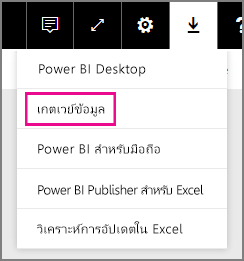
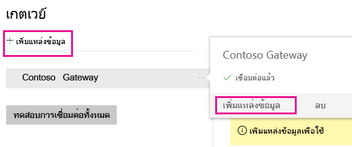
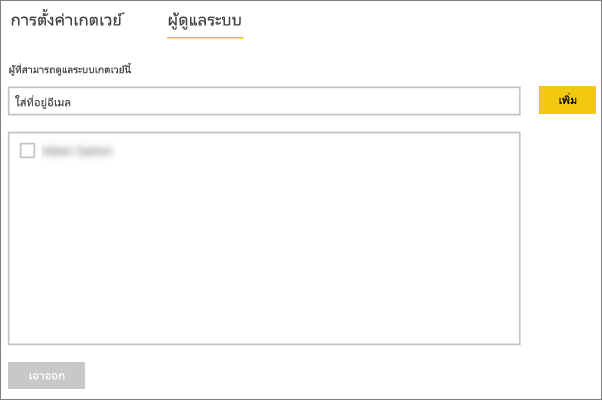
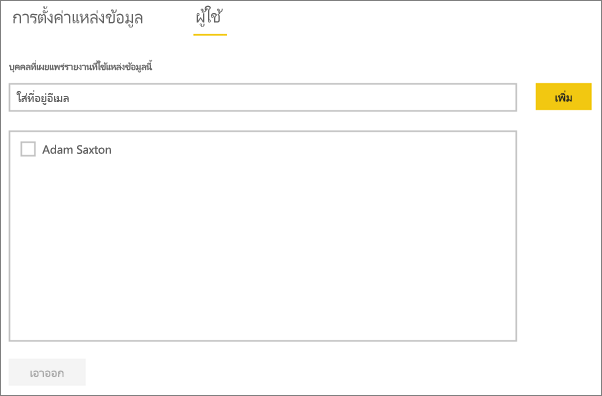

# <a name="manage-your-data-source---analysis-services"></a>จัดการแหล่งข้อมูลของคุณ - Analysis Services
เมื่อคุณได้ติดตั้งเกตเวย์ข้อมูลในองค์กร คุณจะต้องเพิ่มแหล่งข้อมูลที่สามารถใช้กับเกตเวย์ บทความนี้จะดูที่วิธีการทำงานกับเกตเวย์และแหล่งข้อมูล คุณสามารถใช้แหล่งข้อมูล Analysis Services เพื่อการรีเฟรชตามกำหนดการ หรือใช้เพื่อการเชื่อมต่อสดก็ได้

<iframe width="560" height="315" src="https://www.youtube.com/embed/ownIGbcRAAU" frameborder="0" allowfullscreen></iframe>

## <a name="download-and-install-the-gateway"></a>ดาวน์โหลด และติดตั้งเกตเวย์
คุณสามารถดาวน์โหลดเกตเวย์จากบริการ Power BI ได้ เลือก**ดาวน์โหลด** > **Data Gateway**หรือ โดยไป[หน้าดาวน์โหลดเกตเวย์](https://go.microsoft.com/fwlink/?LinkId=698861)



## <a name="limitations-of-analysis-services-live-connections"></a>ขีดจำกัดของการเชื่อมต่อแบบสดของ Analysis Services
คุณสามารถใช้การเชื่อมต่อแบบสดกับอินสแตนซ์หลายมิติ หรือแบบตาราง

| **รุ่นของเซิร์ฟเวอร์** | **SKU ที่จำเป็นต้องมี** |
| --- | --- |
| 2012 SP1 CU4 หรือใหม่กว่า |เทคโนโลยีสำหรับการรวบรวมข้อมูล จัดเก็บ วิเคราะห์ และการเข้าถึงข้อมูล รวมถึงการดูในหลากหลายมุมมอง (BI) และ SKU องค์กร |
| 2014 |เทคโนโลยีสำหรับการรวบรวมข้อมูล จัดเก็บ วิเคราะห์ และการเข้าถึงข้อมูล รวมถึงการดูในหลากหลายมุมมอง (BI) และ SKU องค์กร |
| 2016 |SKU มาตรฐาน หรือสูงกว่า |

* การจัดรูปแบบระดับเซลล์ และคุณลักษณะการแปลไม่ได้รับการสนับสนุน
* การดำเนินการและ Named Sets จะไม่แสดงใน Power BI แต่คุณยังสามารถเชื่อมต่อกับคิวบ์หลายมิติที่ยังประกอบด้วยการดำเนินการ หรือ Named Sets พร้อมสร้างภาพและรายงานได้

## <a name="add-a-gateway"></a>เพิ่มเกตเวย์
หากต้องการเพิ่มเกตเวย์ เพียงแค่[ดาวน์โหลด](https://go.microsoft.com/fwlink/?LinkId=698861)และติดตั้งเกตเวย์บนเซิร์ฟเวอร์ในสภาพแวดล้อมของคุณ หลังจากที่คุณติดตั้งเกตเวย์แล้ว เกตเวย์จะแสดงในรายการของเกตเวย์ใต้**จัดการเกตเวย์**

> [!NOTE]
> **จัดการเกตเวย์**จะไม่แสดงขึ้นจนกว่าคุณจะได้เป็นผู้ดูแลระบบของเกตเวย์อย่างน้อยหนึ่งเกตเวย์ ซึ่งสามารถเกิดขึ้นได้โดยการได้รับการเพิ่มให้เป็นผู้ดูแล หรือคุณเป็นคนติดตั้งและกำหนดค่าเกตเวย์
> 
> 

## <a name="remove-a-gateway"></a>ลบเกตเวย์
การลบเกตเวย์จะเป็นการลบแหล่งข้อมูลต่าง ๆ ที่อยู่ภายใต้เกตเวย์นั้น ๆ ด้วยเช่นกัน  ซึ่งจะเป็นการทำลายแดชบอร์ดและรายงานอิงกับแหล่งข้อมูลเหล่านั้น

1. เลือกไอคอนรูปเฟืองที่มุมบนขวา > **จัดการเกตเวย์**
2. เกตเวย์ >**ลบ**

   

## <a name="add-a-data-source"></a>เพิ่มแหล่งข้อมูล
คุณสามารถเพิ่มแหล่งข้อมูลได้โดยเลือกเกตเวย์ และคลิก**เพิ่มแหล่งข้อมูล** หรือไปที่ “เกตเวย์” > **เพิ่มแหล่งข้อมูล**



จากนั้นคุณสามารถเลือก**ชนิดแหล่งข้อมูล**จากรายการได้ เลือก Analysis Services ถ้าคุณกำลังเชื่อมต่อกับเซิร์ฟเวอร์หลายมิติ หรือเซิร์ฟเวอร์แบบตาราง


จากนั้นคุณจะต้องกรอกข้อมูลเกี่ยวกับแหล่งข้อมูลซึ่งรวมถึง**Server**และ**ฐานข้อมูล**  

เกตเวย์จะนำ**ชื่อผู้ใช้**และ**รหัสผ่าน**ที่คุณกรอกมาใช้ในการเชื่อมต่อกับอินสแตนซ์ Analysis Services

> [!NOTE]
> บัญชีผู้ใช้ Windows คุณกรอกนั้นจะต้องได้รับอนุญาตจากผู้ดูแลเซิร์ฟเวอร์สำหรับอินสแตนซ์ที่คุณกำลังทำการเชื่อมต่อด้วย ถ้ารหัสผ่านของบัญชีนี้ถูกตั้งค่าให้หมดอายุ ผู้ใช้อาจจะเจอข้อผิดพลาดในการเชื่อมต่อหากไม่มีการอัปเดตรหัสผ่านสำหรับแหล่งข้อมูลนั้น ๆ สำหรับข้อมูลเพิ่มเติม ให้ดูบทความเกตเวย์ข้อมูลหลักภายในองค์กรเพื่อเรียนรู้เพิ่มเติมเกี่ยวกับวิธีการจัดเก็บ[ข้อมูลประจำตัว](service-gateway-onprem.md#credentials)
> 
> 


คุณสามารถคลิก**เพิ่ม**หลังจากที่คุณไดกรอกทุกอย่างครบแล้ว  ในตอนนี้ คุณสามารถใช้แหล่งข้อมูลนี้ในการรีเฟรชตามกำหนดการ หรือ การเชื่อมต่อแบบสด กับอินสแตนซ์ Analysis Services ที่อยู่ภายในองค์กรแล้ว  คุณจะเห็น*เชื่อมต่อสำเร็จ*หากการดำเนินการเสร็จสมบูรณ์แล้ว


### <a name="advanced-settings"></a>การตั้งค่าขั้นสูง
คุณสามารถกำหนดค่าระดับความเป็นส่วนตัวให้กับแหล่งข้อมูลของคุณ ซึ่งจะช่วยควบคุมการปะปนของข้อมูล โดยจะใช้เฉพาะสำหรับการรีเฟรชตามกำหนดการ จะไม่นำไปใช้กับการเชื่อมต่อสด [ศึกษาเพิ่มเติม](https://support.office.com/article/Privacy-levels-Power-Query-CC3EDE4D-359E-4B28-BC72-9BEE7900B540)


## <a name="usernames-with-analysis-services"></a>ชื่อผู้ใช้ โดย Analysis Services
แต่ละครั้งที่ผู้ใช้โต้ตอบกับรายงานที่เชื่อมต่อกับ Analysis Services ชื่อผู้ใช้ที่มีผลบังคับใช้ถูกส่งผ่านไปยังเกตเวย์ แล้วไปยังเซิร์ฟเวอร์ Analysis Services ภายในองค์กรของคุณ อยู่อีเมลที่คุณนำมาลงชื่อเข้าใช้กับ Power BI คือข้อมูลที่เราจะส่งผ่านไปยัง Analysis Services ในฐานะที่เป็นผู้ใช้ที่มีผลบังคับใช้ ซึ่งจะถูกส่งผ่านในคุณสมบัติการเชื่อมต่อ[EffectiveUserName](https://msdn.microsoft.com/library/dn140245.aspx#bkmk_auth) อีเมลนี้ควรตรงกับ UPN ที่กำหนดไว้ภายในโดเมน Active Directory ภายในเครื่อง UPN เป็นคุณสมบัติของบัญชีผู้ใช้ Active Directory บัญชีผู้ใช้ Windows นั้นจึงจำเป็นต้องมีอยู่ในบทบาท Analysis Services ถ้าหาค่าตรงกันไม่พบใน Active Directory การเข้าสู่ระบบจะไม่ประสบความสำเร็จ [ศึกษาเพิ่มเติม](https://msdn.microsoft.com/library/ms677605.aspx)

คุณยังสามารถทำแมปชื่อที่ใช้ในการลงชื่อเข้าใช้ใน Power BI กับไดเรกทอรีภายในเครื่อง UPN ได้ด้วย [ศึกษาเพิ่มเติม](service-gateway-enterprise-manage-ssas.md#map-user-names)

<iframe width="560" height="315" src="https://www.youtube.com/embed/Qb5EEjkHoLg" frameborder="0" allowfullscreen></iframe>

### <a name="how-do-i-tell-what-my-upn-is"></a>ฉันจะทราบได้อย่างไรว่า UPN ของฉันเป็นอะไร
คุณอาจไม่ทราบว่า UPN ของคุณเป็นอะไร และคุณอาจจะไม่ใช่ผู้ดูแลระบบโดเมน คุณสามารถใช้คำสั่งต่อไปนี้จากเวิร์กสเตชันของคุณเพื่อค้นหา UPN สำหรับบัญชีของคุณ

    whoami /upn

ผลลัพธ์จะมีลักษณะคล้ายกับอยู่อีเมล แต่นี่คือ UPN ที่อยู่ในบัญชีโดเมนของคุณ ถ้าคุณกำลังใช้แหล่งข้อมูล Analysis Services สำหรับการเชื่อมต่อสด และถ้าหากที่อยู่อีเมลไม่ตรงกับอีเมลของคุณที่ใช้ลงชื่อเข้า Power BI คุณอาจต้องดูที่วิธีการ[แมปชื่อผู้ใช้](#map-user-names)

## <a name="map-user-names"></a>แมปชื่อผู้ใช้
<iframe width="560" height="315" src="https://www.youtube.com/embed/eATPS-c7YRU" frameborder="0" allowfullscreen></iframe>

คุณสามารถแมปชื่อผู้ใช้สำหรับ Analysis Services ได้สองวิธี:

1. แมปผู้ใช้ด้วยตนเองอีกครั้ง 
2. ใช้ On-premises Active Directory Property Lookup ในการแมป ADD UPNs ไปยังผู้ใช้ Active Directory (การแมปแบบ AD Lookup)

ถึงแม้จะสามารถแมปผู้ใช้ด้วยตนเองตามวิธีที่สองได้ก็ตาม การกระทำเช่นนี้อาจจะใช้เวลานาน และยากต่อการบำรุงรักษา ซึ่งจะยากมากเป็นพิเศษเมื่อรูปแบบการจับคู่นั้นมีไม่เพียงพอ เช่น เมื่อโดเมนเนมระหว่าง ADD และ on-premises AD นั้นแตกต่างกัน หรือ เมื่อชื่อบัญชีผู้ใช้มีความแตกต่างต่างกันระหว่าง ADD และ AD ดังนั้น การแมปด้วยวิธีที่สองจึงไม่เป็นที่แนะนำ

เราอธิบายวิธีการสองแบบนี้ไว้ในสองหัวข้อด้านล่างตามลำดับ

### <a name="manual-user-name-re-mapping"></a>แมปผู้ใช้ด้วยตนเองอีกครั้ง
สำหรับแหล่งข้อมูล Analysis Services คุณสามารถกำหนดค่ากฎต่าง ๆ ของชื่อหลักของผู้ใช้ (UPN) แบบกำหนดเอง ซึ่งจะช่วยให้คุณถ้าชื่อที่ใช้ในการเข้าสู่ระบบบริการของ Power BI ไม่ตรงกับไดเรกทอรีภายในเครื่อง UPN ตัวอย่างเช่น ถ้าคุณลงชื่อเข้าสู่ Power BI ด้วยjohn@contoso.comแต่ไดเรกทอรี UPN ภายในเครื่องของคุณคือjohn@contoso.localคุณสามารถกำหนดค่ากฎการแมปให้john@contoso.localส่งผ่านไปยัง Analysis Services ได้

เมื่อต้องรับไปยังหน้าจอการแมป UPN ทำสิ่งต่อไปนี้

1. ไป**ไอคอนรูปเฟือง**และเลือก**จัดการเกตเวย์**
2. ขยายเกตเวย์ที่ประกอบด้วยแหล่งข้อมูล Analysis Services หรือ ถ้าคุณยังไม่ได้สร้างแหล่งข้อมูล Analysis Services ใด ๆ คุณจะสามารถทำได้ในขั้นตอนนี้
3. เลือกแหล่งข้อมูล จากนั้น เลือกแท็บ**ผู้ใช้**
4. เลือก**แมปชื่อผู้ใช้**

    

จากนั้นคุณจะเห็นตัวเลือกให้เพิ่มกฎ ตลอดจนบททดสอบสำหรับผู้ใช้ที่กำหนด

> [!NOTE]
> คุณอาจเปลี่ยนแปลงผู้ใชโดยไม่ได้ตั้งใจ ตัวอย่างเช่น ถ้าค่า**ที่นำมาแทน (ค่าเริ่มต้น)ของคุณ**คือ<em>@contoso.com</em>และ**ของคุณ ด้วย(ชื่อใหม่)** คือ <em>@contoso.local</em>ดังนั้น ผู้ใช้ทั้งหมดที่มีเครื่องหมายอยู่<em>@contoso.com</em>จะถูกแทนที่ด้วย<em>@contoso.local</em> นอกจากนี้ยัง ถ้าชื่อ**ที่นำมาแทน (ชื่อเดิม)ของคุณ**คือ<em>dave@contoso.com</em>และ**ของคุณ ด้วย(ชื่อใหม่)** คือ <em>dave@contoso.local</em>ผู้ใช้ที่มีเครื่องหมายอยู่v-dave@contoso.comจะถูกส่งเป็น v-dave<em>@contoso.local</em>

### <a name="ad-lookup-mapping"></a>การแมปแบบค้นหา AD
เพื่อทำการค้นหาคุณสมบัติ on-premises AD เพื่อแมป AAD UPNs อีกครั้ง ผู้ใช้ Active Directory ต้องทำตามขั้นตอนในส่วนนี้ เริ่มแรก มาตรวจสอบวิธีการทำงานกัน

ในการ**บริการ Power BI**จะมีสิ่งต่อไปนี้เกิดขึ้น:

- สำหรับแต่ละคิวรีโดยผู้ใช้ Power BI AAD ไปยังเซิร์ฟเวอร์ on-premises SSAS สตริง UPN จะถูกส่งผ่านตามไปด้วย เช่น:      firstName.lastName@contoso.com

> [!NOTE]
> ผู้ใช้การแมป UPN แบบกำหนดเองใด ๆ ที่ระบุอยู่ในกำหนดค่าแหล่งข้อมูล Power BI จะยังคงใช้ถูกนำมาใช้*ก่อน*ที่จะส่งสตริงชื่อผู้ใช้ไปยังเกตเวย์ข้อมูลในองค์กร
> 
> 

บนข้อมูลในสถานเกตเวย์ด้วยการสร้างผู้ใช้แบบกำหนดเองสามารถกำหนดค่าการแมปได้โดยทำตามขั้นตอนต่อไปนี้:

1. ค้นหา Active Directory เพื่อค้นหา (อัตโนมัติ หรือกำหนดค่าได้)
2. ค้นหาแอตทริบิวต์ของบุคคล AD (เช่น*อีเมล*) ตามสตริง UPN ขาเข้า ("firstName.lastName@contoso.com") จากตัว**บริการ Power BI**
3. ถ้าการค้นหา AD ล้มเหลว ระบบจะพยายามใช้ UPN ผ่านตามเป็น EffectiveUser เพื่อ SSAS
4. ถ้าการค้นหา AD ประสบความสำเร็จ จะดึง*UserPrincipalName*ของบุคคล AD ดังกล่าว 
5. ระบบจะส่งผ่านคำ*UserPrincipalName*ส่งอีเมลเป็น*EffectiveUser*ไปยัง SSAS เช่น: <em>Alias@corp.on-prem.contoso</em>

วิธีการกำหนดค่าเกตเวย์ของคุณเพื่อดำเนินการค้นหา AD:

1. ดาวน์โหลด และติดตั้งเกตเวย์ล่าสุด

2. ในเกตเวย์ คุณจำเป็นต้องเปลี่ยนการ**บริการเกตเวย์ข้อมูลในองค์กร**เพื่อเรียกใช้ ด้วยบัญชีโดเมน (แทนภายในเครื่องบัญชีบริการ – มิฉะนั้นการค้นหา AD จะไม่ทำงานอย่างเหมาะสมในเวลาที่กำลังดำเนินการ) คุณจะต้องปิดและเปิดบริการเกตเวย์ใหม่เพื่อให้การเปลี่ยนแปลงมีผลบังคับใช้  ไปยังแอปเกตเวย์บนเครื่องของคุณ (ค้นหา "เกตเวย์ข้อมูลภายในองค์กร") ในการดำเนินการนี้ ให้ไปที่**ตั้งค่าบริการ > เปลี่ยนบัญชีบริการ** ตรวจสอบให้แน่ใจว่า คุณมีรหัสสำหรับการกู้คืนของเกตเวย์นีอยู่ เนื่องจากคุณจะต้องทำการคืนค่าบนเครื่องเดียวกันเว้นแต่ว่าคุณต้องการสร้างเกตเวย์ใหม่แทน 

3. นำทางไปยังโฟลเดอร์การติดตั้งของเกตเวย์*เกตเวย์ข้อมูลภายในองค์กรกับ C:\Program Files\On*เป็นผู้ดูแล เพื่อให้แน่ใจว่า คุณมีสิทธิ์เขียน และแก้ไขไฟล์ต่อไปนี้: Microsoft.PowerBI.DataMovement.Pipeline.GatewayCore.dll.config 

4. แก้ไขการกำหนดค่าสองค่าต่อไปนี้ตาม*ค่า* การกำหนดค่าแอตทริบิวต์ของ Active Directory สำหรับผู้ใช้ AD ของคุณ ค่ากำหนดค่าที่แสดงด้านล่างเป็นเพียงตัวอย่าง คุณจำเป็นต้องระบุเหล่านั้นโดยยึดตามการกำหนดค่า Active Directory กำหนดค่าเหล่านี้จะตรงตามตัวพิมพ์ใหญ่-เล็ก ดังนั้นให้ ตรวจสอบให้แน่ใจว่าตรงกับค่าใน Active Directory

    

    ถ้าไม่มีค่าไว้สำหรับการกำหนดค่า ADServerPath เกตเวย์ใช้ค่าเริ่มต้นของ Global Catalog คุณยังสามารถระบุค่าหลายค่าสำหรับ ADServerPath ได้ แต่ละค่าต้องคั่น ด้วยเครื่องหมายอัฒภาคตามตัวอย่างต่อไปนี้

    ```xml
    <setting name="ADServerPath" serializeAs="String">
        <value> >GC://serverpath1; GC://serverpath2;GC://serverpath3</value>
    </setting>
    ```
    เกตเวย์แยกวิเคราะห์ค่าสำหรับ ADServerPath จากซ้ายไปขวาจนกว่าจะพบรายการตรงกัน ถ้าไม่ตรงกัน คือใช้ UPN ต้นฉบับ ตรวจสอบให้แน่ใจว่าบัญชีผู้ใช้เรียกใช้บริการเกตเวย์ (PBIEgwService) มีสิทธิ์แบบสอบถามไปยังเซิร์ฟเวอร์ AD ทั้งหมดที่คุณระบุใน ADServerPath

    เกตเวย์สนับสนุนสองชนิด ADServerPath ตามตัวอย่างต่อไปนี้

    **WinNT**

    ```xml
    <value="WinNT://usa.domain.corp.contoso.com,computer"/>
    ```

    **GC**

    ```xml
    <value> GC://USA.domain.com </value>
    ```

5. เริ่ม**เกตเวย์ข้อมูลภายในองค์กร**บริการสำหรับการเปลี่ยนแปลงการกำหนดค่ามีผลใช้

### <a name="working-with-mapping-rules"></a>ทำงานกับกฎการแมป
เมื่อต้องสร้างกฎการแมป ใส่ค่าสำหรับ**ชื่อเดิม**และ**ชื่อใหม่**แล้ว เลือก**เพิ่ม**

| เขตข้อมูล | คำอธิบาย |
| --- | --- |
| แทน (ชื่อเดิม) |อยู่อีเมลที่คุณลงชื่อเข้า Power BI ด้วย |
| กับ (ชื่อใหม่) |ค่าที่คุณต้องการนำมาแทนที่ ผลลัพธ์ของการแทนที่เป็นสิ่งที่จะส่งผ่านไปยัง*EffectiveUserName*คุณสมบัติสำหรับการเชื่อมต่อ Analysis Services |


เมื่อคุณเลือกสิ่งของในรายการ คุณสามารถเลือกที่จะเรียงลำดับใหม่ได้ โดยใช้**ไอคอนรูปบั้ง**หรือ**ลบ**รายการได้


### <a name="using-wildcard-"></a>ใช้อักขระตัวแทน (*)
คุณสามารถใช้อักขระตัวแทนสำหรับสตริง**แทน (ชื่อเดิม)** ของคุณได้ ซึ่งอักขระนี้สามารถใช้เดี่ยว ๆ ได้ด้วยตัวมันเอง และไม่ใช้กับส่วนอื่นใด ๆ ของสตริง และนี่จะเป็นการอนุญาตให้คุณสามารถนำผู้ใช้ทั้งหมด และส่งค่าเดียวไปยังแหล่งข้อมูล มันเป็นประโยชน์เมื่อคุณต้องการผู้ใช้ทั้งหมดในองค์กรของคุณใช้ผู้ใช้เดียวกันในสภาพแวดล้อมภายในเครื่องของคุณ

### <a name="test-a-mapping-rule"></a>ทดสอบกฎการแมป
คุณสามารถตรวจสอบสิ่งที่มีชื่อต้นฉบับจะถูกแทนที่ด้วย โดยการใส่ค่าสำหรับ**ชื่อเดิม**และเลือก**กฎทดสอบ**ได้


> [!NOTE]
> กฎที่บันทึกไว้จะใช้เวลาสักครู่เพื่อให้บริการเริ่มต้นใช้งานเหล่านั้น ภายในเบราว์เซอร์ กฎจะทำงานทันที
> 
> 

### <a name="limitations-for-mapping-rules"></a>ขีดจำกัดสำหรับกฎการแมป
* การแมปมีไว้สำหรับแหล่งข้อมูลที่เฉพาะเจาะจงที่ได้รับการกำหนดค่า ไม่ใช่การตั้งค่าส่วนกลางเท่านั้น ถ้าคุณมีแหล่งข้อมูล Analysis Services หลายแหล่ง คุณจะต้องแมปผู้ใช้สำหรับแต่ละแหล่งข้อมูล

## <a name="remove-a-data-source"></a>ลบแหล่งข้อมูล
การลบแหล่งข้อมูลจะตัดแดชบอร์ดหรือรายงานทุกชนิดที่ขึ้นกับแหล่งข้อมูลที่ระบุ  

ในการลบแหล่งข้อมูล ให้ไปที่แหล่งข้อมูล > **ลบ**


## <a name="manage-administrators"></a>จัดการผู้ดูแลระบบ
ในแถบผู้ดูแลสำหรับเกตเวย์ คุณสามารถเพิ่มและลบผู้ใช้ (หรือกลุ่มการรักษาความปลอดภัย) ที่สามารถเข้ามาดูแลระบบเกตเวย์ได้



## <a name="manage-users"></a>จัดการผู้ใช้
บนแท็บผู้ใช้สำหรับแหล่งข้อมูล คุณสามารถเพิ่ม และลบผู้ใช้ หรือกลุ่มความปลอดภัยที่สามารถใช้แหล่งข้อมูลนี้ได้

> [!NOTE]
> รายการผู้ใช้จะควบคุมเพียงแค่ผู้ที่สามารถเผยแพร่รายงานได้เท่านั้น เจ้าของรายงานสามารถสร้างแดชบอร์ด หรือชุดเนื้อหา และนำมาแชร์ร่วมกับผู้ใช้อื่นๆ ได้
> 
> 



## <a name="using-the-data-source"></a>การใช้แหล่งข้อมูล
หลังจากที่คุณได้สร้างแหล่งข้อมูล รายการนี้จะพร้อมใช้งานเมื่อต้องใช้ทั้งกับการเชื่อมต่อสดหรือผ่านการรีเฟรชตามกำหนดการ

> [!NOTE]
> ชื่อเซิร์ฟเวอร์และชื่อฐานข้อมูลจะต้องตรงกับชื่อระหว่าง Power BI Desktop และแหล่งข้อมูลในเกตเวย์ข้อมูล On-premises!
> 
> 

การเชื่อมโยงระหว่างชุดข้อมูลของคุณและแหล่งข้อมูลภายในเกตเวย์จะเป็นไปตามชื่อเซิร์ฟเวอร์และชื่อฐานข้อมูลของคุณ สิ่งเหล่านี้จำเป็นต้องตรงกัน ตัวอย่างเช่น ถ้าคุณใส่ที่อยู่ IP สำหรับชื่อเซิร์ฟเวอร์ ภายใน Power BI Desktop คุณจะต้องใช้ที่อยู่ IP สำหรับแหล่งข้อมูลภายในการกำหนดค่าเกตเวย์ด้วย ถ้าคุณใช้*SERVER\INSTANCE*ใน Power BI Desktop คุณจะจำเป็นต้องใชชื่อเดียวกันภายในแหล่งข้อมูลกำหนดค่าไว้สำหรับเกตเวย์

นี่คือกรณีสำหรับทั้งเชื่อมต่อแบบสดและรีเฟรชตามกำหนดการ

### <a name="using-the-data-source-with-live-connections"></a>การใช้แหล่งข้อมูลที่ มีการเชื่อมต่อแบบสด
คุณจะต้องตรวจสอบให้แน่ใจว่าเซิร์ฟเวอร์และฐานข้อมูลชื่อตรงกันระหว่าง Power BI Desktop และแหล่งข้อมูลที่กำหนดค่าไว้สำหรับเกตเวย์ คุณจะยังจำเป็นต้องตรวจสอบให้แน่ใจว่า ผู้ใช้ของคุณแสดงอยู่ในแท็บ**ผู้ใช้**ของแหล่งข้อมูลเพื่อที่เผยแพร่ชุดข้อมูลที่เชื่อมต่อสด ตัวเลือกสำหรับการเชื่อมต่อสด จะเกิดขึ้นภายใน Power BI Desktop ตอนที่คุณนำเข้าข้อมูลครั้งแรก

หลังจากที่คุณเผยแพร่แล้ว ไม่ว่าจาก Power BI Desktop หรือ**รับข้อมูล**รายงานของคุณควรเริ่มการทำงานแล้ว อาจจะใช้เวลาหลายนาทีเพื่อให้การเชื่อมต่อสามารถใช้งานได้ หลังจากการสร้างแหล่งข้อมูลภายในเกตเวย์

### <a name="using-the-data-source-with-scheduled-refresh"></a>การใช้แหล่งข้อมูลที่มีการรีเฟรชตามกำหนดการ
ถ้าคุณได้รับการระบุให้อยู่ในแท็บ**ผู้ใช้**ของแหล่งข้อมูลที่กำหนดค่าไว้ภายในเกตเวย์ และชื่อเซิร์ฟเวอร์และชื่อฐานข้อมูลตรงกัน คุณจะเห็นเกตเวย์เป็นตัวเลือกเพื่อใช้กับการรีเฟรชตามกำหนดการ


## <a name="next-steps"></a>ขั้นตอนถัดไป
[เกตเวย์ข้อมูลภายในองค์กร](service-gateway-onprem.md)  
[เกตเวย์ข้อมูลในองค์กร - เชิงลึก](service-gateway-onprem-indepth.md)  
[การแก้ไขปัญหาเกตเวย์ข้อมูลในองค์กร](service-gateway-onprem-tshoot.md)  
มีคำถามเพิ่มเติมหรือไม่? [ลองไปที่ชุมชน Power BI](http://community.powerbi.com/)

