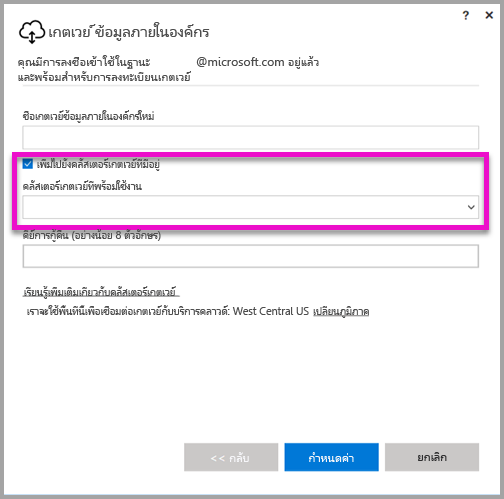

# <a name="high-availability-clusters-for-on-premises-data-gateway"></a>คลัสเตอร์ความพร้อมใช้งานสูงสำหรับเกตเวย์ข้อมูลภายในองค์กร
คุณสามารถสร้าง**คลัสเตอร์ความพร้อมใช้งานสูง**ของการติดตั้ง**เกตเวย์ข้อมูลภายในองค์กร** เพื่อให้แน่ใจว่า องค์กรของคุณสามารถเข้าถึงแห่งข้อมูลที่ายในองค์กรที่ใช้ในรายงาน Power BI และแดชบอร์ดได้ คลัสเตอร์ดังกล่าวช่วยให้ผู้ดูแลระบบเกตเวย์ไปจนถึงเกตเวย์กลุ่มสามารถหลีกเลี่ยงจุดเดี่ยวของความล้มเหลวในการเข้าถึงแหล่งข้อมูลภายในองค์กร บทความนี้อธิบายขั้นตอนที่คุณสามารถใช้เพื่อสร้างคลัสเตอร์ความพร้อมใช้งานสูงของเกตเวย์ข้อมูลภายในองค์กร และแบ่งปันหลักปฏิบัติที่ดีที่สุดเมื่อมีการตั้งค่าเหล่านั้น คลัสเตอร์เกตเวย์พร้อมใช้งานสูงจำเป็นต้องมีการอัปเดตเกตเวย์ข้อมูลภายในองค์กรให้เป็นเวอร์ชันเดือนพฤศจิกายน 2017 หรือใหม่กว่า


## <a name="setting-up-high-availability-clusters-of-gateways"></a>การตั้งค่าคลัสเตอร์ความพร้อมใช้งานสูงของเกตเวย์

ในระหว่างกระบวนการติดตั้ง**เกตเวย์ข้อมูลภายในองค์กร** คุณสามารถระบุว่าได้ว่าควรจะเพิ่มเกตเวย์ไปยังการคลัสเตอร์เกตเวย์ที่มีอยู่หรือไม่ 



เมื่อต้องการเพิ่มเกตเวย์ไปยังคลัสเตอร์ที่มีอยู่ คุณต้องป้อน*คีย์การกู้คืน*สำหรับอินสแตนซ์เกตเวย์หลักสำหรับคลัสเตอร์ที่คุณต้องการให้เกตเวย์ใหม่เข้าร่วม เกตเวย์หลักสำหรับคลัสเตอร์ต้องเรียกใช้การอัปเดตเกตเวย์จากเดือนพฤศจิกายน 2017 หรือใหม่กว่า 


## <a name="managing-a-gateway-cluster"></a>การจัดการคลัสเตอร์เกตเวย์

เมื่อคลัสเตอร์เกตเวย์ประกอบด้วยอย่างน้อยสองเกตเวย์ การดำเนินการจัดการเกตเวย์ทั้งหมด เช่น การเพิ่มแหล่งข้อมูล หรือการมอบสิทธิ์ผู้ดูแลให้เกตเวย์ จะนำไปใช้กับเกตเวย์ทั้งหมดที่เป็นส่วนหนึ่งของคลัสเตอร์ 

เมื่อผู้ดูแลใช้รายการเมนู**จัดการเกตเวย์**ที่แสดงอยู่ใต้ไอคอนรูปเในฟือง**บริการ Power BI**ผู้ดูแลจะเห็นรายการของคลัสเตอร์ที่ลงทะเบียนหรือเกตเวย์ส่วนบุคคล แต่จะไม่เห็นแต่ละอินสแตนซ์เกตเวย์ส่วนบุคคลที่เป็นสมาชิกของคลัสเตอร์

คำขอ**รีเฟรชตามกำหนดการ**ใหม่และการดำเนินงาน DirectQuery ทั้งหมดจะได้รับการส่งไปที่อินสแตนซ์หลักของคลัสเตอร์เกตเวย์ที่ระบุไว้ ถ้าอินสแตนซ์ของเกตเวย์หลักไม่ออนไลน์ คำขอจะได้รับการส่งไปที่อินสแตนซ์ของเกตเวย์อื่นในคลัสเตอร์

## <a name="powershell-support-for-gateway-clusters"></a>การสนับสนุน PowerShell สำหรับคลัสเตอร์เกตเวย์

สคริปต์ของ PowerShell จะพร้อมใช้งานในโฟลเดอร์การติดตั้งเกตเวย์ข้อมูลภายในองค์กร ตามค่าเริ่มต้น โฟลเดอร์ดังกล่าวอยู่ที่*C:\Program Files\On-premises data gateway* คุณจะต้องใช้ PowerShell เวอร์ชัน 5 หรือใหม่กว่าเพื่อให้สคริปต์นี้ทำงานได้อย่างถูกต้อง สคริปต์ PowerShell ช่วยให้ผู้ใช้สามารถดำเนินการต่อไปนี้ได้

-   เรียกใช้รายการของคลัสเตอร์เกตเวย์ที่พร้อมใช้งานสำหรับผู้ใช้
-   เรียกใช้รายการของอินสแตนซ์ของเกตเวย์ที่ลงทะเบียนไว้ในคลัสเตอร์ ตลอดจนสถานะออนไลน์ หรือออฟไลน์
-   ปรับเปลี่ยนสถานะเปิด/ปิดใช้งานสำหรับอินสแตนซ์ของเกตเวย์ภายในคลัสเตอร์ ตลอดจนคุณสมบัติเกตเวย์อื่นๆ
-   ลบเกตเวย์

เมื่อต้องการเรียกใช้คำสั่ง PowerShell ในตาราง ก่อนอื่นคุณต้องทำตามขั้นตอนต่อไปนี้

1. เปิดหน้าต่างคำสั่ง PowerShell ในฐานะผู้ดูแลระบบ
2. จากนั้นเรียกใช้คำสั่ง PowerShell ครั้งเดียวดังต่อไปนี้ (คาดว่าคุณไม่เคยเรียกใช้คำสั่ง PowerShell บนเครื่องปัจจุบันมาก่อน)

    ```
    Set-ExecutionPolicy -ExecutionPolicy Unrestricted -Force
    ```

3. ถัดไป ไปที่โฟลเดอร์การติดตั้งเกตเวย์ข้อมูลภายในองค์กรในหน้าต่าง PowerShell และนำเข้าโมดูลที่จำเป็นโดยใช้คำสั่งต่อไปนี้

    ```
    Import-Module .\OnPremisesDataGatewayHAMgmt.psm1
    ```

เมื่อขั้นตอนเหล่านั้นจะเสร็จสมบูรณ์ คุณจะสามารถใช้คำสั่งต่าง ๆ ในตารางต่อไปนี้เพื่อจัดการคลัสเตอร์เกตเวย์ของคุณ

| **คำสั่ง** | **คำอธิบาย** | **พารามิเตอร์** |
| --- | --- | --- |
| *เข้าสู่ระบบ OnPremisesDataGateway* |คำสั่งนี้ช่วยให้ผู้ใช้สามารถเข้าสู่ระบบเพื่อจัดการคลัสเตอร์เกตเวย์ข้อมูลภายในองค์กรของพวกเขา  คุณต้องเรียกใช้คำสั่งนี้ และเข้าสู่ระบบ*ก่อนที่*คำสั่งความพร้อมใช้งานสูงอื่น ๆ จะสามารถทำงานอย่างถูกต้องได้ หมายเหตุ: โทเค็นรับรองความถูกต้อง AAD ที่ได้รับเป็นส่วนหนึ่งของการโทรเข้าสู่ระบบจะสามารถใช้งานได้เป็นเวลา 1 ชั่วโมงเท่านั้น หลังจากหมดอายุ คุณสามารถเรียกใช้คำสั่งเข้าสู่ระบบเพื่อรับโทเค็นใหม่| ชื่อผู้ใช้ และรหัสผ่าน AAD (เป็นส่วนหนึ่งของการดำเนินการคำสั่ง ไม่ใช่การเรียกใช้เริ่มต้น)|
| *รับ OnPremisesDataGatewayClusters* | เรียกใช้รายการของคลัสเตอร์เกตเวย์สำหรับผู้ใช้ที่เข้าสู่ระบบ | อีกทางหนึ่งคือ คุณสามารถส่งพารามิเตอร์การจัดรูปแบบไปยังคำสั่งนี้เพื่อให้สามารถอ่านได้ดียิ่งขึ้น เช่น*Format-Table -AutoSize -Wrap* |
| *รับ OnPremisesDataClusterGateways* | เรียกใช้รายการของเกตเวย์ภายในคลัสเตอร์ที่ระบุ ตลอดจนข้อมูลเพิ่มเติมสำหรับแต่ละเกตเวย์ (สถานะออนไลน์/ออฟไลน์ ชื่อเครื่องและอื่น ๆ) | *-ClusterObjectID xyz* (ซึ่ง*xyz*จะถูกแทนที่ด้วยค่า ID ออบเจ็กต์คลัสเตอร์จริง ซึ่งสามารถเรียกใช้ได้โดยใช้*รับคำสั่ง OnPremisesDataGatewayClusters*)|
| *ตั้งค่า OnPremisesDataGateway* | ช่วยให้คุณตั้งค่าคุณสมบัติสำหรับเกตเวย์ที่ระบุภายในคลัสเตอร์ รวมถึงความสามารถในการเปิด/ปิดใช้งานอินสแตนซ์เกตเวย์เฉพาะ  | *-ClusterObjectID xyz* (*xyz*ควรถูกแทนที่ค่า ID ออบเจ็กต์คลัสเตอร์จริง ซึ่งสามารถเรียกใช้งานได้โดยใช้*รับคำสั่ง OnPremisesDataGatewayClusters*) *- GatewayObjectID abc* (*abc*ควรถูกแทนที่ด้วยค่า ID วัตถุคลัสเตอร์จริง ซึ่งสามารถเรียกใช้งานได้โดยใช้*รับคำสั่ง OnPremisesDataClusterGateways* ที่กำหนด ID ออบเจ็กต์คลัสเตอร์) |
| *รับ OnPremisesDataGatewayStatus* | ช่วยให้คุณเรียกใช้สถานะสำหรับอินสแตนซ์เกตเวย์ที่ระบุภายในคลัสเตอร์  | *-ClusterObjectID xyz* (*xyz*ควรถูกแทนที่ค่า ID ออบเจ็กต์คลัสเตอร์จริง ซึ่งสามารถเรียกใช้งานได้โดยใช้*รับคำสั่ง OnPremisesDataGatewayClusters*) *- GatewayObjectID abc* (*abc*ควรถูกแทนที่ด้วยค่า ID วัตถุคลัสเตอร์จริง ซึ่งสามารถเรียกใช้งานได้โดยใช้*รับคำสั่ง OnPremisesDataClusterGateways* ที่กำหนด ID ออบเจ็กต์คลัสเตอร์) |
| *ลบ OnPremisesDataGateway*  | ช่วยให้คุณลบอินสแตนซ์เกตเวย์จากคลัสเตอร์ได้ - โปรดอย่าลืมว่าไม่สามารถลบเกตเวย์หลักในคลัสเตอร์ได้จนกว่าเกตเวย์อื่น ๆ ทั้งหมดในคลัสเตอร์ที่ถูกลบออก| *-ClusterObjectID xyz* (*xyz*ควรถูกแทนที่ค่า ID ออบเจ็กต์คลัสเตอร์จริง ซึ่งสามารถเรียกใช้งานได้โดยใช้*รับคำสั่ง OnPremisesDataGatewayClusters*) *- GatewayObjectID abc* (*abc*ควรถูกแทนที่ด้วยค่า ID วัตถุคลัสเตอร์จริง ซึ่งสามารถเรียกใช้งานได้โดยใช้*รับคำสั่ง OnPremisesDataClusterGateways* ที่กำหนด ID ออบเจ็กต์คลัสเตอร์) |


## <a name="next-steps"></a>ขั้นตอนถัดไป

-   [จัดการแหล่งข้อมูลของคุณ - Analysis Services](service-gateway-enterprise-manage-ssas.md)  
-   [จัดการแหล่งข้อมูลของคุณ - SAP HANA](service-gateway-enterprise-manage-sap.md)  
-   [จัดการแหล่งข้อมูลของคุณ - SQL Server](service-gateway-enterprise-manage-sql.md)  
-   [จัดการแหล่งข้อมูลของคุณ - Oracle](service-gateway-onprem-manage-oracle.md)  
-   [จัดการแหล่งข้อมูลของคุณ - นำเข้า/รีเฟรชตามกำหนดการ](service-gateway-enterprise-manage-scheduled-refresh.md)  
-   [ข้อมูลเชิงลึกของเกตเวย์ข้อมูลภายในองค์กร](service-gateway-onprem-indepth.md)  
-   [เกตเวย์ข้อมูลภายในองค์กร (โหมดส่วนบุคคล)](service-gateway-personal-mode.md)
-   [กำหนดค่าพร็อกซีสำหรับเกตเวย์ข้อมูลภายในองค์กร](service-gateway-proxy.md)  
-   [ใช้ Kerberos สำหรับ SSO (ลงชื่อเข้าใช้ครั้งเดียว) จาก Power BI ไปยังแหล่งข้อมูลภายในองค์กร](service-gateway-kerberos-for-sso-pbi-to-on-premises-data.md)  

มีคำถามเพิ่มเติมหรือไม่ [ลองไปที่ชุมชน Power BI](http://community.powerbi.com/)
