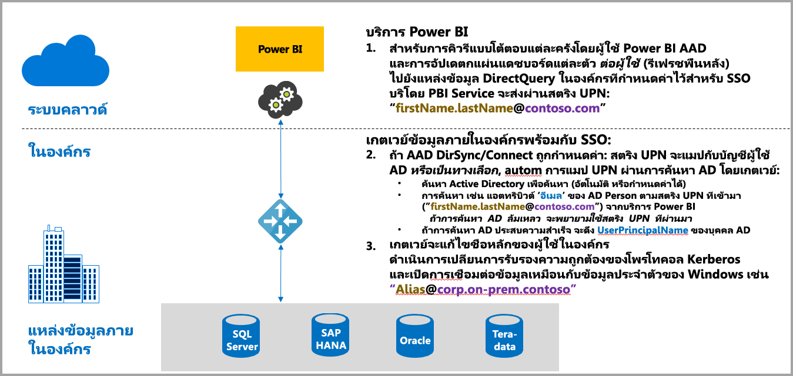
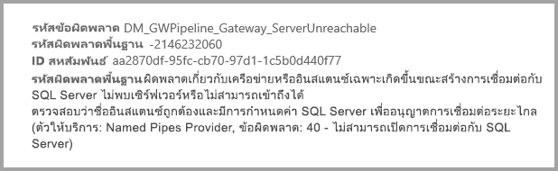
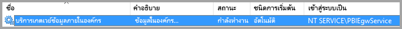
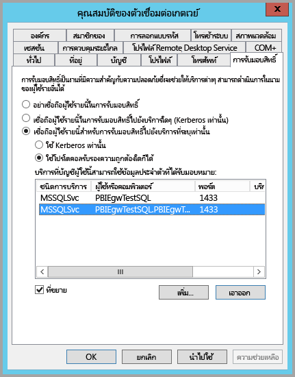
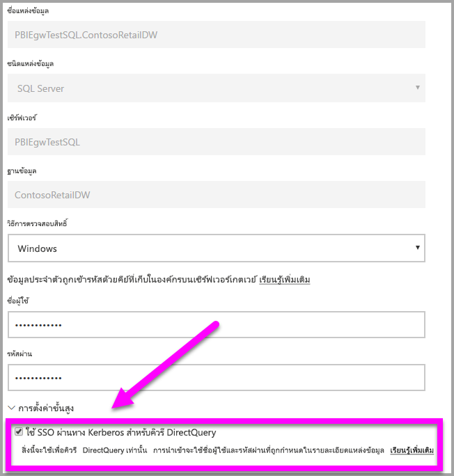
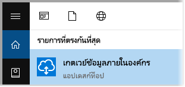

# ใช้ Kerberos สำหรับ SSO (ลงชื่อเข้าระบบครั้งเดียว) จาก Power BI ไปยังแหล่งข้อมูลในองค์กร
คุณสามารถเชื่อมต่อด้วย การลงชื่อเข้าระบบครั้งเดียว เปิดใช้งานรายงานและแดชบอร์ดของ Power BI เพื่อปรับปรุงจากข้อมูลในองค์กร โดยการกำหนดค่าในเกตเวย์ข้อมูลในองค์กรของคุณด้วย Kerberos เกตเวย์ข้อมูลในองค์กร จะช่วยอำนวยความสะดวกในการ ลงชื่อเข้าระบบครั้งเดียว (SSO) โดยใช้ DirectQuery เพื่อเชื่อมต่อกับแหล่งข้อมูลในองค์กร

เราสนับสนุนแหล่งข้อมูลต่อไปนี้ SQL Server, SAP HANA และ Teradata ทั้งหมดนี้ทำงานโดยอาศัย[การมอบหมายที่มีข้อจำกัดของ Kerberos](https://technet.microsoft.com/library/jj553400.aspx)

* SQL Server
* SAP HANA
* SAP BW
* Teradata

เมื่อผู้ใช้โต้ตอบกับ รายงาน DirectQuery ในบริการของ Power BI การดำเนินงานเกี่ยวกับ ตัวกรองข้าม ชิ้น การเรียงลำดับ และการแก้ไขรายงาน อาจดำเนินการด้วยคิวรีสด กับแหล่งข้อมูลพื้นฐานภายในองค์กร  เมื่อแหล่งข้อมูลมีการกำหนดค่า SSO คิวรีจะถูกดำเนินการด้วย ข้อมูลประจำตัวของผู้ใช้ที่โต้ตอบกับ Power BI (นั่นคือ เมื่อทำผ่านเว็บ หรือแอป Power BI บนมือถือ) ดังนั้น ผู้ใช้แต่ละรายการมองเห็นได้เพียงข้อมูลที่พวกเขามีสิทธิ์ในแหล่งข้อมูลพื้นฐาน – เมื่อมีการกำหนดค่า SSO จะไม่มีการแชร์แคชข้อมูลระหว่างผู้ใช้

## การเรียกใช้คิวรีด้วย SSO - ขั้นตอนที่เกิดขึ้น
คิวรีที่ทำงานโดยใช้ SSO ประกอบด้วยสามขั้นตอน ดังที่แสดงในไดอะแกรมต่อไปนี้

> [!NOTE]
> SSO สำหรับ Oracle ยังไม่เปิดให้ใช้งาน ยังอยู่ระหว่างการพัฒนาและจะมาเร็ว ๆ นี้
> 
> 

นี่เป็นรายละเอียดเพิ่มเติมเกี่ยวกับขั้นตอนดังกล่าว:

1. สำหรับแต่ละคิวรี **บริการของ Power BI**จะบรรจุ*ชื่อหลักผู้ใช้* (UPN) เมื่อคุณส่งการร้องขอคิวรีไปยังเกตเวย์ที่กำหนดไว้
2. เกตเวย์ต้องแมปค่า UPN ของ Azure Active Directory ไปยัง ข้อมูลประจำตัวใน Active Directory ในเครื่อง
   
   a.  ถ้า AAD DirSync (หรือที่เรียกว่า*AAD Connect*) มีการกำหนดค่าแล้ว การแมปจะทำงานโดยอัตโนมัติในเกตเวย์
   
   b.  มิฉะนั้น เกตเวย์สามารถค้นหา และแมป Azure AD UPN ไปยังผู้ใช้ภายในเครื่อง โดยการค้นหากับโดเมน Active Directory ในเครื่อง
3. บริการของเกตเวย์ ปลอมตัวเป็นผู้ใช้ภายในเครื่องที่ถูกแมป เปิดการเชื่อมต่อกับฐานข้อมูลพื้นฐาน และส่งคิวรี เกตเวย์ไม่จำเป็นต้องติดตั้งบนคอมพิวเตอร์เครื่องเดียวกับฐานข้อมูล
   
   - การปลอมตัวเป็นผู้ใช้ และการเชื่อมต่อไปยังฐานข้อมูล จะสำเร็จก็ต่อเมื่อ บัญชีของบริการเกตเวย์เป็นบัญชีโดเมน (หรือ SID ของบริการ) และมีการกำหนดค่า การมอบหมายที่มีข้อจำกัดของ Kerberos ที่ฐานข้อมูลให้ยอมรับบัตรผ่าน Kerberos จากบัญชีของบริการเกตเวย์  
   
   > [!NOTE]
   > เกี่ยวกับ SID ของการบริการ ถ้ามีการกำหนดค่าของ AAD DirSync / Connect และบัญชีผู้ใช้มีการซิงโครไนซ์ บริการเกตเวย์ไม่ต้องดำเนินการค้นหา AD ในเครื่องระหว่างที่ดำเนินการ และคุณสามารถใช้ SID ของบริการในเครื่อง (แทนที่จะต้องใช้บัญชีโดเมน) สำหรับบริการเกตเวย์  ขั้นตอนการกำหนดค่า การมอบหมายที่มีข้อจำกัดของ Kerberos ที่ระบุไว้ในเอกสารนี้เป็นแบบเดียวกัน (เพียงแค่นำไปใช้กับ SID ของบริการ แทนที่จะเป็นบัญชีโดเมน)
   > 
   > 

> [!NOTE]
> เมื่อต้องการเปิดใช้งาน SSO สำหรับ SAP HANA:
>
> - ให้แน่ใจว่า เซิร์ฟเวอร์ SAP HANA ทำงานด้วยเวอร์ชันขั้นต่ำ ซึ่งขึ้นอยู่กับระดับเซิร์ฟเวอร์แพลตฟอร์ม SAP Hana ของคุณ:
>     - [HANA 2 SPS 01 Rev 012.03](https://launchpad.support.sap.com/#/notes/2557386)
>     - [HANA 2 SPS 02 Rev 22](https://launchpad.support.sap.com/#/notes/2547324)
>     - [HANA 1 SP 12 Rev 122.13](https://launchpad.support.sap.com/#/notes/2528439)
>
> - บนเครื่องเกตเวย์ ติดตั้งโปรแกรมควบคุม HANA ODBC ล่าสุดของ SAP  เวอร์ชันขั้นต่ำคือ HANA ODBC เวอร์ชัน 2.00.020.00 ที่ออกเดือน สิงหาคม 2017
>
> สำหรับข้อมูลเพิ่มเติมเกี่ยวกับการตั้งค่าและกำหนดค่าการลงชื่อเข้าระบบครั้งเดียวสำหรับ SAP HANA โดยใช้ Kerberos ดูที่หัวข้อ[การลงชื่อเข้าระบบครั้งเดียวโดยใช้ Kerberos](https://help.sap.com/viewer/b3ee5778bc2e4a089d3299b82ec762a7/2.0.03/en-US/1885fad82df943c2a1974f5da0eed66d.html) ในคู่มือความปลอดภัยของ SAP HANA และการเชื่อมโยงจากหน้านั้น โดยเฉพาะอย่างยิ่ง SAP Note 1837331 – HOWTO HANA DBSSO Kerberos/Active Directory] 
>
>

## ข้อผิดพลาดจากการกำหนดค่า Kerberos ไม่เพียงพอ
ถ้าเซิร์ฟเวอร์ฐานข้อมูลพื้นฐาน และเกตเวย์ ไม่ได้กำหนดค่าอย่างเหมาะสมสำหรับ**การมอบหมายที่มีข้อจำกัดของ Kerberos** คุณอาจได้รับข้อผิดพลาดต่อไปนี้:

และรายละเอียดทางเทคนิคสำหรับข้อผิดพลาดอาจเป็นดังต่อไปนี้:

เนื่องจากการกำหนดค่า Kerberos ไม่เพียงพอ ผลก็คือ เกตเวย์ไม่สามารถปลอมตัวเป็นผู้ที่ใช้งานได้ถูกต้อง ทำให้การเชื่อมต่อฐานข้อมูลล้มเหลว

## การเตรียม การมอบหมายที่มีข้อจำกัดของ Kerberos
จะต้องกำหนดค่าหลายรายการ เพื่อให้การมอบหมายที่มีข้อจำกัดของ Kerberos ทำงานได้อย่างถูกต้อง ซึ่งรวมถึง*ชื่อบริการหลัก* (SPN) และการตั้งค่าการรับมอบสิทธิ์บนบัญชีบริการ

### ข้อกำหนดเบื้องต้น 1: ติดตั้ง และกำหนดค่า เกตเวย์ข้อมูลในองค์กร
เกตเวย์ข้อมูลในองค์กร รุ่นนี้รองรับการอัปเกรดแบบแทนที่ ตลอดจนการแทนที่ค่าที่ตั้งไว้ของเกตเวย์เดิม

### ข้อกำหนดเบื้องต้น 2: เรียกใช้บริการ Windows ของเกตเวย์ด้วยบัญชีโดเมน
ในการติดตั้งแบบมาตรฐาน เกตเวย์จะทำงานด้วยบัญชีบริการภายในเครื่อง (ซึ่งก็คือ *NT Service\PBIEgwService*) เช่นที่แสดงในรูปต่อไปนี้:

จะเปิดใช้งาน **การมอบหมายที่มีข้อจำกัดของ Kerberos** เกตเวย์ต้องดำเนินงานด้วยบัญชีโดเมน เว้นแต่ว่า AAD ของคุณได้ซิงโครไนซ์กับ Active Directory ของคุณในเครื่องอยู่แล้ว (ด้วย AAD DirSync/Connect) เพื่อให้เปลี่ยนแปลงบัญชีผู้ใชได้อย่างถูกต้อง คุณมีสองตัวเลือก:

* ถ้าคุณเริ่มต้นด้วย เกตเวย์ข้อมูลในองค์กร เวอร์ชันก่อน ให้ปฏิบัติตามห้าขั้นตอน (รวมถึงการเรียกใช้ โปรแกรมตั้งค่าเกตเวย์ ในขั้นตอนที่ 3) ตามที่ได้อธิบายไว้ในบทความต่อไปนี้ อย่างเคร่งครัด:
  
  * [การเปลี่ยนบัญชีบริการของเกตเวย์ ไปเป็นผู้ใช้โดเมน](https://powerbi.microsoft.com/documentation/powerbi-gateway-proxy/#changing-the-gateway-service-account-to-a-domain-user)
  * ถ้าคุณติดตั้ง เกตเวย์ข้อมูลในองค์กร เวอร์ชันพรีวิว จะมีวิธีการเปลี่ยนบัญชีบริการวิธีใหม่ โดยใช้ UI ในโปรแกรมตั้งค่าเกตเวย์โดยตรง ดูหัวข้อ **การสลับเกตเวย์ไปใช้บัญชีโดเมน** ช่วงท้าย ๆ ของบทความนี้

> [!NOTE]
> ถ้ามีการกำหนดค่าของ AAD DirSync / Connect และบัญชีผู้ใช้มีการซิงโครไนซ์ บริการเกตเวย์ก็ไม่ต้องดำเนินการค้นหา AD ในเครื่องระหว่างที่ทำงาน และคุณสามารถใช้ SID ของบริการในเครื่อง (แทนที่จะต้องใช้บัญชีโดเมน) สำหรับบริการเกตเวย์ ขั้นตอนการกำหนดค่า การมอบหมายที่มีข้อจำกัดของ Kerberos ที่ระบุไว้ในบทความนี้เหมือนกับการใช้งานลักษณะข้างบน (เพียงแค่ใช้ SID ของบริการ แทนที่จะเป็นบัญชีโดเมน)
> 
> 

### ข้อกำหนดเบื้องต้น 3: มีสิทธิ์ผู้ดูแลโดเมน เพื่อกำหนดค่า SPN (SetSPN) และตั้งค่า การมอบหมายที่มีข้อจำกัดของ Kerberos
ถึงแม้ว่า ผู้ดูแลโดเมน สามารถให้บุคคลอื่น มีสิทธิ์กำหนดค่า SPN และการมอบหมายของ Kerberos เป็นการชั่วคราวหรือถาวรได้ โดยไม่ต้องได้สิทธิ์ของผู้ดูแลโดเมน แต่เป็นวิธีที่ไม่แนะนำ ในส่วนต่อไปนี้ จะแสดงขั้นตอนที่จำเป็นในการกำหนดค่าตาม **ข้อกำหนดเบื้องต้น 3** โดยละเอียด

## กำหนดค่า การมอบหมายที่มีข้อจำกัดของ Kerberos สำหรับเกตเวย์และแหล่งข้อมูล
ในการกำหนดค่าระบบที่ถูกต้อง เราต้องกำหนดค่า หรือการตรวจสอบ สองเรื่องต่อไปนี้:

1. ถ้าจำเป็น กำหนดค่า SPN สำหรับบัญชีโดเมนของบริการเกตเวย์ (ถ้ายังไม่ถูกสร้างมาก่อน)
2. กำหนดค่า การรับมอบสิทธิ์ ในบัญชีโดเมนของบริการเกตเวย์

โปรดทราบว่า คุณต้องเป็นผู้ดูแลโดเมน ถึงจะทำสองขั้นตอนนี้ได้

ส่วนต่อไปนี้ จะอธิบายขั้นแต่ละขั้นตอนตามลำดับ

### กำหนดค่าการ SPN สำหรับบัญชีของบริการเกตเวย์
ขั้นแรก ตรวจสอบว่ามีการสร้าง SPN สำหรับบัญชีโดเมน ที่จะใช้เป็นบัญชีของบริการเกตเวย์ ไว้แล้วหรือไม่ โดยทำตามขั้นตอนเหล่านี้:

1. เป็นผู้ดูแลโดเมน เปิดใช้ **ผู้ใช้และคอมพิวเตอร์ Active Directory**
2. คลิกขวาบนโดเมน เลือก **ค้นหา** และพิมพ์ชื่อบัญชีผู้ใช้ของบัญชีบริการเกตเวย์
3. ในผลลัพธ์การค้นหา คลิกขวาบนบัญชีบริการเกตเวย์ แล้วเลือก **คุณสมบัติ**
   
   * ถ้าเห็นแท็บ**การรับมอบสิทธิ์** ในกล่องโต้ตอบ**คุณสมบัติ** แสดงว่า SPN ได้ถูกสร้างขึ้นแล้ว และคุณสามารถข้ามไปยังหัวข้อย่อยถัดไปเรื่อง การกำหนดค่าการรับมอบสิทธิ์

ถ้าไม่มีแท็บ**การรับมอบสิทธิ์** ในกล่องโต้ตอบ**คุณสมบัติ** คุณจะต้องสร้าง SPN บนบัญชีผู้ใช้นั้น ซึ่งซึ่งจะเพิ่มแท็บ**การรับมอบสิทธิ์** (ซึ่งเป็นวิธีง่ายที่สุดในการ กำหนดค่าการรับมอบสิทธิ์) การสร้าง SPN สามารถทำได้โดยใช้[เครื่องมือ setspn](https://technet.microsoft.com/library/cc731241.aspx)ที่มาพร้อมกับ Windows (คุณต้องมีสิทธิ์ผู้ดูแลโดเมนในการสร้าง SPN)

ยกตัวอย่าง สมมุติว่า บัญชีของบริการเกตเวย์คือ "PBIEgwTest\GatewaySvc" และเครื่องที่บริการเกตเวย์ทำงานชื่อว่า **Machine1** เพื่อตั้งค่า SPN สำหรับบัญชีบริการเกตเวย์ สำหรับคอมพิวเตอร์ในตัวอย่าง คุณจะเรียกใช้คำสั่งต่อไปนี้:

เมื่อเสร็จขั้นตอนนี้ เราจะไปกำหนดค่าการรับมอบสิทธิ์กันต่อ

### กำหนดค่า การรับมอบสิทธิ์ ในบัญชีโดเมนของบริการเกตเวย์
สิ่งที่ต้องกำหนดค่าอย่างที่สองคือ การตั้งค่าการรับมอบสิทธิ์ในบัญชีผู้ใช้บริการเกตเวย์ มีเครื่องมือหลายตัวที่คุณสามารถใช้เพื่อดำเนินการขั้นตอนเหล่านี้ ในบทความนี้ เราจะใช้ **ผู้ใช้และคอมพิวเตอร์ Active Directory**ซึ่งเป็นสแนปอิน Microsoft Management Console (MMC) ที่คุณใช้จัดการ และเผยแพร่ข้อมูลในไดเรกทอรี ซึ่งปกติก็ได้ติดตั้งอยู่ในตัวควบคุมโดเมนให้อยู่แล้ว สำหรับคอมพิวเตอร์เครื่องอื่น ๆ คุณสามารถเปิดใช้งานผ่าน **คุณลักษณะของ Windows**

เราจำเป็นต้องกำหนดค่า**การมอบหมายที่มีข้อจำกัดของ Kerberos** ที่มีการเปลี่ยนโพรโทคอล เมื่อมี การมอบหมายที่มีข้อจำกัด คุณต้องระบุให้ชัดว่าบริการไหนที่คุณต้องการมอบหมายสิทธิ์ให้ – ตัวอย่างเช่น ให้เฉพาะ SQL Server ของคุณ หรือเซิร์ฟเวอร์ SAP HANA ของคุณเท่านั้นที่จะยอมรับสิทธิ์ที่บัญชีบริการเกตเวย์ได้รับมอบหมายมา

ในส่วนนี้ถือว่า คุณได้กำหนดค่า SPN สำหรับแหล่งข้อมูลพื้นฐานของคุณ (เช่น SQL Server, SAP HANA, Teradata) เอาไว้แล้ว ถ้าต้องการเรียนรู้วิธีการกำหนดค่า SPN ของเซิร์ฟเวอร์แหล่งข้อมูลเหล่านั้น โปรดดูคู่มือทางเทคนิคสำหรับเซิร์ฟเวอร์ฐานข้อมูลที่เกี่ยวข้อง คุณยังสามารถดูโพสต์ในบล็อกที่อธิบาย [ *SPN อะไรบ้างที่จำเป็นสำหรับแอปของคุณ?*](https://blogs.msdn.microsoft.com/psssql/2010/06/23/my-kerberos-checklist/)

ในขั้นตอนต่อไปนี้ เราสมมุติว่าฐานข้อมูลในองค์กรประกอบด้วยเครื่องคอมพิวเตอร์สองเครื่อง: เครื่องที่เป็นเกตเวย์ และเครื่องเซิร์ฟเวอร์ฐานข้อมูล (ฐานข้อมูล SQL Server) และในตัวอย่างนี้ เราสมมุติว่ามีการตั้งค่าและตั้งชื่อไว้ดังนี้:

* ชื่อเครื่องเกตเวย์: **PBIEgwTestGW**
* บัญชีบริการเกตเวย์: **PBIEgwTest\GatewaySvc** (ชื่อบัญชีที่แสดง: Gateway Connector)
* ชื่อเครื่องแหล่งข้อมูล SQL Server: **PBIEgwTestSQL**
* บัญชีบริการแหล่งข้อมูล SQL Server: **PBIEgwTest\SQLService**

จากตัวอย่างชื่อและการตั้งค่าที่ให้มา ขั้นตอนในการกำหนดค่ามีดังต่อไปนี้:

1. ด้วยสิทธิ์ระดับผู้ดูแลโดเมน เรียกใช้ **ผู้ใช้และคอมพิวเตอร์ Active Directory**
2. คลิกขวาบนบัญชีบริการเกตเวย์ (**PBIEgwTest\GatewaySvc**) แล้วเลือก **คุณสมบัติ**
3. เลือกแท็บ **การรับมอบสิทธิ์**
4. เลือก **เชื่อถือคอมพิวเตอร์เครื่องนี้สำหรับการรับมอบสิทธิ์ไปยังบริการที่ระบุเท่านั้น**
5. เลือก**ใช้โพรโทคอลรับรองความถูกต้องใดก็ได้**
6. ภายใต้การ**บริการที่บัญชีผู้ใช้นี้สามารถใช้ข้อมูลประจำตัวที่ได้รับมอบหมาย:** เลือก**เพิ่ม**
7. ในกล่องโต้ตอบใหม่ เลือก**ผู้ใช้หรือคอมพิวเตอร์**
8. ใส่บัญชีบริการ สำหรับบริการฐานข้อมูล SQL Server (**PBIEgwTest\SQLService**) แล้วเลือก**ตกลง**
9. เลือก SPN ที่คุณสร้างขึ้นสำหรับเซิร์ฟเวอร์ฐานข้อมูล ในตัวอย่างของเรา SPN จะเริ่มต้นด้วย**MSSQLSvc** ถ้าคุณเพิ่มทั้ง FQDN และ NetBIOS SPN สำหรับบริการฐานข้อมูลของคุณ ให้เลือกทั้งสองอย่าง คุณอาจเห็นแค่อย่างเดียวเท่านั้น
10. เลือก**ตกลง** คุณควรเห็น SPN ในรายการแล้ว
11. คุณอาจเลือก**ขยาย**เพื่อแสดงทั้ง FQDN และ NetBIOS SPN ข้างใน
12. กล่องโต้ตอบจะมีลักษณะคล้ายรูปต่อไปนี้ ถ้าคุณได้ทำเครื่องหมายที่**ขยาย**
    
    
13. เลือก**ตกลง**
    
    สุดท้าย บนเครื่องที่มีบริการเกตเวย์ทำงาน (**PBIEgwTestGW**ในตัวอย่างของเรา) คุณต้องให้นโยบาย "เลียนแบบไคลเอ็นต์หลังจากการรับรองความถูกต้อง" กับบัญชีของบริการเกตเวย์ คุณสามารถกำหนด/ตรวจสอบด้วย ตัวแก้ไขนโยบายกลุ่มภายใน (**gpedit**) ได้
14. บนเครื่องเกตเวย์ เรียกใช้: *gpedit.msc*
15. ไปยัง **นโยบายคอมพิวเตอร์ภายใน > การกำหนดค่าคอมพิวเตอร์ > การตั้งค่า Windows > การตั้งค่าความปลอดภัย > นโยบายภายใน > การกำหนดสิทธิ์ของผู้ใช้** ดังที่แสดงในรูปต่อไปนี้
    
    
16. จากรายการของนโยบายภายใต้ **การกำหนดสิทธิ์ของผู้ใช้** เลือก**เลียนแบบไคลเอ็นต์หลังจากการรับรองความถูกต้อง**
    
    
    
    คลิกขวา และเปิดตัว**คุณสมบัติ**สำหรับ**เลียนแบบไคลเอ็นต์หลังจากการรับรองความถูกต้อง** และตรวจสอบรายการบัญชีผู้ใช้ จะต้องมีบัญชีผู้ใช้บริการเกตเวย์ (**PBIEgwTest\GatewaySvc**) แสดงอยู่ข้างใน
17. จากรายการของนโยบายภายใต้**การกำหนดสิทธิ์ของผู้ใช้** เลือก**ทำหน้าที่เป็นส่วนหนึ่งของระบบปฏิบัติการ (SeTcbPrivilege)** ให้แน่ใจว่า บัญชีบริการเกตเวย์รวมอยู่ในรายการของบัญชีผู้ใช้นี้เช่นกัน
18. รีสตาร์ต **เกตเวย์ข้อมูลในองค์กร**

## การเรียกใช้รายงาน Power BI
หลังจากเสร็จขั้นตอนการกำหนดค่าที่อธิบายไว้ก่อนหน้านี้ในบทความนี้แล้ว คุณสามารถใช้หน้า **จัดการเกตเวย์** ใน Power BI เพื่อกำหนดค่าแหล่งข้อมูล และภายใน **การตั้งค่าขั้นสูง** เปิดใช้งาน SSO จากนั้นก็เผยแพร่รายงานและชุดข้อมูลที่ผูกกับแหล่งข้อมูลนั้น

การกำหนดค่านี้ใช้ได้ในกรณีส่วนใหญ่ อย่างไรก็ตาม การใช้งานกับ Kerberos อาจต้องมีการตั้งค่าที่แตกต่างกันออกไป ขึ้นอยู่กับสภาพแวดล้อมของคุณ ถ้ายังไม่สามารถโหลดรายงานได้ คุณต้องติดต่อผู้ดูแลโดเมนของคุณเพื่อตรวจสอบเพิ่มเติม

## การสลับเกตเวย์ไปยังบัญชีโดเมน
ก่อนหน้านี้ในบทความ เราได้กล่าวถึงการสลับเกตเวย์จากบัญชีบริการภายในเครื่อง ให้เรียกใช้จากบัญชีโดเมนแทน โดยใช้ ส่วนติดต่อผู้ใช้ของ**เกตเวย์ข้อมูลภายในองค์กร** นี่คือขั้นตอนที่ต้องทำ

1. เปิดใช้เครื่องมือการกำหนดค่าของ **เกตเวย์ข้อมูลภายในองค์กร**
   
   
2. เลือกปุ่ม**ลงชื่อเข้าใช้**บนหน้าหลัก และลงชื่อเข้าใช้ ด้วยบัญชี Power BI ของคุณ
3. หลังจากลงชื่อเข้าใช้เสร็จสมบูรณ์ เลือกแท็บ**การตั้งค่าบริการ**
4. คลิก**เปลี่ยนบัญชีผู้ใช้**เพื่อเริ่มเข้าสู่ขั้นตอนการเปลี่ยน ดังที่แสดงในรูปต่อไปนี้
   
   

## ขั้นตอนถัดไป
สำหรับข้อมูลเพิ่มเติมเกี่ยวกับการ**เกตเวย์ข้อมูลในองค์กร**และ **DirectQuery** ลองดูบทความต่อไปนี้:

* [เกตเวย์ข้อมูลภายในองค์กร](service-gateway-onprem.md)
* [DirectQuery ใน Power BI](desktop-directquery-about.md)
* [แหล่งข้อมูลที่สนับสนุนโดย DirectQuery](desktop-directquery-data-sources.md)
* [DirectQuery และ SAP BW](desktop-directquery-sap-bw.md)
* [DirectQuery และ SAP HANA](desktop-directquery-sap-hana.md)

