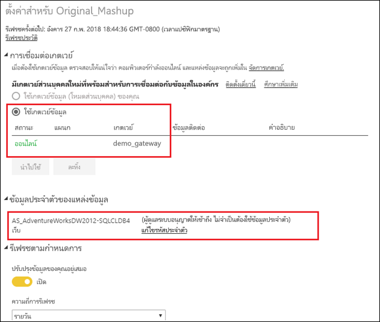

# ผสาน หรือผนวก แหล่งข้อมูลภายในองค์กรและในระบบคลาวด์

[!INCLUDE [gateway-rewrite](includes/gateway-rewrite.md)]

คุณสามารถใช้เกตเวย์ข้อมูลภายในองค์กร เพื่อผสานหรือผนวก แหล่งข้อมูลภายในองค์กรและในระบบคลาวด์ ในคิวรีเดียวกัน โซลูชันนี้จะมีประโยชน์เมื่อคุณต้องการรวมข้อมูลจากหลายแหล่งข้อมูลเข้าด้วยกัน โดยไม่ต้องใช้คิวรีที่แยกต่างหาก

>[!NOTE]
>บทความนี้นำไปใช้กับชุดข้อมูลที่มีระบบคลาวด์และแหล่งข้อมูลภายในองค์กรที่ผสานหรือผนวกในคิวรีเดียวเท่านั้น สำหรับชุดข้อมูลซึ่งรวมถึงคิวรีที่แยกต่างหาก - คิวรีหนึ่งซึ่งจะเชื่อมต่อไปยังแหล่งข้อมูลภายในองค์กรและอีกคิวรีหนึ่งไปยังแหล่งข้อมูลบนคลาวด์--เกตเวย์ไม่ได้ดำเนินการคิวรีสำหรับแหล่งข้อมูลบนคลาวด์

## ข้อกำหนดเบื้องต้น

- [เกตเวย์ที่ติดตั้ง](/data-integration/gateway/service-gateway-install)ภายในคอมพิวเตอร์
- ไฟล์ Power BI Desktop ที่มีคิวรีที่รวมแหล่งข้อมูลภายในองค์กรและในระบบคลาวด์

>[!NOTE]
>ในการเข้าถึงแหล่งข้อมูลระบบคลาวด์ใด ๆ คุณต้องตรวจสอบให้แน่ใจว่าเกตเวย์มีการเข้าถึงแหล่งข้อมูลเหล่านั้น

1. ที่มุมบนขวาของบริการของ Power BI เลือกไอคอนรูปเฟือง  > **จัดการเกตเวย์**

    

2. เลือกเกตเวย์ที่คุณต้องการกำหนดค่า

3. ภายใต้**การตั้งค่าคลัสเตอร์เกตเวย์** เลือก**อนุญาตให้แหล่งข้อมูลระบบคลาวด์ของผู้ใช้รีเฟรชผ่านคลัสเตอร์เกตเวย์นี้** > **นำไปใช้**

    

4. ภายใต้คลัสเตอร์เกตเวย์นี้ เพิ่ม[แหล่งข้อมูลในองค์กร](service-gateway-enterprise-manage-scheduled-refresh.md#add-a-data-source)ใด ๆ ที่ใช้ในคิวรีของคุณ คุณไม่จำเป็นต้องเพิ่มแหล่งข้อมูลระบบคลาวด์ตรงนี้

5. อัปโหลดไฟล์ Power BI Desktop พร้อมคิวรีที่รวมแหล่งข้อมูลภายในองค์กรและในระบบคลาวด์ของคุณ ไปยังบริการของ Power BI

6. บนหน้า**การตั้งค่าชุดข้อมูล**สำหรับชุดข้อมูลใหม่:

   - สำหรับแหล่งข้อมูลภายในองค์กร เลือกเกตเวย์ที่เกี่ยวข้องกับแหล่งข้อมูลนี้
   - ภายใต้**ข้อมูลประจำตัวของแหล่งข้อมูล** แก้ไขข้อมูลประจำตัวแหล่งข้อมูลคลาวด์ที่จำเป็น

    ตรวจสอบให้แน่ใจว่าระดับความเป็นส่วนตัวสำหรับระบบคลาวด์และแหล่งข้อมูลภายในองค์กรได้รับการตั้งค่าอย่างเหมาะสมเพื่อให้แน่ใจว่ามีการจัดการการรวมอย่างปลอดภัย

     

7. เมื่อตั้งค่าข้อมูลประจำตัวบนระบบคลาวด์แล้ว คุณสามารถรีเฟรชชุดข้อมูลได้ โดยใช้ตัวเลือก**รีเฟรชเดี๋ยวนี้** หรือกำหนดเวลาการรีเฟรชเป็นระยะได้

## ขั้นตอนถัดไป

เพื่อเรียนรู้เพิ่มเติมเกี่ยวกับการรีเฟรชข้อมูลสำหรับเกตเวย์ ดู[การใช้แหล่งข้อมูลสำหรับการรีเฟรชตามกำหนดเวลา](service-gateway-enterprise-manage-scheduled-refresh.md#using-the-data-source-for-scheduled-refresh)
