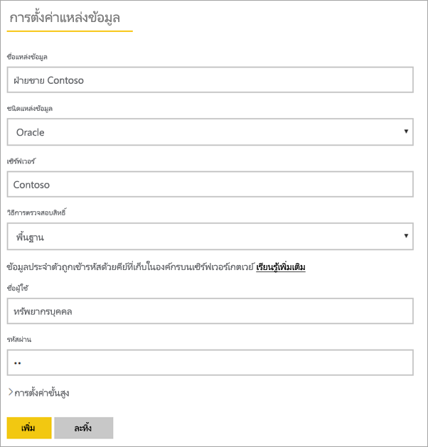
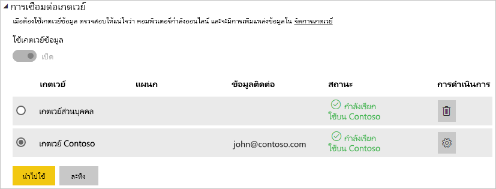

# <a name="manage-your-data-source---oracle"></a>จัดการแหล่งข้อมูลของคุณ - Oracle

[!INCLUDE [gateway-rewrite](includes/gateway-rewrite.md)]

เมื่อคุณได้[ติดตั้งเกตเวย์ข้อมูลภายในองค์กรแล้ว](/data-integration/gateway/service-gateway-install) คุณจะต้อง[เพิ่มแหล่งข้อมูล](service-gateway-data-sources.md#add-a-data-source)ที่สามารถใช้ได้กับเกตเวย์ดังกล่าว บทความนี้จะดูวิธีการทำงานกับเกตเวย์และแหล่งข้อมูล Oracle สำหรับการรีเฟรชตามกำหนดการหรือสำหรับ DirectQuery

## <a name="installing-the-oracle-client"></a>ติดตั้ง Oracle Client

เพื่อให้เกตเวย์สามารถเชื่อมต่อกับเซิร์ฟเวอร์ Oracle ของคุณได้ จำเป็นต้องติดตั้งและกำหนดค่าตัวให้บริการข้อมูล Oracle สำหรับ .NET (ODP.NET) นี่คือส่วนหนึ่งขององค์ประกอบการเข้าถึงข้อมูล Oracle (Oracle Data Access Components: ODAC)

สำหรับเวอร์ชัน**32 บิต**ของ Power BI Desktop ใช้ลิงก์ต่อไปนี้เพื่อดาวน์โหลดและติดตั้ง Oracle Client**32 บิต**

* [32-bit Oracle Data Access Components (ODAC) พร้อมเครื่องมือผู้พัฒนา Oracle สำหรับ Visual Studio (12.1.0.2.4)](http://www.oracle.com/technetwork/topics/dotnet/utilsoft-086879.html)

สำหรับเวอร์ชัน**64 บิต**ของ Power BI Desktop หรือสำหรับเกตเวย์ข้อมูลภายในองค์กร ใช้ลิงก์ต่อไปนี้เพื่อดาวน์โหลดและติดตั้ง Oracle Client **64 บิต**

* [64-bit ODAC 12.2c Release 1 (12.2.0.1.0) สำหรับ Windows x64](http://www.oracle.com/technetwork/database/windows/downloads/index-090165.html)

หลังจากติดตั้งแล้ว คุณจะต้องกำหนดค่าไฟล์ tnsnames.ora ของคุณด้วยข้อมูลที่เหมาะสมสำหรับฐานข้อมูลของคุณ Power BI Desktop และเกตเวย์จะออกไปจาก net_service_name ที่กำหนดไว้ในไฟล์ tnsnames.ora ถ้าจะไม่ได้กำหนดค่าไว้ คุณจะไม่สามารถเชื่อมต่อได้ เส้นทางตามค่าเริ่มต้นสำหรับ tnsnames.ora มีดังนี้: `[Oracle Home Directory]\Network\Admin\tnsnames.ora` สำหรับข้อมูลเพิ่มเติมเกี่ยวกับวิธีการกำหนดค่าไฟล์ tnsnames.ora ให้ดูที่[Oracle: ภายในการตั้งชื่อพารามิเตอร์ (tnsnames.ora)](https://docs.oracle.com/cd/B28359_01/network.111/b28317/tnsnames.htm)

### <a name="example-tnsnamesora-file-entry"></a>ตัวอย่างการใส่ข้อมูลไฟล์ tnsnames.ora

รูปแบบพื้นฐานของรายการข้อมูลใน tnsname.ora มีดังนี้

```
net_service_name=
 (DESCRIPTION=
   (ADDRESS=(protocol_address_information))
   (CONNECT_DATA=
     (SERVICE_NAME=service_name)))
```

นี่คือตัวอย่างของเซิร์ฟเวอร์และข้อมูลพอร์ตที่กรอกแล้ว

```
CONTOSO =
  (DESCRIPTION =
    (ADDRESS = (PROTOCOL = TCP)(HOST = oracleserver.contoso.com)(PORT = 1521))
    (CONNECT_DATA =
      (SERVER = DEDICATED)
      (SERVICE_NAME = CONTOSO)
    )
  )
```

## <a name="add-a-data-source"></a>เพิ่มแหล่งข้อมูล

สำหรับข้อมูลเกี่ยวกับวิธีการเพิ่มแหล่งข้อมูล ให้ดู[เพิ่มแหล่งข้อมูล](service-gateway-data-sources.md#add-a-data-source) เลือก Oracle สำหรับ**ชนิดแหล่งข้อมูล**


หลังจากที่คุณเลือกชนิดแหล่งข้อมูล Oracle แล้วคุณจะกรอกข้อมูลลงในสำหรับแหล่งข้อมูล ซึ่งประกอบด้วย  **เซิร์ฟเวอร์** และ **ฐานข้อมูล**  

นอกจากนี้ คุณยังต้องเลือก**วิธีการรับรองความถูกต้อง**ด้วย  ซึ่งสามารถเลือกเป็น**Windows**หรือ**Basic**ได้  คุณจะต้องเลือก**พื้นฐาน**ถ้าคุณใช้บัญชีผู้ใช้ที่สร้างขึ้นภายใน Oracle แทนการรับรองความถูกต้องของ Windows จากนั้นใส่ข้อมูลประจำตัวที่จะใช้สำหรับแหล่งข้อมูลนี้

> [!NOTE]
> แบบสอบถามทั้งหมดที่ไปยังแหล่งข้อมูลจะทำงานโดยใช้ข้อมูลประจำตัวเหล่านี้ หากต้องการเรียนรู้เพิ่มเติมเกี่ยวกับวิธีการจัดเก็บข้อมูลประจำตัว ให้ดู[การจัดเก็บข้อมูลประจำตัวที่เข้ารหัสไว้ในระบบคลาวด์](service-gateway-data-sources.md#storing-encrypted-credentials-in-the-cloud)



เลือก**เพิ่ม**หลังจากที่คุณได้กรอกทุกอย่างครบถ้วนแล้ว คุณสามารถใช้แหล่งข้อมูลนี้สำหรับการรีเฟรชตามกำหนดการหรือ DirectQuery เทียบกับเซิร์ฟเวอร์ Oracle ที่อยู่ภายในองค์กรได้ คุณจะเห็น*การเชื่อมต่อสำเร็จ* หากการดำเนินการเสร็จสมบูรณ์แล้ว


### <a name="advanced-settings"></a>การตั้งค่าขั้นสูง

อีกทางหนึ่งคือคุณสามารถกำหนดค่าระดับความเป็นส่วนตัวให้กับแหล่งข้อมูลของคุณ ซึ่งจะช่วยควบคุมการรวมข้อมูลได้ และใช้ได้เฉพาะกับการรีเฟรชตามกำหนดการเท่านั้น ไม่สามารถนำไปใช้กับ DirectQuery หากต้องการเรียนรู้เพิ่มเติมเกี่ยวกับระดับความเป็นส่วนตัวสำหรับแหล่งข้อมูลของคุณ ให้ดู [ระดับความเป็นส่วนตัว (Power Query)](https://support.office.com/article/Privacy-levels-Power-Query-CC3EDE4D-359E-4B28-BC72-9BEE7900B540)


## <a name="using-the-data-source"></a>การใช้แหล่งข้อมูล

หลังจากที่คุณสร้างแหล่งข้อมูลแล้ว แหล่งข้อมูลนั้นจะพร้อมใช้งานกับการเชื่อมต่อ DirectQuery หรือใช้งานผ่านการรีเฟรชตามกำหนดการ

> [!WARNING]
> ชื่อเซิร์ฟเวอร์และชื่อฐานข้อมูลจะต้องตรงกับ Power BI Desktop และแหล่งข้อมูลในเกตเวย์ข้อมูลภายในองค์กร

การเชื่อมโยงระหว่างชุดข้อมูลของคุณและแหล่งข้อมูลภายในเกตเวย์จะเป็นไปตามชื่อเซิร์ฟเวอร์และชื่อฐานข้อมูลของคุณ ซึ่งจำเป็นต้องตรงกัน ตัวอย่างเช่น ถ้าคุณใส่ที่อยู่ IP สำหรับชื่อเซิร์ฟเวอร์ ใน Power BI Desktop คุณจะต้องใช้ที่อยู่ IP สำหรับแหล่งข้อมูลภายในการกำหนดค่าเกตเวย์ด้วยเช่นกัน นอกจากนี้ ชื่อนี้ยังต้องตรงกับนามแฝงที่กำหนดไว้ภายในแฟ้ม tnsnames.ora ด้วย สำหรับข้อมูลเพิ่มเติมเกี่ยวกับไฟล์ tnsnames.ora ดู[ติดตั้ง Oracle Client](#installing-the-oracle-client)

นี่คือกรณีสำหรับทั้ง DirectQuery และการรีเฟรชตามกำหนดการ

### <a name="using-the-data-source-with-directquery-connections"></a>การใช้แหล่งข้อมูลที่มีการเชื่อมต่อ DirectQuery

คุณจะต้องตรวจสอบให้แน่ใจว่าชื่อเซิร์ฟเวอร์และชื่อฐานข้อมูลตรงกันระหว่าง Power BI Desktop และแหล่งข้อมูลที่กำหนดค่าไว้สำหรับเกตเวย์ และคุณยังต้องตรวจสอบให้แน่ใจอีกว่า ผู้ใช้ของคุณแสดงอยู่ในแท็บ**ผู้ใช้**ของแหล่งข้อมูลเพื่อให้สามารถเผยแพร่ชุดข้อมูล DirectQuery ได้ เมื่อคุณนำเข้าข้อมูลครั้งแรก การเลือกสำหรับ DirectQuery จะเกิดขึ้นภายใน Power BI Desktop สำหรับข้อมูลเพิ่มเติมเกี่ยวกับ DirectQuery ให้ดู[ ใช้ DirectQuery ใน Power BI Desktop](desktop-use-directquery.md)

หลังจากที่คุณเผยแพร่ชุดข้อมูลจาก Power BI Desktop หรือ**รับข้อมูล** รายงานของคุณควรเริ่มการทำงาน อาจจะใช้เวลาหลายนาทีเพื่อให้การเชื่อมต่อสามารถใช้งานได้ หลังจากการสร้างแหล่งข้อมูลภายในเกตเวย์

### <a name="using-the-data-source-with-scheduled-refresh"></a>การใช้แหล่งข้อมูลที่มีการรีเฟรชตามกำหนดการ

ถ้าคุณอยู่ในแท็บ**ผู้ใช้**ของแหล่งข้อมูลที่กำหนดค่าไว้ภายในเกตเวย์ และชื่อเซิร์ฟเวอร์และชื่อฐานข้อมูลตรงกัน คุณจะเห็นเกตเวย์เป็นตัวเลือกเพื่อใช้กับการรีเฟรชตามกำหนดการ



## <a name="troubleshooting"></a>การแก้ไขปัญหา

คุณอาจพบข้อผิดพลาดจำนวนมากจาก Oracle เมื่อไวยากรณ์ตั้งชื่อไม่ถูกต้อง หรือไม่ได้กำหนดค่าอย่างถูกต้อง

* ORA-12154: TNS: ไม่สามารถแก้ไขตัวระบุที่เชื่อมต่อได้  
* ORA-12514: ในขณะนี้ ผู้ฟัง TNS ไม่ทราบบริการที่ร้องขอตัวบอกที่เชื่อมต่อ  
* ORA-12541: TNS: ไม่มีผู้ฟัง  
* ORA-12170: TNS: เชื่อมต่อหมดเวลา  
* ORA-12504: ผู้ฟัง TNS ไม่ได้รับ SERVICE_NAME ใน CONNECT_DATA  

ข้อผิดพลาดเหล่านี้อาจเกิดขึ้นถ้าไม่ได้ติดตั้ง Oracle Client หรือถ้าไม่ได้มีการกำหนดค่าอย่างถูกต้อง ถ้ามีการติดตั้งอยู่แล้ว คุณจะต้องตรวจสอบไฟล์ tnsnames.ora ว่ามีการกำหนดค่าอย่างถูกต้อง และคุณกำลังใช้ net_service_name ที่เหมาะสมหรือไม่ นอกจากนี้ คุณจะต้องตรวจสอบให้แน่ใจว่า net_service_name สำหรับเครื่องที่ใช้ Power BI Desktop และเครื่องที่ใช้งานเกตเวย์นั้นเป็นตัวเดียวกัน สำหรับข้อมูลเพิ่มเติม ดู[ติดตั้ง Oracle Client](#installing-the-oracle-client)

> [!NOTE]
> คุณอาจยังพบปัญหาเนื่องจากความสามารถในการเข้ากันได้ระหว่างเวอร์ชั่น Oracle เซิร์ฟเวอร์และ Oracle ไคลเอนต์ โดยทั่วไปแล้ว ส่วนเหล่านี้ต้องตรงกัน

สำหรับข้อมูลเพิ่มเติมแก้ไขปัญหาที่เกี่ยวข้องกับเกตเวย์ ดู[การแก้ไขปัญหาเกตเวย์ข้อมูลภายในองค์กร](/data-integration/gateway/service-gateway-tshoot)

## <a name="next-steps"></a>ขั้นตอนถัดไป

* [แก้ไขปัญหาเกตเวย์-Power BI](service-gateway-onprem-tshoot.md)
* [Power BI Premium](service-premium.md)

มีคำถามเพิ่มเติมหรือไม่? [ลองถามชุมชน Power BI](http://community.powerbi.com/)

