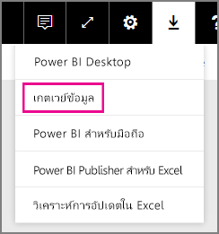
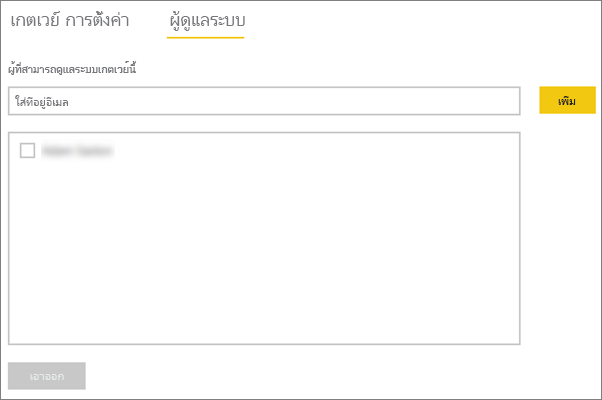
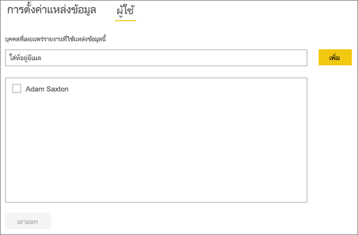

# <a name="manage-your-data-source---oracle"></a>จัดการแหล่งข้อมูลของคุณ - Oracle
เมื่อคุณได้ติดตั้งเกตเวย์ข้อมูลในองค์กรแล้ว คุณจะต้องเพิ่มแหล่งข้อมูลที่สามารถใช้ได้กับเกตเวย์ดังกล่าว บทความนี้เราจะดูวิธีการทำงานกับเกตเวย์และแหล่งข้อมูล คุณสามารถใช้แหล่งข้อมูล Oracle สำหรับการรีเฟรชตามกำหนดการหรือสำหรับ DirectQuery ได้

## <a name="download-and-install-the-gateway"></a>ดาวน์โหลดและติดตั้งเกตเวย์
คุณสามารถดาวน์โหลดเกตเวย์จากบริการ Power BI ได้ เลือก**ดาวน์โหลด** > **เกตเวย์ข้อมูล**หรือ โดยไป[หน้าดาวน์โหลดเกตเวย์](https://go.microsoft.com/fwlink/?LinkId=698861)



> [!WARNING]
> เพื่อให้เกตเวย์สามารถเชื่อมต่อกับเซิร์ฟเวอร์ Oracle ของคุณได้ จำเป็นต้องติดตั้งและกำหนดค่าตัวให้บริการข้อมูล Oracle สำหรับ .NET (ODP.NET) นี่คือส่วนหนึ่งขององค์ประกอบการเข้าถึงข้อมูล Oracle (Oracle Data Access Components: ODAC) สำหรับข้อมูลเพิ่มเติมเกี่ยวกับวิธีการดาวน์โหลดตัวให้บริการ Oracle ดู[ติดตั้ง Oracle Client](#installing-the-oracle-client)ที่ด้านล่าง
> 
> 

## <a name="installing-the-oracle-client"></a>ติดตั้ง Oracle Client
สำหรับเวอร์ชัน**32 บิต**ของ Power BI Desktop ใช้ลิงก์ต่อไปนี้เพื่อดาวน์โหลดและติดตั้ง Oracle Client**32 บิต**

* [32-bit Oracle Data Access Components (ODAC) พร้อมเครื่องมือผู้พัฒนา Oracle สำหรับ Visual Studio (12.1.0.2.4)](http://www.oracle.com/technetwork/topics/dotnet/utilsoft-086879.html)

สำหรับเวอร์ชัน**64 บิต**ของ Power BI Desktop หรือสำหรับเกตเวย์ข้อมูลภายในองค์กร ใช้ลิงก์ต่อไปนี้เพื่อดาวน์โหลดและติดตั้ง Oracle Client **64 บิต**

* [64-bit ODAC 12.2c Release 1 (12.2.0.1.0) สำหรับ Windows x64](http://www.oracle.com/technetwork/database/windows/downloads/index-090165.html)

หลังจากติดตั้งแล้ว คุณจะต้องกำหนดค่าไฟล์ tnsnames.ora ของคุณด้วยข้อมูลที่เหมาะสมสำหรับฐานข้อมูลของคุณ Power BI Desktop และเกตเวย์จะออกไปจาก net_service_name ที่กำหนดไว้ในไฟล์ tnsnames.ora ถ้าจะไม่ได้กำหนดค่าไว้ คุณจะไม่สามารถเชื่อมต่อได้ เส้นทางตามค่าเริ่มต้นสำหรับ tnsnames.ora มีดังนี้: `[Oracle Home Directory]\Network\Admin\tnsnames.ora` สำหรับข้อมูลเพิ่มเติมเกี่ยวกับวิธีการกำหนดค่าไฟล์ tnsnames.ora ให้ดูที่[Oracle: ภายในการตั้งชื่อพารามิเตอร์ (tnsnames.ora)](https://docs.oracle.com/cd/B28359_01/network.111/b28317/tnsnames.htm)

### <a name="example-tnsnamesora-file-entry"></a>ตัวอย่างการใส่ข้อมูลไฟล์ tnsnames.ora
รูปแบบพื้นฐานของรายการข้อมูลใน tnsname.ora มีดังนี้

```
net_service_name=
 (DESCRIPTION=
   (ADDRESS=(protocol_address_information))
   (CONNECT_DATA=
     (SERVICE_NAME=service_name)))
```

นี่คือตัวอย่างของเซิร์ฟเวอร์และข้อมูลพอร์ตที่กรอกแล้ว

```
CONTOSO =
  (DESCRIPTION =
    (ADDRESS = (PROTOCOL = TCP)(HOST = oracleserver.contoso.com)(PORT = 1521))
    (CONNECT_DATA =
      (SERVER = DEDICATED)
      (SERVICE_NAME = CONTOSO)
    )
  )
```

## <a name="add-a-gateway"></a>เพิ่มเกตเวย์
หากต้องการเพิ่มเกตเวย์ เพียงแค่[ดาวน์โหลด](https://go.microsoft.com/fwlink/?LinkId=698861)และติดตั้งเกตเวย์บนเซิร์ฟเวอร์ในสภาพแวดล้อมของคุณ หลังจากที่คุณติดตั้งเกตเวย์แล้ว เกตเวย์จะแสดงในรายการของเกตเวย์ใต้**จัดการเกตเวย์**

> [!NOTE]
> **จัดการเกตเวย์**จะไม่แสดงขึ้นจนกว่าคุณจะได้เป็นผู้ดูแลระบบของเกตเวย์อย่างน้อยหนึ่งเกตเวย์ ซึ่งสามารถเกิดขึ้นได้โดยการได้รับการเพิ่มให้เป็นผู้ดูแล หรือคุณเป็นคนติดตั้งและกำหนดค่าเกตเวย์
> 
> 

## <a name="remove-a-gateway"></a>ลบเกตเวย์
การลบเกตเวย์จะเป็นการลบแหล่งข้อมูลต่าง ๆ ที่อยู่ภายใต้เกตเวย์นั้น ๆ ด้วยเช่นกัน  ซึ่งจะเป็นการทำลายแดชบอร์ดและรายงานอิงกับแหล่งข้อมูลเหล่านั้น

1. เลือกไอคอนรูปเฟืองที่มุมบนขวา > **จัดการเกตเวย์**
2. เกตเวย์ >**ลบ**
   
   

## <a name="add-a-data-source"></a>เพิ่มแหล่งข้อมูล
คุณสามารถเพิ่มแหล่งข้อมูลได้โดยเลือกเกตเวย์ และคลิก**เพิ่มแหล่งข้อมูล** หรือไปที่ “เกตเวย์” > **เพิ่มแหล่งข้อมูล**


จากนั้นคุณสามารถเลือก**ชนิดแหล่งข้อมูล**จากรายการได้


จากนั้นคุณจะต้องกรอกข้อมูลเกี่ยวกับแหล่งข้อมูลซึ่งรวมถึง**Server**และ**ฐานข้อมูล**  

และคุณจะต้องเลือก**วิธีการรับรองความถูกต้อง**ด้วย  ซึ่งสามารถเป็น**Windows**หรือ**พื้นฐาน**ได้  คุณควรเลือก**พื้นฐาน**ถ้าคุณใช้บัญชีผู้ใช้ที่สร้างขึ้นภายใน Oracle แทนการรับรองความถูกต้องของ Windows จากนั้น ใส่ข้อมูลประจำตัวที่จะใช้สำหรับแหล่งข้อมูลนี้

> [!NOTE]
> แบบสอบถามทั้งหมดที่ไปยังแหล่งข้อมูลจะทำงานโดยใช้ข้อมูลประจำตัวเหล่านี้ สำหรับข้อมูลเพิ่มเติม ให้ดูบทความเกตเวย์ข้อมูลหลักภายในองค์กรเพื่อเรียนรู้เพิ่มเติมเกี่ยวกับวิธีการจัดเก็บ[ข้อมูลประจำตัว](service-gateway-onprem.md#credentials)
> 
> 


คุณสามารถคลิก**เพิ่ม**หลังจากที่คุณได้กรอกทุกอย่างครบถ้วนแล้ว  คุณสามารถใช้แหล่งข้อมูลนี้สำหรับการรีเฟรชตามกำหนดการหรือ DirectQuery เทียบกับเซิร์ฟเวอร์ Oracle ที่อยู่ภายในองค์กรได้ คุณจะเห็น*เชื่อมต่อสำเร็จ* หากการดำเนินการเสร็จสมบูรณ์แล้ว


### <a name="advanced-settings"></a>การตั้งค่าขั้นสูง
คุณสามารถกำหนดค่าระดับความเป็นส่วนตัวให้กับแหล่งข้อมูลของคุณ ซึ่งจะช่วยควบคุมการปะปนของข้อมูล และใช้ได้เฉพาะกับการรีเฟรชตามกำหนดการเท่านั้น ไม่สามารถนำไปใช้กับ DirectQuery [เรียนรู้เพิ่มเติม](https://support.office.com/article/Privacy-levels-Power-Query-CC3EDE4D-359E-4B28-BC72-9BEE7900B540)


## <a name="remove-a-data-source"></a>ลบแหล่งข้อมูล
การลบแหล่งข้อมูลจะทำลายแดชบอร์ดหรือรายงานต่างๆ ที่อิงกับแหล่งข้อมูลที่ระบุ  

หากต้องหารลบแหล่งข้อมูลให้ไปที่ แหล่งข้อมูล > **ลบ**


## <a name="manage-administrators"></a>จัดการผู้ดูแลระบบ
ในแถบผู้ดูแลสำหรับเกตเวย์ คุณสามารถเพิ่มและลบผู้ใช้ (หรือกลุ่มการรักษาความปลอดภัย) ที่สามารถเข้ามาดูแลระบบเกตเวย์ได้



## <a name="manage-users"></a>จัดการผู้ใช้
บนแท็บผู้ใช้สำหรับแหล่งข้อมูล คุณสามารถเพิ่มและลบผู้ใช้ หรือกลุ่มความปลอดภัยที่สามารถใช้แหล่งข้อมูลนี้ได้

> [!NOTE]
> รายชื่อผู้ใช้จะควบคุมผู้ที่ได้รับอนุญาตให้เผยแพร่รายงานเท่านั้น เจ้าของรายงานสามารถสร้างแดชบอร์ดหรือชุดเนื้อหา และนำมาแชร์ร่วมกับผูใช้คนอื่นได้ ผู้ใช้ที่กำลังใช้งานรายงานหรือแดชบอร์ดไม่จำเป็นต้องอยู่ในรายการผู้ใช้
> 
> 



## <a name="using-the-data-source"></a>การใช้แหล่งข้อมูล
หลังจากที่คุณสร้างแหล่งข้อมูลแล้ว แหล่งข้อมูลนั้นจะพร้อมใช้งานกับการเชื่อมต่อ DirectQuery หรือใช้งานผ่านการรีเฟรชตามกำหนดการ

> [!WARNING]
> ชื่อเซิร์ฟเวอร์และชื่อฐานข้อมูลจะต้องตรงกับ Power BI Desktop และแหล่งข้อมูลในเกตเวย์ข้อมูลภายในองค์กร!
> 
> 

การเชื่อมโยงระหว่างชุดข้อมูลของคุณและแหล่งข้อมูลภายในเกตเวย์จะเป็นไปตามชื่อเซิร์ฟเวอร์และชื่อฐานข้อมูลของคุณ สิ่งเหล่านี้จำเป็นต้องตรงกัน! ตัวอย่างเช่น ถ้าคุณใส่ที่อยู่ IP สำหรับชื่อเซิร์ฟเวอร์ ภายใน Power BI Desktop คุณจะต้องใช้ที่อยู่ IP สำหรับแหล่งข้อมูลภายในการกำหนดค่าเกตเวย์ด้วย นอกจากนี้ ชื่อนี้ยังต้องตรงกับนามแฝงที่กำหนดไว้ภายในแฟ้ม tnsnames.ora ด้วย สำหรับข้อมูลเพิ่มเติมเกี่ยวกับไฟล์ tnsnames.ora ดู[ติดตั้ง Oracle Client](#installing-the-oracle-client)

นี่คือกรณีสำหรับทั้ง DirectQuery และการรีเฟรชตามกำหนดการ

### <a name="using-the-data-source-with-directquery-connections"></a>การใช้แหล่งข้อมูลที่มีการเชื่อมต่อ DirectQuery
คุณจะต้องตรวจสอบให้แน่ใจว่าเซิร์ฟเวอร์และฐานข้อมูลชื่อตรงกันระหว่าง Power BI Desktop และแหล่งข้อมูลที่กำหนดค่าไว้สำหรับเกตเวย์ คุณจะยังจำเป็นต้องตรวจสอบให้แน่ใจว่า ผู้ใช้ของคุณแสดงอยู่ในแท็บ**ผู้ใช้**ของแหล่งข้อมูลเพื่อที่เผยแพร่ชุดข้อมูล DirectQuery เมื่อคุณนำเข้าข้อมูลครั้งแรก การเลือกสำหรับ DirectQuery จะเกิดขึ้นภายใน Power BI Desktop [เรียนรู้เพิ่มเติม](desktop-use-directquery.md)

หลังจากที่คุณเผยแพร่ชุดข้อมูลจาก Power BI Desktop หรือ**รับข้อมูล** รายงานของคุณควรเริ่มการทำงาน อาจจะใช้เวลาหลายนาทีเพื่อให้การเชื่อมต่อสามารถใช้งานได้ หลังจากการสร้างแหล่งข้อมูลภายในเกตเวย์

### <a name="using-the-data-source-with-scheduled-refresh"></a>การใช้แหล่งข้อมูลที่มีการรีเฟรชตามกำหนดการ
ถ้าคุณอยู่ในแถบ**ผู้ใช้**ของแหล่งข้อมูลที่กำหนดค่าภายในเกตเวย์ และชื่อเซิร์ฟเวอร์และชื่อฐานข้อมูลตรงกัน คุณจะเห็นเกตเวย์เป็นหนึ่งตัวเลือกในการใช้กับการรีเฟรชตามกำหนดการ


## <a name="troubleshooting"></a>การแก้ไขปัญหา
คุณอาจพบข้อผิดพลาดจำนวนมากจาก Oracle เมื่อไวยากรณ์ตั้งชื่อไม่ถูกต้อง หรือไม่ได้กำหนดค่าอย่างถูกต้อง

* ORA-12154: TNS: ไม่สามารถแก้ไขตัวระบุที่เชื่อมต่อได้  
* ORA-12514: ในขณะนี้ ผู้ฟัง TNS ไม่ทราบบริการที่ร้องขอตัวบอกที่เชื่อมต่อ  
* ORA-12541: TNS: ไม่มีผู้ฟัง  
* ORA-12170: TNS: เชื่อมต่อหมดเวลา  
* ORA-12504: ผู้ฟัง TNS ไม่ได้รับ SERVICE_NAME ใน CONNECT_DATA  

ข้อผิดพลาดเหล่านี้อาจเกิดขึ้นถ้าไม่ได้ติดตั้ง Oracle Client หรือถ้าไม่ได้มีการหนดค่าอย่างถูกต้อง ถ้ามีการติดตั้งอยู่แล้ว ต้องตรวจสอบไฟล์ tnsnames.ora ว่ามีการกำหนดค่าอย่างถูกต้องและคุณใช้ net_service_name ที่เหมาะสมหรือไม่ นอกจากนี้ คุณจำเป็นต้องตรวจสอบให้แน่ใจว่า net_service_name สำหรับเครื่องที่ใช้ Power BI Desktop และเครื่องที่ใช้งานเกตเวย์นั้นเป็นตัวเดียวกัน สำหรับข้อมูลเพิ่มเติม ดู[ติดตั้ง Oracle Client](#installing-the-oracle-client)

> [!NOTE]
> คุณอาจยังพบปัญหาเนื่องจากความสามารถในการเข้ากันได้ระหว่างเวอร์ชั่น Oracle เซิร์ฟเวอร์และ Oracle ไคลเอนต์ โดยทั่วไปแล้ว ส่วนเหล่านี้ต้องตรงกัน
> 
> 

สำหรับข้อมูลเพิ่มเติมแก้ไขปัญหาที่เกี่ยวข้องกับเกตเวย์ ดู[การแก้ไขปัญหาเกตเวย์ข้อมูลในองค์กร](service-gateway-onprem-tshoot.md)

## <a name="next-steps"></a>ขั้นตอนถัดไป
[เกตเวย์ข้อมูลภายในองค์กร](service-gateway-onprem.md)  
[เกตเวย์ข้อมูลในองค์กร - เชิงลึก](service-gateway-onprem-indepth.md)  
[การแก้ไขปัญหาเกตเวย์ข้อมูลในองค์กร](service-gateway-onprem-tshoot.md)  
[Power BI Premium](service-premium.md)

มีคำถามเพิ่มเติมหรือไม่? [ลองถามชุมชน Power BI](http://community.powerbi.com/)

