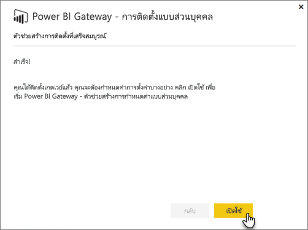
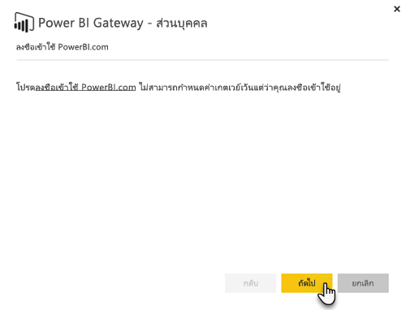
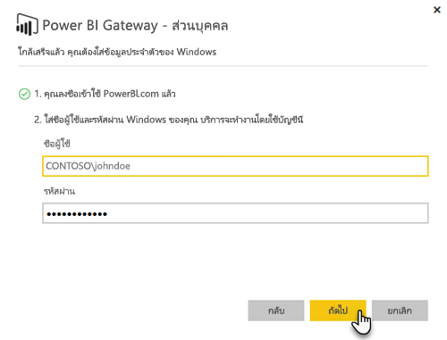

# เกตเวย์ข้อมูลภายในองค์กร

เกตเวย์ข้อมูลภายในองค์กรทำหน้าที่เป็นสะพาน โดยให้บริการการถ่ายโอนข้อมูลที่รวดเร็วและปลอดภัยระหว่างข้อมูลภายในองค์กร (ข้อมูลที่ไม่ได้อยู่ในระบบคลาวด์) และบริการ Power BI, Microsoft Flow, Logic Apps และ PowerApps

คุณสามารถใช้เกตเวย์เดียวกับบริการอื่น ๆ ในเวลาเดียวกัน ถ้าคุณกำลังใช้ Power BI ได้เช่นเดียวกับ PowerApps สามารถใช้เกตเวย์เดียวสำหรับทั้งสองอย่าง ซึ่งจะขึ้นอยู่กับบัญชีผู้ใช้ที่คุณลงชื่อเข้าใช้

> [!NOTE]
> เกตเวย์ข้อมูลในองค์กรประมวลผลรวมข้อมูล และการเข้ารหัส transport ในทุกโหมด

<!-- Shared Requirements Include -->
[!INCLUDE [gateway-onprem-requirements-include](./includes/gateway-onprem-requirements-include.md)]

### ขีดจำกัดของการเชื่อมต่อแบบสดของ Analysis Services

คุณสามารถใช้การเชื่อมต่อแบบสดกับอินสแตนซ์หลายมิติ หรือแบบตาราง

| **รุ่นของเซิร์ฟเวอร์** | **SKU ที่จำเป็นต้องมี** |
| --- | --- |
| 2012 SP1 CU4 หรือใหม่กว่า |เทคโนโลยีสำหรับการรวบรวมข้อมูล จัดเก็บ วิเคราะห์ และการเข้าถึงข้อมูล รวมถึงการดูในหลากหลายมุมมอง (BI) และ SKU องค์กร |
| 2014 |เทคโนโลยีสำหรับการรวบรวมข้อมูล จัดเก็บ วิเคราะห์ และการเข้าถึงข้อมูล รวมถึงการดูในหลากหลายมุมมอง (BI) และ SKU องค์กร |
| 2016 |SKU มาตรฐาน หรือสูงกว่า |

* การจัดรูปแบบระดับเซลล์ และคุณลักษณะการแปลไม่ได้รับการสนับสนุน
* การดำเนินการและ Named Sets จะไม่แสดงใน Power BI แต่คุณยังสามารถเชื่อมต่อกับคิวบ์หลายมิติที่ยังประกอบด้วยการดำเนินการ หรือ Named Sets พร้อมสร้างภาพและรายงานได้

<!-- Shared Install steps Include -->
[!INCLUDE [gateway-onprem-datasources-include](./includes/gateway-onprem-datasources-include.md)]

## ดาวน์โหลด และติดตั้งเกตเวย์ข้อมูลในองค์กร

ในการดาวน์โหลดเกตเวย์ ให้เลือก**เกตเวย์ข้อมูล**ภายใต้เมนูดาวน์โหลด ดาวน์โหลด[เกตเวย์ข้อมูลภายในองค์กร](http://go.microsoft.com/fwlink/?LinkID=820925)

สังเกตว่าคุณอัปเดตเกตเวย์ข้อมูลแบบติดตั้งภายในองค์กร โดยการติดตั้งเกตเวย์อีกครั้งตามที่อธิบายไว้ในส่วนนี้ การตั้งค่าปัจจุบันของคุณจะยังคงอยู่ ตราบเท่าที่คุณติดตั้งเกตเวย์เวอร์ชันใหม่ ถ้าคุณติดตั้งเวอร์ชันเดิม ระบบจะถือว่าเป็นการติดตั้งซ้ำ และจะไม่เก็บการตั้งค่าของคุณไว้

<!-- Shared Install steps Include -->
[!INCLUDE [gateway-onprem-install-include](./includes/gateway-onprem-install-include.md)]

## ติดตั้งเกตเวย์ในโหมดส่วนตัว

> [!NOTE]
> เกตเวย์เวอร์ชันส่วนบุคคล ทำงานกับ Power BI เท่านั้น

หลังจากที่มีการติดตั้งเกตเวย์ส่วนบุคคล คุณจะต้องเปิดใช้การ**Power BI Gateway-Personal ตัวช่วยสร้างการกำหนดค่า**

จากนั้นคุณจะจำเป็นต้องลงชื่อเข้า Power BI ใช้เพื่อลงทะเบียนเกตเวย์กับบริการระบบคลาวด์

นอกจากนี้คุณจะจำเป็นต้องใส่ชื่อผู้ใช้ windows และรหัสผ่านที่บริการ windows จะเรียกใช้ในฐานะ คุณสามารถระบุบัญชีผู้ใช้ Windows อื่นที่แตกต่างจากของคุณ บริการเกตเวย์จะทำงานโดยใช้บัญชีนี้

หลังจากการติดตั้งเสร็จสมบูรณ์ คุณจะต้องไปที่ชุดข้อมูลของคุณภายใน Power BI และตรวจสอบให้แน่ใจว่า มีป้อนข้อมูลประจำตัวสำหรับแหล่งข้อมูลภายในองค์กรของคุณ

## จัดเก็บข้อมูลประจำตัวเข้ารหัสลับในระบบคลาวด์

เมื่อคุณเพิ่มแหล่งข้อมูลกับเกตเวย์ คุณจำเป็นต้องใส่ข้อมูลประจำตัวสำหรับแหล่งข้อมูลนั้น คิวรีทั้งหมดไปยังแหล่งข้อมูลจะทำงานโดยใช้ข้อมูลประจำตัวเหล่านี้ ข้อมูลประจำตัวถูกเข้ารหัสลับได้อย่างปลอดภัย โดยใช้การเข้ารหัสลับสมมาตรเพื่อให้พวกเขาไม่สามารถถอดรหัสในระบบคลาวด์ ก่อนที่พวกเขาจะถูกจัดเก็บในระบบคลาวด์ ข้อมูลประจำตัวถูกส่งไปยังเครื่อง เรียกใช้เกตเวย์ ภายในองค์กรที่พวกเขาจะถอดรหัสลับเมื่อมีการเข้าถึงแหล่งข้อมูล

<!-- Account and Port information -->
[!INCLUDE [gateway-onprem-accounts-ports-more](./includes/gateway-onprem-accounts-ports-more.md)]

<!-- How the gateway works -->
[!INCLUDE [gateway-onprem-how-it-works-include](./includes/gateway-onprem-how-it-works-include.md)]

## ข้อจำกัดและข้อควรพิจารณา

* [Azure Information Protection](https://docs.microsoft.com/microsoft-365/enterprise/protect-files-with-aip
) ยังไม่ได้รับการสนับสนุนในขณะนี้
* [การเข้าถึงแบบออนไลน์](https://products.office.com/access) ยังไม่ได้รับการสนับสนุนในขณะนี้
* ระบบจะสนับสนุนสคริปต์ R เมื่อเรียกใช้เกตเวย์ในโหมดส่วนบุคคลเท่านั้น

## การดูแลระบบระดับผู้เช่า

ในฐานะผู้ดูแลระบบผู้เช่า คุณสามารถดูเกตเวย์ข้อมูลภายในองค์กรทั้งหมดที่ติดตั้งภายในผู้เช่าของคุณและจัดการเกตเวย์เหล่านั้น ขณะนี้ความสามารถนี้อยู่ในการแสดงตัวอย่างแบบสาธารณะ สำหรับข้อมูลเพิ่มเติม ดูท [ี่เอกสารศูนย์การดูแลระบบแพลตฟอร์ม Power](/power-platform/admin/onpremises-data-gateway-management)

หรือหากคุณเป็นผู้ดูแลระบบผู้เช่า เราขอแนะนำให้คุณขอให้ผู้ใช้ในองค์กรของคุณเพิ่มคุณเป็นผู้ดูแลระบบสำหรับทุกเกตเวย์ที่ทำการติดตั้ง ซึ่งช่วยให้คุณสามารถจัดการเกตเวย์ทั้งหมดในองค์กรของคุณผ่านทางหน้าการตั้งค่าเกตเวย์ หรือผ่านทาง[คำสั่ง PowerShell](service-gateway-high-availability-clusters.md#powershell-support-for-gateway-clusters) 

## การเปิดใช้งานการเชื่อมต่อ Azure ขาออก

เกตเวย์ข้อมูลในองค์กรอาศัย Azure Service Bus สำหรับการเชื่อมต่อระบบคลาวด์ และสร้างการเชื่อมต่อขาออกไปยังภูมิภาค Azure ที่เกี่ยวข้อง ตามค่าเริ่มต้น นี่คือตำแหน่งที่ตั้งของผู้เช่า Power BI ของคุณ ดูว่า [ตำแหน่งที่ตั้งของผู้เช่า Power BI](https://powerbi.microsoft.com/documentation/powerbi-admin-where-is-my-tenant-located/) ของฉันอยู่ที่ไหน
ถ้ามีไฟร์วอลล์บล็อกการเชื่อมต่อขาออก คุณต้องกำหนดค่าไฟร์วอลล์เพื่ออนุญาตการเชื่อมต่อขาออกจากเกตเวย์ข้อมูลในองค์กร ไปยังภูมิภาค Azure ที่เกี่ยวข้อง ดู [ช่วง IP ของศูนย์ข้อมูล Microsoft Azure](https://www.microsoft.com/download/details.aspx?id=41653) สำหรับรายละเอียดเกี่ยวกับช่วงของที่อยู่ IP ของแต่ละศูนย์ข้อมูลของ Azure
> [!NOTE]
> ช่วงของที่อยู่ IP อาจเปลี่ยนแปลงได้ตามเวลา ดังนั้น ให้แน่ใจว่าคุณดาวน์โหลดข้อมูลล่าสุดเป็นประจำ 

## การแก้ไขปัญหา

ถ้าคุณพบปัญหาเมื่อติดตั้ง และกำหนดค่าเกตเวย์ อย่าลืมดู[เกตเวย์ข้อมูลในองค์กรในการแก้ไขปัญหา](service-gateway-onprem-tshoot.md) ถ้าคุณคิดว่า คุณกำลังมีปัญหากับไฟร์วอลล์ของคุณ ดู[ไฟร์วอลล์หรือพร็อกซี](service-gateway-onprem-tshoot.md#firewall-or-proxy)ส่วนในบทความแก้ไขปัญหา

ถ้าคุณคิดว่า คุณกำลังประสบปัญหาพร็อกซี กับเกตเวย์ ดู[กำหนดค่าพร็อกซีสำหรับเกตเวย์ Power BI](service-gateway-proxy.md)

## ขั้นตอนถัดไป

[จัดการแหล่งข้อมูลของคุณ - Analysis Services](service-gateway-enterprise-manage-ssas.md)  
[จัดการแหล่งข้อมูลของคุณ - SAP HANA](service-gateway-enterprise-manage-sap.md)  
[จัดการแหล่งข้อมูลของคุณ - SQL Server](service-gateway-enterprise-manage-sql.md)  
[จัดการแหล่งข้อมูลของคุณ - Oracle](service-gateway-onprem-manage-oracle.md)  
[จัดการแหล่งข้อมูลของคุณ - นำเข้า/รีเฟรชตามกำหนดการ](service-gateway-enterprise-manage-scheduled-refresh.md)  
[เกตเวย์ข้อมูลในองค์กรในเชิงลึก](service-gateway-onprem-indepth.md)  
[เกตเวย์ข้อมูลภายในองค์กร (โหมดส่วนตัว) - เวอร์ชันใหม่ของเกตเวย์ส่วนบุคคล](service-gateway-personal-mode.md)  
[กำหนดค่าพร็อกซีสำหรับเกตเวย์ข้อมูลภายในองค์กร](service-gateway-proxy.md)  

มีคำถามเพิ่มเติมหรือไม่? [ลองไปที่ชุมชน Power BI](http://community.powerbi.com/)
