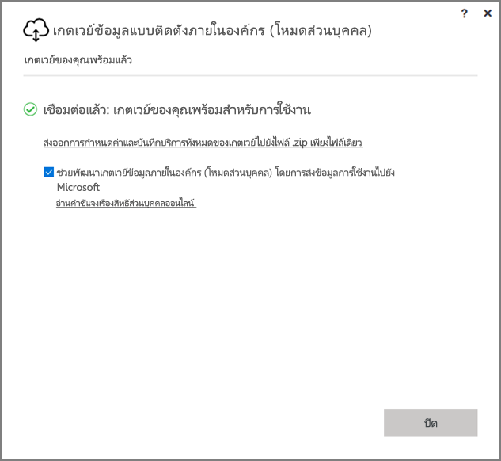
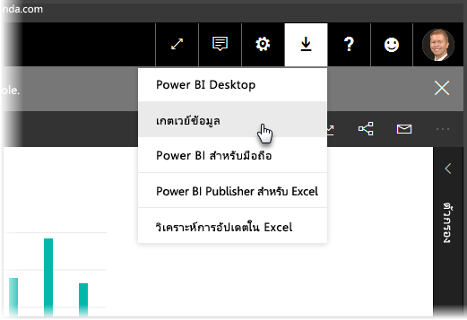
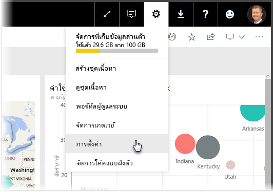
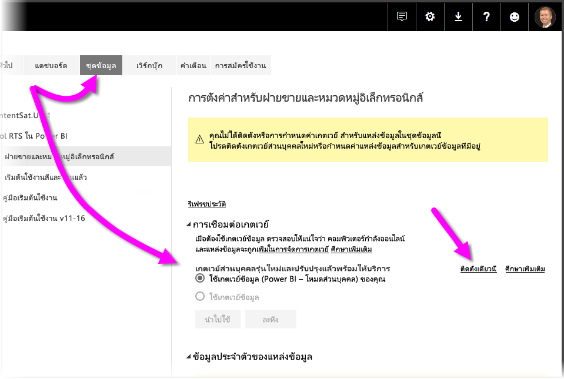
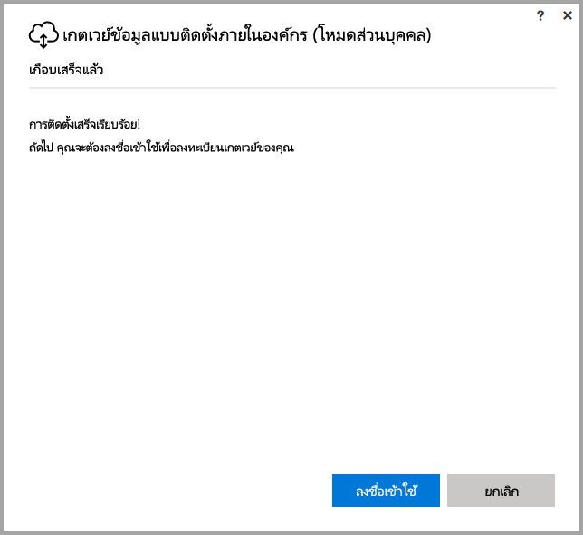
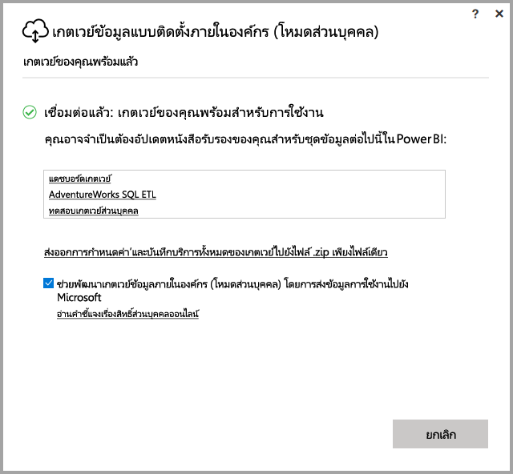

# <a name="on-premises-data-gateway-personal-mode"></a>เกตเวย์ข้อมูลแบบติดตั้งภายในองค์กร (โหมดส่วนบุคคล)
คุณสามารถใช้แหล่งข้อมูลแบบติดตั้งภายในองค์กร และสร้างรายงาน Power BI และแดชบอร์ด **เกตเวย์** คือ ซอฟต์แวร์ที่อำนวยความสะดวกในการเข้าถึงข้อมูลที่เก็บอยู่ในเครือข่ายส่วนตัวแบบติดตั้งภายในองค์กร และทำให้คุณสามารถใช้ข้อมูลดังกล่าวด้วยบริการออนไลน์ เช่น **บริการ BI Power** ได้ **เกตเวย์ข้อมูลแบบติดตั้งภายในองค์กร (โหมดส่วนบุคคล)**  คือ การอัปเดตเกตเวย์ Power BI ที่ปล่อยออกมาล่าสุด ซึ่งอนุญาตให้บุคคลสามารถติดตั้งเกตเวย์ในคอมพิวเตอร์ของตนเองและเข้าถึงข้อมูลภายในองค์กรได้



> [!NOTE]
> **เกตเวย์ข้อมูลแบบติดตั้งภายในองค์กร (โหมดส่วนบุคคล)**  แทนที่เกตเวย์ส่วนบุคคลในรุ่นที่สนับสนุนก่อนหน้านี้ซึ่งเรียกว่า  **Power BI Gateway - Personal** เกตเวย์ส่วนบุคคลรุ่นก่อนหน้าจะยังสามารถทำงานได้จนถึงวันที่ 31 กรกฎาคม พ.ศ. 2017 เท่านั้น ดูส่วนด้านล่างสำหรับข้อมูลเกี่ยวกับวิธีการอัปเดตเป็นรุ่นใหม่่
> 
> 

## <a name="features-of-the-on-premises-data-gateway-personal-mode"></a>คุณลักษณะการทำงานของเกตเวย์ข้อมูลแบบติดตั้งภายในองค์กร (โหมดส่วนบุคคล)
ด้วยการเปิดตัวของ **เกตเวย์ข้อมูลแบบติดตั้งภายในองค์กร (โหมดส่วนบุคคล)** ขณะนี้มีชุดของการปรับปรุงและคุณลักษณะต่างๆที่พร้อมใช้งานแล้ว สำหรับเกตเวย์ส่วนบุคคลในรุ่นก่อนหน้า (ซึ่งเรียกว่า **Power BI Gateway - Personal**) จะมีการกำหนดข้อจำกัดการใช้งานบางประการ เช่นเดียวกับผลิตภัณฑ์ Power BI จำนวนมาก เราได้ฟังความต้องการ คำขอ และวิธีการใช้ผลิตภัณฑ์ของลูกค้า ด้วยเหตุนี้ **เกตเวย์ข้อมูลแบบติดตั้งภายในองค์กร (โหมดส่วนบุคคล)** จึงได้รับการออกแบบใหม่ตั้งแต่เริ่มแรก และมีคุณลักษณะและการปรับปรุงต่อไปนี้:

* **ความน่าเชื่อถือที่ดีขึ้น** - เกตเวย์ส่วนบุคคลรุ่นใหม่มีการปรับปรุงความน่าเชื่อถือเหนือกว่าในรุ่นก่อนหน้า เนื่องจากการปรับปรุงโค้ดและซอฟต์แวร์โครงสร้าง
* **ความสามารถในการขยายเพิ่มขึ้น** - เป็นส่วนหนึ่งของการปรับปรุงซอฟต์แวร์โครงสร้าง ทำให้สามารถเพิ่มคุณลักษณะเพิ่มเติมลงในเกตเวย์ส่วนบุคคลเมื่อพร้อมใช้งานได้อย่างง่ายดาย
* **ลบเกตเวย์ส่วนบุคคลออกจากบริการ Power BI** - ด้วยรุ่นใหม่ คุณสามารถลบเกตเวย์ส่วนบุคคลของคุณได้ภายใน **บริการ Power BI**
* **ไฟล์บันทึกการกำหนดค่าและบริการ** - เวอร์ชันใหม่จะช่วยให้คุณสามารถส่งออกไฟล์บันทึกการกำหนดค่าและบริการไปยังไฟล์ .zip ได้อย่างง่ายดายด้วยการคลิกเพียงครั้งเดียว

## <a name="installing-on-premises-data-gateway-personal-mode"></a>การติดตั้งเกตเวย์ข้อมูลแบบติดตั้งภายในองค์กร (โหมดส่วนบุคคล)
หากต้องการติดตั้ง **เกตเวย์ข้อมูลแบบติดตั้งภายในองค์กร (โหมดส่วนบุคคล)** โดยไม่ได้มีการติดตั้งเกตเวย์รุ่นก่อนหน้าไว้แล้ว ให้เลือกไอคอนฟันเฟืองใน **บริการ Power BI** และเลือก **เกตเวย์ข้อมูล**



คุณยังสามารถดาวน์โหลดเกตเวย์ได้จาก [ ตำแหน่งนี้ ](https://go.microsoft.com/fwlink/?LinkId=820925&clcid=0x409) อีกด้วย คุณสามารถปฏิบัติตามขั้นตอนการติดตั้ง และตั้งแต่ขั้นตอนการติดตั้งอนุญาตให้คุณติดตั้งเกตเวย์รุ่นใดก็ได้ (เกตเวย์มาตรฐาน ซึ่งสามารถใช้งานร่วมกับกับบุคคลอื่น หรือโหมดส่วนบุคคล) ตรวจสอบให้แน่ใจว่าคุณได้เลือก **เกตเวย์ข้อมูลแบบติดตั้งภายในองค์กร (โหมดส่วนบุคคล)** เมื่อได้รับแจ้งรุ่นของเกตเวย์ที่คุณต้องการติดตั้ง

### <a name="updating-from-the-previous-personal-gateway"></a>กำลังอัปเดตจากเกตเวย์ส่วนบุคคลก่อนหน้านี้
หากคุณมีเกตเวย์ **Power BI Gateway - personal** ที่ติดตั้งไว้แล้ว คุณจะได้รับแจ้งให้ติดตั้งเกตเวย์ส่วนบุคคลรุ่นใหม่และได้รับการปรับปรุงแล้วเมื่อคุณดู **ชุดข้อมูล** ภายใต้ **การตั้งค่า** ใน **บริการ Power BI**



เมื่อคุณเลือกชุดข้อมูล จากนั้นเลือก **การเชื่อมต่อเกตเวย์** ระบบจะแจ้งให้คุณทราบว่าเกตเวย์ส่วนบุคคลรุ่นใหม่และได้รับการปรับปรุงแล้วพร้อมใช้งาน เมื่อทำเช่นนั้น ให้เลือก **ติดตั้งเดี๋ยวนี้**



> [!NOTE]
> หากคุณกำลังใช้งาน **Power BI Gateway - personal** รุ่นก่อนหน้าเป็นกระบวนการระดับสูง โปรดตรวจสอบว่าคุณเริ่มต้นกระบวนการติดตั้งเกตเวย์ใหม่ด้วยเช่นกัน ดังนั้นข้อมูลประจำตัวของชุดข้อมูลจะได้รับการอัปเดตโดยอัตโนมัติ มิฉะนั้น คุณจะต้องอัปเดตข้อมูลประจำตัวของชุดข้อมูลด้วยตนเอง
> 
> 

ระบบจะแนะนำขั้นตอนการอัปเดตให้กับคุณ หลังจากนั้นคุณจะเห็นว่าการติดตั้งเสร็จสมบูรณ์แล้ว อย่าปิดสิ่งใด เนื่องจากยังคงมีขั้นตอนสุดท้ายอยู่



นี่คือขั้นตอนสุดท้าย เมื่อมีการติดตั้งเกตเวย์ส่วนบุคคลใหม่ (และยังคงมองเห็นหน้าจอการติดตั้งล่าสุด) ให้ลงชื่อเข้าใช้ **บริการ Power BI** และรอจนกว่าคุณจะเห็นว่าเกตเวย์ออนไลน์ดังที่แสดงในภาพ



หากคุณได้อัปเดตเกตเวย์ส่วนบุคคลบนเครื่องเดียวกับเกตเวย์ก่อนหน้าที่ได้ติดตั้งไปแล้ว ข้อมูลประจำตัวของคุณจะอัปเดตโดยอัตโนมัติ และกิจกรรมรีเฟรชทั้งหมดจะย้ายไปยังเกตเวย์ใหม่ หากมีการติดตั้งเกตเวย์ก่อนหน้านี้ไว้ในเครื่องอื่น คุณจะได้รับแจ้งให้อัปเดตข้อมูลประจำตัวในชุดข้อมูลบางชุด ในรูปภาพก่อนหน้า ให้สังเกตรายการชุดข้อมูลในหน้าต่าง ซึ่งรายการจะแสดงชุดข้อมูลที่อาจต้องการข้อมูลประจำตัวที่ได้รับการอัปเดต ชุดข้อมูลที่ระบุแต่ละชุดจะเป็นลิงก์ที่เชื่อมโยงโดยตรง ซึ่งคุณเพียงแค่คลิกเพื่ออัปเดตข้อมูลประจำตัวของคุณได้อย่างง่ายดาย

นั่นแหละ - เกือบเสร็จแล้ว เมื่อติดตั้งเกตเวย์ใหม่แล้ว คุณไม่จำเป็นต้องติดตั้งรุ่นก่อนหน้าลงในเครื่องของคุณอีกต่อไป ดังนั้นคุณจึงควรถอนการติดตั้ง คุณสามารถดำเนินการได้โดยค้นหา **Power BI Gateway - personal** บนเครื่องของคุณ และถอนการติดตั้ง

### <a name="determining-which-version-of-the-personal-gateway-you-have-installed"></a>ตรวจสอบรุ่นของเกตเวย์ส่วนบุคคลที่คุณได้ติดตั้ง
เมื่อต้องการตรวจสอบรุ่นของเกตเวย์ส่วนบุคคลที่คุณได้ติดตั้ง คุณสามารถดำเนินการดังต่อไปนี้:

* เกตเวย์ส่วนบุคคลรุ่นก่อนหน้าเรียกว่า **Power BI Gateway - Personal** และใช้ไอคอน Power BI ในกล่องโต้ตอบการติดตั้ง
* เกตเวย์ส่วนบุคคลรุ่นใหม่เรียกว่า **เกตเวย์ข้อมูลแบบติดตั้งภายในองค์กร (โหมดส่วนบุคคล)** และใช้ไอคอนเกตเวย์ (เมฆพร้อมลูกศรขึ้นและลงที่ด้านล่าง)

คุณสามารถไปที่ **เพิ่ม/ลบโปรแกรม** และดูว่าเกตเวย์ **Power BI Gateway - Personal** ปรากฏอยู่ในรายการหรือไม่ และถ้าใช่ แสดงว่าคุณมีเกตเวย์ส่วนบุคคลรุ่นก่อนหน้าติดตั้งอยู่

## <a name="using-fast-combine-with-the-personal-gateway"></a>ใช้ Fast Combine กับเกตเวย์ส่วนบุคคล
หากคุณเคยใช้ **Fast Combine** กับเกตเวย์ก่อนหน้านี้ คุณจะต้องทำตามขั้นตอนต่อไปนี้เพื่อเปิดใช้งาน **Fast Combine** อีกครั้งเพื่อให้สามารถทำงานร่วมกับ  **เกตเวย์ข้อมูลแบบติดตั้งภายในองค์กร (โหมดส่วนบุคคล)**:

1. ใช้ File Explorer เปิดไฟล์ต่อไปนี้:
   
   ```
   %localappdata%\Microsoft\On-premises data gateway (personal mode)\Microsoft.PowerBI.DataMovement.Pipeline.GatewayCore.dll.config
   ```
2. ที่ด้านล่างของไฟล์ ให้เพิ่มข้อความต่อไปนี้:
   
    ```xml
       <setting name="EnableFastCombine" serializeAs="String">
       <value>true</value>
    </setting>
    ```
3. เมื่อเสร็จสมบูรณ์ การตั้งค่าจะมีผลในเวลาประมาณหนึ่งนาที หากต้องการตรวจสอบว่าสามารถทำงานได้อย่างถูกต้องหรือไม่ ลองใช้การรีเฟรชตามความต้องการใน **บริการ Power BI** เพื่อยืนยันว่า **Fast Combine** กำลังทำงานอยู่

## <a name="limitations-and-considerations"></a>ข้อจำกัดและข้อควรพิจารณา
มีบางสิ่งที่ควรพิจารณาเมื่อใช้ **เกตเวย์ข้อมูลแบบติดตั้งภายในองค์กร (โหมดส่วนบุคคล)** ตามที่อธิบายไว้ในรายการต่อไปนี้

* หากคุณกำลังใช้ **Windows Hello** หรือ PIN เพื่อลงชื่อเข้าใช้ Windows คุณอาจพบข้อผิดพลาดต่อไปนี้: 
  * *บัญชีผู้ใช้ที่คุณเลือกไม่ตรงตามข้อกำหนดของแอปพลิเคชัน โปรดใช้บัญชีอื่น*
  * หากต้องการแก้ไขข้อผิดพลาด ให้เลือก *ใช้บัญชีอื่น* และลงชื่อเข้าใช้อีกครั้ง 

ปัจจุบันแหล่งข้อมูลต่อไปนี้ไม่ได้รับการสนับสนุนสำหรับ  **เกตเวย์ข้อมูลแบบติดตั้งภายในองค์กร (โหมดส่วนบุคคล)**:

* ADO.NET 
* CurrentWorkbook
* FTP
* HDFS
* SAP BusinessObjects         
* Spark

การสนับสนุน Spark มีการวางแผนไว้ในช่วงครึ่งหลังของปีปฏิทิน พ.ศ. 2017

## <a name="frequently-asked-questions-faq"></a>คำถามที่พบบ่อย (FAQ)
* ฉันสามารถเรียกใช้ **เกตเวย์ข้อมูลแบบติดตั้งภายในองค์กร (โหมดส่วนบุคคล)** พร้อมกันกับ **เกตเวย์ข้อมูลแบบติดตั้งภายในองค์กร** (ก่อนหน้านี้เรียกว่าเกตเวย์รุ่นองค์กร) ได้หรือไม่
  
  * **คำตอบ**: ใช่ ด้วยเวอร์ชันใหม่นี้ สามารถเรียกใช้งานทั้งสองรุ่นพร้อมกันได้
* ฉันสามารถเรียกใช้ **เกตเวย์ข้อมูลแบบติดตั้งภายในองค์กร (โหมดส่วนบุคคล)** เป็นบริการได้หรือไม่
  
  * **คำตอบ**: หมายเลข **เกตเวย์ข้อมูลแบบติดตั้งภายในองค์กร (โหมดส่วนบุคคล)**  จะสามารถเรียกใช้เป็นแอปพลิเคชันเท่านั้น หากคุณต้องการใช้เกตเวย์เป็นบริการและ/หรือในโหมดผู้ดูแลระบบ คุณอาจจะต้องใช้ [**เกตเวย์ข้อมูลแบบติดตั้งภายในองค์กร**](service-gateway-onprem.md) (ก่อนหน้านี้เรียกว่า เกตเวย์รุ่นองค์กร)
* มีการอัปเดต **เกตเวย์ข้อมูลแบบติดตั้งภายในองค์กร (โหมดส่วนบุคคล)** บ่อยเพียงใด
  
  * **คำตอบ**: เราวางแผนที่จะอัปเดตเกตเวย์ส่วนบุคคลเป็นรายเดือน
* เหตุใดฉันจึงต้องอัปเดตข้อมูลประจำตัวของฉัน
  
  * **คำตอบ**: มีหลายสถานการณ์ก่อให้เกิดการร้องขอข้อมูลประจำตัวได้ โดยทั่วไปคุณจะติดตั้ง **เกตเวย์ข้อมูลแบบติดตั้งภายในองค์กร(โหมดส่วนบุคคล)** อีกครั้งไว้ในเครื่องอื่นนอกเหนือจากเกตเวย์ **Power BI - personal** ของคุณ นอกจากนี้อาจเป็นปัญหาจากแหล่งข้อมูลและ Power BI ที่ไม่สามารถทำการเชื่อมต่อการทดสอบ หรือหมดเวลา หรือเกิดข้อผิดพลาดของระบบได้ คุณสามารถอัปเดตข้อมูลประจำตัวของคุณใน **บริการ Power BI** ได้โดยไปที่ **ไอคอนฟันเฟือง** และเลือก **การตั้งค่า** และ **ชุดข้อมูล** และค้นหาชุดข้อมูลในคำถามและคลิกที่ *อัปเดตข้อมูลประจำตัว*
* เกตเวย์ส่วนตัวของฉันรุ่นก่อนหน้านี้จะออฟไลน์นานเท่าใดระหว่างการอัปเกรด
  
  * **คำตอบ**: การอัปเกรดเกตเวย์ส่วนบุคคลไปเป็นรุ่นใหม่ควรใช้เวลาเพียงไม่กี่นาทีเท่านั้น 
* จะเกิดอะไรขึ้นหากฉันไม่ย้ายไปยังเกตเวย์ส่วนบุคคลรุ่นใหม่ภายในวันที่ 31 กรกฎาคม พ.ศ. 2017
  
  * **คำตอบ**: หากคุณกำลังรีเฟรชรายงานของคุณด้วยเกตเวย์ปัจจุบัน การรีเฟรชจะหยุดลง วิธีเดียวที่จะตั้งค่ากำหนดเวลาการรีเฟรชใหม่คือ การติดตั้งและการกำหนดค่าเกตเวย์ใหม่
* ฉันกำลังใช้ R script ระบบจะรองรับหรือไม่
  
  * **คำตอบ**: R script ได้รับการรองรับสำหรับโหมดส่วนตัว
* เหตุใดฉันจึงไม่เห็นข้อความในการอัปเดตเกตเวย์ของฉันใน **บริการ Power BI**
  
  * **คำตอบ**: ส่วนมากมีสาเหตุมาจากคุณมีชุดข้อมูลอย่างน้อยหนึ่งชุดที่มีแหล่งข้อมูลที่ยังไม่ได้รับการรองรับในปัจจุบัน

## <a name="next-steps"></a>ขั้นตอนถัดไป
[การกำหนดค่าพร็อกซีสำหรับเกตเวย์ Power BI](service-gateway-proxy.md)  
คุณมีคำถามเพิ่มเติมหรือไม่ [ลองไปที่ชุมชน Power BI](http://community.powerbi.com/)

