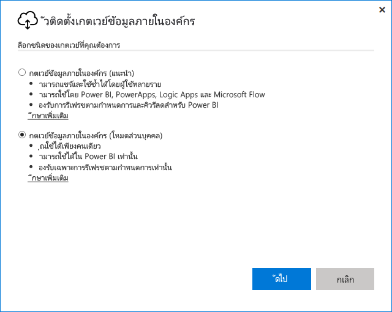
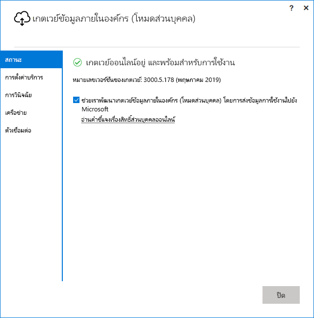

# <a name="use-personal-gateways-in-power-bi"></a>ใช้เกตเวย์ส่วนบุคคลใน Power BI

[!INCLUDE [gateway-rewrite](includes/gateway-rewrite.md)]

เกตเวย์ข้อมูลภายในองค์กร (โหมดส่วนบุคคล) เป็นเวอร์ชันของเกตเวย์ข้อมูลภายในองค์กรที่ทำงานกับ Power BI เท่านั้น เกตเวย์ส่วนบุคคลอนุญาตให้ผู้ใช้สามารถติดตั้งเกตเวย์บนคอมพิวเตอร์ของตนเอง และรับสิทธิ์การเข้าถึงข้อมูลภายในองค์กรได้

> [!NOTE]
> คุณสามารถมี เกตเวย์โหมดส่วนบุคคล ตัวเดียวต่อผู้ใช้ Power BI หนึ่งคนเท่านั้น ถ้าคุณติดตั้งเกตเวย์โหมดส่วนบุคคล อีกตัวสำหรับผู้ใช้เดียวกัน ถึงแม้ว่าจะอยู่บนคอมพิวเตอร์คนละเครื่อง การติดตั้งล่าสุดจะแทนที่การติดตั้งก่อนหน้านี้

## <a name="on-premises-data-gateway-vs-on-premises-data-gateway-personal-mode"></a>เกตเวย์ข้อมูลภายในองค์กรเทียบกับเกตเวย์ข้อมูลภายในองค์กร (โหมดส่วนบุคคล)

ตารางต่อไปนี้จะอธิบายความแตกต่างระหว่างเกตเวย์ข้อมูลภายในองค์กรและเกตเวย์ข้อมูลภายในองค์กร (โหมดส่วนบุคคล)

|   |เกตเวย์ข้อมูลภายในองค์กร | เกตเวย์ข้อมูลแบบติดตั้งภายในองค์กร (โหมดส่วนบุคคล) |
| ---- | ---- | ---- |
|บริการระบบคลาวด์ที่ได้รับการสนับสนุน |Power BI, PowerApps, Azure Logic Apps, Microsoft Flow, Azure Analysis Services, Data Flows |Power BI |
|เรียกใช้ |ตามที่กำหนดค่าโดยผู้ใช้ที่มีสิทธิ์เข้าถึงเกตเวย์ |เช่นเดียวกับคุณสำหรับการรับรองความถูกต้องของ Windows และการกำหนดค่าโดยคุณสำหรับชนิดการรับรองความถูกต้องอื่นๆ |
|สามารถติดตั้งได้เฉพาะในฐานะผู้ดูแลระบบคอมพิวเตอร์เท่านั้น |ใช่ |ไม่ใช่ |
|เกตเวย์ส่วนกลางและการจัดการแหล่งข้อมูล |ใช่ |ไม่ใช่ |
|นำเข้าข้อมูลและกำหนดเวลาการรีเฟรช |ใช่ |ใช่ |
|การสนับสนุน DirectQuery |ใช่ |ไม่ใช่ |
|การสนับสนุน LiveConnect สำหรับ Analysis Services |ใช่ |ไม่ใช่ |

## <a name="install-the-on-premises-data-gateway-personal-mode"></a>ติดตั้งเกตเวย์ข้อมูลภายในองค์กร (โหมดส่วนบุคคล)

วิธีการติดตั้งเกตเวย์ข้อมูลภายในองค์กร (โหมดส่วนบุคคล)

1. [ดาวน์โหลดเกตเวย์ข้อมูลภายในองค์กร](https://go.microsoft.com/fwlink/?LinkId=820925&clcid=0x409)

2. ในตัวติดตั้ง เลือกเกตเวย์ข้อมูลภายในองค์กร (โหมดส่วนบุคคล) แล้วเลือกปุ่ม **ถัดไป**

   

เมื่อการติดตั้งเสร็จสมบูรณ์แล้วและคุณได้ลงชื่อเข้าใช้แล้ว คุณจะเห็นหน้าจอต่อไปนี้



## <a name="using-fast-combine-with-the-personal-gateway"></a>ใช้ Fast Combine กับเกตเวย์ส่วนบุคคล

การรวมอย่างรวดเร็วบนเกตเวย์ส่วนบุคคลจะช่วยให้คุณสามารถข้ามระดับความเป็นส่วนตัวที่ระบุในขณะที่ดำเนินการคิวรี เมื่อต้องการเปิดใช้งานการรวมอย่างรวดเร็วเพื่อให้สามารถดำเนินการกับเกตเวย์ข้อมูลภายในองค์กร (โหมดส่วนบุคคล) ได้:

1. ใช้ File Explorer เปิดไฟล์ต่อไปนี้:

   `%localappdata%\Microsoft\On-premises data gateway (personal mode)\Microsoft.PowerBI.DataMovement.Pipeline.GatewayCore.dll.config`

2. ที่ด้านล่างของไฟล์ ให้เพิ่มข้อความต่อไปนี้:

    ```xml
    <setting name="EnableFastCombine" serializeAs="String">
       <value>true</value>
    </setting>
    ```

3. เมื่อเสร็จสมบูรณ์ การตั้งค่าจะมีผลในเวลาประมาณหนึ่งนาที หากต้องการตรวจสอบว่าสามารถทำงานได้อย่างถูกต้องหรือไม่ ลองใช้การรีเฟรชตามความต้องการใน **บริการ Power BI** เพื่อยืนยันว่า **Fast Combine** กำลังทำงานอยู่

## <a name="frequently-asked-questions-faq"></a>คำถามที่พบบ่อย (FAQ)

**คำถาม:** ฉันสามารถเรียกใช้ **เกตเวย์ข้อมูลภายในองค์กร (โหมดส่วนบุคคล)** พร้อมกันกับ **เกตเวย์ข้อมูลภายในองค์กร** (ก่อนหน้านี้เรียกว่าเกตเวย์เวอร์ชันสำหรับองค์กร) ได้หรือไม่
  
**คำตอบ:** ได้ เกตุเวย์ทั้งสองอย่างสามารถทำงานพร้อมกันได้

**คำถาม:** ฉันสามารถเรียกใช้ **เกตเวย์ข้อมูลภายในองค์กร (โหมดส่วนบุคคล)** เป็นบริการได้หรือไม่
  
**คำตอบ:** หมายเลข **เกตเวย์ข้อมูลภายในองค์กร (โหมดส่วนบุคคล)**  จะสามารถเรียกใช้เป็นแอปพลิเคชันเท่านั้น หากคุณต้องการใช้เกตเวย์เป็นบริการและ/หรือในโหมดผู้ดูแลระบบ คุณอาจจะต้องใช้ [**เกตเวย์ข้อมูลภายในองค์กร**](/data-integration/gateway/service-gateway-onprem) (ก่อนหน้านี้เรียกว่า เกตเวย์เวอร์ชันสำหรับองค์กร)

**คำถาม:** มีการอัปเดต **เกตเวย์ข้อมูลภายในองค์กร (โหมดส่วนบุคคล)** บ่อยเพียงใด
  
**คำตอบ:** เราวางแผนที่จะอัปเดตเกตเวย์ส่วนบุคคลเป็นรายเดือน

**คำถาม:** เหตุใดฉันจึงต้องอัปเดตข้อมูลประจำตัวของฉัน
  
**คำตอบ:** มีหลายสถานการณ์ก่อให้เกิดการร้องขอข้อมูลประจำตัวได้ โดยทั่วไปคุณจะติดตั้ง **เกตเวย์ข้อมูลภายในองค์กร(โหมดส่วนบุคคล)** อีกครั้งไว้ในเครื่องอื่นนอกเหนือจาก **Power BI - เกตเวย์ส่วนบุคคล** ของคุณ นอกจากนี้อาจเป็นปัญหาจากแหล่งข้อมูลและ Power BI ที่ไม่สามารถทำการเชื่อมต่อการทดสอบ หรือหมดเวลา หรือเกิดข้อผิดพลาดของระบบได้ คุณสามารถอัปเดตข้อมูลประจำตัวของคุณใน **บริการของ Power BI** ได้โดยไปที่ **ไอคอนฟันเฟือง** และเลือก **การตั้งค่า** และ **ชุดข้อมูล** และค้นหาชุดข้อมูลในคำถามและเลือก **ข้อมูลประจำตัวของแหล่งข้อมูล**

**คำถาม:** เกตเวย์ส่วนตัวของฉันรุ่นก่อนหน้านี้จะออฟไลน์นานเท่าใดระหว่างการอัปเกรด
  
**คำตอบ:** การอัปเกรดเกตเวย์ส่วนบุคคลไปเป็นรุ่นใหม่ควรใช้เวลาเพียงไม่กี่นาทีเท่านั้น

**คำถาม:** ฉันกำลังใช้สคริปต์ R และสคริปต์ Python ระบบจะรองรับหรือไม่
  
**คำตอบ:** สคริปต์ R และสคริปต์ Python ได้รับการรองรับสำหรับโหมดส่วนบุคคล

## <a name="next-steps"></a>ขั้นตอนถัดไป

* [การกำหนดค่าการตั้งค่าพร็อกซีสำหรับเกตเวย์ข้อมูลภายในองค์กร](/data-integration/gateway/service-gateway-proxy)  

มีคำถามเพิ่มเติมหรือไม่? [ลองไปที่ชุมชน Power BI](http://community.powerbi.com/)

