# <a name="tutorial-connect-to-on-premises-data-in-sql-server"></a>บทช่วยสอน: เชื่อมต่อกับข้อมูลภายในองค์กรใน SQL Server

เกตเวย์ข้อมูลภายในองค์กร เป็นซอฟต์แวร์ที่คุณติดตั้งในเครือข่ายภายในองค์กร ซึ่งอำนวยความสะดวกในการเข้าถึงข้อมูลในเครือข่ายดังกล่าว ในบทช่วยสอนนี้ คุณจะสร้างรายงานใน Power BI Desktop จากข้อมูลตัวอย่างที่นำเข้าจาก SQL Server จากนั้น คุณจะเผยแพร่รายงานไปยังบริการของ Power BI และกำหนดค่าเกตเวย์เพื่อให้บริการสามารถเข้าถึงข้อมูลภายในองค์กร การเข้าถึงนี้หมายความว่า บริการสามารถรีเฟรชข้อมูลเมื่อต้องการทำให้รายงานทันสมัย

ในบทช่วยสอนนี้ คุณจะเรียนรู้วิธีการ:
> [!div class="checklist"]
> * สร้างรายงานจากข้อมูลใน SQL Server
> * เผยแพร่รายงานไปยังบริการของ Power BI
> * เพิ่ม SQL Server เป็นแหล่งข้อมูลเกตเวย์
> * รีเฟรชข้อมูลในรายงาน

ถ้าคุณไม่ได้ลงทะเบียน Power BI ให้[ลงทะเบียนรุ่นทดลองใช้ฟรี](https://app.powerbi.com/signupredirect?pbi_source=web)ก่อนที่คุณจะเริ่มต้นใช้งาน


## <a name="prerequisites"></a>ข้อกำหนดเบื้องต้น

* [ติดตั้ง Power BI Desktop](https://powerbi.microsoft.com/desktop/)
* [ติดตั้ง SQL Server](https://docs.microsoft.com/sql/database-engine/install-windows/install-sql-server) ภายในเครื่องคอมพิวเตอร์ 
* [ติดตั้งเกตเวย์ข้อมูลภายในองค์กร](service-gateway-install.md) บนคอมพิวเตอร์เครื่องเดียวกัน (แต่ในการใช้งานจริง มักจะเป็นคอมพิวเตอร์คนละเครื่อง)


## <a name="set-up-sample-data"></a>ตั้งค่าข้อมูลตัวอย่าง

คุณเริ่มต้น โดยการเพิ่มข้อมูลตัวอย่างไปยัง SQL Server เพื่อให้คุณสามารถใช้ข้อมูลนั้นในส่วนที่เหลือของบทช่วยสอน

1. ใน SQL Server Management Studio (SSMS) เชื่อมต่อกับอินสแตนซ์ของ SQL Server ของคุณ และสร้างฐานข้อมูลทดสอบ

    ```sql
    CREATE DATABASE TestGatewayDocs
    ```

2. ในฐานข้อมูลที่คุณสร้าง เพิ่มตารางและแทรกข้อมูลลงไป

    ```sql
    USE TestGatewayDocs

    CREATE TABLE Product (
        SalesDate DATE,
        Category  VARCHAR(100),
        Product VARCHAR(100),
        Sales MONEY,
        Quantity INT
    )

    INSERT INTO Product VALUES('2018-05-05','Accessories','Carrying Case',9924.60,68)
    INSERT INTO Product VALUES('2018-05-06','Accessories','Tripod',1350.00,18)
    INSERT INTO Product VALUES('2018-05-11','Accessories','Lens Adapter',1147.50,17)
    INSERT INTO Product VALUES('2018-05-05','Accessories','Mini Battery Charger',1056.00,44)
    INSERT INTO Product VALUES('2018-05-06','Accessories','Telephoto Conversion Lens',1380.00,18)
    INSERT INTO Product VALUES('2018-05-06','Accessories','USB Cable',780.00,26)
    INSERT INTO Product VALUES('2018-05-08','Accessories','Budget Movie-Maker',3798.00,9)
    INSERT INTO Product VALUES('2018-05-09','Digital video recorder','Business Videographer',10400.00,13)
    INSERT INTO Product VALUES('2018-05-10','Digital video recorder','Social Videographer',3000.00,60)
    INSERT INTO Product VALUES('2018-05-11','Digital','Advanced Digital',7234.50,39)
    INSERT INTO Product VALUES('2018-05-07','Digital','Compact Digital',10836.00,84)
    INSERT INTO Product VALUES('2018-05-08','Digital','Consumer Digital',2550.00,17)
    INSERT INTO Product VALUES('2018-05-05','Digital','Slim Digital',8357.80,44)
    INSERT INTO Product VALUES('2018-05-09','Digital SLR','SLR Camera 35mm',18530.00,34)
    INSERT INTO Product VALUES('2018-05-07','Digital SLR','SLR Camera',26576.00,88)
    ```

3. เลือกข้อมูลจากตารางเพื่อตรวจสอบ

    ```sql
    SELECT * FROM Product
    ```

    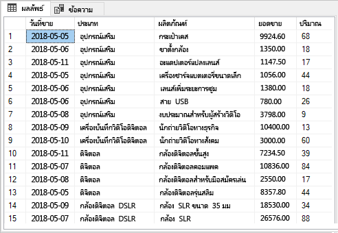


## <a name="build-and-publish-a-report"></a>สร้าง และเผยแพร่รายงาน

ตอนนี้ คุณมีข้อมูลตัวอย่างเพื่อทำงานด้วยแล้ว คุณจะเชื่อมต่อกับ SQL Server ใน Power BI Desktop และสร้างรายงานจากข้อมูลนั้น จากนั้น คุณจะเผยแพร่รายงานไปยังบริการของ Power BI

1. ใน Power BI Desktop บนแท็บ**หน้าแรก** เลือก **รับข้อมูล** > **SQL Server**

2. ภายใต้**เซิร์ฟเวอร์** ใส่ชื่อเซิร์ฟเวอร์ของคุณ และภายใต้**ฐานข้อมูล** ใส่ "TestGatewayDocs" เลือก **ตกลง** 

    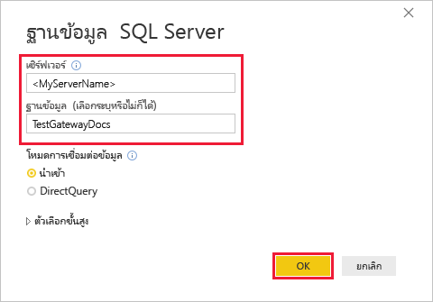

3. ตรวจสอบข้อมูลประจำตัวของคุณ จากนั้นเลือก**เชื่อมต่อ**

4. ภายใต้**ตัวนำทาง** เลือกตาราง **Product** (ผลิตภัณฑ์) จากนั้นเลือก**โหลด**

    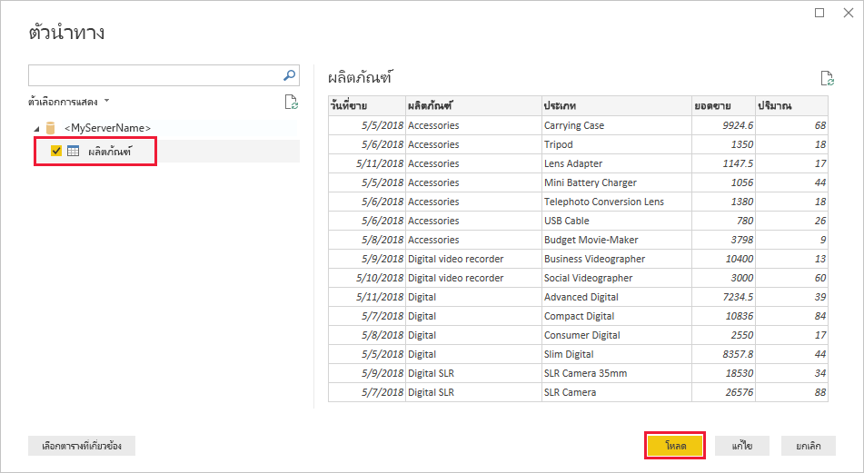

5. ใน Power BI Desktop มุมมอง**รายงาน** ในบานหน้าต่าง**การจัดรูปแบบการแสดงข้อมูล** เลือก**แผนภูมิคอลัมน์แบบเรียงซ้อน**

    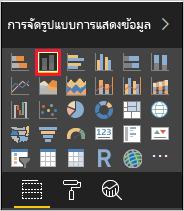    

6. เลือกที่แผนภูมิคอลัมน์ในพื้นที่รายงาน ในบานหน้าต่าง**เขตข้อมูล** เลือกเขตข้อมูล **Category** (ประเภท) และ **Sales** (ยอดขาย)  

    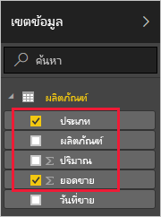

    ตอนนี้แผนภูมิควรมีลักษณะดังต่อไปนี้

    

    สังเกตว่า **SLR Camera** คือรายการที่มียอดขายสูงสุดในปัจจุบัน ซึ่งจะเปลี่ยนแปลงเมื่อคุณอัปเดตข้อมูล และรีเฟรชรายงานในภายหลัง ในบทช่วยสอนนี้

7. บันทึกรายงานเป็นชื่อ "TestGatewayDocs.pbix"

8. บนแท็บ**หน้าแรก** เลือก **เผยแพร่** > **พื้นที่ทำงานของฉัน** > **เลือก** ลงชื่อเข้าใช้ไปยังบริการของ Power BI ถ้าคุณถูกขอให้ทำเช่นนั้น 

    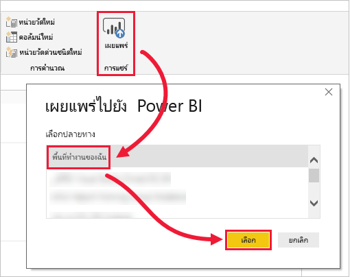

9. บนหน้าจอ**สำเร็จ** เลือก**เปิด 'TestGatewayDocs.pbix' ใน Power BI**


## <a name="add-sql-server-as-a-gateway-data-source"></a>เพิ่ม SQL Server เป็นแหล่งข้อมูลเกตเวย์

ใน Power BI Desktop คุณเชื่อมต่อโดยตรงกับ SQL Server แต่บริการของ Power BI จำเป็นต้องใช้เกตเวย์เพื่อทำหน้าที่เป็นบริดจ์ ตอนนี้ คุณเพิ่มของอินสแตนซ์ของ SQL Server ให้เป็นแหล่งข้อมูลสำหรับเกตเวย์ที่คุณสร้างไว้ในบทความก่อนหน้า (แสดงอยู่ภายใต้[ข้อกำหนดเบื้องต้น](#prereqisites)) 

1. ที่มุมบนขวาของบริการของ Power BI เลือกไอคอนรูปเฟือง  > **จัดการเกตเวย์**

    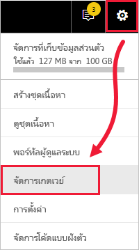

2. เลือก**เพิ่มแหล่งข้อมูล** และใส่ "test-sql-source" สำหรับ**ชื่อแหล่งข้อมูล**

    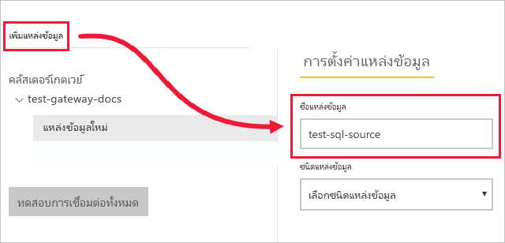

3. เลือก**ชนิดแหล่งข้อมูล**เป็น **SQL Server** จากนั้นใส่ค่าอื่น ๆ ตามที่แสดง

    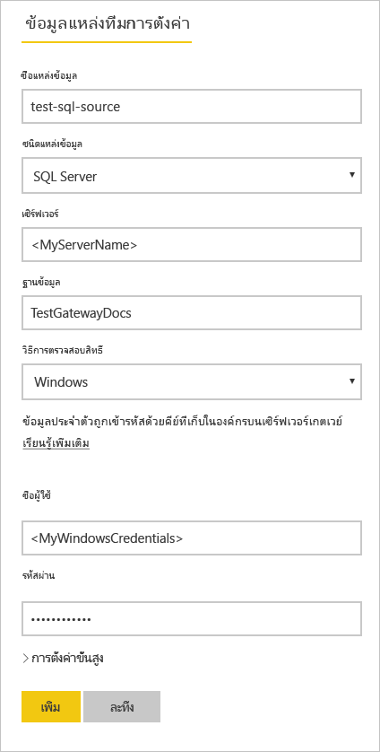

    | ตัวเลือก | ค่า |
    | ---    | ---   |
    | **ชื่อแหล่งข้อมูล**       | test-sql-source      |
    | **ชนิดแหล่งข้อมูล**       | เซิร์ฟเวอร์ SQL      |
    | **เซิร์ฟเวอร์**       |  ชื่อของอินสแตนซ์ SQL Server ของคุณ (ต้องเหมือนกับสิ่งที่คุณได้ระบุไว้ใน Power BI Desktop)    |
    | **ฐานข้อมูล**       | TestGatewayDocs      |
    | **วิธีการรับรองความถูกต้อง**       | Windows      |
    | **ชื่อผู้ใช้**        |  บัญชี เช่น michael@contoso.com ที่คุณใช้เพื่อเชื่อมต่อกับ SQL Server     |
    | **รหัสผ่าน**       |  รหัสผ่านสำหรับบัญชีที่คุณใช้เพื่อเชื่อมต่อกับ SQL Server    |

4. เลือก**เพิ่ม** คุณจะเห็นข้อความ*การเชื่อมต่อเป็นที่สำเร็จ* เมื่อกระบวนการสำเร็จ

    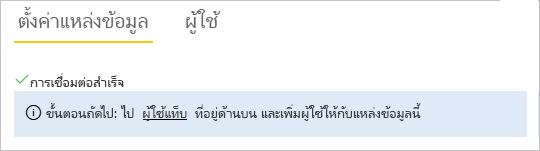

    ตอนนี้คุณสามารถใช้แหล่งข้อมูลนี้เพื่อรวมข้อมูลจาก SQL Server ลงในแดชบอร์ดและรายงาน Power BI ของคุณ


## <a name="configure-and-use-data-refresh"></a>กำหนดค่า และใช้การรีเฟรชข้อมูล

คุณได้เผยแพร่รายงานไปยังบริการของ Power BI และกำหนดค่าแหล่งข้อมูล SQL Server แล้ว เมื่อทุกอย่างเข้าที่แล้ว ตอนนี้คุณสามารถทำการเปลี่ยนแปลงในตารางผลิตภัณฑ์ และการเปลี่ยนแปลงนั้นส่งผ่านทางเกตเวย์ไปยังรายงานที่เผยแพร่ คุณยังจะกำหนดรีเฟรชตามกำหนดเวลา เพื่อจัดการกับการเปลี่ยนแปลงในอนาคต

1. ใน SSMS ปรับปรุงข้อมูลในตาราง Product

    ```sql
    UPDATE Product
    SET Sales = 32508, Quantity = 252
    WHERE Product='Compact Digital'     

    ```

2. ในการบริการ Power BI ในบานหน้าต่างนำทางด้านซ้าย เลือก **พื้นที่ทำงานของฉัน**

3. ภายใต้**ชุดข้อมูล** สำหรับชุดข้อมูล **TestGatewayDocs** เลือก**เพิ่มเติม** (**...** ) > **รีเฟรชเดี๋ยวนี้**

    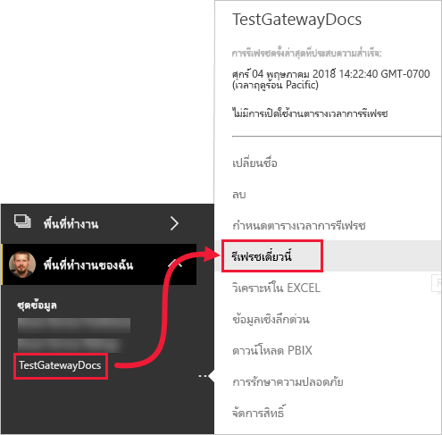

4. เลือก **พื้นที่ทำงานของฉัน** > **รายงาน** > **TestGatewayDocs** ดูว่าการปรับปรุงวิ่งผ่านมาอย่างไร และผู้นำยอดขายขณะนี้คือ **Compact Digital** 

    

5. เลือก **พื้นที่ทำงานของฉัน** > **รายงาน** > **TestGatewayDocs** เลือก **เพิ่มเติม** (**...** ) > **รีเฟรชตามกำหนดเวลา**

6. ภายใต้**รีเฟรชตามกำหนดเวลา** ตั้งค่าการรีเฟรชเป็น**เปิด** แล้วเลือก**นำไปใช้** ชุดข้อมูลมีการรีเฟรชรายวันตามค่าเริ่มต้น

    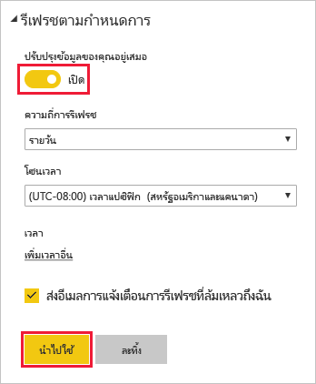

## <a name="clean-up-resources"></a>เพิ่มพื้นที่ทรัพยากร
ถ้าคุณไม่ต้องการใช้ข้อมูลตัวอย่างอีกต่อไป เรียกใช้ `DROP DATABASE TestGatewayDocs` ใน SSMS ถ้าคุณไม่ต้องการใช้แหล่งข้อมูล SQL Server [ลบแหล่งข้อมูล](service-gateway-manage.md#remove-a-data-source) 


## <a name="next-steps"></a>ขั้นตอนถัดไป
ในบทช่วยสอนนี้ คุณเรียนรู้วิธีการ:
> [!div class="checklist"]
> * สร้างรายงานจากข้อมูลใน SQL Server
> * เผยแพร่รายงานไปยังบริการของ Power BI
> * เพิ่ม SQL Server เป็นแหล่งข้อมูลเกตเวย์
> * รีเฟรชข้อมูลในรายงาน

ไปยังบทความถัดไปเพื่อเรียนรู้เพิ่มเติม
> [!div class="nextstepaction"]
> [จัดการเกตเวย์ Power BI](service-gateway-manage.md)

