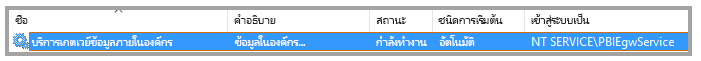
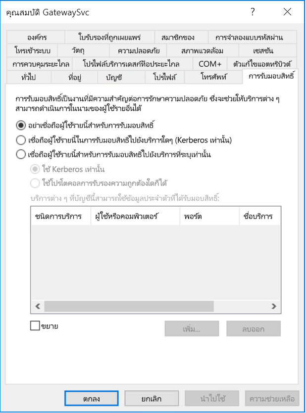
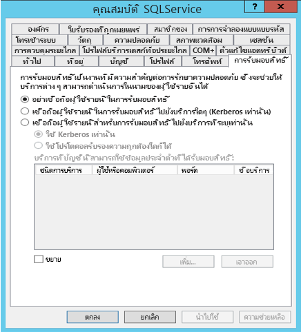
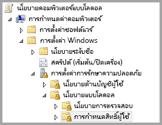
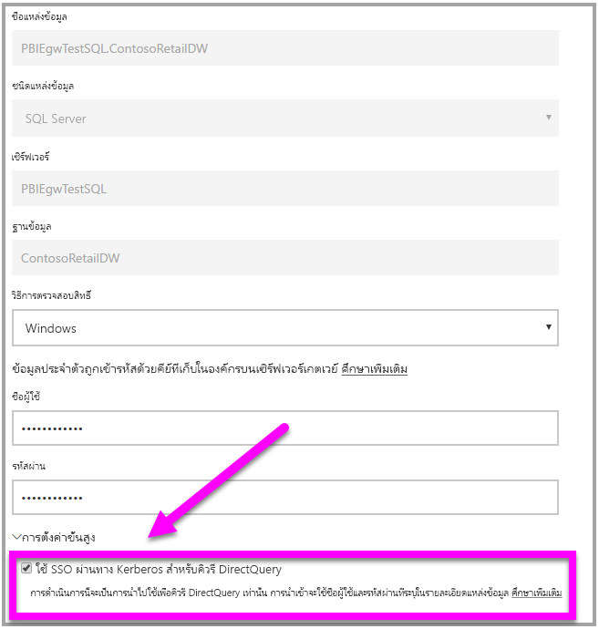

# <a name="use-resource-based-kerberos-for-single-sign-on-sso-from-power-bi-to-on-premises-data-sources"></a>ใช้ Kerberos ตามทรัพยากร สำหรับการลงชื่อเข้าระบบครั้งเดียว (SSO) จาก Power BI ไปยังแหล่งข้อมูลในองค์กร

ใช้[การมอบหมายที่มีข้อจำกัดของ Kerberos ตามทรัพยากร](/windows-server/security/kerberos/kerberos-constrained-delegation-overview)เพื่อเปิดใช้งานการเชื่อมต่อการลงชื่อเข้าระบบครั้งเดียวสำหรับ Windows Server 2012 และเวอร์ชันที่ใหม่กว่า เพื่ออนุญาตให้บริการหน้าสุดและปลายสุดมีโดเมนที่แตกต่างกัน สำหรับขั้นตอนนี้ โดเมนของบริการปลายสุดจำเป็นต้องเชื่อถือโดเมนของบริการหน้าสุด

## <a name="preparing-for-resource-based-kerberos-constrained-delegation"></a>การเตรียมการสำหรับการมอบหมายที่มีข้อจำกัดของ Kerberos ตามทรัพยากร

จะต้องกำหนดค่าหลายรายการ เพื่อให้การมอบหมายที่มีข้อจำกัดของ Kerberos ทำงานได้อย่างถูกต้อง ซึ่งรวมถึง_ชื่อบริการหลัก_ (SPN) และการตั้งค่าการมอบหมายบนบัญชีบริการ

### <a name="prerequisite-1-operating-system-requirements"></a>ข้อกำหนดเบื้องต้น 1: ความต้องการของระบบปฏิบัติการ

การมอบหมายที่มีข้อจำกัดตามทรัพยากรสามารถกำหนดค่าตัวควบคุมโดเมนที่เรียกใช้ด้วย Windows Server 2012 R2 หรือ Windows Server 2012 หรือสูงกว่าเท่านั้น

### <a name="prerequisite-2-install-and-configure-the-on-premises-data-gateway"></a>ข้อกำหนดเบื้องต้น 2: ติดตั้งและกำหนดค่าเกตเวย์ข้อมูลภายในองค์กร

เกตเวย์ข้อมูลภายในองค์กรรุ่นนี้รองรับการอัปเกรดแบบแทนที่ และ_การแทนที่การตั้งค่า_ของเกตเวย์เดิม

### <a name="prerequisite-3-run-the-gateway-windows-service-as-a-domain-account"></a>ข้อกำหนดเบื้องต้น 3: เรียกใช้บริการ Windows ของเกตเวย์ด้วยบัญชีโดเมน

ในการติดตั้งแบบมาตรฐาน เกตเวย์จะทำงานด้วยบัญชีบริการภายในเครื่อง (ซึ่งก็คือ _NT Service\PBIEgwService_) เช่นที่แสดงในรูปต่อไปนี้:



ในการเปิดใช้งาน**การมอบหมายที่มีข้อจำกัดของ Kerberos เกตเวย์ต้องดำเนินงานด้วยบัญชีโดเมน เว้นแต่ว่า Azure AD ของคุณได้ซิงโครไนซ์กับ Active Directory ของคุณในเครื่องอยู่แล้ว (ด้วย Azure AD DirSync/Connect) ถ้าคุณต้องการสลับบัญชีไปเป็นบัญชีโดเมน โปรดดู[ การสลับเกตเวย์ไปยังบัญชีโดเมน](service-gateway-sso-kerberos.md#switching-the-gateway-to-a-domain-account) ภายหลังในบทความนี้

ถ้า Azure AD DirSync / Connect ได้รับการกำหนดค่าและบัญชีผู้ใช้ได้รับการซิงโครไนซ์ บริการเกตเวย์ไม่จำเป็นต้องดำเนินการค้นหา AD ภายในเครื่องที่รันไทม์ คุณสามารถใช้ SID ของบริการภายในเครื่อง (แทนการใช้บัญชีโดเมน) สำหรับบริการเกตเวย์ ขั้นตอนการกำหนดค่าการมอบหมายที่มีข้อจำกัดของ Kerberos ที่แสดงในบทความนี้จะเหมือนกับการกำหนดค่านั้น (จะใช้กับวัตถุคอมพิวเตอร์ของเกตเวย์ใน Active Directory แทนที่จะใช้บัญชีโดเมน)

### <a name="prerequisite-4-have-domain-admin-rights-to-configure-spns-setspn-and-kerberos-constrained-delegation-settings"></a>ข้อกำหนดเบื้องต้น 4: มีสิทธิ์ผู้ดูแลระบบโดเมนเพื่อกำหนดค่า SPN (SetSPN) และการตั้งค่าการมอบหมายที่มีข้อจำกัดของ Kerberos

ถึงแม้ว่า ผู้ดูแลโดเมน สามารถให้บุคคลอื่น มีสิทธิ์กำหนดค่า SPN และการมอบหมายของ Kerberos เป็นการชั่วคราวหรือถาวรได้ โดยไม่ต้องได้สิทธิ์ของผู้ดูแลโดเมน แต่เป็นวิธีที่ไม่แนะนำ ในส่วนต่อไปนี้ เราจะแสดงขั้นตอนที่จำเป็นในการกำหนดค่าตาม **ข้อกำหนดเบื้องต้น 3** โดยละเอียด

## <a name="configuring-kerberos-constrained-delegation-for-the-gateway-and-data-source"></a>การกำหนดค่าการมอบหมายที่มีข้อจำกัดของ Kerbeross สำหรับเกตเวย์และแหล่งข้อมูล

ในการกำหนดค่าระบบที่ถูกต้อง เราต้องกำหนดค่า หรือการตรวจสอบ สองเรื่องต่อไปนี้:

1. ถ้าจำเป็น ให้กำหนดค่า SPN สำหรับบัญชีโดเมนของบริการเกตเวย์

1. กำหนดค่า การรับมอบสิทธิ์ ในบัญชีโดเมนของบริการเกตเวย์

โปรดทราบว่า คุณต้องเป็นผู้ดูแลโดเมน ถึงจะทำสองขั้นตอนนี้ได้

ส่วนต่อไปนี้ จะอธิบายขั้นแต่ละขั้นตอนตามลำดับ

### <a name="configure-an-spn-for-the-gateway-service-account"></a>กำหนดค่าการ SPN สำหรับบัญชีของบริการเกตเวย์

ขั้นแรก ตรวจสอบว่ามีการสร้าง SPN สำหรับบัญชีโดเมน ที่จะใช้เป็นบัญชีของบริการเกตเวย์ ไว้แล้วหรือไม่ โดยทำตามขั้นตอนเหล่านี้:

1. ในฐานะผู้ดูแลโดเมน ให้เรียกใช้งาน **Active Directory Users and Computers**

1. คลิกขวาบนโดเมน เลือก **ค้นหา** และพิมพ์ชื่อบัญชีผู้ใช้ของบัญชีบริการเกตเวย์

1. ในผลลัพธ์การค้นหา คลิกขวาบนบัญชีบริการเกตเวย์ แล้วเลือก **คุณสมบัติ**

1. ถ้าเห็นแท็บ**การรับมอบสิทธิ์** ในกล่องโต้ตอบ**คุณสมบัติ** แสดงว่า SPN ได้ถูกสร้างขึ้นแล้ว และคุณสามารถข้ามไปยังหัวข้อย่อยถัดไปเรื่อง การกำหนดค่าการรับมอบสิทธิ์

    ถ้าไม่มีแท็บ**การรับมอบสิทธิ์** ในกล่องโต้ตอบ**คุณสมบัติ** คุณจะต้องสร้าง SPN บนบัญชีผู้ใช้นั้น ซึ่งซึ่งจะเพิ่มแท็บ**การรับมอบสิทธิ์** (ซึ่งเป็นวิธีง่ายที่สุดในการ กำหนดค่าการรับมอบสิทธิ์) การสร้าง SPN สามารถทำได้โดยใช้[เครื่องมือ setspn](https://technet.microsoft.com/library/cc731241.aspx)ที่มาพร้อมกับ Windows (คุณต้องมีสิทธิ์ผู้ดูแลโดเมนในการสร้าง SPN)

    ยกตัวอย่าง สมมติว่าบัญชีผู้ใช้บริการเกตเวย์คือ "PBIEgwTest\GatewaySvc" และเครื่องที่บริการเกตเวย์ทำงานชื่อว่า **Machine1** เพื่อตั้งค่า SPN สำหรับบัญชีบริการเกตเวย์ สำหรับคอมพิวเตอร์ในตัวอย่าง คุณจะเรียกใช้คำสั่งต่อไปนี้:

      

    เมื่อเสร็จขั้นตอนนี้ เราจะไปกำหนดค่าการรับมอบสิทธิ์กันต่อ

### <a name="configure-delegation-settings"></a>กำหนดค่าการตั้งค่าการมอบหมาย

ในขั้นตอนต่อไปนี้ เราจะสมมติให้สภาพแวดล้อมภายในองค์กรมีเครื่องสองเครื่องที่มีโดเมนต่างกันคือ เครื่องเกตเวย์และเซิร์ฟเวอร์ฐานข้อมูลที่ใช้ SQL Server เพื่อใช้ตัวอย่างนี้ เราจะสมมติการตั้งค่าและชื่อต่อไปนี้:

- ชื่อเครื่องเกตเวย์: **PBIEgwTestGW**
- บัญชีผู้ใช้บริการเกตเวย์: **PBIEgwTestFrontEnd\GatewaySvc** (ชื่อที่แสดงบัญชี: ตัวเชื่อมต่อเกตเวย์)
- ชื่อเครื่องแหล่งข้อมูล SQL Server: **PBIEgwTestSQL**
- บัญชีบริการแหล่งข้อมูล SQL Server: **PBIEgwTestBackEnd\SQLService**

จากตัวอย่างชื่อและการตั้งค่าที่ให้มา ใช้ขั้นตอนการกำหนดค่าต่อไปนี้:

1. ใช้ **Active Directory Users and Computers** ซึ่งเป็น Microsoft Management Console (MMC) snap-in บนตัวควบคุมโดเมนสำหรับโดเมน **PBIEgwTestFront-end** ตรวจสอบให้แน่ใจว่าไม่มีการปรับใช้การตั้งค่าการมอบหมายสำหรับบัญชีผู้ใช้บริการเกตเวย์

    

1. ใช้ **Active Directory Users and Computers** บนตัวควบคุมโดเมนสำหรับโดเมน **PBIEgwTestBack-end** ตรวจสอบให้แน่ใจว่าไม่มีการปรับใช้การตั้งค่าการมอบหมายสำหรับบัญชีบริการปลายสุด นอกจากนี้ ตรวจสอบให้แน่ใจว่าแอตทริบิวต์ "msDS-AllowedToActOnBehalfOfOtherIdentity" สำหรับบัญชีนี้ยังไม่ได้ตั้งค่า คุณสามารถค้นหาแอตทริบิวต์นี้ใน "ตัวแก้ไขแอตทริบิวต์" ดังที่แสดงในรูปภาพต่อไปนี้:

    

1. สร้างกลุ่มใน **Active Directory Users and Computers** บนตัวควบคุมโดเมนสำหรับโดเมน **PBIEgwTestBack-end** เพิ่มบัญชีผู้ใช้บริการเกตเวย์ไปยังกลุ่มนี้ดังที่แสดงในรูปภาพต่อไปนี้ รูปภาพจะแสดงกลุ่มใหม่เรียกว่า _ResourceDelGroup_ และบัญชีผู้ใช้บริการเกตเวย์ **GatewaySvc** ที่เพิ่มลงในกลุ่มนี้

    

1. เปิดพร้อมท์คำสั่งและเรียกใช้คำสั่งต่อไปนี้ในตัวควบคุมโดเมนสำหรับโดเมน **PBIEgwTestBack-end** เพื่ออัปเดตแอตทริบิวต์ msDS-AllowedToActOnBehalfOfOtherIdentity ของบัญชีบริการปลายสุด:

    ```powershell
    $c=get-adgroupResourceDelGroup
    set-aduser **SQLService** -principalsAllowedToDelegateToAccount$c
    ```

1. คุณสามารถตรวจสอบว่าการอัปเดตจะแสดงอยู่ในแท็บ "ตัวแก้ไขแอตทริบิวต์" ในคุณสมบัติสำหรับบัญชีบริการปลายสุดใน **Active Directory Users and Computers**

สุดท้าย บนเครื่องที่มีบริการเกตเวย์ทำงาน (**PBIEgwTestGW** ในตัวอย่างของเรา) คุณต้องให้นโยบายภายในเครื่อง "เลียนแบบไคลเอ็นต์หลังจากการรับรองความถูกต้อง" กับบัญชีผู้ใช้บริการเกตเวย์ คุณสามารถกำหนด/ตรวจสอบด้วย ตัวแก้ไขนโยบายกลุ่มภายใน (**gpedit**) ได้

1. บนเครื่องเกตเวย์ เรียกใช้: _gpedit.msc_

1. ไปยัง **นโยบายคอมพิวเตอร์ภายใน > การกำหนดค่าคอมพิวเตอร์ > การตั้งค่า Windows > การตั้งค่าความปลอดภัย > นโยบายภายในเครื่อง > การกำหนดสิทธิ์ของผู้ใช้** ดังที่แสดงในรูปภาพต่อไปนี้

    

1. จากรายการของนโยบายภายใต้**การกำหนดสิทธิ์ของผู้ใช้** เลือก**เลียนแบบไคลเอ็นต์หลังจากการรับรองความถูกต้อง**

    

1. คลิกขวาและเปิด**คุณสมบัติ**สำหรับ**เลียนแบบไคลเอ็นต์หลังจากการรับรองความถูกต้อง** และตรวจสอบรายการบัญชีผู้ใช้ จะต้องมีบัญชีผู้ใช้บริการเกตเวย์ ( **PBIEgwTestFront-end** **\GatewaySvc**) แสดงอยู่ข้างใน

1. จากรายการของนโยบายภายใต้**การกำหนดสิทธิ์ของผู้ใช้** เลือก**ทำหน้าที่เป็นส่วนหนึ่งของระบบปฏิบัติการ (SeTcbPrivilege)** ตรวจสอบให้แน่ใจว่า บัญชีบริการเกตเวย์รวมอยู่ในรายการของบัญชีผู้ใช้นี้เช่นกัน

1. รีสตาร์ทกระบวนการบริการ**เกตเวย์ข้อมูลในองค์กร**

## <a name="running-a-power-bi-report"></a>การเรียกใช้รายงาน Power BI

หลังจากเสร็จขั้นตอนการกำหนดค่าที่อธิบายไว้ก่อนหน้านี้ในบทความนี้แล้ว คุณสามารถใช้หน้า **จัดการเกตเวย์** ใน Power BI เพื่อกำหนดค่าแหล่งข้อมูล จากนั้น ภายใน **การตั้งค่าขั้นสูง** เปิดใช้งาน SSO จากนั้นก็เผยแพร่รายงานและชุดข้อมูลที่ผูกกับแหล่งข้อมูลนั้น



การกำหนดค่านี้ใช้ได้ในกรณีส่วนใหญ่ อย่างไรก็ตาม การใช้งานกับ Kerberos อาจต้องมีการตั้งค่าที่แตกต่างกันออกไป ขึ้นอยู่กับสภาพแวดล้อมของคุณ ถ้ายังไม่สามารถโหลดรายงานได้ คุณต้องติดต่อผู้ดูแลโดเมนของคุณเพื่อตรวจสอบเพิ่มเติม

## <a name="next-steps"></a>ขั้นตอนถัดไป

สำหรับข้อมูลเพิ่มเติมเกี่ยวกับการ**เกตเวย์ข้อมูลในองค์กร**และ **DirectQuery** ลองดูบทความต่อไปนี้:

- [เกตเวย์ข้อมูลภายในองค์กร](service-gateway-onprem.md)
- [DirectQuery ใน Power BI](desktop-directquery-about.md)
- [แหล่งข้อมูลที่สนับสนุนโดย DirectQuery](desktop-directquery-data-sources.md)
- [DirectQuery และ SAP BW](desktop-directquery-sap-bw.md)
- [DirectQuery และ SAP HANA](desktop-directquery-sap-hana.md)