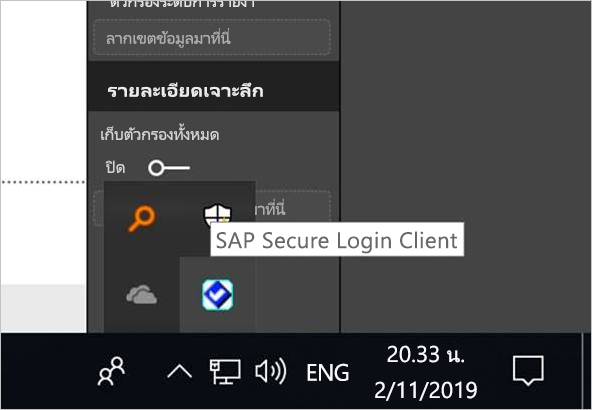
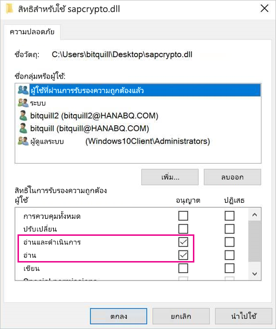
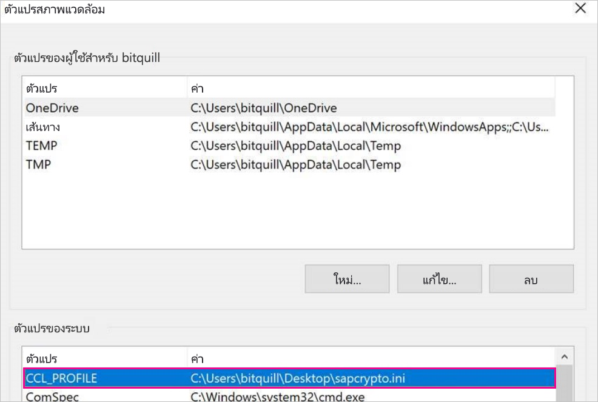
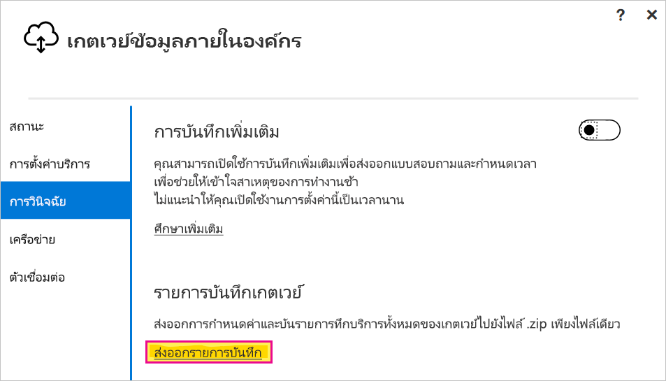

# <a name="use-kerberos-single-sign-on-for-sso-to-sap-bw-using-commoncryptolib-sapcryptodll"></a>ใช้การลงชื่อเข้าระบบแบบครั้งเดียวของ Kerberos สำหรับ SSO ไปยัง SAP เท่ากับการใช้ CommonCryptoLib (sapcrypto.dll)

บทความนี้อธิบายวิธีกำหนดค่าแหล่งข้อมูล SAP BW ของคุณเพื่อเปิดใช้งาน SSO จากบริการของ Power BI โดยใช้ CommonCryptoLib (sapcrypto.dll)

> [!NOTE]
> ก่อนที่คุณจะพยายามรีเฟรชรายงานที่ยึดกับ SAP BW ที่ใช้ Kerberos SSO ให้ทำตามทั้งขั้นตอนในบทความนี้และขั้นตอนใน [กำหนดค่า Kerberos SSO](service-gateway-sso-kerberos.md) การใช้CommonCryptoLib เป็นคลัง SNC สามารถทำให้การเชื่อมต่อ SSO ไปยังเซอร์เวอร์แอปพลิเคชัน SAP BW และเซอร์เวอร์ข้อความ SAP BW ได้

## <a name="configure-sap-bw-to-enable-sso-using-commoncryptolib"></a>กำหนดค่า SAP BWเพื่อเปิดการใช้งาน SSO โดยใช้ CommonCryptoLib

> [!NOTE]
> เกตเวย์ข้อมูลภายในองค์กรเป็นซอฟ์ทแวร์ 64 บิท ดังนั้นจึงต้องการ CommonCryptoLib (sapcrypto.dll) เวอร์ชัน 64 บิทเพื่อดำเนินการ BW SSO หากคุณวางแผนที่จะทดสอบการเชื่อมต่อ SSO เข้ากับเซิร์ฟเวอร์ SAP BW ใน SAP GUI ก่อนพยายามที่จะเชื่อมต่อ SSO ผ่านเกตเวย์ (แนะนำ) คุณจะต้องใช้ CommonCryptoLib เวอร์ชัน 32 บิทเนื่องจาก SAP GUI เป็นเวอร์ชัน 32 บิท

1. ตรวจสอบให้แน่ใจว่าเซิร์ฟเวอร์ BW ได้รับการกำหนดค่าสำหรับ Kerberos SSO อย่างถูกต้องโดยใช้ CommonCryptoLib ถ้าเป็นเช่นนั้น คุณสามารถใช้ SSO เพื่อเข้าถึงเซิร์ฟเวอร์ของคุณได้ (โดยตรงหรือผ่านเซิร์ฟเวอร์ข้อความของ SAP BW) ด้วยเครื่องมือ SAP เช่น SAP GUI ที่ได้รับการกำหนดค่าให้ใช้ CommonCryptoLib 

   สำหรับข้อมูลเพิ่มเติมเกี่ยวกับขั้นตอนการตั้งค่า ให้ดู[ SAP แบบลงชื่อเข้าระบบเพียงครั้งเดียว: รับรองความถูกต้องด้วย Kerberos/SPNEGO](https://blogs.sap.com/2017/07/27/sap-single-sign-on-authenticate-with-kerberosspnego/) เซิร์ฟเวอร์ของคุณควรใช้ CommonCryptoLib เป็นไลบรารีของ SNC และมีชื่อ SNC ที่เริ่มต้นด้วย *CN =* เช่น *CN = BW1* สำหรับข้อมูลเพิ่มเติมเกี่ยวกับข้อกำหนดของชื่อ SNC (โดยเฉพาะอย่างยิ่ง snc/ข้อมูลประจำตัว/เป็นพารามิเตอร์) ให้ดู[พารามิเตอร์ SNC สำหรับการกำหนดค่า Kerberos ](https://help.sap.com/viewer/df185fd53bb645b1bd99284ee4e4a750/3.0/360534094511490d91b9589d20abb49a.html)

1. หากคุณยังไม่ได้ดำเนินการดังกล่าว ให้ติดตั้งเวอร์ชั่น x64 ของ [SAP .NET Connector](https://support.sap.com/en/product/connectors/msnet.html) บนคอมพิวเตอร์ที่มีการติดตั้งเกตเวย์ไว้แล้ว 
   
   คุณสามารถตรวจสอบว่ามีการติดตั้งคอมโพเนนต์โดยพยายามเชื่อมต่อกับเซิร์ฟเวอร์ BW ใน Power BI Desktop จากคอมพิวเตอร์เกตเวย์หรือไม่ ถ้าคุณไม่สามารถเชื่อมต่อโดยใช้การดำเนินการ 2.0 คุณจะไม่สามารถติดตั้ง .NET Connector หรือติดตั้งไปที่ GAC ได้

1. ตรวจสอบให้แน่ใจว่า SAP Secure Login Client (SLC) ไม่ได้ทำงานบนคอมพิวเตอร์ที่มีการติดตั้งเกตเวย์ 

   SLC จะแคชตั๋ว Kerberos ในลักษณะที่อาจรบกวนความสามารถของเกตเวย์เพื่อใช้ Kerberos สำหรับ SSO 

1. ถ้ามีการติดตั้ง SLC ให้ถอนการติดตั้งหรือตรวจสอบให้แน่ใจว่าคุณออกจาก SAP Secure Login Client คลิกขวาที่ไอคอนในถาดระบบและเลือก **ออกจากระบบ** และ **จบการทำงาน** ก่อนที่คุณจะพยายามเชื่อมต่อแบบ SSO โดยใช้เกตเวย์ 

   SLC ไม่ได้รับการสนับสนุนสำหรับการใช้งานบนเครื่องเซิร์ฟเวอร์ของ Windows สำหรับข้อมูลเพิ่มเติม ให้ดู [SAP Note 2780475](https://launchpad.support.sap.com/#/notes/2780475) (ต้องมีผู้ใช้ s)

   

1. ถ้าคุณถอนการติดตั้ง SLC หรือเลือก **ออกจากระบบ** และ**จบการทำงาน** ให้เปิดหน้าต่าง cmd และใส่ `klist purge` เพื่อล้างตั๋ว Kerberos แบบ SSO ผ่านเกตเวย์

1. ดาวน์โหลด CommonCryptoLib 64 บิท (sapcrypto.dll) เวอร์ชั่น *8.5.25 หรือมากกว่า*จาก SAP Launchpad และคัดลอกไปยังโฟลเดอร์บนเครื่องเกตเวย์ของคุณ ในไดเรกทอรีเดียวกันกับที่คุณคัดลอก sapcrypto สร้างไฟล์ที่ชื่อ sapcrypto ด้วยเนื้อหาต่อไปนี้:

    ```
    ccl/snc/enable_kerberos_in_client_role = 1
    ```

    ไฟล์ .ini มีข้อมูลการกำหนดค่าที่จำเป็นโดย CommonCryptoLib เพื่อเปิดใช้งาน SSO ในสถานการณ์เกตเวย์

    > [!NOTE]
    > ไฟล์เหล่านี้จะต้องถูกจัดเก็บไว้ในตำแหน่งที่ตั้งเดียวกัน อีกอย่างหนึ่ง _/path/to/sapcrypto/_ ควรมีทั้ง sapcrypto.ini และ sapcrypto.dll

    ทั้งผู้ใช้บริการเกตเวย์และผู้ใช้ Active Directory (AD) ที่ผู้ใช้บริการเลียนแบบจำเป็นต้องมีสิทธิ์ในการอ่านและการใช้งานสำหรับทั้งสองไฟล์ เราขอแนะนำการให้สิทธิ์ทั้งไฟล์. ini และ. dll กับกลุ่มผู้ใช้ที่ได้รับการรับรองความถูกต้อง สำหรับวัตถุประสงค์ในการทดสอบ คุณยังสามารถมอบสิทธิ์เหล่านี้ให้กับทั้งผู้ใช้บริการเกตเวย์และผู้ใช้ Active Directory ที่คุณจะใช้สำหรับการทดสอบ ในสกรีนช็อตต่อไปนี้ เราได้ให้สิทธิ์ในการ **อ่าน&amp; ใช้** กับกลุ่มผู้ใช้ที่ได้รับการรับรองความถูกต้องสำหรับ sapcrypto.dll:

    

1. หากคุณยังไม่มีแหล่งข้อมูล SAP BW ซึ่งเชื่อมโยงกับเกตเวย์ที่คุณต้องการให้การเชื่อมต่อ SSO ผ่าน ให้เพิ่มแหล่งข้อมูลหนึ่งในหน้า **จัดการเกตเวย์** ในบริการของ Power BI หากคุณมีแหล่งข้อมูลดังกล่าวอยู่แล้ว ให้แก้ไข: 
    - เลือก**SAP Business Warehouse** เป็น**ชนิดแหล่งข้อมูล**ถ้าคุณต้องการสร้างการเชื่อมต่อ SSO ไปยังเซิร์ฟเวอร์แอปพลิเคชัน BW ของคุณ 
    - เลือก**SAP Business Warehouse Message Server** ถ้าคุณต้องการสร้างการเชื่อมต่อ SSO ไปยังเซิร์ฟเวอร์ข้อความ BW

1. สำหรับ **ไลบรารี SNC** เลือกตัวแปรสภาพแวดล้อม **SNC\_LIB** หรือ **SNC\_LIB\_64** หรือ **กำหนดเอง** 

   - หากคุณเลือก **SNC\_LIB** คุณต้องตั้งค่าของตัวแปรสภาพแวดล้อม **SNC\_LIB\_64** บนเครื่องเกตเวย์ไปยังเส้นทางที่แน่นอนของสำเนา 64 บิท sapcrypto.dll บนเครื่องเกตเวย์. ตัวอย่างเช่น *C:\Users\Test\Desktop\sapcrypto.dll*

   - หากคุณเลือก **กำหนดเอง** ให้วางเส้นทางที่แน่นอนไปยัง *sapcrypto .dll* ไว้ในเขตข้อมูลเส้นทางไลบรารี SNC แบบกำหนดเองที่ปรากฎบนหน้า**จัดการเกตเวย์** 

1. สำหรับ**ชื่อคู่ค้า SNC** ของบริษัทให้ใส่ชื่อ SNC ของเซิร์ฟเวอร์ BW ของคุณ ภายใต้ **การตั้งค่าขั้นสูง** ตรวจสอบให้แน่ใจว่ามีการเลือก**ใช้ SSO ผ่าน Kerberos สำหรับคิวรี DirectQuery** กรอกข้อมูลในเขตข้อมูลอื่น ๆ ในขณะที่คุณกำลังสร้างการเชื่อมต่อการรับรองความถูกต้องของ Windows จาก PBI Desktop

1. สร้างตัวแปรสภาพแวดล้อมระบบ **CCL\_PROFILE** และตั้งค่าไปยังเส้นทางสำหรับ sapcrypto.ini

    

    ไฟล์ sapcrypto .dll และ .ini ต้องอยู่ในตำแหน่งเดียวกัน ในตัวอย่างข้างต้น sapcrypto.ini และ sapcrypto.dll ทั้งสองอยู่บนเดสก์ท็อป

1. รีสตาร์ทบริการเกตเวย์

    

1. [เปิดใช้รายงาน Power BI](service-gateway-sso-kerberos.md#run-a-power-bi-report)

## <a name="troubleshooting"></a>การแก้ไขปัญหา

ถ้าคุณไม่สามารถรีเฟรชรายงานในบริการของ Power BI คุณสามารถใช้การติดตามเกตเวย์ การติดตาม CPIC และการติดตาม CommonCryptoLib เพื่อวินิจฉัยปัญหาได้ เนื่องจากการติดตาม CPIC และ CommonCryptoLib เป็นผลิตภัณฑ์ของ SAP ดังนั้น Microsoft จึงไม่สามารถให้การสนับสนุนได้

### <a name="gateway-logs"></a>รายการบันทึกเกตเวย์

1. สร้างปัญหาขึ้นมาใหม่

2. เปิด[แอปเกตเวย์](https://docs.microsoft.com/data-integration/gateway/service-gateway-app)และเลือก**บันทึกการส่งออก**จากแท็บ **การวินิจฉัย**

      

### <a name="cpic-tracing"></a>การติดตาม CPIC

1. เมื่อต้องการเปิดใช้งานการติดตาม CPIC ให้ตั้งค่าตัวแปรสภาพแวดล้อมสองรายการ: **CPIC\_TRACE** และ **CPIC\_TRACE\_DIR** 

   ตัวแปรแรกตั้งค่าระดับการติดตามและตัวแปรที่สองตั้งค่าไดเรกทอรีไฟล์การติดตาม ไดเรกทอรีต้องอยู่ในตำแหน่งที่สมาชิกของกลุ่มผู้ใช้ที่ได้รับการรับรองความถูกต้องสามารถเขียนถึงได้ 
 
2. ตั้งค่า **CPIC\_TRACE** เป็น *3* และ CPICTRACE**CPIC\_TRACE\_DIR** เป็นไดเรกทอรีใดก็ได้ที่คุณต้องการติดตามไฟล์ที่เขียนถึง ตัวอย่างเช่น:

   

3. สร้างปัญหาขึ้นมาใหม่และตรวจสอบว่า **CPIC\_TRACE\_DIR** มีไฟล์การติดตามอยู่ด้วย
 
    การติดตาม CPIC สามารถวินิจฉันปัญหาระดับสูง อย่างเช่นการไม่สามารถโหลดไลบราลี่ sapcrypto.dll ยกตัวอย่างเช่น,ตรงนี้การติดตามไฟล์  CPIC ที่การโหลด a .dll เกิดข้อผิดพลาดขึ้น:

    ```
    [Thr 7228] *** ERROR => DlLoadLib()==DLENOACCESS - LoadLibrary("C:\Users\test\Desktop\sapcrypto.dll")
    Error 5 = "Access is denied." [dlnt.c       255]
    ```

    หากคุณเจอปัญหาเช่นนี้แต่คุณได้ตั้งค่าขออนุญาต Read & Execute บน sapcrypto.dll และ sapcrypto.ini ตามที่ได้อธิบายไว้ใน [ส่วนด้านบนนี้](#configure-sap-bw-to-enable-sso-using-commoncryptolib)ลองตั้งค่า Read & Execute permissions ในโฟลเดอร์ที่มีไฟล์อยู่

    หากยังไม่สามารถโหลด .dll ได้ให้ลองเปิด[การตรวจสอบไฟล์](/windows/security/threat-protection/auditing/apply-a-basic-audit-policy-on-a-file-or-folder). การตรวจสอบผลของการตรวจสอบไฟล์ใน Windows Event Viewer อาจช่วยให้คุณรู้ได้ว่าทำไมไฟล์จึงไม่สามารถโหลดได้ ลองมองหาเอ็นทิตี้ที่ผิดพลาดโดยผู้ใช้งาน  Active Directory ยกตัวอย่างเช่นผู้ใช้งานที่ดำเนินการ`MYDOMAIN\mytestuser` ล้มเหลวอาจมองหาข้อผิดพลาดแบบนี้:

    ```
    A handle to an object was requested.

    Subject:
        Security ID:        MYDOMAIN\mytestuser
        Account Name:       mytestuser
        Account Domain:     MYDOMAIN
        Logon ID:       0xCF23A8

    Object:
        Object Server:      Security
        Object Type:        File
        Object Name:        <path information>\sapcrypto.dll
        Handle ID:      0x0
        Resource Attributes:    -

    Process Information:
        Process ID:     0x2b4c
        Process Name:       C:\Program Files\On-premises data gateway\Microsoft.Mashup.Container.NetFX45.exe

    Access Request Information:
        Transaction ID:     {00000000-0000-0000-0000-000000000000}
        Accesses:       ReadAttributes
                
    Access Reasons:     ReadAttributes: Not granted
                
    Access Mask:        0x80
    Privileges Used for Access Check:   -
    Restricted SID Count:   0
    ```

### <a name="commoncryptolib-tracing"></a>การติดตาม CommonCryptoLib 

1. เปิดการติดตาม CommonCryptoLib โดยการเพิ่มบรรทัดเหล่านี้ลงในไฟล์ sapcrypto.ini ที่คุณสร้างไว้ก่อนหน้านี้:

    ```
    ccl/trace/level=5
    ccl/trace/directory=<drive>:\logs\sectrace
    ```

2. เปลี่ยนตัวเลือก `ccl/trace/directory` ไปยังตำแหน่งที่ตั้งที่สมาชิกของกลุ่มผู้ใช้ที่ได้รับการรับรองความถูกต้องสามารถเขียนได้ 

3. อีกวิธีหนึ่งคือสร้างไฟล์ .ini ใหม่เพื่อเปลี่ยนลักษณะการทำงานนี้ ในไดเรกทอรีเดียวกันกับ sapcrypto.ini และ sapcrypto.dll ให้สร้างไฟล์ที่ชื่อ sectrace ด้วยเนื้อหาต่อไปนี้ แทนที่ตัวเลือก`DIRECTORY`ด้วยตำแหน่งบนเครื่องของคุณซึ่งสมาชิกของกลุ่มผู้ใช้ที่ได้รับการรับรองความถูกต้องสามารถเขียนได้:

    ```
    LEVEL = 5
    DIRECTORY = <drive>:\logs\sectrace
    ```

4. ให้สร้างปัญหาขึ้นมาใหม่ และตรวจสอบว่าตำแหน่งที่ชี้ไปตาม**ไดเรกทอรี**ที่มีไฟล์การติดตาม 

5. ปิดการติดตาม CPIC และ CCL เมื่อคุณดำเนินการเสร็จแล้ว

    สำหรับข้อมูลเพิ่มเติมเกี่ยวกับการติดตาม CommonCryptoLib ให้ดู [SAP Note 2491573](https://launchpad.support.sap.com/#/notes/2491573) (ผู้ใช้ SAP ต้องมี)

## <a name="next-steps"></a>ขั้นตอนถัดไป

สำหรับข้อมูลเพิ่มเติมเกี่ยวกับเกตเวย์ข้อมูลภายในองค์กรและ DirectQuery ให้ดูแหล่งข้อมูลต่อไปนี้:

* [เกตเวย์ข้อมูลภายในองค์กรคืออะไร](/data-integration/gateway/service-gateway-onprem)
* [DirectQuery ใน Power BI](desktop-directquery-about.md)
* [แหล่งข้อมูลที่สนับสนุนโดย DirectQuery](desktop-directquery-data-sources.md)
* [DirectQuery และ SAP BW](desktop-directquery-sap-bw.md)
* [DirectQuery และ SAP HANA](desktop-directquery-sap-hana.md)
