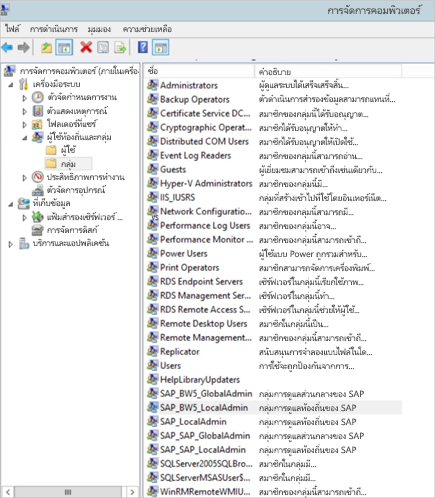
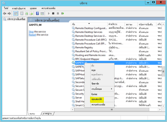
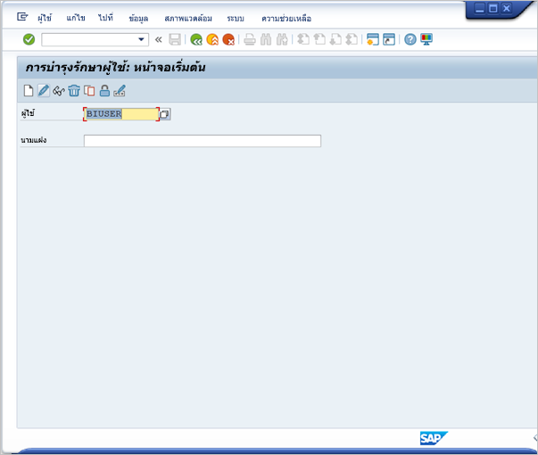
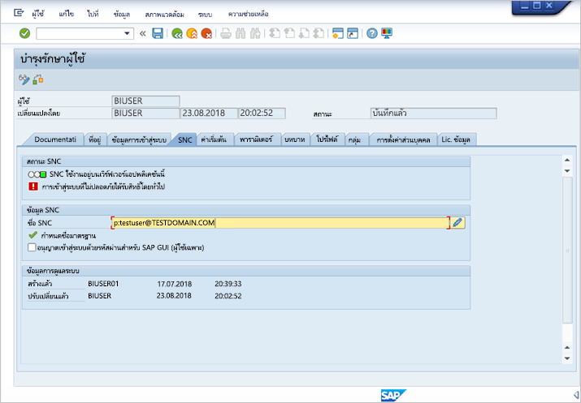
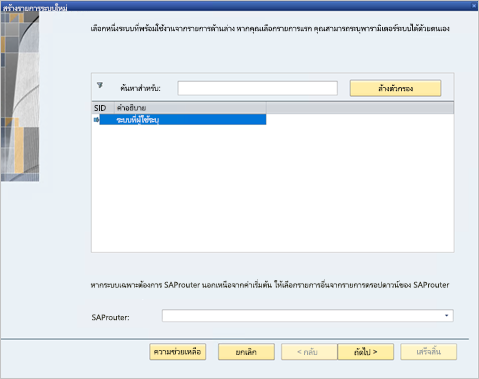
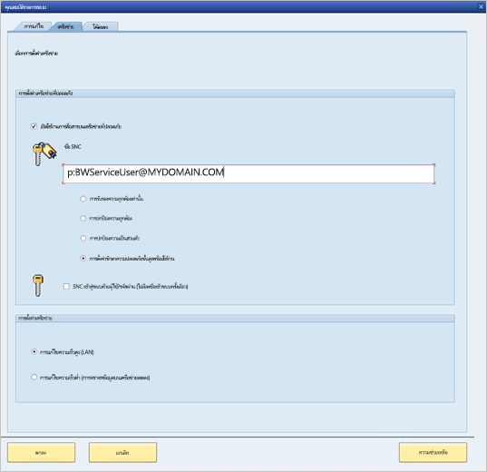

# <a name="use-kerberos-for-single-sign-on-sso-to-sap-bw-using-gx64krb5"></a>ใช้ Kerberos สำหรับลงชื่อเข้าระบบครั้งเดียว (SSO) ไปยัง SAP BW โดยใช้ gx64krb5

บทความนี้อธิบายวิธีกำหนดค่าแหล่งข้อมูล SAP BW ของคุณเพื่อเปิดใช้งาน SSO จากบริการของ Power BI โดยใช้ gx64krb5

> [!NOTE]
> คุณสามารถทำตามขั้นตอนในบทความนี้นอกเหนือจากขั้นตอนใน [Configure Kerberos SSO](service-gateway-sso-kerberos.md) เพื่อเปิดใช้งานการรีเฟรช SSO สำหรับรายงานที่ยึดตามเซิร์ฟเวอร์แอปพลิเคชัน SAP BW ในบริการของ Power BI อย่างไรก็ตาม Microsoft แนะนำให้ใช้งาน CommonCryptoLib เป็นไลบรารี SNC ของคุณ ไม่ใช่ gx64krb5 SAP ไม่รองรับ gx64krb5 อีกต่อไป และขั้นตอนที่จำเป็นในการกำหนดค่าสำหรับเกตเวย์มีความซับซ้อนมากขึ้นเมื่อเทียบกับ CommonCryptoLib สำหรับข้อมูลเกี่ยวกับวิธีกำหนดค่า SSO โดยใช้ CommonCryptoLib โปรดดูที่ [กำหนดค่า SAP BW สำหรับ SSO โดยใช้ CommonCryptoLib](service-gateway-sso-kerberos-sap-bw-commoncryptolib.md) คุณควรใช้ CommonCryptoLib _หรือ_ gx64krb5 เป็นไลบรารีของคุณ ไม่ต้องทำขั้นตอนการกำหนดค่าสำหรับทั้งสองไลบรารี

คู่มือนี้ครอบคลุม หากคุณทำตามขั้นตอนที่อธิบายไว้แล้วบางส่วนคุณสามารถข้ามไปได้ ตัวอย่างเช่น คุณอาจกำหนดค่าเซิร์ฟเวอร์ SAP BW ของคุณสำหรับ SSO โดยใช้ gx64krb5 เรียบร้อยแล้ว

## <a name="set-up-gx64krb5-on-the-gateway-machine-and-the-sap-bw-server"></a>ตั้งค่า gx64krb5 บนเครื่องเกตเวย์และเซิร์ฟเวอร์ SAP BW

> [!NOTE]
> SAP ไม่รองรับไลบรารี gx64krb5 อีกต่อไป สำหรับข้อมูลเพิ่มเติม ให้ดู [SAP Note 352295](https://launchpad.support.sap.com/#/notes/352295) โปรดทราบว่า gx64krb5 ไม่อนุญาตให้มีการเชื่อมต่อ SSO จากเกตเวย์ข้อมูลไปยัง SAP BW Message Servers; ซึ่งสามารถเชื่อมต่อกับ SAP BW Application Server ได้เท่านั้น ข้อจำกัดนี้จะไม่มีถ้าคุณใช้ [CommonCryptoLib](service-gateway-sso-kerberos-sap-bw-commoncryptolib.md) เป็นไลบรารีของคุณ แม้ว่าไลบรารี SNC อื่นอาจทำงานกับ BW SSO แต่ไม่ได้รับการรองรับจาก Microsoft อย่างเป็นทางการ

ต้องมีการใช้ไลบรารี gx64krb5 ทั้งในไคลเอ็นต์และในเซิร์ฟเวอร์เพื่อทำให้การเชื่อมต่อ SSO ผ่านเกตเวย์สมบูรณ์ นั่นคือ ทั้งไคลเอ็นต์และเซิร์ฟเวอร์ต้องใช้ไลบรารี SNC เหมือนกัน

1. ดาวน์โหลด gx64krb5.dll จาก [SAP Note 2115486](https://launchpad.support.sap.com/) (จำเป็นต้องมีผู้ใช้ระดับ S ของ SAP) ตรวจสอบให้แน่ใจว่าคุณมีเวอร์ชัน 1.0.11.x เป็นอย่างน้อย นอกจากนี้ ให้ดาวน์โหลด gsskrb5.dll (ไลบรารีเวอร์ชัน 32 บิต) ด้วย ถ้าคุณต้องการทดสอบการเชื่อมต่อ SSO ใน SAP GUI ก่อนที่คุณจะพยายามเชื่อมต่อ SSO ผ่านเกตเวย์ (แนะนำ) จำเป็นต้องมีเวอร์ชัน 32 บิตในการทดสอบกับ SAP GUI เนื่องจาก SAP GUI เป็น 32 บิตเท่านั้น

1. วาง gx64krb5.dll ในตำแหน่งที่ตั้งบนเครื่องเกตเวย์ของคุณซึ่งผู้ใช้บริการเกตเวย์สามารถเข้าถึงได้ หากคุณต้องการทดสอบการเชื่อมต่อ SSO ด้วย SAP GUI ให้ใส่สำเนาของ gsskrb5.dll บนเครื่องของคุณ และตั้งค่าตัวแปรสภาพแวดล้อม **SNC_LIB** เพื่อชี้ไปที่ไฟล์ดังกล่าว ทั้งผู้ใช้บริการเกตเวย์และผู้ใช้ Active Directory (AD) ที่ผู้ใช้บริการจะเลียนแบบจำเป็นต้องอ่านและใช้สิทธิ์สำหรับสำเนาของ gx64krb5.dll เราขอแนะนำการให้สิทธิ์ไฟล์ .dll กับกลุ่มผู้ใช้ที่ได้รับการรับรองความถูกต้อง สำหรับวัตถุประสงค์ในการทดสอบ คุณยังสามารถมอบสิทธิ์เหล่านี้ให้กับทั้งผู้ใช้บริการเกตเวย์และผู้ใช้ Active Directory ที่คุณจะใช้สำหรับทดสอบ

1. ถ้าเซิร์ฟเวอร์ BW ของคุณยังไม่ได้รับการกำหนดค่าสำหรับ SSO โดยใช้ gx64krb5.dll ให้ใส่สำเนาอื่นของไฟล์ .dll บนเครื่องเซิร์ฟเวอร์ SAP BW ของคุณในตำแหน่งที่ตั้งที่สามารถเข้าถึงได้โดยเซิร์ฟเวอร์ SAP BW 

    สำหรับข้อมูลเพิ่มเติมเกี่ยวกับการกำหนดค่า gx64krb5 เพื่อใช้งานกับเซิร์ฟเวอร์ SAP BW โปรดดู [เอกสารประกอบ SAP](https://launchpad.support.sap.com/#/notes/2115486) (จำเป็นต้องมีผู้ใช้ระดับ S ของ SAP)

1. บนเครื่องไคลเอ็นต์และเซิร์ฟเวอร์ ให้ตั้งค่าตัวแปรสภาพแวดล้อม **SNC_LIB** และ **SNC_LIB_64** 
    - ถ้าคุณใช้ gsskrb5.dll ให้ตั้งค่าตัวแปร **SNC_LIB** เป็นเส้นทางสัมบูรณ์ของไฟล์ดังกล่าว 
    - ถ้าคุณใช้ gx64krb5.dll ให้ตั้งค่าตัวแปร **SNC_LIB_64** เป็นเส้นทางสัมบูรณ์ของไฟล์ดังกล่าว

## <a name="configure-an-sap-bw-service-user-and-enable-snc-communication-on-the-bw-server"></a>กำหนดค่าผู้ใช้บริการ SAP BW และเปิดใช้งานการสื่อสาร SNC บนเซิร์ฟเวอร์ BW

ดำเนินการในส่วนนี้ให้เสร็จสมบูรณ์ถ้าคุณยังไม่ได้กำหนดค่าเซิร์ฟเวอร์ SAP BW ของคุณสำหรับการสื่อสาร (ตัวอย่างเช่น SSO) โดยใช้ gx64krb5

> [!NOTE]
> ส่วนนี้ถือว่าคุณได้สร้างผู้ใช้บริการสำหรับ BW และผูกโยง SPN ที่เหมาะสมเข้าด้วยแล้ว (นั่นคือชื่อที่ขึ้นต้นด้วย *SAP/* )

1. ให้ผู้ใช้บริการเข้าถึง SAP BW Application Server ของคุณ:

    1. บนเครื่องเซิร์ฟเวอร์ SAP BW ให้เพิ่มผู้ใช้บริการลงในกลุ่มผู้ดูแลระบบภายใน เปิดโปรแกรม**การจัดการคอมพิวเตอร์** และระบุกลุ่มผู้ดูแลระบบภายในสำหรับเซิร์ฟเวอร์ของคุณ 

        

    1. ดับเบิลคลิกกลุ่มผู้ดูแลระบบภายในเครื่อง แล้วเลือก **เพิ่ม** เพื่อเพิ่มผู้ใช้บริการของคุณไปยังกลุ่ม 

    1. เลือก **ตรวจสอบชื่อ** เพื่อให้แน่ใจว่าคุณป้อนชื่อถูกต้องจากนั้นเลือก **ตกลง**

1. ตั้งค่าผู้ใช้บริการของเซิร์ฟเวอร์ SAP BW เป็นผู้ใช้ที่เริ่มต้นใช้งานบริการของเซิร์ฟเวอร์ SAP BW บนเครื่องเซิร์ฟเวอร์ SAP BW

    1. เปิด **Run** แล้วป้อน **Services.msc** 

    1. ค้นหาบริการที่สอดคล้องกับอินสแตนซ์ของ SAP BW Application Server ของคุณ คลิกขวาจากนั้นเลือก **คุณสมบัติ**

        

    1. สลับไปยังแท็บ **เข้าสู่ระบบ** และเปลี่ยนผู้ใช้เป็นผู้ใช้บริการ SAP BW ของคุณ 

    1. ป้อนรหัสผ่านของผู้ใช้ แล้วเลือก **ตกลง**

1. ลงชื่อเข้าใช้เซิร์ฟเวอร์ของคุณใน SAP Logon และตั้งค่าพารามิเตอร์โปรไฟล์ต่อไปนี้โดยใช้ทรานแซคชัน RZ10:

    1. ตั้งค่าพารามิเตอร์โปรไฟล์ **snc/identity/as** เป็น*p:&lt; ผู้ใช้บริการ SAP BW ที่คุณสร้าง &gt;* ตัวอย่างเช่น *p:BWServiceUser\@MYDOMAIN.COM* โปรดทราบว่า *p:* มาก่อน UPN ของผู้ใช้บริการ ซึ่งตรงข้ามกับ *p:CN=* ที่นำหน้า UPN เมื่อคุณใช้ CommonCryptoLib เป็นไลบรารี SNC

    1. ตั้งค่าพารามิเตอร์โปรไฟล์ **snc/gssapi\_lib** เป็น *&lt; โดยชี้เส้นทางไปยัง gx64krb5.dll บนเซิร์ฟเวอร์ BW&gt;* วางไลบรารีในตำแหน่งที่ SAP BW Application Server สามารถเข้าถึงได้

    1. ตั้งค่าพารามิเตอร์โปรไฟล์เพิ่มเติมต่อไปนี้ โดยเปลี่ยนค่าตามต้องการเพื่อให้เหมาะกับความต้องการของคุณ ตัวเลือกห้าตัวท้ายช่วยให้ไคลเอ็นต์สามารถเชื่อมต่อกับเซิร์ฟเวอร์ SAP BW ได้โดยใช้ SAP Logon โดยไม่ต้องกำหนดค่า SNC

        | **การตั้งค่า** | **ค่า** |
        | --- | --- |
        | snc/data\_protection/max | 3 |
        | snc/data\_protection/min | 1 |
        | snc/data\_protection/use | 9 |
        | snc/accept\_insecure\_cpic | 1 |
        | snc/accept\_insecure\_gui | 1 |
        | snc/accept\_insecure\_r3int\_rfc | 1 |
        | snc/accept\_insecure\_rfc | 1 |
        | snc/permit\_insecure\_start | 1 |

    1. ตั้งค่าคุณสมบัติ **snc/enable** เป็น 1

1. หลังจากที่คุณตั้งค่าพารามิเตอร์โปรไฟล์เหล่านี้แล้ว ให้เปิด SAP Management Console บนเครื่องเซิร์ฟเวอร์และรีสตาร์ทอินสแตนซ์ SAP BW 

   ถ้าเซิร์ฟเวอร์ไม่เริ่มทำงาน ให้ยืนยันว่า คุณได้ตั้งค่าพารามิเตอร์โปร์ไฟล์อย่างถูกต้อง สำหรับข้อมูลเพิ่มเติมเกี่ยวกับการตั้งค่าพารามิเตอร์โปรไฟล์ โปรดดู [เอกสารประกอบ SAP](https://help.sap.com/saphelp_nw70ehp1/helpdata/en/e6/56f466e99a11d1a5b00000e835363f/frameset.htm) นอกจากนี้คุณยังสามารถดูส่วน [การแก้ไขปัญหา](#troubleshooting) ในบทความนี้ได้อีกด้วย

## <a name="map-an-sap-bw-user-to-an-active-directory-user"></a>แมปผู้ใช้ SAP BW ไปยังผู้ใช้ Active Directory

หากคุณยังไม่ได้ดำเนินการ ให้แมปผู้ใช้ Active Directory ไปยังผู้ใช้ SAP BW Application Server และทดสอบการเชื่อมต่อ SSO ใน SAP Logon

1. ลงชื่อเข้าใช้เซิร์ฟเวอร์ SAP BW ของคุณด้วย SAP Logon เรียกใช้ทรานแซคชัน SU01

1. สำหรับ **ผู้ใช้** ให้ป้อนผู้ใช้ SAP BW ที่คุณต้องการเปิดใช้งานการเชื่อมต่อ SSO เลือกไอคอน **แก้ไข** (ไอคอนปากกา) ใกล้กับด้านบนซ้ายของหน้าต่าง SAP Logon

    

1. เลือกแท็บ **SNC** ในช่องใส่ชื่อ SNC ให้ป้อน *p:&lt;ผู้ใช้ Active Directory ของคุณ&gt;@&lt;โดเมนของคุณ&gt;* สำหรับชื่อ SNC *p:* จะต้องนำหน้า UPN ของผู้ใช้ Active Directory โปรดทราบว่า UPN จะต้องตรงตามตัวพิมพ์ใหญ่-เล็ก

   ผู้ใช้ Active Directory ที่คุณระบุต้องเป็นบุคคลหรือองค์กรที่คุณต้องการเปิดใช้งาน SSO เพื่อเข้าถึง SAP BW Application Server ตัวอย่างเช่น หากคุณต้องการเปิดใช้งานการเข้าถึง SSO สำหรับผู้ใช้ testuser\@TESTDOMAIN.COM ให้ป้อน *p:testuser\@TESTDOMAIN.COM*

    

1. เลือกไอคอน **บันทึก** (ภาพฟล็อปปี้ดิสก์) ใกล้กับมุมซ้ายบนของหน้าจอ

## <a name="test-sign-in-via-sso"></a>ทดสอบการลงชื่อเข้าใช้ผ่านทาง SSO

ตรวจสอบว่าคุณสามารถลงชื่อเข้าใช้เซิร์ฟเวอร์โดยใช้ SAP Logon ผ่าน SSO ในฐานะผู้ใช้ Active Directory ที่คุณเพิ่งเปิดใช้งานการเข้าถึง SSO ได้หรือไม่:

1. ในฐานะผู้ใช้ Active Directory ที่คุณเพิ่งเปิดใช้งานการเข้าถึง SSO ให้ลงชื่อเข้าใช้เครื่องในโดเมนของคุณที่ติดตั้ง SAP Logon ไว้ เปิดใช้งาน SAP Logon และสร้างการเชื่อมต่อใหม่

1. คัดลอกไฟล์ gsskrb5.dll ที่คุณดาวน์โหลดก่อนหน้านี้ไปยังตำแหน่งที่ตั้งบนเครื่องที่คุณลงชื่อเข้าใช้ ตั้งค่าตัวแปรสภาพแวดล้อม **SNC_LIB** เป็นเส้นทางสัมบูรณ์ของตำแหน่งที่ตั้งนี้

1. เปิดใช้งาน SAP Logon และสร้างการเชื่อมต่อใหม่

1. ในหน้าจอ **สร้างรายการระบบใหม่** ให้เลือก **ระบบเฉพาะสำหรับผู้ใช้** จากนั้นเลือก **ถัดไป**

    

1. กรอกรายละเอียดที่เหมาะสมในหน้าจอถัดไป รวมทั้งเซิร์ฟเวอร์แอปพลิเคชัน หมายเลขอินสแตนซ์ และ ID ของระบบ จากนั้น เลือก **เสร็จสิ้น**

1. คลิกขวาที่การเชื่อมต่อใหม่ เลือก**คุณสมบัติ**จากนั้นเลือกแท็บ**เครือข่าย** 

1. ในกล่อง **ชื่อ SNC** ให้ป้อน *p:&lt;UPN ของผู้ใช้บริการ SAP BW&gt;* ตัวอย่างเช่น *p:BWServiceUser\@MYDOMAIN.COM* เลือก**ตกลง**

    

1. ดับเบิลคลิกที่การเชื่อมต่อที่คุณเพิ่งสร้างขึ้นเพื่อลองเชื่อมต่อ SSO ไปยังเซิร์ฟเวอร์ SAP BW ของคุณ 

   หากการเชื่อมต่อนี้ประสบความสำเร็จ ให้ดำเนินการส่วนถัดไป มิเช่นนั้น ให้ตรวจสอบขั้นตอนก่อนหน้าในเอกสารนี้เพื่อให้มั่นใจว่าได้ดำเนินการเสร็จสิ้นอย่างถูกต้องแล้ว หรือตรวจสอบส่วน[การแก้ปัญหา](#troubleshooting) ถ้าคุณไม่สามารถเชื่อมต่อกับเซิร์ฟเวอร์ SAP BW ผ่าน SSO ในบริบทนี้ คุณจะไม่สามารถเชื่อมต่อกับเซิร์ฟเวอร์ SAP BW โดยใช้ SSO ในบริบทเกตเวย์ได้

## <a name="add-registry-entries-to-the-gateway-machine"></a>เพิ่มรายการรีจิสทรีไปยังเครื่องเกตเวย์

เพิ่มรายการรีจิสทรีที่จำเป็นลงในรีจิสทรีของเครื่องที่มีการติดตั้งเกตเวย์ และลงในเครื่องที่ต้องการเชื่อมต่อจาก Power BI Desktop เมื่อต้องการเพิ่มรายการรีจิสทรีเหล่านี้ ให้เรียกใช้คำสั่งต่อไปนี้:

- ```REG ADD HKLM\SOFTWARE\Wow6432Node\SAP\gsskrb5 /v ForceIniCredOK /t REG_DWORD /d 1 /f```

- ```REG ADD HKLM\SOFTWARE\SAP\gsskrb5 /v ForceIniCredOK /t REG_DWORD /d 1 /f```

## <a name="add-a-new-sap-bw-application-server-data-source-to-the-power-bi-service-or-edit-an-existing-one"></a>เพิ่มแหล่งข้อมูล SAP BW Application Server ใหม่ลงในบริการ Power BI หรือแก้ไขตัวที่มีอยู่

1. ในหน้าต่างการกำหนดค่าแหล่งข้อมูล ให้ป้อน **ชื่อโฮสต์** **หมายเลขระบบ** และ **ID ไคลเอ็นต์** ของ SAP BW Application Server ตามที่คุณต้องการเพื่อลงชื่อเข้าใช้เซิร์ฟเวอร์ SAP BW จาก Power BI Desktop

1. ในเขตข้อมูล **ชื่อหุ้นส่วน SNC** ให้ใส่ *p:&lt;SPN ที่คุณแมปไปยังผู้ใช้บริการ SAP BW ของคุณ&gt;* ตัวอย่างเช่นถ้า SPN คือ SAP/BWServiceUser\@MYDOMAIN.COM ให้ป้อน *p:SAP/BWServiceUser\@MYDOMAIN.COM* ในเขตข้อมูล **ชื่อหุ้นส่วน SNC**

1. สำหรับไลบรารี SNC ให้เลือก **SNC\_LIB** หรือ **SNC\_LIB\_64** ตรวจสอบให้แน่ใจว่า **SNC\_LIB\_64** บนเครื่องเกตเวย์ชี้ไปยัง gx64krb5.dll อีกวิธีหนึ่งคือคุณสามารถเลือกตัวเลือก **แบบกำหนดเอง** และใส่เส้นทางสัมบูรณ์สำหรับ gx64krb5 บนเครื่องเกตเวย์

1. เลือก **ใช้ SSO ผ่าน Kerberos สำหรับคิวรี DirectQuery** แล้วเลือก **ปรับใช้** หากการเชื่อมต่อทดสอบไม่สำเร็จ ให้ตรวจสอบว่าขั้นตอนการตั้งค่าและการกำหนดค่าก่อนหน้าเสร็จสมบูรณ์อย่างถูกต้องหรือไม่

1. [เปิดใช้รายงาน Power BI](service-gateway-sso-kerberos.md#run-a-power-bi-report)

## <a name="troubleshooting"></a>การแก้ไขปัญหา

### <a name="troubleshoot-gx64krb5-configuration"></a>แก้ไขการกำหนดค่า gx64krb5

ถ้าคุณพบปัญหาใดก็ตามดังต่อไปนี้ ให้ทำตามขั้นตอนเหล่านี้เพื่อแก้ไขปัญหาการติดตั้ง gx64krb5 และการเชื่อมต่อ SSO

* คุณพบข้อผิดพลาดเมื่อคุณทำตามขั้นตอนการตั้งค่า gx64krb5 ตัวอย่างเช่น เซิร์ฟเวอร์ SAP BW จะไม่เริ่มทำงานหลังจากคุณเปลี่ยนพารามิเตอร์โปรไฟล์แล้ว ดูบันทึกเซิร์ฟเวอร์ (…work\dev\_w0 บนเครื่องเซิร์ฟเวอร์) เพื่อแก้ไขข้อผิดพลาดเหล่านี้ 

* คุณไม่สามารถเริ่มใช้บริการ SAP BW ได้เนื่องจากความล้มเหลวในการลงชื่อเข้าใช้ คุณอาจระบุรหัสผ่านไม่ถูกต้องเมื่อคุณตั้งค่าผู้ใช้ *เริ่มต้น*ของ SAP BW ตรวจสอบรหัสผ่านโดยลงชื่อเข้าใช้ในฐานะผู้ใช้บริการ SAP BW บนเครื่องในสภาพแวดล้อม Active Directory ของคุณ

* คุณได้รับข้อผิดพลาดเกี่ยวกับข้อมูลประจำตัวของแหล่งข้อมูลเบื้องต้น (ตัวอย่างเช่น SQL Server) ซึ่งป้องกันไม่ให้เซิร์ฟเวอร์เริ่มทำงาน ให้ตรวจสอบว่าคุณได้ให้สิทธิ์การเข้าถึงฐานข้อมูล SAP BW แก่ผู้ใช้บริการแล้ว

* คุณได้รับข้อความต่อไปนี้: *(GSS-API) ไม่รู้จักหรือไม่สามารถเข้าถึงเป้าหมายที่ระบุได้* โดยทั่วไป ข้อผิดพลาดนี้มักหมายความว่าคุณระบุชื่อ SNC ไม่ถูกต้อง ตรวจสอบให้แน่ใจว่าใช้ *p:* เท่านั้น ไม่ใช่ *p:CN=* เพื่อนำหน้า UPN ของผู้ใช้บริการในแอปพลิเคชันฝั่งไคลเอ็นต์

* คุณได้รับข้อความต่อไปนี้: *(GSS-API) มีการระบุชื่อที่ไม่ถูกต้อง* ตรวจสอบให้แน่ใจว่า *p:* อยู่ในค่าของพารามิเตอร์โปรไฟล์ข้อมูลประจำตัวของ SNC ของเซิร์ฟเวอร์

* คุณได้รับข้อความต่อไปนี้: *(ข้อผิดพลาด SNC) ไม่พบโมดูลที่ระบุ* ข้อผิดพลาดนี้มักเกิดจากการวางไฟล์ gx64krb5.dll ในตำแหน่งที่ต้องใช้สิทธิ์ระดับสูง (สิทธิ์ผู้ดูแลระบบ) ในการเข้าถึง

### <a name="troubleshoot-gateway-connectivity-issues"></a>แก้ไขปัญหาการเชื่อมต่อเกตเวย์

1. ตรวจสอบไฟล์บันทึกเกตเวย์ เปิดแอปพลิเคชันการกำหนดค่าเกตเวย์ แล้วเลือก **การวินิจฉัย** จากนั้นเลือก **ส่งออกไฟล์บันทึก** ข้อผิดพลาดล่าสุดจะอยู่ท้ายไฟล์บันทึกที่คุณตรวจสอบ

    

1. เปิดการติดตาม SAP BW และตรวจดูไฟล็บันทึกที่สร้างขึ้น มีการติดตาม SAP BW หลายประเภทที่คุณสามารถใช้งานได้ (ตัวอย่างเช่น การติดตาม CPIC)

   a. เมื่อต้องการเปิดใช้งานการติดตาม CPIC ให้ตั้งค่าตัวแปรสภาพแวดล้อมสองรายการ: **CPIC\_TRACE** และ **CPIC\_TRACE\_DIR**

      ตัวแปรแรกตั้งค่าระดับการติดตามและตัวแปรที่สองตั้งค่าไดเรกทอรีไฟล์การติดตาม ไดเรกทอรีต้องอยู่ในตำแหน่งที่สมาชิกของกลุ่มผู้ใช้ที่ได้รับการรับรองความถูกต้องสามารถเขียนถึงได้ 
 
    b. ตั้งค่า **CPIC\_TRACE** เป็น *3* และ **CPIC\_TRACE\_DIR** เป็นไดเรกทอรีใดก็ได้ที่คุณต้องการติดตามไฟล์ที่เขียนถึง ตัวอย่างเช่น:

      

    c. สร้างปัญหาขึ้นมาใหม่และตรวจสอบว่า **CPIC\_TRACE\_DIR** มีไฟล์การติดตามอยู่ด้วย 
    
    d. ตรวจสอบเนื้อหาของการติดตามไฟล์เพื่อกำหนดปัญหาการบล็อค ตัวอย่างเช่นคุณอาจพบว่า gx64krb5.dll ไม่ได้โหลดอย่างถูกต้องหรือผู้ใช้ Active Directory แตกต่างจากที่คุณคาดหวังว่าจะสามารถใช้งานในการเชื่อมต่อ SSO ได้

## <a name="next-steps"></a>ขั้นตอนถัดไป

สำหรับข้อมูลเพิ่มเติมเกี่ยวกับเกตเวย์ข้อมูลภายในองค์กรและ DirectQuery ให้ดูแหล่งข้อมูลต่อไปนี้:

* [เกตเวย์ข้อมูลภายในองค์กรคืออะไร](/data-integration/gateway/service-gateway-onprem)
* [DirectQuery ใน Power BI](desktop-directquery-about.md)
* [แหล่งข้อมูลที่สนับสนุนโดย DirectQuery](desktop-directquery-data-sources.md)
* [DirectQuery และ SAP BW](desktop-directquery-sap-bw.md)
* [DirectQuery และ SAP HANA](desktop-directquery-sap-hana.md)
